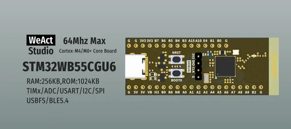

# STM32WB55 Core Board

**WeAct Studio** · Other

Revision: Not identified  
Coverage: Board labels only; pinout needed

[Browse all manufacturers](../../../../BROWSE.md) · [Desktop app](https://github.com/valleytechsolutions/black-wire-desktop)

## Board silkscreen and component labels

**board labeling image** · Reviewed source · PNG

[Open original reference](../../../../library/media/f7739af625c95483a39c541a670e25128470c446dd3bc6a7dd0997bc055ca8c8.png)

**Credit and rights:** Not established; source attribution retained. Source/manufacturer: WeAct Studio.

[Source 1](https://raw.githubusercontent.com/WeActStudio/WeActStudio.STM32WB55CoreBoard/3b3b2160a231ed3441bea3453ae689a939419206/Images/1.png) · [Source 2](https://github.com/WeActStudio/WeActStudio.STM32WB55CoreBoard/blob/3b3b2160a231ed3441bea3453ae689a939419206/Images/1.png)

Original repository file preserved with commit identifier. Board illustration/silkscreen images are explicitly distinguished from expanded pin-function diagrams.

**Partial diagram. Confirm missing pins against the exact board documentation.**

SHA-256: `f7739af625c95483a39c541a670e25128470c446dd3bc6a7dd0997bc055ca8c8`

Pin assignments have not been independently electrically verified. Check board revision before wiring.
