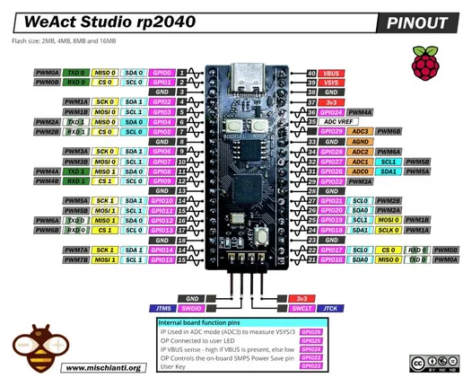
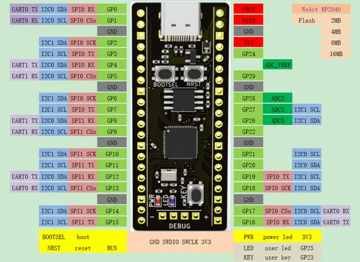

# RP2040 Core

**WeAct Studio** · RP2040

Revision: Not identified  
Coverage: Pinout image collected

[Browse all manufacturers](../../../../BROWSE.md) · [Desktop app](https://github.com/valleytechsolutions/black-wire-desktop)

## Pinout - Renzo Mischianti

**pinout image** · Reviewed source · JPG

[Open original reference](../../../../library/media/ab4a01f0851413352c8be1149731015cbc253a19df76d8f9e903a5bc79c663ad.jpg)

**Credit and rights:** CC BY-NC-ND marking visible on image; exact license version and publication permissions not established. Source/manufacturer: WeAct Studio.

[Source 1](https://mischianti.org/wp-content/uploads/2022/09/weact-studio-rp2040-raspberry-pi-pico-alternative-pinout-low-resolution-1024x837.jpg) · [Source 2](https://mischianti.org/weact-studio-rp2040-high-resolution-pinout-and-specs/)

Original public image by Renzo Mischianti, unchanged. Diagram/model matching is visual, not electrical verification. Exact PCB layout and revision must match; no inference of compatibility with lookalike marketplace clones.

SHA-256: `ab4a01f0851413352c8be1149731015cbc253a19df76d8f9e903a5bc79c663ad`

## Manufacturer pinout

**pinout image** · Reviewed source · PNG

[Open original reference](../../../../library/media/f1e30b0d01545577a1ffbe39da13d3f949e413800f0652428daa5c002efdff68.png)

**Credit and rights:** Not established; source attribution retained. Source/manufacturer: WeAct Studio.

[Source 1](https://raw.githubusercontent.com/WeActStudio/WeActStudio.RP2040CoreBoard/2d438e5033b969a7b885bd5ffcd49acaeb08e0ff/HDK/PINout.PNG) · [Source 2](https://github.com/WeActStudio/WeActStudio.RP2040CoreBoard/blob/2d438e5033b969a7b885bd5ffcd49acaeb08e0ff/HDK/PINout.PNG)

Original repository file preserved with commit identifier. Board illustration/silkscreen images are explicitly distinguished from expanded pin-function diagrams.

SHA-256: `f1e30b0d01545577a1ffbe39da13d3f949e413800f0652428daa5c002efdff68`

Pin assignments have not been independently electrically verified. Check board revision before wiring.
