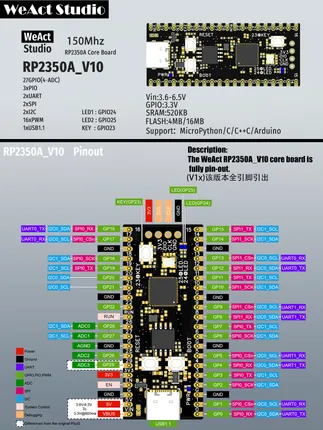

# RP2350A Core v1.0

**WeAct Studio** · RP2350

Revision: v1.0  
Coverage: Pinout image collected

[Browse all manufacturers](../../../../BROWSE.md) · [Desktop app](https://github.com/valleytechsolutions/black-wire-desktop)

## Manufacturer pinout

**pinout image** · Reviewed source · PNG

[Open original reference](../../../../library/media/4eb80a0cefce7235e8876c3fc25f6f75af03dd41363039ff1d8b72a5b5ba66ef.png)

**Credit and rights:** Not established; source attribution retained. Source/manufacturer: WeAct Studio.

[Source 1](https://raw.githubusercontent.com/WeActStudio/WeActStudio.RP2350ACoreBoard/dd0bf693ffbbb6b663294b1c82d65462b7d29710/RP2350A_V10/HDK/V10_PinOUT.png) · [Source 2](https://github.com/WeActStudio/WeActStudio.RP2350ACoreBoard/blob/dd0bf693ffbbb6b663294b1c82d65462b7d29710/RP2350A_V10/HDK/V10_PinOUT.png)

Original repository file preserved with commit identifier. Board illustration/silkscreen images are explicitly distinguished from expanded pin-function diagrams.

SHA-256: `4eb80a0cefce7235e8876c3fc25f6f75af03dd41363039ff1d8b72a5b5ba66ef`

Pin assignments have not been independently electrically verified. Check board revision before wiring.
