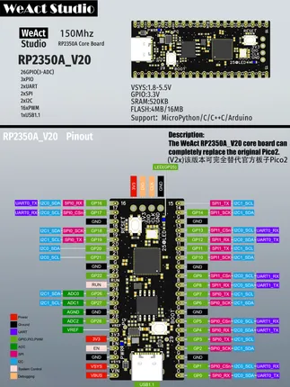

# RP2350A Core v2.0

**WeAct Studio** · RP2350

Revision: v2.0  
Coverage: Pinout image collected

[Browse all manufacturers](../../../../BROWSE.md) · [Desktop app](https://github.com/valleytechsolutions/black-wire-desktop)

## Manufacturer pinout

**pinout image** · Reviewed source · PNG

[Open original reference](../../../../library/media/c30d1b6ba49ee36584fbc76970d789d13571a298d187bcd8030cb6efd29ecf4d.png)

**Credit and rights:** Not established; source attribution retained. Source/manufacturer: WeAct Studio.

[Source 1](https://raw.githubusercontent.com/WeActStudio/WeActStudio.RP2350ACoreBoard/dd0bf693ffbbb6b663294b1c82d65462b7d29710/RP2350A_V20/HDK/%E4%BB%8B%E7%BB%8D%20-%201.png) · [Source 2](https://github.com/WeActStudio/WeActStudio.RP2350ACoreBoard/blob/dd0bf693ffbbb6b663294b1c82d65462b7d29710/RP2350A_V20/HDK/%E4%BB%8B%E7%BB%8D%20-%201.png)

Original repository file preserved with commit identifier. Board illustration/silkscreen images are explicitly distinguished from expanded pin-function diagrams.

SHA-256: `c30d1b6ba49ee36584fbc76970d789d13571a298d187bcd8030cb6efd29ecf4d`

Pin assignments have not been independently electrically verified. Check board revision before wiring.
