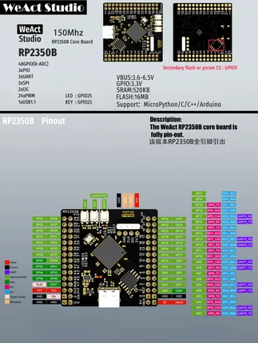

# RP2350B Core

**WeAct Studio** · RP2350

Revision: Not identified

Coverage: Pinout image collected

[Browse all manufacturers](../../../../BROWSE.md) · [Devices & IoT](../../../../DEVICES.md) · [Open in the browser guide](https://valleytech-black-wire-guide.pages.dev/?board=weact-studio-rp2350-rp2350b-core)

## Datasheets and original documentation

Board datasheet: **not yet recorded**. Visual reference: **available**.

[Manufacturer source (recorded link)](https://github.com/WeActStudio/WeActStudio.RP2350BCoreBoard)

A chip datasheet, schematic and board datasheet have different scopes. Match the exact hardware revision.

[Documentation coverage and remaining gaps](../../../../DOCUMENTATION.md)

## Manufacturer board pinout

**pinout image** · Reviewed source · PNG

[Open original reference](../../../../library/media/3bf5d9ea3e2ab83a9e397c81cd6a7eb29ff1e341aea354d197a19180c0c34e76.png)

**Credit and rights:** Not established; source attribution retained. Source/manufacturer: WeAct Studio.

[Source 1](https://raw.githubusercontent.com/WeActStudio/WeActStudio.RP2350BCoreBoard/5b165b5c0ad4b4432137721ac10e469205e8e350/HDK/RP2350B_PINOUT.png) · [Source 2](https://github.com/WeActStudio/WeActStudio.RP2350BCoreBoard/blob/5b165b5c0ad4b4432137721ac10e469205e8e350/HDK/RP2350B_PINOUT.png)

Image revision: Not identified

SHA-256: `3bf5d9ea3e2ab83a9e397c81cd6a7eb29ff1e341aea354d197a19180c0c34e76`

Pin assignments have not been independently electrically verified. Check board revision before wiring.
