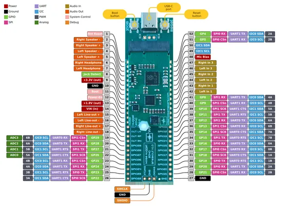

# Noise Nugget 2040 Breakout

**Wee Noise Makers** · RP2040

Revision: Not identified  
Coverage: Pinout image collected

[Browse all manufacturers](../../../../BROWSE.md) · [Desktop app](https://github.com/valleytechsolutions/black-wire-desktop)

## Physical board pinout

**pinout image** · Reviewed source · PNG

[Open original reference](../../../../library/media/afa1e12bd649a32e4e4b75671bda72fd4097e4fcb4ac575c1595767069392d19.png)

**Credit and rights:** Not established; source attribution retained. Source/manufacturer: Wee Noise Makers.

[Source 1](https://weenoisemakers.com/assets/noise-nugget-2040/wnm-nn2040-breakout-pinout.png) · [Source 2](https://weenoisemakers.com/noise-nugget-2040/)

Discovered from CircuitPython board metadata and the linked product/documentation page. Exact hardware revision requires matching to the diagram.

SHA-256: `afa1e12bd649a32e4e4b75671bda72fd4097e4fcb4ac575c1595767069392d19`

Pin assignments have not been independently electrically verified. Check board revision before wiring.
