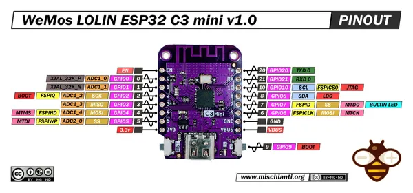

# LOLIN C3 Mini v1.0

**Wemos** · ESP32-C3

Revision: v1.0  
Coverage: Pinout image collected

[Browse all manufacturers](../../../../BROWSE.md) · [Desktop app](https://github.com/valleytechsolutions/black-wire-desktop)

## Pinout - Renzo Mischianti

**pinout image** · Reviewed source · JPG

[Open original reference](../../../../library/media/809f465475509765a385ad5b1feaedbd807e6e62e56dd1b6ddc40a213d0b77b9.jpg)

**Credit and rights:** CC BY-NC-ND marking visible on image; exact license version and publication permissions not established. Source/manufacturer: Wemos.

[Source 1](https://mischianti.org/wp-content/uploads/2023/04/WeMos-LOLIN-ESP32-C3-mini-v10-pinout-low.jpg) · [Source 2](https://mischianti.org/wemos-lolin-esp32-c3-mini-v1-0-high-resolution-pinout-and-specs/)

Original public image by Renzo Mischianti, unchanged. Diagram/model matching is visual, not electrical verification. Exact PCB layout and revision must match; no inference of compatibility with lookalike marketplace clones.

SHA-256: `809f465475509765a385ad5b1feaedbd807e6e62e56dd1b6ddc40a213d0b77b9`

Pin assignments have not been independently electrically verified. Check board revision before wiring.
