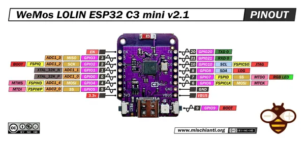

# LOLIN C3 Mini v2.1

**Wemos** · ESP32-C3

Revision: v2.1  
Coverage: Pinout image collected

[Browse all manufacturers](../../../../BROWSE.md) · [Desktop app](https://github.com/valleytechsolutions/black-wire-desktop)

## Pinout - Renzo Mischianti

**pinout image** · Reviewed source · JPG

[Open original reference](../../../../library/media/bba6db5ea3addeb36185933c1c116e410926fe74573211ec36c7bbc40db78bc9.jpg)

**Credit and rights:** CC BY-NC-ND marking visible on image; exact license version and publication permissions not established. Source/manufacturer: Wemos.

[Source 1](https://mischianti.org/wp-content/uploads/2023/05/WeMos-LOLIN-ESP32-C3-mini-v21-pinout-low.jpg) · [Source 2](https://mischianti.org/wemos-lolin-esp32-c3-mini-v2-1-high-resolution-pinout-and-specs/)

Original public image by Renzo Mischianti, unchanged. Diagram/model matching is visual, not electrical verification. Exact PCB layout and revision must match; no inference of compatibility with lookalike marketplace clones.

SHA-256: `bba6db5ea3addeb36185933c1c116e410926fe74573211ec36c7bbc40db78bc9`

Pin assignments have not been independently electrically verified. Check board revision before wiring.
