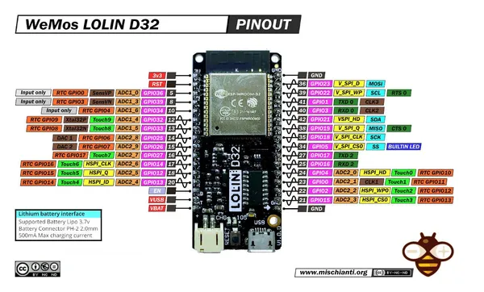

# LOLIN D32

**Wemos** · ESP32 original

Revision: Not identified  
Coverage: Pinout image collected

[Browse all manufacturers](../../../../BROWSE.md) · [Desktop app](https://github.com/valleytechsolutions/black-wire-desktop)

## Pinout - Renzo Mischianti

**pinout image** · Reviewed source · JPG

[Open original reference](../../../../library/media/4060a5d111d864b1a884c95d1518e93b91d9915d58d032fe3ab38ae88e07c13d.jpg)

**Credit and rights:** CC BY-NC-ND marking visible on image; exact license version and publication permissions not established. Source/manufacturer: Wemos.

[Source 1](https://mischianti.org/wp-content/uploads/2022/10/ESP32-WeMos-LOLIN-D32-pinout-mischianti.jpg) · [Source 2](https://mischianti.org/esp32-wemos-lolin-d32-high-resolution-pinout-and-specs/)

Original public image by Renzo Mischianti, unchanged. Diagram/model matching is visual, not electrical verification. Exact PCB layout and revision must match; no inference of compatibility with lookalike marketplace clones.

SHA-256: `4060a5d111d864b1a884c95d1518e93b91d9915d58d032fe3ab38ae88e07c13d`

Pin assignments have not been independently electrically verified. Check board revision before wiring.
