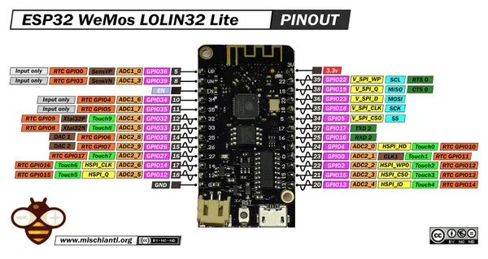

# LOLIN32 Lite

**Wemos** · ESP32 original

Revision: Not identified

Coverage: Pinout image collected

[Browse all manufacturers](../../../../BROWSE.md) · [Devices & IoT](../../../../DEVICES.md) · [Open in the browser guide](https://valleytech-black-wire-guide.pages.dev/?board=wemos-esp32-lolin32-lite)

## Datasheets and original documentation

Board datasheet: **not yet recorded**. Visual reference: **available**.

Original manufacturer website still needs identification.

A chip datasheet, schematic and board datasheet have different scopes. Match the exact hardware revision.

[Documentation coverage and remaining gaps](../../../../DOCUMENTATION.md)

## Pinout - Renzo Mischianti

**pinout image** · Reviewed source · JPG

[Open original reference](../../../../library/media/333724986d41e542ae213487af93887fbc17d21173147916adb81467644445f9.jpg)

**Credit and rights:** CC BY-NC-ND marking visible on image; exact license version and publication permissions not established. Source/manufacturer: Wemos.

[Source 1](https://mischianti.org/wp-content/uploads/2021/07/ESP32-WeMos-LOLIN32-Lite-pinout-mischianti-low.jpg) · [Source 2](https://mischianti.org/esp32-wemos-lolin32-lite-high-resolution-pinout-and-specs/)

Original public image by Renzo Mischianti, unchanged. Diagram/model matching is visual, not electrical verification. Exact PCB layout and revision must match; no inference of compatibility with lookalike marketplace clones.

Image revision: Not identified

SHA-256: `333724986d41e542ae213487af93887fbc17d21173147916adb81467644445f9`

Pin assignments have not been independently electrically verified. Check board revision before wiring.
