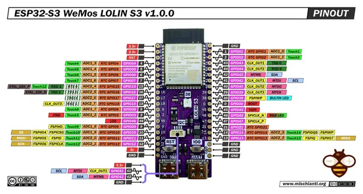

# LOLIN S3

**Wemos** · ESP32-S3

Revision: v1.0.0 shown in image  
Coverage: Pinout image collected

[Browse all manufacturers](../../../../BROWSE.md) · [Desktop app](https://github.com/valleytechsolutions/black-wire-desktop)

## Pinout - Renzo Mischianti

**pinout image** · Reviewed source · JPG

[Open original reference](../../../../library/media/7b95c2f14c2a5b2f48f9fb26015e71ed8a58728296999a8e35c09c0fed984518.jpg)

**Credit and rights:** CC BY-NC-ND marking visible on image; exact license version and publication permissions not established. Source/manufacturer: Wemos.

[Source 1](https://mischianti.org/wp-content/uploads/2024/03/esp32-S3-WeMos-LOLIN-S3-pinout-low.jpg) · [Source 2](https://mischianti.org/wemos-lolin-s3-esp32-s3-high-resolution-pinout-datasheet-and-specs/)

Original public image by Renzo Mischianti, unchanged. Diagram/model matching is visual, not electrical verification. Exact PCB layout and revision must match; no inference of compatibility with lookalike marketplace clones.

SHA-256: `7b95c2f14c2a5b2f48f9fb26015e71ed8a58728296999a8e35c09c0fed984518`

Pin assignments have not been independently electrically verified. Check board revision before wiring.
