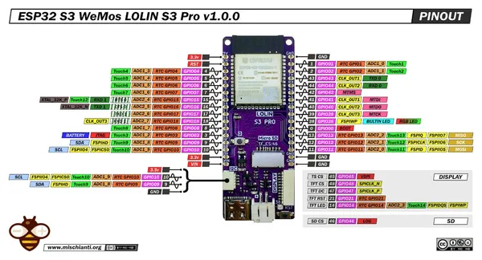

# LOLIN S3 Pro

**Wemos** · ESP32-S3

Revision: v1.0.0 shown in image

Coverage: Pinout image collected

[Browse all manufacturers](../../../../BROWSE.md) · [Devices & IoT](../../../../DEVICES.md) · [Open in the browser guide](https://valleytech-black-wire-guide.pages.dev/?board=wemos-esp32-lolin-s3-pro)

## Datasheets and original documentation

Board datasheet: **not yet recorded**. Visual reference: **available**.

[Manufacturer source (recorded link)](https://www.wemos.cc/en/latest/s3/s3.html)

A chip datasheet, schematic and board datasheet have different scopes. Match the exact hardware revision.

[Documentation coverage and remaining gaps](../../../../DOCUMENTATION.md)

## Pinout - Renzo Mischianti

**pinout image** · Reviewed source · JPG

[Open original reference](../../../../library/media/7c2eaed2fc91e5f0a2d1e59640eaa2ebe35cb15c56a96a8a4e837fa1a7daa698.jpg)

**Credit and rights:** CC BY-NC-ND marking visible on image; exact license version and publication permissions not established. Source/manufacturer: Wemos.

[Source 1](https://mischianti.org/wp-content/uploads/2024/03/esp32-S3-WeMos-LOLIN-S3-Pro-pinout-low.jpg) · [Source 2](https://mischianti.org/wemos-lolin-s3-pro-esp32-s3-high-resolution-pinout-datasheet-and-specs/)

Original public image by Renzo Mischianti, unchanged. Diagram/model matching is visual, not electrical verification. Exact PCB layout and revision must match; no inference of compatibility with lookalike marketplace clones.

Image revision: v1.0.0 shown in image

SHA-256: `7c2eaed2fc91e5f0a2d1e59640eaa2ebe35cb15c56a96a8a4e837fa1a7daa698`

Pin assignments have not been independently electrically verified. Check board revision before wiring.
