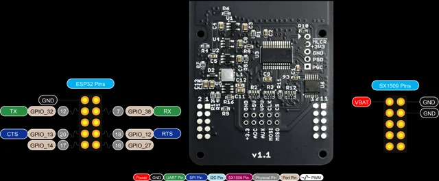
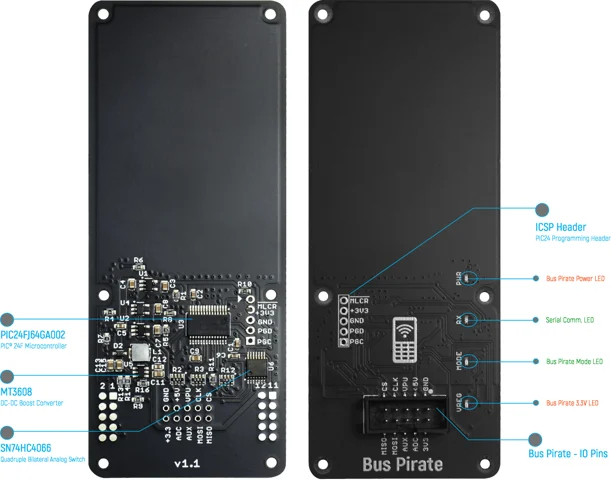
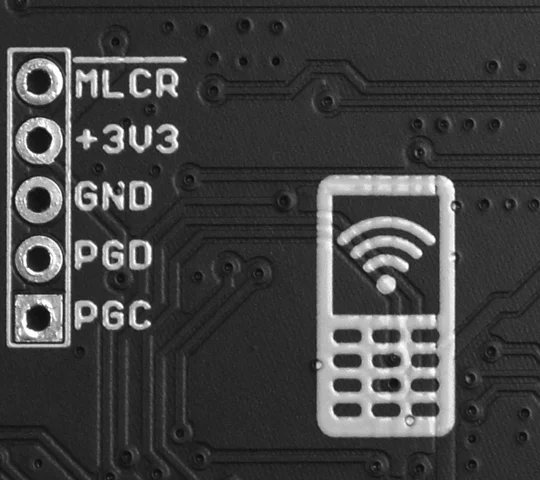
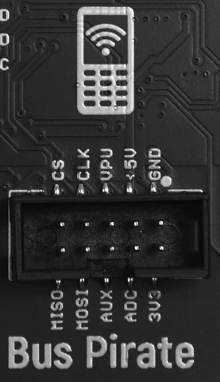

# WiPhone Bus Pirate Daughter Board V1.1

**WiPhone** · PIC24FJ64GA002

Revision: V1.1 pictured; source filename says v1.0  
Coverage: Pinout image collected

[Browse all manufacturers](../../../../BROWSE.md) · [Devices & IoT](../../../../DEVICES.md) · [Open in the browser guide](https://valleytech-black-wire-guide.pages.dev/?board=wiphone-gpio-device-bus-pirate-daughter-board-v1-1)

Device category: **Handhelds & pocket tools**

## Daughter-board interface pin map

**pinout image** · Reviewed source · PNG

[Open original reference](../../../../library/media/2008e3560daeec98f32679764af1ab5d5646f36add760955d45a4f0c02cfd410.png)

**Credit and rights:** Not established; source attribution retained. Source/manufacturer: WiPhone.

[Source 1](https://www.wiphone.io/docs/Bus_Pirate/latest/_images/Bus_pirate_Pinout_v1.0.png) · [Source 2](https://www.wiphone.io/docs/Bus_Pirate/latest/)

WiPhone Bus Pirate daughter board, not a standalone Bus Pirate 5. The PCB illustration says V1.1 while the source filename says v1.0. Verify the pictured revision.

Image revision: V1.1 pictured; source filename says v1.0

SHA-256: `2008e3560daeec98f32679764af1ab5d5646f36add760955d45a4f0c02cfd410`

## Board functions and connector locations

**board labeling image** · Reviewed source · PNG

[Open original reference](../../../../library/media/5a2aadf78c29cc849801acede78ae845c8fac4332fd3792ad246786eb2869240.png)

**Credit and rights:** Not established; source attribution retained. Source/manufacturer: WiPhone.

[Source 1](https://www.wiphone.io/docs/Bus_Pirate/latest/_images/20240804-BusPirateLegened.png) · [Source 2](https://www.wiphone.io/docs/Bus_Pirate/latest/)

Annotated front/back views of the WiPhone daughter board.

Image revision: V1.1 pictured; source filename says v1.0

SHA-256: `5a2aadf78c29cc849801acede78ae845c8fac4332fd3792ad246786eb2869240`

## ICSP programming header labels

**pinout image** · Reviewed source · PNG

[Open original reference](../../../../library/media/013ff85f564aedced33ea9cc9ecc61ad28b5e396495eafeb595e3fefd6605785.png)

**Credit and rights:** Not established; source attribution retained. Source/manufacturer: WiPhone.

[Source 1](https://www.wiphone.io/docs/Bus_Pirate/latest/_images/ICSPHeader.png) · [Source 2](https://www.wiphone.io/docs/Bus_Pirate/latest/)

Physical header close-up. The original silkscreen spells the reset label MLCR; retained unchanged. Confirm against the schematic before programming.

Image revision: V1.1 pictured; source filename says v1.0

SHA-256: `013ff85f564aedced33ea9cc9ecc61ad28b5e396495eafeb595e3fefd6605785`

## Ten-pin Bus Pirate I/O header labels

**pinout image** · Reviewed source · PNG

[Open original reference](../../../../library/media/b2c931653e3f616ba0105289a0846faaac58c8f3466dc07d99ee8664d4127734.png)

**Credit and rights:** Not established; source attribution retained. Source/manufacturer: WiPhone.

[Source 1](https://www.wiphone.io/docs/Bus_Pirate/latest/_images/BusPirateIOs.png) · [Source 2](https://www.wiphone.io/docs/Bus_Pirate/latest/)

Physical I/O header close-up with MISO, MOSI, AUX, CS, CLK, supplies and ground. Partial connector reference.

Image revision: V1.1 pictured; source filename says v1.0

SHA-256: `b2c931653e3f616ba0105289a0846faaac58c8f3466dc07d99ee8664d4127734`

Pin assignments have not been independently electrically verified. Check board revision before wiring.
