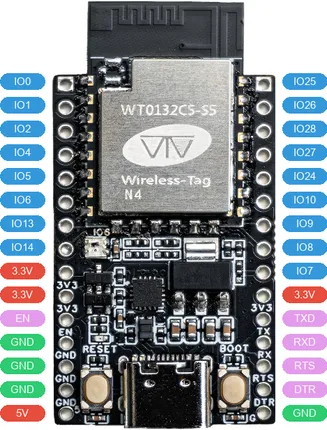

# WT9932C5-TINY

**Wireless-Tag** · ESP32-C5

Revision: Not identified  
Coverage: Pinout image collected

[Browse all manufacturers](../../../../BROWSE.md) · [Desktop app](https://github.com/valleytechsolutions/black-wire-desktop)

## Board pinout

**pinout image** · Reviewed source · PNG

[Open original reference](../../../../library/media/2bfdb9e200e8bdd183925fbcd1c2e89734f1e5d93da0f9e33ad848c32a7ba539.png)

**Credit and rights:** Not established; source attribution retained. Source/manufacturer: Wireless-Tag.

[Source 1](https://res.8ms.xyz/wiki_assets/WT9932C5-TINY/WT9932C5-TINY_%E5%BC%95%E8%84%9A%E5%AE%9A%E4%B9%89_V1.1.png) · [Source 2](https://wiki.wireless-tag.com/docs/en/WT9932C5-TINY/board_resources.html)

SHA-256: `2bfdb9e200e8bdd183925fbcd1c2e89734f1e5d93da0f9e33ad848c32a7ba539`

Pin assignments have not been independently electrically verified. Check board revision before wiring.
