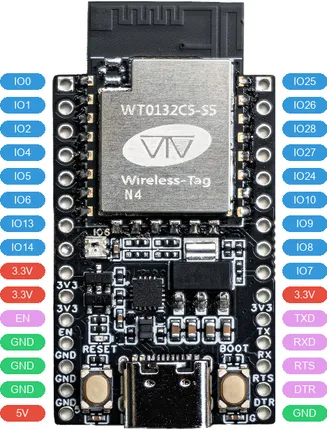

# WT9932C5-TINY

**Wireless-Tag** · ESP32-C5

Revision: Not identified

Coverage: Pinout image collected

[Browse all manufacturers](../../../../BROWSE.md) · [Devices & IoT](../../../../DEVICES.md) · [Open in the browser guide](https://valleytech-black-wire-guide.pages.dev/?board=wireless-tag-esp32-wt9932c5-tiny)

## Datasheets and original documentation

Board datasheet: **not yet recorded**. Visual reference: **available**.

Original manufacturer website still needs identification.

A chip datasheet, schematic and board datasheet have different scopes. Match the exact hardware revision.

[Documentation coverage and remaining gaps](../../../../DOCUMENTATION.md)

## Board pinout

**pinout image** · Reviewed source · PNG

[Open original reference](../../../../library/media/2bfdb9e200e8bdd183925fbcd1c2e89734f1e5d93da0f9e33ad848c32a7ba539.png)

**Credit and rights:** Not established; source attribution retained. Source/manufacturer: Wireless-Tag.

[Source 1](https://res.8ms.xyz/wiki_assets/WT9932C5-TINY/WT9932C5-TINY_%E5%BC%95%E8%84%9A%E5%AE%9A%E4%B9%89_V1.1.png) · [Source 2](https://wiki.wireless-tag.com/docs/en/WT9932C5-TINY/board_resources.html)

Image revision: Not identified

SHA-256: `2bfdb9e200e8bdd183925fbcd1c2e89734f1e5d93da0f9e33ad848c32a7ba539`

Pin assignments have not been independently electrically verified. Check board revision before wiring.
