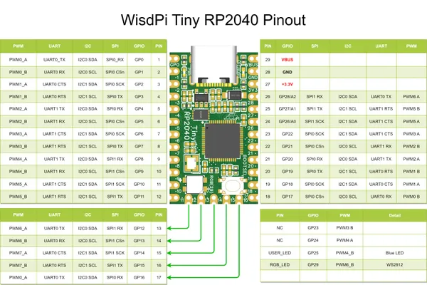

# WisdPi Tiny RP2040

**WisdPi** · RP2040

Revision: Not identified  
Coverage: Pinout image collected

[Browse all manufacturers](../../../../BROWSE.md) · [Desktop app](https://github.com/valleytechsolutions/black-wire-desktop)

## Physical board pinout

**pinout image** · Reviewed source · JPG

[Open original reference](../../../../library/media/f206165f970f492a304a3bdd598f379e849325c98363cf7054e304eabbb9ca18.jpg)

**Credit and rights:** Not established; source attribution retained. Source/manufacturer: WisdPi.

[Source 1](https://wisdpi.com/cdn/shop/files/wisdPiTinyRP2040pinout.jpg?v=1715947320) · [Source 2](https://www.wisdpi.com/products/wisdpi-tiny-rp2040-a-tiny-cool-rp2040-dev-board-with-4mb-flash)

Discovered from CircuitPython board metadata and the linked product/documentation page. Exact hardware revision requires matching to the diagram.

SHA-256: `f206165f970f492a304a3bdd598f379e849325c98363cf7054e304eabbb9ca18`

Pin assignments have not been independently electrically verified. Check board revision before wiring.
