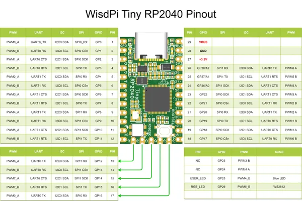

# WisdPi Tiny RP2040

**WisdPi** · RP2040

Revision: Not identified

Coverage: Pinout image collected

[Browse all manufacturers](../../../../BROWSE.md) · [Devices & IoT](../../../../DEVICES.md) · [Open in the browser guide](https://valleytech-black-wire-guide.pages.dev/?board=wisdpi-rp2040-tiny-rp2040)

## Datasheets and original documentation

Board datasheet: **not yet recorded**. Visual reference: **available**.

Original manufacturer website still needs identification.

A chip datasheet, schematic and board datasheet have different scopes. Match the exact hardware revision.

[Documentation coverage and remaining gaps](../../../../DOCUMENTATION.md)

## Physical board pinout

**pinout image** · Reviewed source · JPG

[Open original reference](../../../../library/media/f206165f970f492a304a3bdd598f379e849325c98363cf7054e304eabbb9ca18.jpg)

**Credit and rights:** Not established; source attribution retained. Source/manufacturer: WisdPi.

[Source 1](https://wisdpi.com/cdn/shop/files/wisdPiTinyRP2040pinout.jpg?v=1715947320) · [Source 2](https://www.wisdpi.com/products/wisdpi-tiny-rp2040-a-tiny-cool-rp2040-dev-board-with-4mb-flash)

Discovered from CircuitPython board metadata and the linked product/documentation page. Exact hardware revision requires matching to the diagram.

Image revision: Not identified

SHA-256: `f206165f970f492a304a3bdd598f379e849325c98363cf7054e304eabbb9ca18`

Pin assignments have not been independently electrically verified. Check board revision before wiring.
