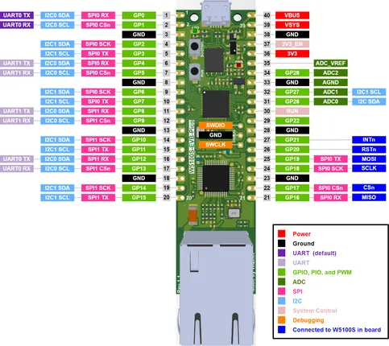
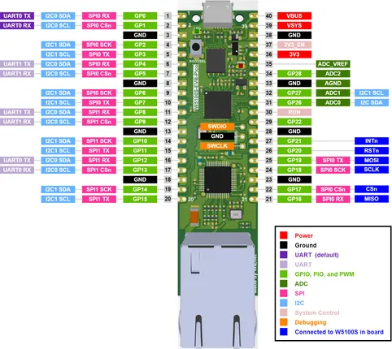

# W5100S-EVB-Pico

**WIZnet** · RP2040

Revision: Multiple source/revision records; see individual assets

Coverage: Pinout image collected

[Browse all manufacturers](../../../../BROWSE.md) · [Devices & IoT](../../../../DEVICES.md) · [Open in the browser guide](https://valleytech-black-wire-guide.pages.dev/?board=wiznet-rp2040-w5100s-evb-pico)

## Datasheets and original documentation

Board datasheet: **not yet recorded**. Visual reference: **available**.

[Manufacturer source (recorded link)](https://docs.wiznet.io/Product/Chip/Ethernet/W5100S/w5100s-evb-pico)

A chip datasheet, schematic and board datasheet have different scopes. Match the exact hardware revision.

[Documentation coverage and remaining gaps](../../../../DOCUMENTATION.md)

## Manufacturer pinout reference

**pinout image** · Reviewed source · PNG

[Open original reference](../../../../library/media/c2957f74cd5a577838f7778a4f267a9bf40eb4c89c4b5f7dbee84ec99558232a.png)

**Credit and rights:** Not established; source attribution retained. Source/manufacturer: WIZnet.

[Source 1](https://docs.wiznet.io/assets/images/w5100s-evb-pico-1.1-pinout-106c570db291aee2fa8b1e973d2ee535.png) · [Source 2](https://docs.wiznet.io/Product/Chip/Ethernet/W5100S/w5100s-evb-pico)

Image revision: W5100S-EVB-Pico v1.1

SHA-256: `c2957f74cd5a577838f7778a4f267a9bf40eb4c89c4b5f7dbee84ec99558232a`

## Manufacturer pinout reference

**pinout image** · Reviewed source · PNG

[Open original reference](../../../../library/media/f2a26ef8708815b156a3c7728d523ecfd418cb84c4b191ee004f24a3866b5caa.png)

**Credit and rights:** Not established; source attribution retained. Source/manufacturer: WIZnet.

[Source 1](https://docs.wiznet.io/assets/images/w5100s-evb-pic-pinout_v1-0b6175173e9620025ef8d641a9521bfc.png) · [Source 2](https://docs.wiznet.io/Product/Chip/Ethernet/W5100S/w5100s-evb-pico)

Image revision: W5100S-EVB-Pico v1.0

SHA-256: `f2a26ef8708815b156a3c7728d523ecfd418cb84c4b191ee004f24a3866b5caa`

Pin assignments have not been independently electrically verified. Check board revision before wiring.
