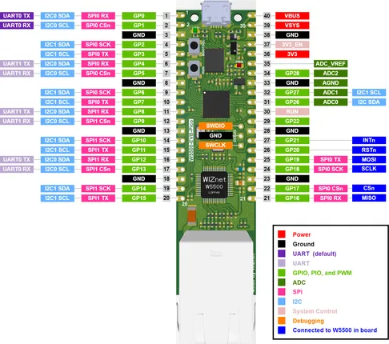

# W5500-EVB-Pico

**WIZnet** · RP2040

Revision: Not identified  
Coverage: Pinout image collected

[Browse all manufacturers](../../../../BROWSE.md) · [Desktop app](https://github.com/valleytechsolutions/black-wire-desktop)

## Manufacturer pinout reference

**pinout image** · Reviewed source · PNG

[Open original reference](../../../../library/media/2336f1f35974c4bbb221a3c108ec28e0cccf49bbe3160be7a500bcf5d10498f8.png)

**Credit and rights:** Not established; source attribution retained. Source/manufacturer: WIZnet.

[Source 1](https://docs.wiznet.io/assets/images/w5500-evb-pico-pinout-fe942a8c8d6e9d591c0ae8bc7312d592.png) · [Source 2](https://docs.wiznet.io/Product/Chip/Ethernet/W5500/w5500-evb-pico)

SHA-256: `2336f1f35974c4bbb221a3c108ec28e0cccf49bbe3160be7a500bcf5d10498f8`

Pin assignments have not been independently electrically verified. Check board revision before wiring.
