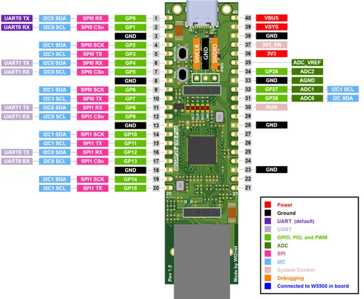

# W55RP20-EVB-Pico

**WIZnet** · RP2040

Revision: Not identified  
Coverage: Pinout image collected

[Browse all manufacturers](../../../../BROWSE.md) · [Desktop app](https://github.com/valleytechsolutions/black-wire-desktop)

## Physical board pinout

**pinout image** · Reviewed source · PNG

[Open original reference](../../../../library/media/bd66a4677e0b448da363a58966222300b7452e8cf76a3e9fec436d46c9371266.png)

**Credit and rights:** Not established; source attribution retained. Source/manufacturer: WIZnet.

[Source 1](https://docs.wiznet.io/assets/images/w55rp20-evb-pico-pinout-c7dbe9757fcc123403e7ed81a6984931.png) · [Source 2](https://docs.wiznet.io/Product/Chip/MCU/W55RP20/w55rp20-evb-pico)

Discovered from CircuitPython board metadata and the linked product/documentation page. Exact hardware revision requires matching to the diagram.

SHA-256: `bd66a4677e0b448da363a58966222300b7452e8cf76a3e9fec436d46c9371266`

Pin assignments have not been independently electrically verified. Check board revision before wiring.
