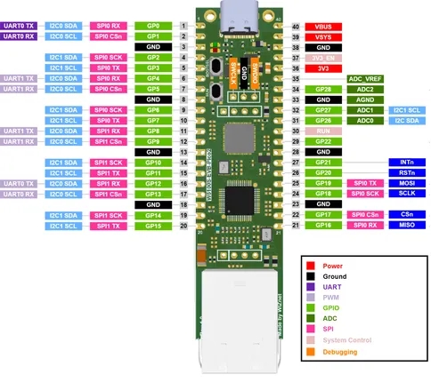

# W5100S-EVB-Pico2

**WIZnet** · RP2350

Revision: Not identified  
Coverage: Pinout image collected

[Browse all manufacturers](../../../../BROWSE.md) · [Desktop app](https://github.com/valleytechsolutions/black-wire-desktop)

## Manufacturer pinout reference

**pinout image** · Reviewed source · PNG

[Open original reference](../../../../library/media/c21d8fd8c0c8098ee2b8023583ef4e27b895244caefbf0112249913963ea02ff.png)

**Credit and rights:** Not established; source attribution retained. Source/manufacturer: WIZnet.

[Source 1](https://docs.wiznet.io/assets/images/w5100s-evb-pico2-pinout-a84701258223969cfbbe26d2c2ef9280.png) · [Source 2](https://docs.wiznet.io/Product/Chip/Ethernet/W5100S/w5100s-evb-pico2)

SHA-256: `c21d8fd8c0c8098ee2b8023583ef4e27b895244caefbf0112249913963ea02ff`

Pin assignments have not been independently electrically verified. Check board revision before wiring.
