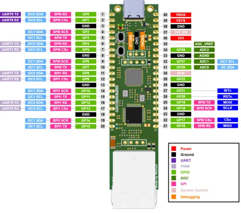

# W5500-EVB-Pico2

**WIZnet** · RP2350

Revision: Not identified  
Coverage: Pinout image collected

[Browse all manufacturers](../../../../BROWSE.md) · [Desktop app](https://github.com/valleytechsolutions/black-wire-desktop)

## Pinout

**pinout image** · Reviewed source · PNG

[Open original reference](../../../../library/media/012d20abba3b8323f49788407594d8889feef49662926fd01955d9e6cf6c43e7.png)

**Credit and rights:** Not established; source attribution retained. Source/manufacturer: WIZnet.

[Source 1](https://docs.wiznet.io/assets/images/w5500-evb-pico2-pinout-8c8e5ac528484abeab3e39549a0b1c97.png) · [Source 2](https://docs.wiznet.io/Product/Chip/Ethernet/W5500/w5500-evb-pico2)

SHA-256: `012d20abba3b8323f49788407594d8889feef49662926fd01955d9e6cf6c43e7`

Pin assignments have not been independently electrically verified. Check board revision before wiring.
