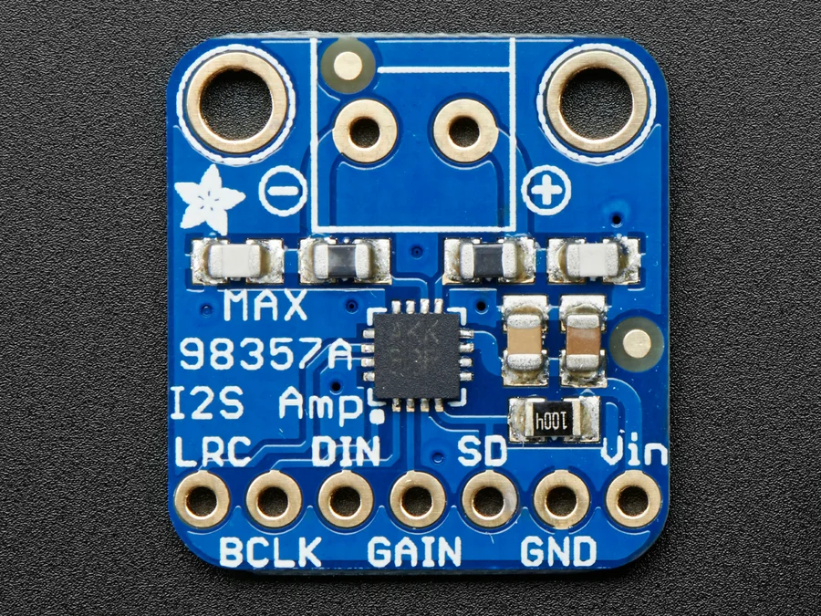

# Audio / visual references

[All categories](../../MAKER_VISUALS.md) · [Image attribution ledger](../../catalog/maker-attributions.json)

Source references remain unchanged. Check exact PCB/revision, source notes and rights before reuse. Photos and partial connector diagrams are not complete-device approvals.

## Adafruit MAX98357 I2S Class-D Amps - Stereo and Mono

Adafruit · Manufacturer documentation recorded

[Open full gallery](https://valleytech-black-wire-guide.pages.dev/?tab=makers&part=maker-adafruit-ca3cc11716cc)

**source reference** · Source image inspected; technical review pending

Adafruit Industries / original asset contributor. https://creativecommons.org/licenses/by-sa/3.0/; original image unchanged. See linked asset page for creator and terms.
