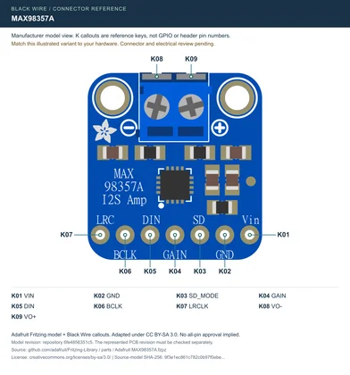

# Audio / visual references

[All categories](../../MAKER_VISUALS.md) · [Image attribution ledger](../../catalog/maker-attributions.json)

Manufacturer originals remain unchanged. Connector-model sheets add separately labeled callouts under the recorded source license. Check exact PCB/revision, source notes and rights before reuse. Photos and partial connector diagrams are not complete-device approvals.

## Adafruit MAX98357 I2S Class-D Amps - Stereo and Mono

Adafruit · Manufacturer documentation recorded

[Open full gallery](https://valleytech-black-wire-guide.pages.dev/?tab=makers&part=maker-adafruit-ca3cc11716cc)

**pinout image** · Manufacturer-model geometry checked; independent electrical and full-device review pending

Adafruit manufacturer illustration with Black Wire connector callouts, adapted under CC BY-SA 3.0. Attribution and share-alike terms apply to this sheet.
