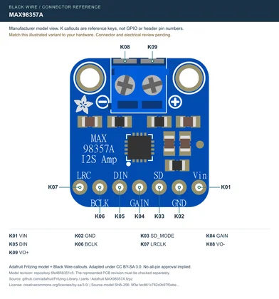
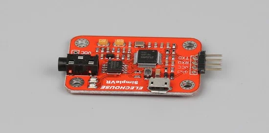
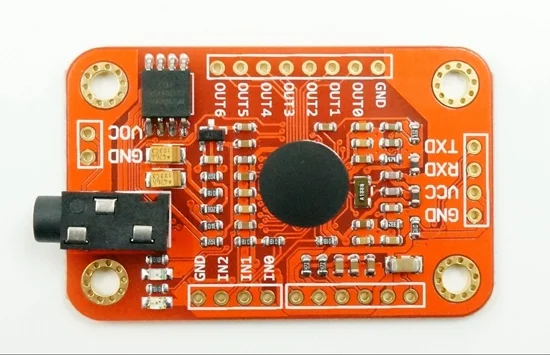

# Audio / visual references

[All categories](../../MAKER_VISUALS.md) · [Image attribution ledger](../../catalog/maker-attributions.json)

Manufacturer originals remain unchanged. Connector-model sheets add separately labeled callouts under the recorded source license. Check exact PCB/revision, source notes and rights before reuse. Photos and partial connector diagrams are not complete-device approvals.

## Adafruit MAX98357 I2S Class-D Amps - Stereo and Mono

Adafruit · Manufacturer documentation recorded

[Open full gallery](https://valleytech-black-wire-guide.pages.dev/?tab=makers&part=maker-adafruit-ca3cc11716cc)

**pinout image** · Manufacturer-model geometry checked; independent electrical and full-device review pending

Adafruit manufacturer illustration with Black Wire connector callouts, adapted under CC BY-SA 3.0. Attribution and share-alike terms apply to this sheet.

## SimpleVR speaker-independent Voice Recognition Module

Elechouse · Manufacturer documentation recorded

[Open full gallery](https://valleytech-black-wire-guide.pages.dev/?tab=makers&part=elechouse-simplevr)

**board labeling image** · Source image / document inspected; independent electrical review pending

Elechouse / original diagram and document contributors. Asset-specific redistribution and print rights are not established. Black Wire's editorial license does not relicense this artwork.

## Speak Recognition, Voice Recognition Module V3

Elechouse · Manufacturer documentation recorded

[Open full gallery](https://valleytech-black-wire-guide.pages.dev/?tab=makers&part=elechouse-voice-recognition-v3)

**board labeling image** · Source image / document inspected; independent electrical review pending

Elechouse / original diagram and document contributors. Asset-specific redistribution and print rights are not established. Black Wire's editorial license does not relicense this artwork.
