# Communication / visual references

[All categories](../../MAKER_VISUALS.md) · [Image attribution ledger](../../catalog/maker-attributions.json)

Source references remain unchanged. Check exact PCB/revision, source notes and rights before reuse. Photos and partial connector diagrams are not complete-device approvals.

## Bluetooth Bee

Seeed Studio · Source review pending

[Open full gallery](https://valleytech-black-wire-guide.pages.dev/?tab=makers&part=maker-existing-seeed-studio-expansion-bluetooth-bee)

[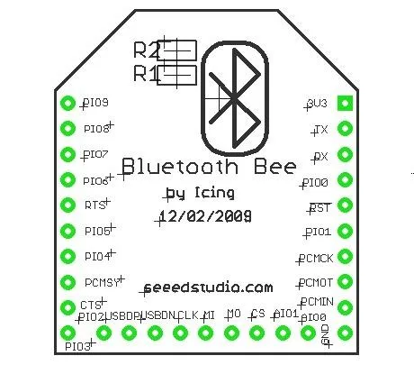](../../library/media/3e2d762a2855ad3f0ba70dcb8f1031e23dde345f74d424f475c95f26ac06bc8e.jpg)

**pinout image** · Reviewed source

Not established; source attribution retained

## Dual Gigabit Ethernet Carrier Board for Raspberry Pi CM4

Seeed Studio · Source review pending

[Open full gallery](https://valleytech-black-wire-guide.pages.dev/?tab=makers&part=maker-existing-seeed-studio-expansion-dual-gigabit-ethernet-carrier-board-for-raspberry-pi-cm4)

[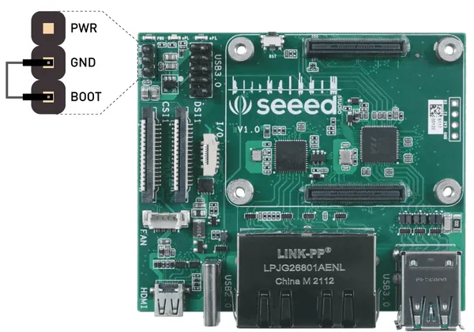](../../library/media/9fc6eb742335e369409920538aa2754400854d96b11ddd0d20dcd4c35fe3bbfa.png)

**pinout image** · Reviewed source

Not established; source attribution retained

## GPS Bee Kit

Seeed Studio · Source review pending

[Open full gallery](https://valleytech-black-wire-guide.pages.dev/?tab=makers&part=maker-existing-seeed-studio-expansion-gps-bee-kit)

[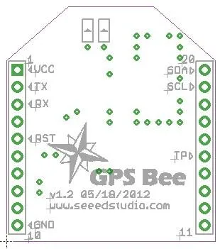](../../library/media/f83125e6b947de50f09e706dbbe688dd948e0d17c1193743a55112f9d8f2f549.jpg)

**pinout image** · Reviewed source

Not established; source attribution retained

## L76-L GNSS Module for XIAO

Seeed Studio · Source review pending

[Open full gallery](https://valleytech-black-wire-guide.pages.dev/?tab=makers&part=maker-existing-seeed-studio-expansion-l76-l-gnss-module-for-xiao)

**pinout image** · Reviewed source

Not established; source attribution retained

## L76K GNSS Module for XIAO

Seeed Studio · Source review pending

[Open full gallery](https://valleytech-black-wire-guide.pages.dev/?tab=makers&part=maker-existing-seeed-studio-expansion-l76k-gnss-module-for-xiao)

**pinout image** · Reviewed source

Not established; source attribution retained

## Module GPS v2.0

M5Stack · Source review pending

[Open full gallery](https://valleytech-black-wire-guide.pages.dev/?tab=makers&part=maker-existing-m5stack-expansion-module-gps-v2-0)

**pinout image** · Reviewed source

Not established; source attribution retained

## Module GPS v2.1

M5Stack · Source review pending

[Open full gallery](https://valleytech-black-wire-guide.pages.dev/?tab=makers&part=maker-existing-source-board-44364c1110885a327e)

[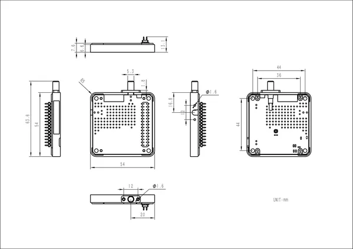](../../library/media/b71dc423f87399de8c846a75cda03f7438d68bab05f12632807551d6d6bbbdcd.png)

**source reference** · Unreviewed source

Source rights not yet established

## Module LoRa433 v1.1

M5Stack · Source review pending

[Open full gallery](https://valleytech-black-wire-guide.pages.dev/?tab=makers&part=maker-existing-source-board-5184d306f94dee5e99)

[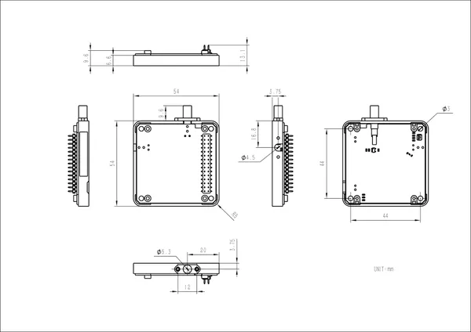](../../library/media/d334136ec454d44f285e138b8add11e649eb1ff9c8896035ae72b37a76828c83.jpg)

**source reference** · Unreviewed source

Source rights not yet established

## Module LoRaWAN-EU868

M5Stack · Source review pending

[Open full gallery](https://valleytech-black-wire-guide.pages.dev/?tab=makers&part=maker-existing-source-board-19fedbc3541758cfe4)

[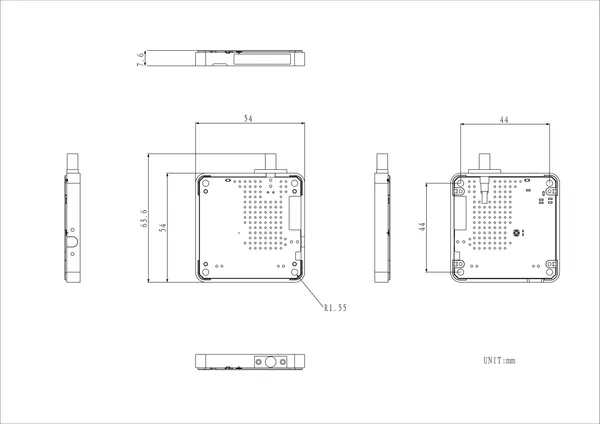](../../library/media/001187e66cdec901dd62112d0769aeefd1124ca8dd884d913f7d8b26fdddb6fe.png)

**source reference** · Unreviewed source

Source rights not yet established

## Module13.2 LoRa-1262

M5Stack · Source review pending

[Open full gallery](https://valleytech-black-wire-guide.pages.dev/?tab=makers&part=maker-existing-m5stack-expansion-module13-2-lora-1262)

[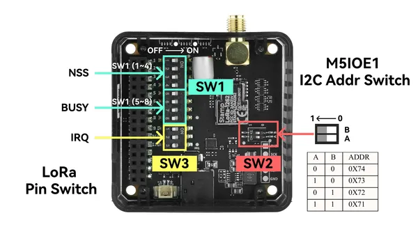](../../library/media/f7fe0223690398b6365b0d26ea3a412b97cd8ddf6e4f791a57515d47f187cbf0.png)

**pinout image** · Reviewed source

Not established; source attribution retained

## Serial Port Bluetooth Module (Master-Slave)

Seeed Studio · Source review pending

[Open full gallery](https://valleytech-black-wire-guide.pages.dev/?tab=makers&part=maker-existing-seeed-studio-expansion-serial-port-bluetooth-module-master-slave)

[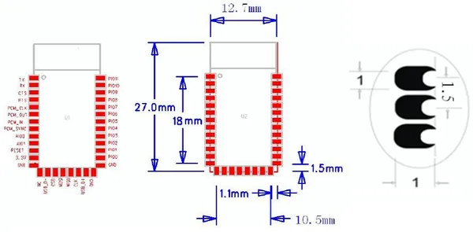](../../library/media/bde0aff47cb55cc116e1ca3a69a30240420249ffe8bce4cf769288f1f9389e3e.jpg)

**pinout image** · Reviewed source

Not established; source attribution retained

## Stamp LoRa-1262

M5Stack · Source review pending

[Open full gallery](https://valleytech-black-wire-guide.pages.dev/?tab=makers&part=maker-existing-m5stack-expansion-stamp-lora-1262)

**pinout image** · Reviewed source

Not established; source attribution retained

## Stamp LoRa-1262 I

M5Stack · Source review pending

[Open full gallery](https://valleytech-black-wire-guide.pages.dev/?tab=makers&part=maker-existing-m5stack-expansion-stamp-lora-1262-i)

**pinout image** · Reviewed source

Not established; source attribution retained

## Stamp LoRa-1262 IF

M5Stack · Source review pending

[Open full gallery](https://valleytech-black-wire-guide.pages.dev/?tab=makers&part=maker-existing-m5stack-expansion-stamp-lora-1262-if)

[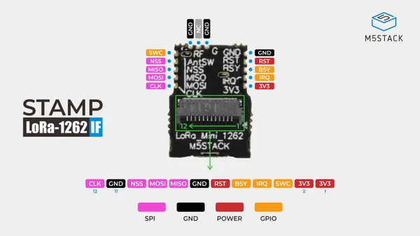](../../library/media/8ace86669c0b7a4cf9cb0f33a43c44e50cb96b1a0511610f5b1f095cdecc9abb.jpg)

**pinout image** · Reviewed source

Not established; source attribution retained

## Stamp UWB

M5Stack · Source review pending

[Open full gallery](https://valleytech-black-wire-guide.pages.dev/?tab=makers&part=maker-existing-m5stack-expansion-stamp-uwb)

[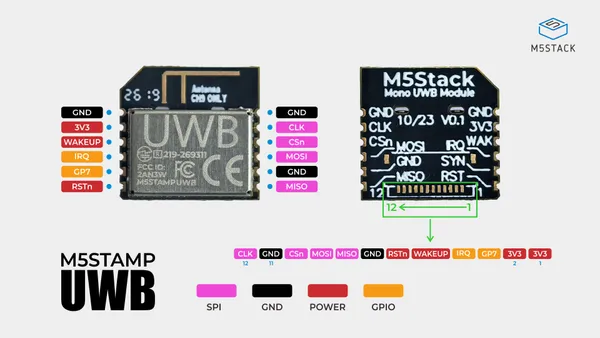](../../library/media/be0b15e5b9ab67dc6d9dac8c3bfb50fdaf38fb48886d656480fbb0b2969da01f.jpg)

**pinout image** · Reviewed source

Not established; source attribution retained

## Stamp UWB F

M5Stack · Source review pending

[Open full gallery](https://valleytech-black-wire-guide.pages.dev/?tab=makers&part=maker-existing-m5stack-expansion-stamp-uwb-f)

**pinout image** · Reviewed source

Not established; source attribution retained

## Unit CatM GNSS

M5Stack · Source review pending

[Open full gallery](https://valleytech-black-wire-guide.pages.dev/?tab=makers&part=maker-existing-source-board-4d02ce62687c830d61)

[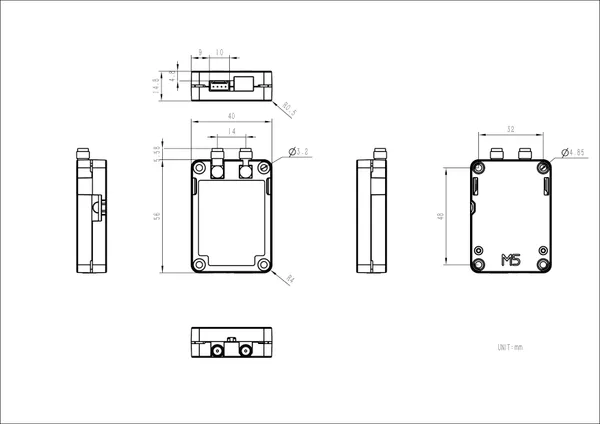](../../library/media/8d6b8ec0a3f24a1897cdd90f4ebf558ec5722f8067dd27ca7cdf10ae9882d265.jpg)

**source reference** · Unreviewed source

Source rights not yet established

## Unit GPS

M5Stack · Source review pending

[Open full gallery](https://valleytech-black-wire-guide.pages.dev/?tab=makers&part=maker-existing-source-board-4469908e23dfc1079d)

**source reference** · Unreviewed source

Source rights not yet established

## Unit LoRaE220-433

M5Stack · Source review pending

[Open full gallery](https://valleytech-black-wire-guide.pages.dev/?tab=makers&part=maker-existing-source-board-cfb352c345e0ddda30)

[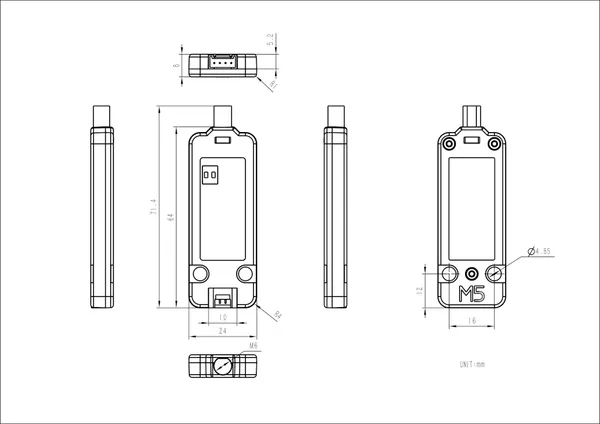](../../library/media/5e049c898baa3a1aa7c758a8128244518edee0ed8aab43e966e532a8747fee3d.jpg)

**source reference** · Unreviewed source

Source rights not yet established

## Unit UWB

M5Stack · Source review pending

[Open full gallery](https://valleytech-black-wire-guide.pages.dev/?tab=makers&part=maker-existing-source-board-fd2e7091a16298609a)

[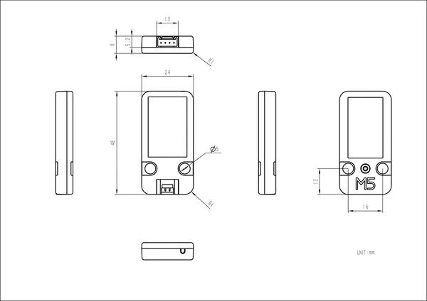](../../library/media/6235e927705e96fb499300eabe21b7f30aacb49d9d69529bf6c93a64f6c59fb1.png)

**source reference** · Unreviewed source

Source rights not yet established

## Wi-Fi HaLow Module for XIAO

Seeed Studio · Source review pending

[Open full gallery](https://valleytech-black-wire-guide.pages.dev/?tab=makers&part=maker-existing-seeed-studio-expansion-wi-fi-halow-module-for-xiao)

**board labeling image** · Reviewed source

Not established; source attribution retained

## WM1302 LoRaWAN Gateway Module

Seeed Studio · Source review pending

[Open full gallery](https://valleytech-black-wire-guide.pages.dev/?tab=makers&part=maker-existing-seeed-studio-expansion-wm1302-lorawan-gateway-module)

[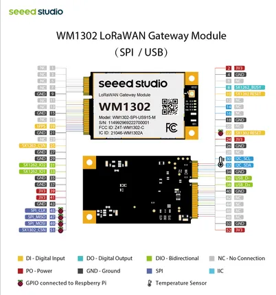](../../library/media/f64af32329e3765e919568e46fd776e428219f7053b4180614d75188bc73579d.png)

**pinout image** · Reviewed source

Not established; source attribution retained
