# Communication / visual references

[All categories](../../MAKER_VISUALS.md) · [Image attribution ledger](../../catalog/maker-attributions.json)

Manufacturer originals remain unchanged. Connector-model sheets add separately labeled callouts under the recorded source license. Check exact PCB/revision, source notes and rights before reuse. Photos and partial connector diagrams are not complete-device approvals.

## 13.56MHZ RFID Reader/Writer Module V5— Ultralight

Elechouse · Manufacturer documentation recorded

[Open full gallery](https://valleytech-black-wire-guide.pages.dev/?tab=makers&part=elechouse-serial-rfid-v5)

[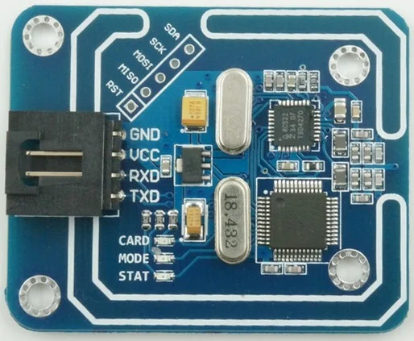](../../library/media/5f01e7b71d4984a0d5313017f497d1611a4c28f19255f9799f5124f731cdb01a.jpg)

**board labeling image** · Source image / document inspected; independent electrical review pending

Elechouse / original diagram and document contributors. Asset-specific redistribution and print rights are not established. Black Wire's editorial license does not relicense this artwork.

## 915MHz CC1101 Wireless Module

Elechouse · Manufacturer documentation recorded

[Open full gallery](https://valleytech-black-wire-guide.pages.dev/?tab=makers&part=elechouse-cc1101-915mhz)

[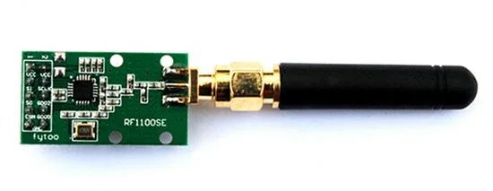](../../library/media/d8c53edebfb75af6724b417385ab1170a0b04f6beb687105d9199c44d5e3c583.jpg)

**product photograph** · Source image / document inspected; independent electrical review pending

Elechouse / original diagram and document contributors. Asset-specific redistribution and print rights are not established. Black Wire's editorial license does not relicense this artwork.

## BlueSMiRF v2

SparkFun · Manufacturer source references collected

[Open full gallery](https://valleytech-black-wire-guide.pages.dev/?tab=makers&part=maker-sparkfun-bluesmirf-v2)

[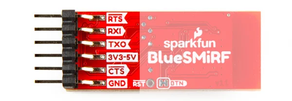](../../library/media/1720ff2f36f06bc57eda57b10e47017421b69882b79b3b7a6fc321884939147c.jpg)

**pinout image** · Reviewed source

SparkFun / original diagram contributors. Rights not established for this asset; attribution retained. Original artwork is not covered by Black Wire's editorial license.

## Bluetooth Bee

Seeed Studio · Source review pending

[Open full gallery](https://valleytech-black-wire-guide.pages.dev/?tab=makers&part=maker-existing-seeed-studio-expansion-bluetooth-bee)

[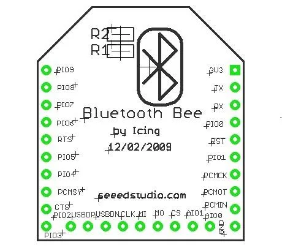](../../library/media/3e2d762a2855ad3f0ba70dcb8f1031e23dde345f74d424f475c95f26ac06bc8e.jpg)

**pinout image** · Reviewed source

Not established; source attribution retained

## CLRC663 Reader Module V1—SPI/I2C/UART

Elechouse · Manufacturer documentation recorded

[Open full gallery](https://valleytech-black-wire-guide.pages.dev/?tab=makers&part=elechouse-clrc663-v1)

[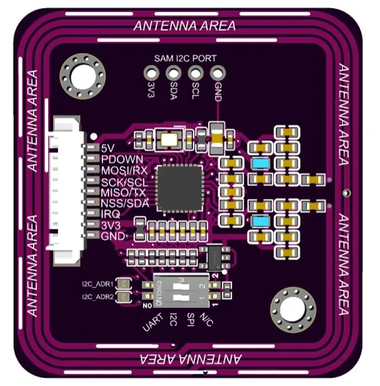](../../library/media/c38c2c2c7dc636c6511f89dc64a1f27fcf17696211d45760b33870d06201bc9e.jpg)

**board labeling image** · Source image / document inspected; independent electrical review pending

Elechouse / original diagram and document contributors. Asset-specific redistribution and print rights are not established. Black Wire's editorial license does not relicense this artwork.

## Dual Gigabit Ethernet Carrier Board for Raspberry Pi CM4

Seeed Studio · Source review pending

[Open full gallery](https://valleytech-black-wire-guide.pages.dev/?tab=makers&part=maker-existing-seeed-studio-expansion-dual-gigabit-ethernet-carrier-board-for-raspberry-pi-cm4)

[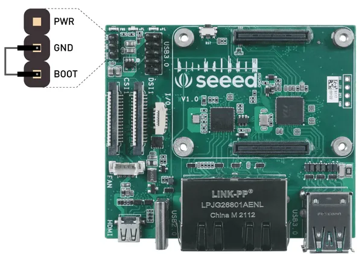](../../library/media/9fc6eb742335e369409920538aa2754400854d96b11ddd0d20dcd4c35fe3bbfa.png)

**pinout image** · Reviewed source

Not established; source attribution retained

## GPS Bee Kit

Seeed Studio · Source review pending

[Open full gallery](https://valleytech-black-wire-guide.pages.dev/?tab=makers&part=maker-existing-seeed-studio-expansion-gps-bee-kit)

[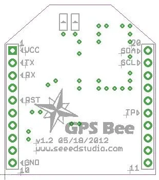](../../library/media/f83125e6b947de50f09e706dbbe688dd948e0d17c1193743a55112f9d8f2f549.jpg)

**pinout image** · Reviewed source

Not established; source attribution retained

## Inland 8266 WIFI Module (2PCS)

Inland · Manufacturer documentation recorded

[Open full gallery](https://valleytech-black-wire-guide.pages.dev/?tab=makers&part=inland-support-665)

[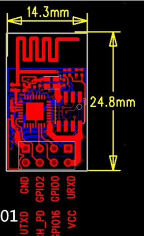](../../library/media/1e789fed6a80bd102d7ac447818213b02fb4f0e80fc15d4782a02aaddaae1edf.png)

**pinout image** · Reviewed source

Inland / original artwork contributors. Asset-specific redistribution and print rights are not established. Black Wire's editorial license does not relicense this artwork.

## Inland Bluetooth Transmission Module for Arduino with Bottom hc-05 Master and Slave

Inland · Manufacturer documentation recorded

[Open full gallery](https://valleytech-black-wire-guide.pages.dev/?tab=makers&part=inland-support-636)

[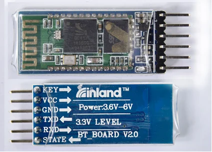](../../library/media/25af5988f214357c8dc58ad941dfdc227dc9de854b9c74d23f791fcce0ada073.png)

**board labeling image** · Reviewed source

Inland / original artwork contributors. Asset-specific redistribution and print rights are not established. Black Wire's editorial license does not relicense this artwork.

## Inland CAN-BUS Shield (blue and Eco-friendly)

Inland · Manufacturer documentation recorded

[Open full gallery](https://valleytech-black-wire-guide.pages.dev/?tab=makers&part=inland-support-647)

[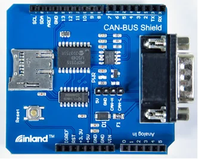](../../library/media/6289015b4c536af1ece66ffffb7b1215e671bee9cb81ef1e74ea2d73fad76780.png)

**board labeling image** · Reviewed source

Inland / original artwork contributors. Asset-specific redistribution and print rights are not established. Black Wire's editorial license does not relicense this artwork.

## Inland HM-10 Bluetooth-4.0 V3 Compatible with HC-06 Pins

Inland · Manufacturer documentation recorded

[Open full gallery](https://valleytech-black-wire-guide.pages.dev/?tab=makers&part=inland-support-655)

[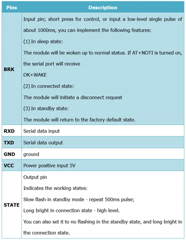](../../library/media/563e7daff2fb63e631d67dbeebc867b432a3a26b666e6894026434bd7deef52a.png)

**pin function reference** · Reviewed source

Inland / original artwork contributors. Asset-specific redistribution and print rights are not established. Black Wire's editorial license does not relicense this artwork.

## Inland RC522 RFID Module for Arduino

Inland · Manufacturer documentation recorded

[Open full gallery](https://valleytech-black-wire-guide.pages.dev/?tab=makers&part=inland-support-674)

[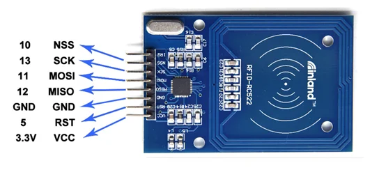](../../library/media/470e215fee793b4293847e61106681952a1e5991422b0b742ec4ac96b5af9bee.png)

**pinout image** · Reviewed source

Inland / original artwork contributors. Asset-specific redistribution and print rights are not established. Black Wire's editorial license does not relicense this artwork.

## L76-L GNSS Module for XIAO

Seeed Studio · Source review pending

[Open full gallery](https://valleytech-black-wire-guide.pages.dev/?tab=makers&part=maker-existing-seeed-studio-expansion-l76-l-gnss-module-for-xiao)

[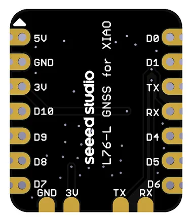](../../library/media/6e83db6dd9d70e9ccaf199a5db29b35f70eed982c5beb5f8dc2a38887ac3c8c8.png)

**pinout image** · Reviewed source

Not established; source attribution retained

## L76K GNSS Module for XIAO

Seeed Studio · Source review pending

[Open full gallery](https://valleytech-black-wire-guide.pages.dev/?tab=makers&part=maker-existing-seeed-studio-expansion-l76k-gnss-module-for-xiao)

[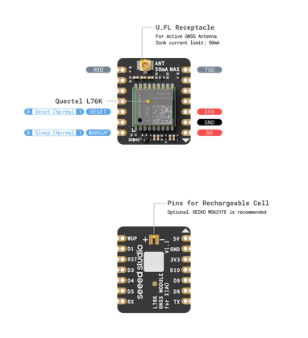](../../library/maker-media/9fc8cd70a85811fcf8acc518ad43b6e58bb81fd8c883d6a6fd5343a485e1cc07.png)

**pinout image** · Connector diagram visually inspected; independent electrical review pending

Manufacturer source artwork. Reproduction rights not established; excluded from the printed book.

## Module GPS v2.0

M5Stack · Source review pending

[Open full gallery](https://valleytech-black-wire-guide.pages.dev/?tab=makers&part=maker-existing-m5stack-expansion-module-gps-v2-0)

[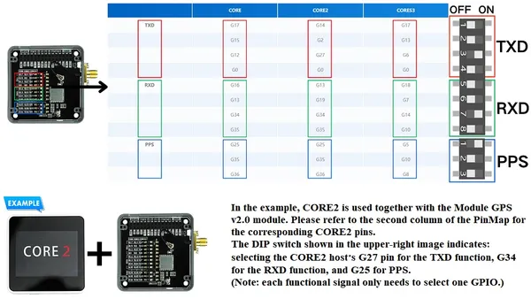](../../library/media/ba9ae005684eb4b90d6d4553561151016485769c074c37ed75a5dae3396f0b0f.jpg)

**pinout image** · Reviewed source

Not established; source attribution retained

## Module GPS v2.1

M5Stack · Source review pending

[Open full gallery](https://valleytech-black-wire-guide.pages.dev/?tab=makers&part=maker-existing-source-board-44364c1110885a327e)

[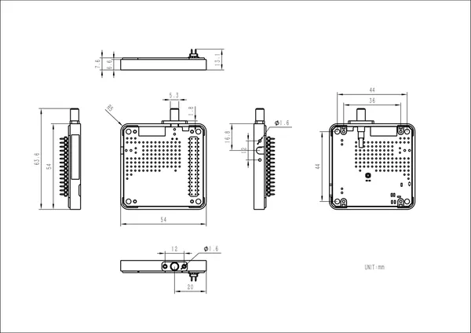](../../library/media/b71dc423f87399de8c846a75cda03f7438d68bab05f12632807551d6d6bbbdcd.png)

**source reference** · Unreviewed source

Source rights not yet established

## Module LoRa433 v1.1

M5Stack · Source review pending

[Open full gallery](https://valleytech-black-wire-guide.pages.dev/?tab=makers&part=maker-existing-source-board-5184d306f94dee5e99)

**source reference** · Unreviewed source

Source rights not yet established

## Module LoRaWAN-EU868

M5Stack · Source review pending

[Open full gallery](https://valleytech-black-wire-guide.pages.dev/?tab=makers&part=maker-existing-source-board-19fedbc3541758cfe4)

[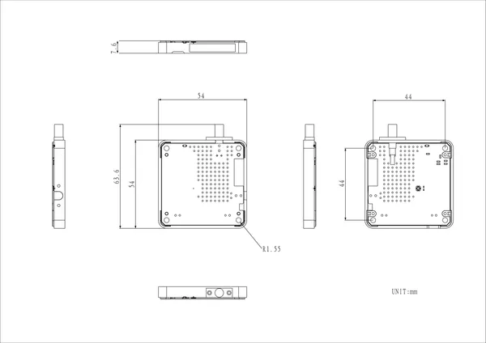](../../library/media/001187e66cdec901dd62112d0769aeefd1124ca8dd884d913f7d8b26fdddb6fe.png)

**source reference** · Unreviewed source

Source rights not yet established

## Module13.2 LoRa-1262

M5Stack · Source review pending

[Open full gallery](https://valleytech-black-wire-guide.pages.dev/?tab=makers&part=maker-existing-m5stack-expansion-module13-2-lora-1262)

**pinout image** · Reviewed source

Not established; source attribution retained

## PN5180 NFC MODULE

Elechouse · Manufacturer documentation recorded

[Open full gallery](https://valleytech-black-wire-guide.pages.dev/?tab=makers&part=elechouse-pn5180)

[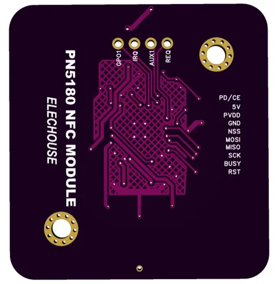](../../library/media/a906230dfd3bd6263fc5cab698539491b0d92b11146faaea3932a18a4d873fa7.jpg)

**board labeling image** · Source image / document inspected; independent electrical review pending

Elechouse / original diagram and document contributors. Asset-specific redistribution and print rights are not established. Black Wire's editorial license does not relicense this artwork.

## PN532 NFC Evolution V1

Elechouse · Manufacturer documentation recorded

[Open full gallery](https://valleytech-black-wire-guide.pages.dev/?tab=makers&part=elechouse-pn532-evolution-v1)

[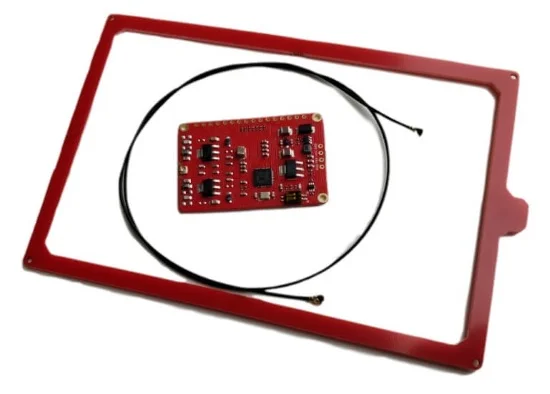](../../library/media/e7b73850d9eace183f276f82a40fe21746d4d93621cfc3906af467eb62e03705.jpg)

**product photograph** · Source image / document inspected; independent electrical review pending

Elechouse / original diagram and document contributors. Asset-specific redistribution and print rights are not established. Black Wire's editorial license does not relicense this artwork.

## PN532 NFC RFID module V3

Elechouse · Manufacturer documentation recorded

[Open full gallery](https://valleytech-black-wire-guide.pages.dev/?tab=makers&part=elechouse-pn532-v3)

[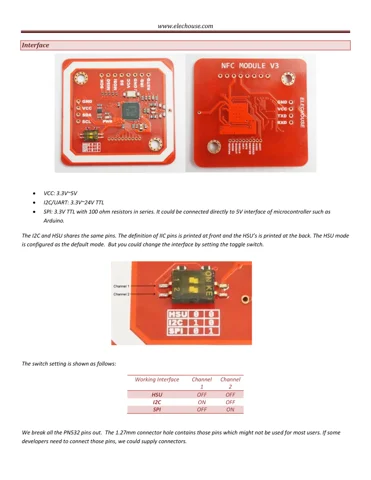](../../library/media/d329bffa86b706e0dad82e82af20fd8d06e7373d0e8b67f400a4bafe3a5ff1ba.png)

**board labeling image** · Source image / document inspected; independent electrical review pending

Elechouse / original diagram and document contributors. Asset-specific redistribution and print rights are not established. Black Wire's editorial license does not relicense this artwork.

## PN532 NFC RFID module V4

Elechouse · Manufacturer documentation recorded

[Open full gallery](https://valleytech-black-wire-guide.pages.dev/?tab=makers&part=elechouse-pn532-v4)

[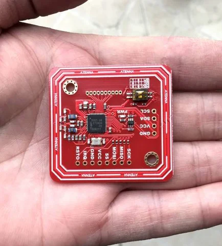](../../library/media/8bc2c6aa3f5b3f76668924bd9a6fe57c4859cdfe8a3e85e73878be22a2307cbe.jpg)

**board labeling image** · Source image / document inspected; independent electrical review pending

Elechouse / original diagram and document contributors. Asset-specific redistribution and print rights are not established. Black Wire's editorial license does not relicense this artwork.

## PN532 NFC RFID Module w/ External Antenna — updated version

Elechouse · Manufacturer documentation recorded

[Open full gallery](https://valleytech-black-wire-guide.pages.dev/?tab=makers&part=elechouse-pn532-external-antenna)

[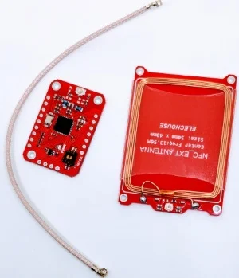](../../library/media/8ab6c597c43407577f62eb42c2baed4a129d97b2358d01020a7a484e5f813815.jpg)

**product photograph** · Source image / document inspected; independent electrical review pending

Elechouse / original diagram and document contributors. Asset-specific redistribution and print rights are not established. Black Wire's editorial license does not relicense this artwork.

## PN532 NFC RFID module — Purple Version

Elechouse · Manufacturer documentation recorded

[Open full gallery](https://valleytech-black-wire-guide.pages.dev/?tab=makers&part=elechouse-pn532-purple)

[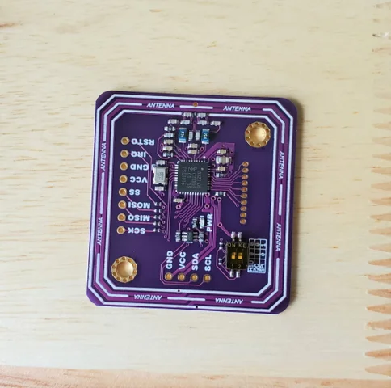](../../library/media/65a82d1a1fce7ee6eb0e234d0deab4d66d9a0c8c861bc3c8b596e76db06c97be.jpg)

**board labeling image** · Source image / document inspected; independent electrical review pending

Elechouse / original diagram and document contributors. Asset-specific redistribution and print rights are not established. Black Wire's editorial license does not relicense this artwork.

## PN532 NFC USB MODULE—Type C

Elechouse · Manufacturer documentation recorded

[Open full gallery](https://valleytech-black-wire-guide.pages.dev/?tab=makers&part=elechouse-pn532-usb-type-c)

[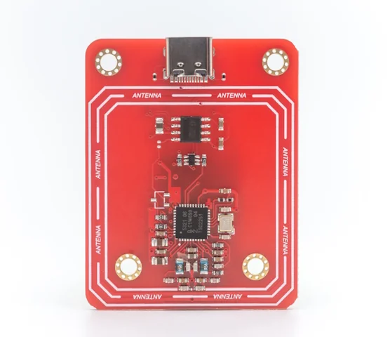](../../library/media/eefd88dbb5c9feb4efff10ff038224b95e489f0d82f1e36c6ba5fa2f4148108c.jpg)

**board labeling image** · Source image / document inspected; independent electrical review pending

Elechouse / original diagram and document contributors. Asset-specific redistribution and print rights are not established. Black Wire's editorial license does not relicense this artwork.

## PN5321 MINI w/ Interference-Resistant Antenna

Elechouse · Manufacturer documentation recorded

[Open full gallery](https://valleytech-black-wire-guide.pages.dev/?tab=makers&part=elechouse-pn5321-mini)

[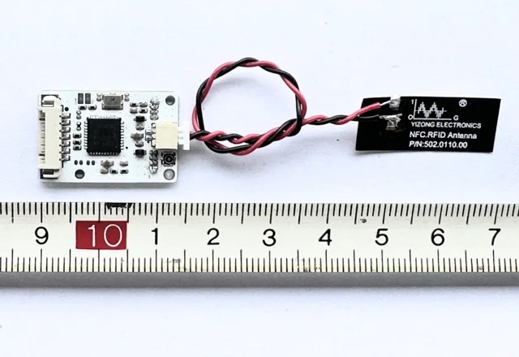](../../library/media/17c271aa3924b5cb586e4e03e7d6214f7c85ad79607e7fc03b1829a644cc9697.jpg)

**board labeling image** · Source image / document inspected; independent electrical review pending

Elechouse / original diagram and document contributors. Asset-specific redistribution and print rights are not established. Black Wire's editorial license does not relicense this artwork.

## PN7150 NFC RFID MODULE

Elechouse · Manufacturer documentation recorded

[Open full gallery](https://valleytech-black-wire-guide.pages.dev/?tab=makers&part=elechouse-pn7150-v1)

[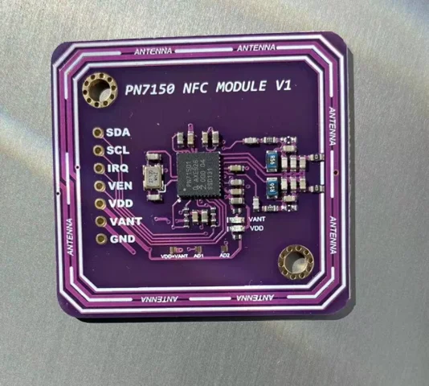](../../library/media/1a6e32f6f6c1aef52d5b3643ad92564881b4ec86ae9708f4c7d3c0fa2c9a84a2.jpg)

**board labeling image** · Source image / document inspected; independent electrical review pending

Elechouse / original diagram and document contributors. Asset-specific redistribution and print rights are not established. Black Wire's editorial license does not relicense this artwork.

## PN7160 MINI V1 — I2C

Elechouse · Manufacturer documentation recorded

[Open full gallery](https://valleytech-black-wire-guide.pages.dev/?tab=makers&part=elechouse-pn7160-mini-v1-i2c)

[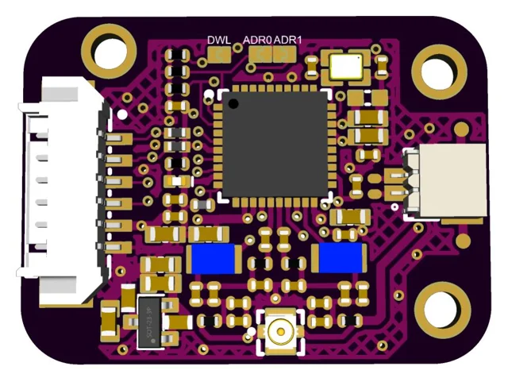](../../library/media/2be62879db9bf005f89e47bb455cb3cd4ade614b293f0eca8790da5294583dcb.jpg)

**board labeling image** · Source image / document inspected; independent electrical review pending

Elechouse / original diagram and document contributors. Asset-specific redistribution and print rights are not established. Black Wire's editorial license does not relicense this artwork.

## PN7160 NFC RFID MODULE—I2C Version

Elechouse · Manufacturer documentation recorded

[Open full gallery](https://valleytech-black-wire-guide.pages.dev/?tab=makers&part=elechouse-pn7160-i2c)

[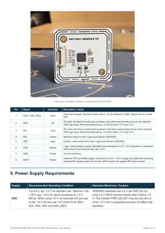](../../library/media/9c56ea44944d116005ed2c99d03c8e4a95652332372bd117c107613ba947f966.png)

**pinout image** · Source image / document inspected; independent electrical review pending

Elechouse / original diagram and document contributors. Asset-specific redistribution and print rights are not established. Black Wire's editorial license does not relicense this artwork.

## PN7161 MINI V1 — SPI

Elechouse · Manufacturer documentation recorded

[Open full gallery](https://valleytech-black-wire-guide.pages.dev/?tab=makers&part=elechouse-pn7161-mini-v1-spi)

[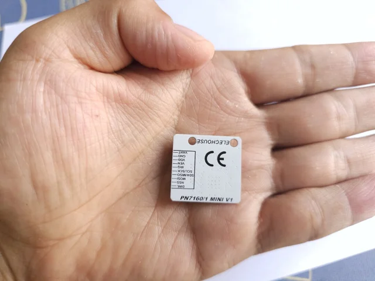](../../library/media/b2e87ff3138d1a44df23a3d51078e84e40abab1a7c6296920bb863a35fd7669d.jpg)

**board labeling image** · Source image / document inspected; independent electrical review pending

Elechouse / original diagram and document contributors. Asset-specific redistribution and print rights are not established. Black Wire's editorial license does not relicense this artwork.

## PN7161 NFC RFID MODULE—I2C

Elechouse · Manufacturer documentation recorded

[Open full gallery](https://valleytech-black-wire-guide.pages.dev/?tab=makers&part=elechouse-pn7161-i2c)

**pinout image** · Source image / document inspected; independent electrical review pending

Elechouse / original diagram and document contributors. Asset-specific redistribution and print rights are not established. Black Wire's editorial license does not relicense this artwork.

## Serial Port Bluetooth Module (Master-Slave)

Seeed Studio · Source review pending

[Open full gallery](https://valleytech-black-wire-guide.pages.dev/?tab=makers&part=maker-existing-seeed-studio-expansion-serial-port-bluetooth-module-master-slave)

[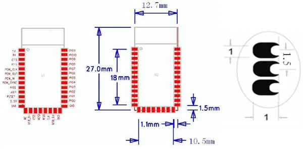](../../library/media/bde0aff47cb55cc116e1ca3a69a30240420249ffe8bce4cf769288f1f9389e3e.jpg)

**pinout image** · Reviewed source

Not established; source attribution retained

## ST25R3916 NFC Reader Module

Elechouse · Manufacturer documentation recorded

[Open full gallery](https://valleytech-black-wire-guide.pages.dev/?tab=makers&part=elechouse-st25r3916)

[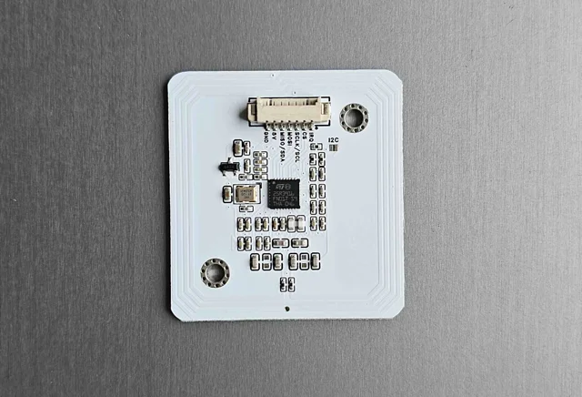](../../library/media/26ae07bbafe84c172e38d0e838183196abc9cf6006d5b83210b19e8c292c514b.jpg)

**board labeling image** · Source image / document inspected; independent electrical review pending

Elechouse / original diagram and document contributors. Asset-specific redistribution and print rights are not established. Black Wire's editorial license does not relicense this artwork.

## ST25R3916B Mini NFC Module with Ultra-Slim External Antenna

Elechouse · Manufacturer documentation recorded

[Open full gallery](https://valleytech-black-wire-guide.pages.dev/?tab=makers&part=elechouse-st25r3916b-mini)

[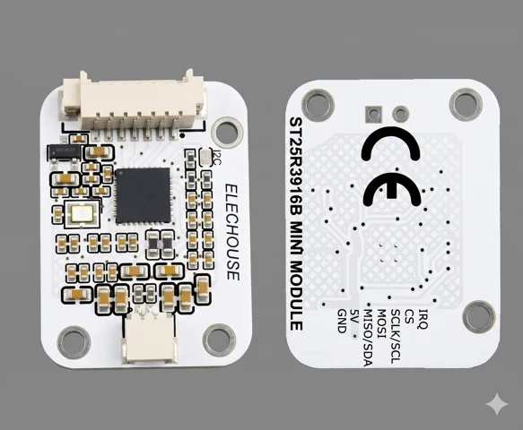](../../library/media/5691190e1c8cc86ccd598b1dda612c3b1d1b81985a9fbeb5cbbf85dcde732396.png)

**board labeling image** · Source image / document inspected; independent electrical review pending

Elechouse / original diagram and document contributors. Asset-specific redistribution and print rights are not established. Black Wire's editorial license does not relicense this artwork.

## ST25R3916B NFC Module

Elechouse · Manufacturer documentation recorded

[Open full gallery](https://valleytech-black-wire-guide.pages.dev/?tab=makers&part=elechouse-st25r3916b)

[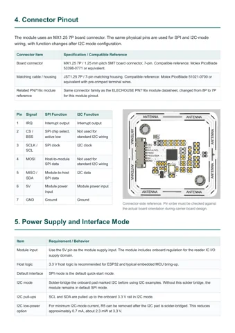](../../library/media/d4beb57b374086af22ec6ce065bf9f943b8a7f01cebffa35fc4163edddd389c9.png)

**pinout image** · Source image / document inspected; independent electrical review pending

Elechouse / original diagram and document contributors. Asset-specific redistribution and print rights are not established. Black Wire's editorial license does not relicense this artwork.

## Stamp LoRa-1262

M5Stack · Source review pending

[Open full gallery](https://valleytech-black-wire-guide.pages.dev/?tab=makers&part=maker-existing-m5stack-expansion-stamp-lora-1262)

[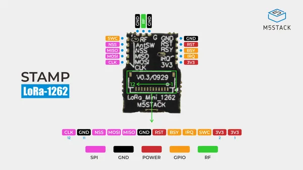](../../library/media/1af7ac83d9336bb2f35bb410f4280a8b22d502613d6eac729eeb041eb7730165.jpg)

**pinout image** · Reviewed source

Not established; source attribution retained

## Stamp LoRa-1262 I

M5Stack · Source review pending

[Open full gallery](https://valleytech-black-wire-guide.pages.dev/?tab=makers&part=maker-existing-m5stack-expansion-stamp-lora-1262-i)

**pinout image** · Reviewed source

Not established; source attribution retained

## Stamp LoRa-1262 IF

M5Stack · Source review pending

[Open full gallery](https://valleytech-black-wire-guide.pages.dev/?tab=makers&part=maker-existing-m5stack-expansion-stamp-lora-1262-if)

[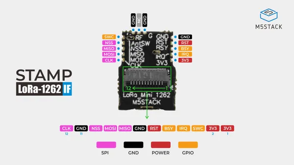](../../library/media/8ace86669c0b7a4cf9cb0f33a43c44e50cb96b1a0511610f5b1f095cdecc9abb.jpg)

**pinout image** · Reviewed source

Not established; source attribution retained

## Stamp UWB

M5Stack · Source review pending

[Open full gallery](https://valleytech-black-wire-guide.pages.dev/?tab=makers&part=maker-existing-m5stack-expansion-stamp-uwb)

[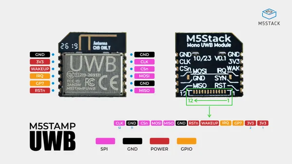](../../library/media/be0b15e5b9ab67dc6d9dac8c3bfb50fdaf38fb48886d656480fbb0b2969da01f.jpg)

**pinout image** · Reviewed source

Not established; source attribution retained

## Stamp UWB F

M5Stack · Source review pending

[Open full gallery](https://valleytech-black-wire-guide.pages.dev/?tab=makers&part=maker-existing-m5stack-expansion-stamp-uwb-f)

[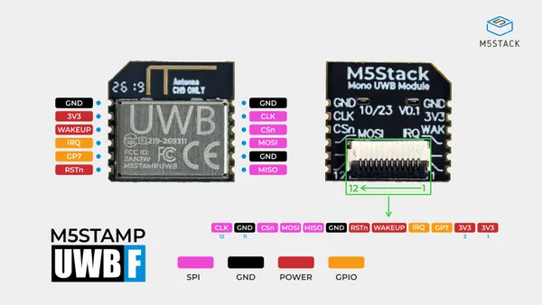](../../library/media/7585b75e4d85c73fd46bae0737b7eb36c25c8428886b3680d6353e78dc83965b.jpg)

**pinout image** · Reviewed source

Not established; source attribution retained

## Unit CatM GNSS

M5Stack · Source review pending

[Open full gallery](https://valleytech-black-wire-guide.pages.dev/?tab=makers&part=maker-existing-source-board-4d02ce62687c830d61)

**source reference** · Unreviewed source

Source rights not yet established

## Unit GPS

M5Stack · Source review pending

[Open full gallery](https://valleytech-black-wire-guide.pages.dev/?tab=makers&part=maker-existing-source-board-4469908e23dfc1079d)

[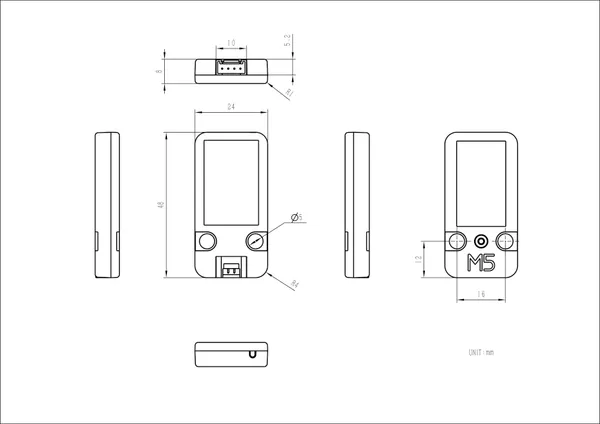](../../library/media/fdbc801b874ed401d6ce2f3b5d377a6b15dea13c99a685ec0bc787bb91136797.jpg)

**source reference** · Unreviewed source

Source rights not yet established

## Unit LoRaE220-433

M5Stack · Source review pending

[Open full gallery](https://valleytech-black-wire-guide.pages.dev/?tab=makers&part=maker-existing-source-board-cfb352c345e0ddda30)

**source reference** · Unreviewed source

Source rights not yet established

## Unit UWB

M5Stack · Source review pending

[Open full gallery](https://valleytech-black-wire-guide.pages.dev/?tab=makers&part=maker-existing-source-board-fd2e7091a16298609a)

**source reference** · Unreviewed source

Source rights not yet established

## Wi-Fi HaLow Module for XIAO

Seeed Studio · Source review pending

[Open full gallery](https://valleytech-black-wire-guide.pages.dev/?tab=makers&part=maker-existing-seeed-studio-expansion-wi-fi-halow-module-for-xiao)

**board labeling image** · Reviewed source

Not established; source attribution retained

## WM1302 LoRaWAN Gateway Module

Seeed Studio · Source review pending

[Open full gallery](https://valleytech-black-wire-guide.pages.dev/?tab=makers&part=maker-existing-seeed-studio-expansion-wm1302-lorawan-gateway-module)

[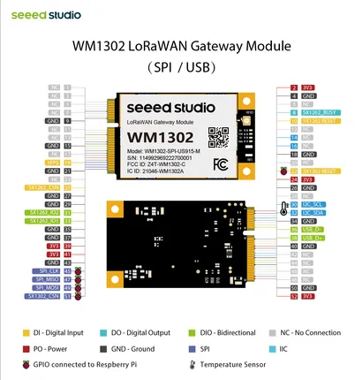](../../library/media/f64af32329e3765e919568e46fd776e428219f7053b4180614d75188bc73579d.png)

**pinout image** · Reviewed source

Not established; source attribution retained
