# Displays / visual references

[All categories](../../MAKER_VISUALS.md) · [Image attribution ledger](../../catalog/maker-attributions.json)

Manufacturer originals remain unchanged. Connector-model sheets add separately labeled callouts under the recorded source license. Check exact PCB/revision, source notes and rights before reuse. Photos and partial connector diagrams are not complete-device approvals.

## 0.91inch OLED Module

Waveshare · Manufacturer documentation recorded

[Open full gallery](https://valleytech-black-wire-guide.pages.dev/?tab=makers&part=maker-waveshare-9a5a6596f5ff)

[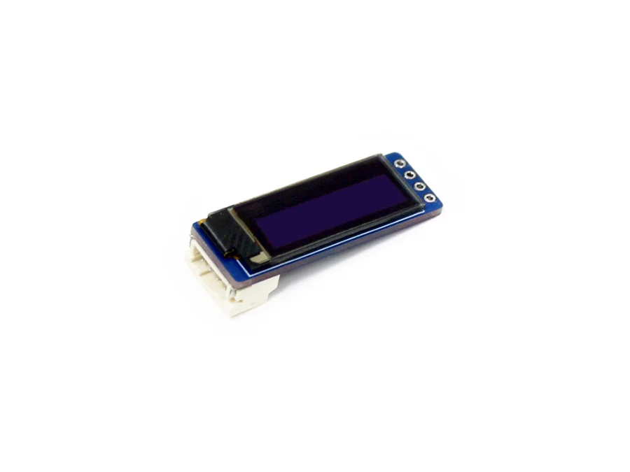](../../library/maker-media/e53e9501bd8a903c1d2404cd015077f93a9a365a0a1e8608520930dab6d64e6b.jpg)

**identification photo** · Source image inspected; technical review pending

Manufacturer artwork; reproduction rights not established; not cleared for the printed book

## 0.95inch RGB OLED (A)

Waveshare · Manufacturer documentation recorded

[Open full gallery](https://valleytech-black-wire-guide.pages.dev/?tab=makers&part=maker-waveshare-5ac502d2453f)

[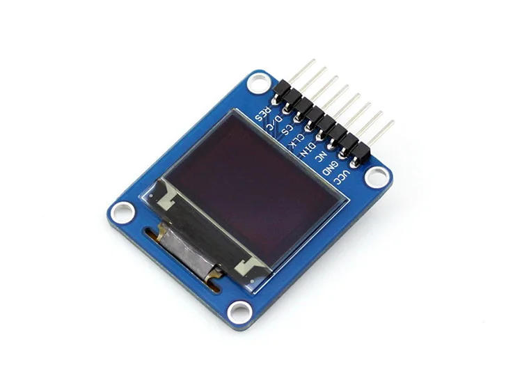](../../library/maker-media/03e669f2e4570f47bf067b12a8adad54b66798c6875f445862fb49e3449b54dd.jpg)

**identification photo** · Source image inspected; technical review pending

Manufacturer artwork; reproduction rights not established; not cleared for the printed book

## 0.95inch RGB OLED (B)

Waveshare · Manufacturer documentation recorded

[Open full gallery](https://valleytech-black-wire-guide.pages.dev/?tab=makers&part=maker-waveshare-ccb8a9d6d370)

[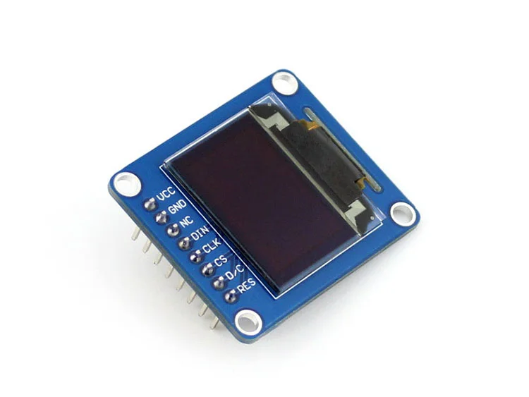](../../library/maker-media/c6f714407d954b5ae0622973715e3a237fc351aaf67b8b2a067d3b43a75dacfc.jpg)

**identification photo** · Source image inspected; technical review pending

Manufacturer artwork; reproduction rights not established; not cleared for the printed book

## 0.96" mini Color OLED

Adafruit · Manufacturer documentation recorded

[Open full gallery](https://valleytech-black-wire-guide.pages.dev/?tab=makers&part=maker-adafruit-8b83680fc8bb)

[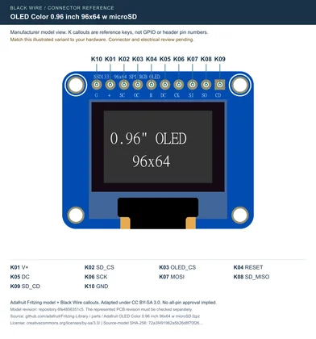](../../library/maker-media/fdf7fa56561bccbb1c3d0ca20a5f41eed55e70462ba298b0d3ba13aa246b7594.svg)

**pinout image** · Manufacturer-model geometry checked; independent electrical and full-device review pending

Adafruit manufacturer illustration with Black Wire connector callouts, adapted under CC BY-SA 3.0. Attribution and share-alike terms apply to this sheet.

## 0.96inch LCD Module

Waveshare · Manufacturer documentation recorded

[Open full gallery](https://valleytech-black-wire-guide.pages.dev/?tab=makers&part=maker-waveshare-919a4c1e2397)

[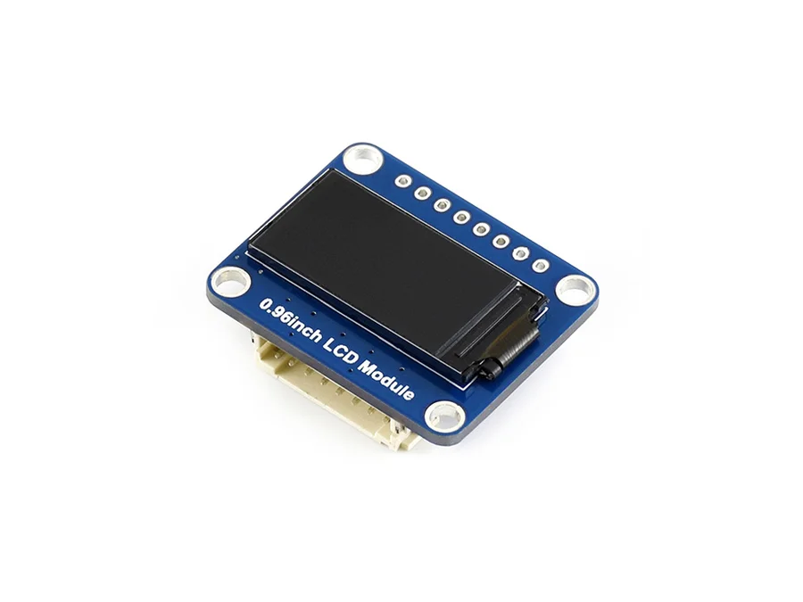](../../library/maker-media/492dc4329803d57deab7087424e1ba814bdd116810c78d9686b4833c89b8daf1.jpg)

**identification photo** · Source image inspected; technical review pending

Manufacturer artwork; reproduction rights not established; not cleared for the printed book

## 0.96inch OLED (A)

Waveshare · Manufacturer documentation recorded

[Open full gallery](https://valleytech-black-wire-guide.pages.dev/?tab=makers&part=maker-waveshare-373c12f5f380)

[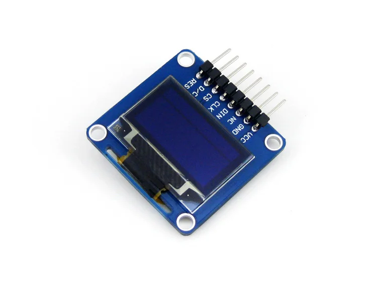](../../library/maker-media/42aa5622d38141da9129382d984b345ab3ab6ce1161f6954cb6fc7b479bc1630.jpg)

**identification photo** · Source image inspected; technical review pending

Manufacturer artwork; reproduction rights not established; not cleared for the printed book

## 0.96inch OLED (B)

Waveshare · Manufacturer documentation recorded

[Open full gallery](https://valleytech-black-wire-guide.pages.dev/?tab=makers&part=maker-waveshare-5275c80a3c4f)

[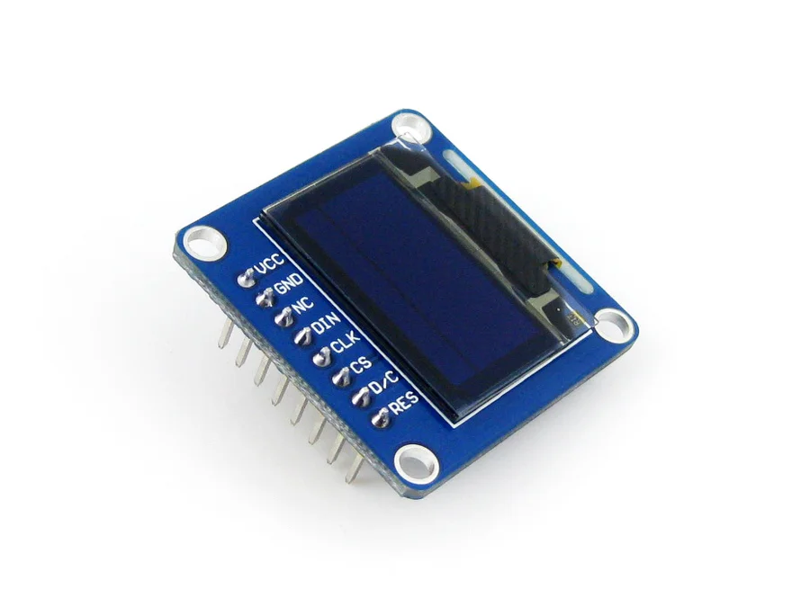](../../library/maker-media/40d67261884eb473161392d33d97be3751b70a95c9de407a960579627f0e03c6.jpg)

**identification photo** · Source image inspected; technical review pending

Manufacturer artwork; reproduction rights not established; not cleared for the printed book

## 1.14inch LCD Module

Waveshare · Manufacturer documentation recorded

[Open full gallery](https://valleytech-black-wire-guide.pages.dev/?tab=makers&part=maker-waveshare-a8bb3247b32e)

[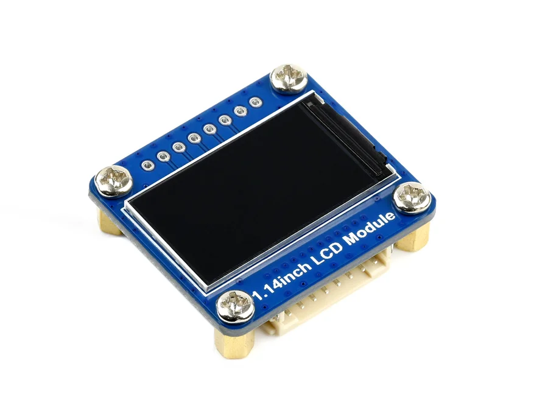](../../library/maker-media/ccc71506428f2ccd63d059504242e6645ac0c2eb1691bc996b20d3246daa23bc.jpg)

**identification photo** · Source image inspected; technical review pending

Manufacturer artwork; reproduction rights not established; not cleared for the printed book

## 1.28inch LCD Module

Waveshare · Manufacturer documentation recorded

[Open full gallery](https://valleytech-black-wire-guide.pages.dev/?tab=makers&part=maker-waveshare-9926a68263bc)

[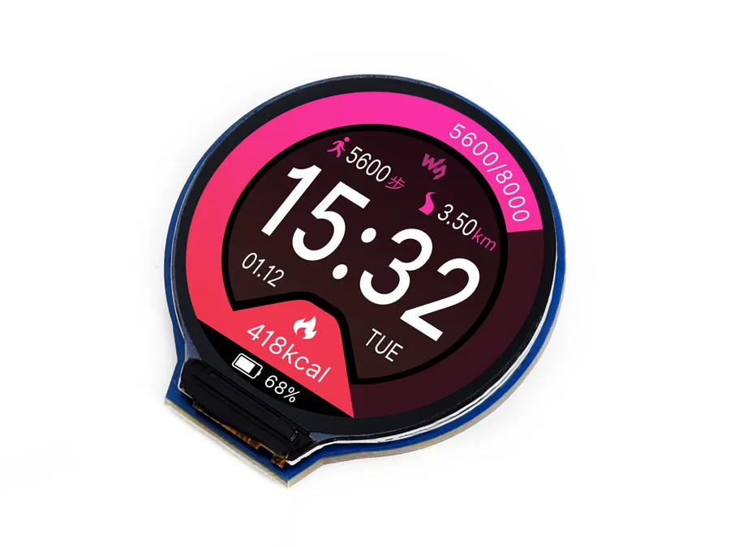](../../library/maker-media/9f6e82052954325d3173a004316b6033fcfc9cd0082a1f8f41959a540e2e2733.jpg)

**identification photo** · Source image inspected; technical review pending

Manufacturer artwork; reproduction rights not established; not cleared for the printed book

## 1.3inch OLED (A)

Waveshare · Manufacturer documentation recorded

[Open full gallery](https://valleytech-black-wire-guide.pages.dev/?tab=makers&part=maker-waveshare-34cae83a82fb)

[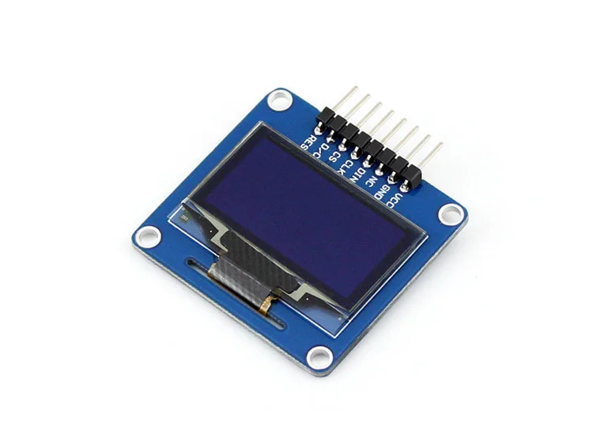](../../library/maker-media/2eccaef725e26093f5c9576a39b13ef87bf9566d8c6f6c9a142693b4f409b795.jpg)

**identification photo** · Source image inspected; technical review pending

Manufacturer artwork; reproduction rights not established; not cleared for the printed book

## 1.3inch OLED (B)

Waveshare · Manufacturer documentation recorded

[Open full gallery](https://valleytech-black-wire-guide.pages.dev/?tab=makers&part=maker-waveshare-85832ce2eb1a)

**identification photo** · Source image inspected; technical review pending

Manufacturer artwork; reproduction rights not established; not cleared for the printed book

## 1.3inch OLED Module (C)

Waveshare · Manufacturer documentation recorded

[Open full gallery](https://valleytech-black-wire-guide.pages.dev/?tab=makers&part=maker-waveshare-cfe7acc968c7)

[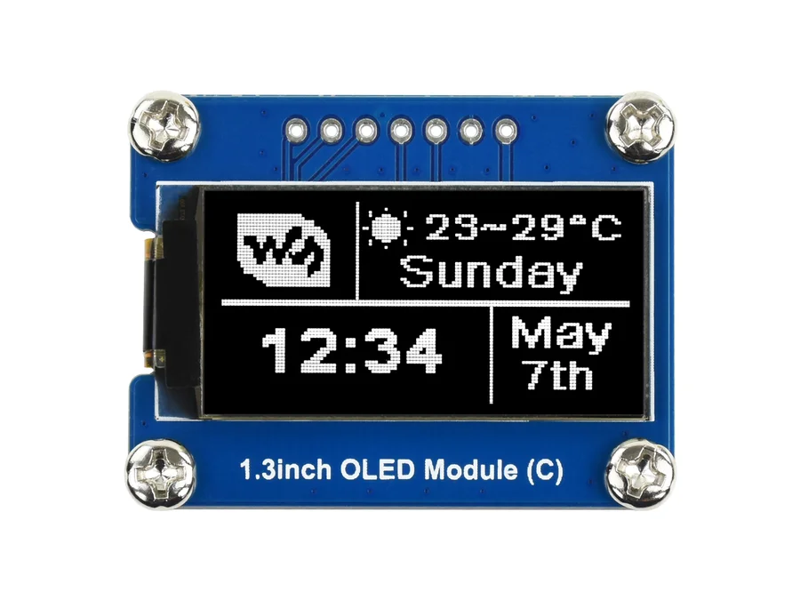](../../library/maker-media/0483a7ee255e25936a8bcf7de6d502d0ba1d7f6d74f5ebc1de0f6593e6691720.jpg)

**identification photo** · Source image inspected; technical review pending

Manufacturer artwork; reproduction rights not established; not cleared for the printed book

## 1.47 inch LCD SPI Display

Seeed Studio · Source review pending

[Open full gallery](https://valleytech-black-wire-guide.pages.dev/?tab=makers&part=maker-existing-seeed-studio-expansion-1-47-inch-lcd-spi-display)

[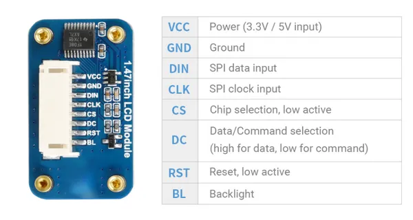](../../library/media/b8c59324844e1710e70750958a891c5212147fb9119e33fa39c0a5cb8010da56.png)

**pinout image** · Reviewed source

Not established; source attribution retained

## 1.54inch e-Paper Module

Waveshare · Manufacturer documentation recorded

[Open full gallery](https://valleytech-black-wire-guide.pages.dev/?tab=makers&part=maker-waveshare-650eb3657ddc)

[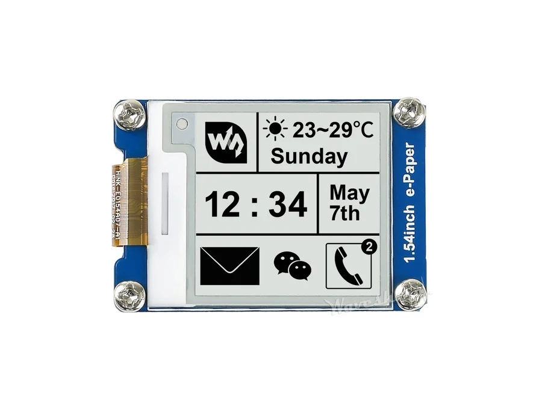](../../library/maker-media/d7327d8a1d95f5bb777f0c57926dbf17c7970caa9e8e044a68c59428b7f390ca.jpg)

**identification photo** · Source image inspected; technical review pending

Manufacturer artwork; reproduction rights not established; not cleared for the printed book

## 1.54inch e-Paper Module (B)

Waveshare · Manufacturer documentation recorded

[Open full gallery](https://valleytech-black-wire-guide.pages.dev/?tab=makers&part=maker-waveshare-d0854e2e3aac)

[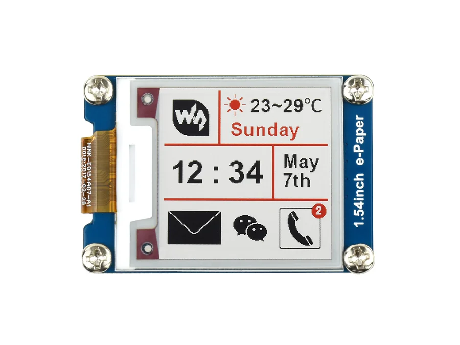](../../library/maker-media/4c9fc41ad3bb0e69e02513afbea6fa50671cfdf624a720b244f8bb369d57c529.jpg)

**identification photo** · Source image inspected; technical review pending

Manufacturer artwork; reproduction rights not established; not cleared for the printed book

## 1.54inch e-Paper Module (C)

Waveshare · Manufacturer documentation recorded

[Open full gallery](https://valleytech-black-wire-guide.pages.dev/?tab=makers&part=maker-waveshare-b620a7fafe92)

[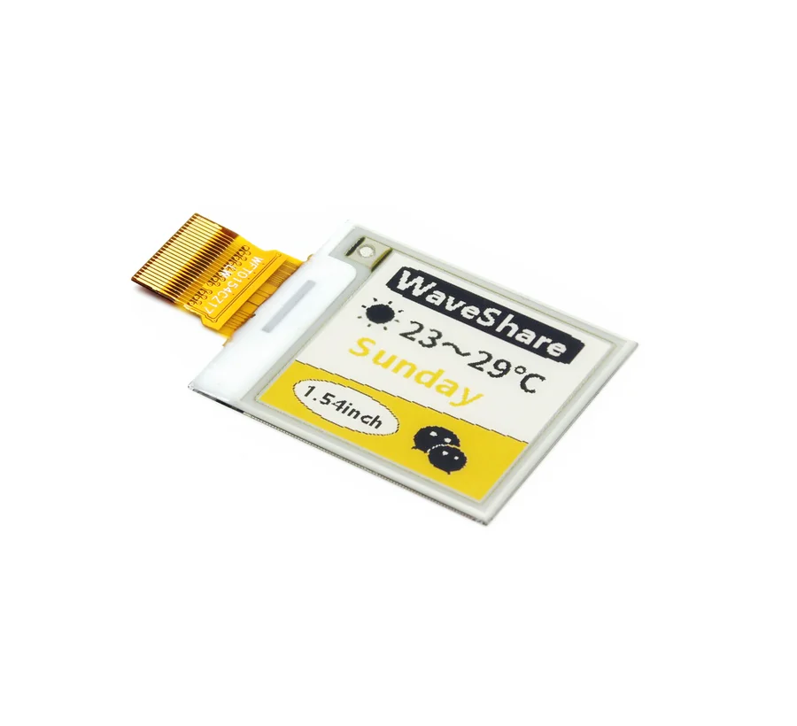](../../library/maker-media/eb95120040a1fe7c0db876fe62f8ee0d9e847eddfee72ad75e3111b11779a86a.jpg)

**identification photo** · Source image inspected; technical review pending

Manufacturer artwork; reproduction rights not established; not cleared for the printed book

## 1.54inch LCD Module

Waveshare · Manufacturer documentation recorded

[Open full gallery](https://valleytech-black-wire-guide.pages.dev/?tab=makers&part=maker-waveshare-41d89c7fc84c)

[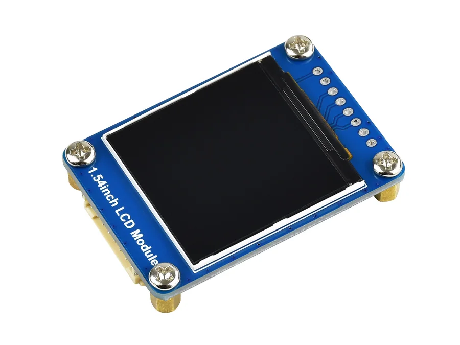](../../library/maker-media/3fab650969db21bc0991f7cbd06cb50d3d929f4b107018bfb0d1221c7d315950.jpg)

**identification photo** · Source image inspected; technical review pending

Manufacturer artwork; reproduction rights not established; not cleared for the printed book

## 1.5inch OLED Module

Waveshare · Manufacturer documentation recorded

[Open full gallery](https://valleytech-black-wire-guide.pages.dev/?tab=makers&part=maker-waveshare-ace990e37982)

[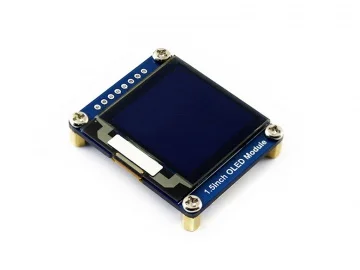](../../library/maker-media/0ce42740879b18e1a01f5bc1d5864f14697502702582b6bb442daa0882149bc3.jpg)

**identification photo** · Source image inspected; technical review pending

Manufacturer artwork; reproduction rights not established; not cleared for the printed book

## 1.5inch RGB OLED Module

Waveshare · Manufacturer documentation recorded

[Open full gallery](https://valleytech-black-wire-guide.pages.dev/?tab=makers&part=maker-waveshare-570622d23479)

[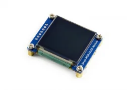](../../library/maker-media/8f827c210e2f3b388b66969344181b460a6d9141d06c31074af4c34d6464bf7e.png)

**identification photo** · Source image inspected; technical review pending

Manufacturer artwork; reproduction rights not established; not cleared for the printed book

## 1.64inch e-Paper Module (G)

Waveshare · Manufacturer documentation recorded

[Open full gallery](https://valleytech-black-wire-guide.pages.dev/?tab=makers&part=maker-waveshare-215ef83b82ed)

[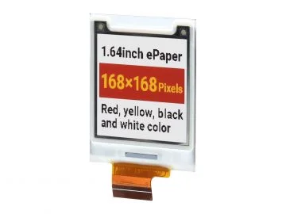](../../library/maker-media/d19e9e46a08f948af3eb225a9154caac66f11dbc6c528c1c1bcd559aabc50d09.jpg)

**identification photo** · Source image inspected; technical review pending

Manufacturer artwork; reproduction rights not established; not cleared for the printed book

## 1.69 inch LCD SPI Display

Seeed Studio · Source review pending

[Open full gallery](https://valleytech-black-wire-guide.pages.dev/?tab=makers&part=maker-existing-seeed-studio-expansion-1-69-inch-lcd-spi-display)

[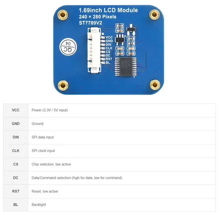](../../library/media/6cf12cad18d3b5ef3d3aca206b924c92dc7aab1175908c733ddf0819dbcf13ab.png)

**pinout image** · Reviewed source

Not established; source attribution retained

## 1.8" TFT Display Breakout and Shield

Adafruit · Manufacturer documentation recorded

[Open full gallery](https://valleytech-black-wire-guide.pages.dev/?tab=makers&part=maker-adafruit-f9445ce8ab45)

[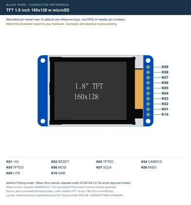](../../library/maker-media/ce528d6cf91f5cc98d018813af342edd4b9f0f38b7df66ebbb4c5982292e8afd.svg)

**pinout image** · Manufacturer-model geometry checked; independent electrical and full-device review pending

Adafruit manufacturer illustration with Black Wire connector callouts, adapted under CC BY-SA 3.0. Attribution and share-alike terms apply to this sheet.

## 10.3inch e-Paper HAT

Waveshare · Manufacturer documentation recorded

[Open full gallery](https://valleytech-black-wire-guide.pages.dev/?tab=makers&part=maker-waveshare-1108cb7746dd)

[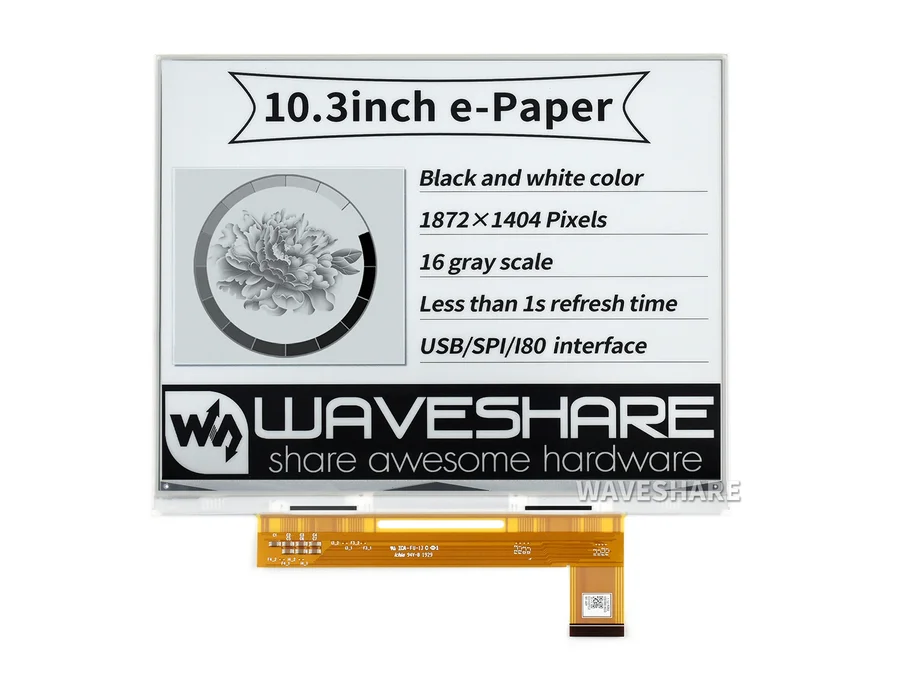](../../library/maker-media/4ad5295f6d603cc3fe8d5dedf732e15a8e433e57927fec495095204ef9f0d6ad.jpg)

**identification photo** · Source image inspected; technical review pending

Manufacturer artwork; reproduction rights not established; not cleared for the printed book

## 10.3inch e-Paper HAT (D)

Waveshare · Manufacturer documentation recorded

[Open full gallery](https://valleytech-black-wire-guide.pages.dev/?tab=makers&part=maker-waveshare-550c10c9a80a)

[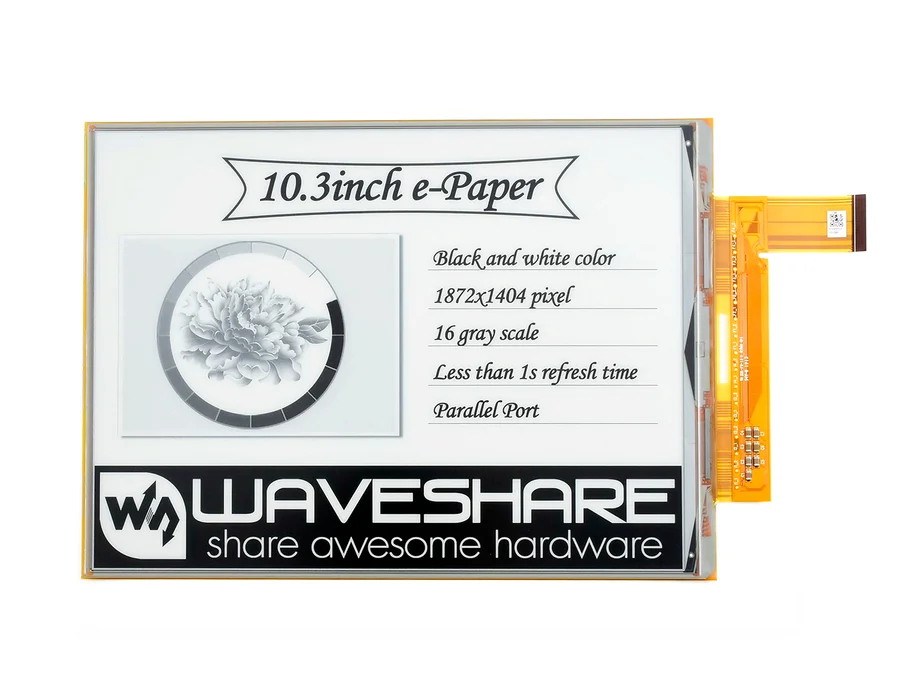](../../library/maker-media/a98ec3d80226cc0f483a16767a04a2913430b36a21ecc98462602f7c4645d5c2.jpg)

**identification photo** · Source image inspected; technical review pending

Manufacturer artwork; reproduction rights not established; not cleared for the printed book

## 12.48inch e-Paper Module

Waveshare · Manufacturer documentation recorded

[Open full gallery](https://valleytech-black-wire-guide.pages.dev/?tab=makers&part=maker-waveshare-24322c40a629)

[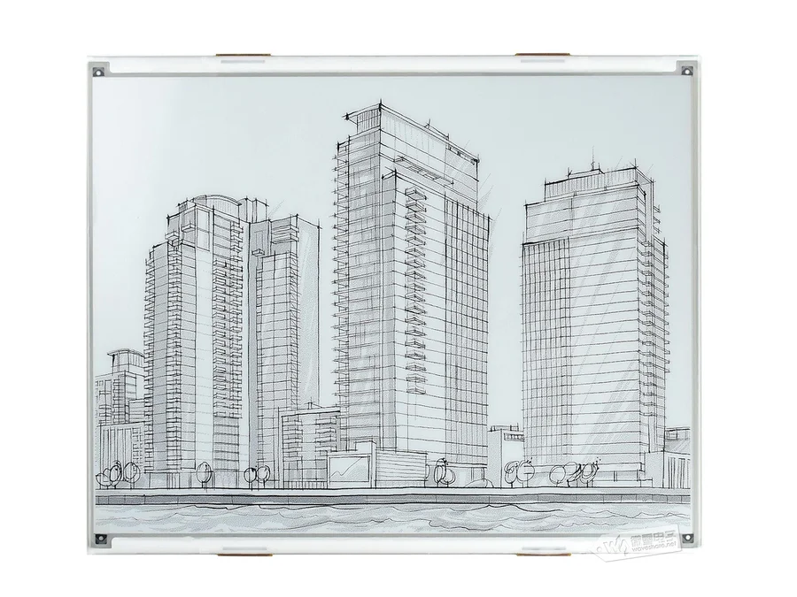](../../library/maker-media/6a190d250e145fd5e5fcee25577a45f1f480f2f67a75cd1caf9ca35268c84beb.jpg)

**identification photo** · Source image inspected; technical review pending

Manufacturer artwork; reproduction rights not established; not cleared for the printed book

## 12.48inch e-Paper Module (B)

Waveshare · Manufacturer documentation recorded

[Open full gallery](https://valleytech-black-wire-guide.pages.dev/?tab=makers&part=maker-waveshare-7f5c496e7ca7)

[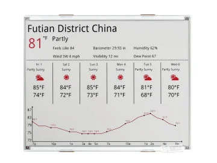](../../library/maker-media/fdb0a9cedc8b0b71a4ccac62bd3e5114df1cf339a5bd65f084bfe81e953644dc.jpg)

**identification photo** · Source image inspected; technical review pending

Manufacturer artwork; reproduction rights not established; not cleared for the printed book

## 13.3inch e-Paper HAT

Waveshare · Manufacturer documentation recorded

[Open full gallery](https://valleytech-black-wire-guide.pages.dev/?tab=makers&part=maker-waveshare-0a7b41d142f9)

[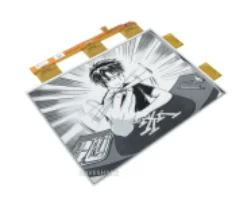](../../library/maker-media/06b86eb19c89a9fc976afff59d7199a9d7e1016754fc533096c17721541815ac.png)

**identification photo** · Source image inspected; technical review pending

Manufacturer artwork; reproduction rights not established; not cleared for the printed book

## 13.3inch e-Paper HAT (K)

Waveshare · Manufacturer documentation recorded

[Open full gallery](https://valleytech-black-wire-guide.pages.dev/?tab=makers&part=maker-waveshare-2321eac99561)

[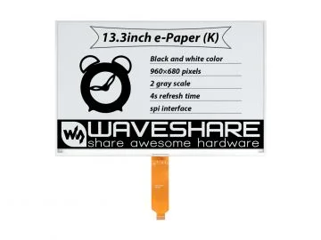](../../library/maker-media/56dde248a7ce5765a0f5843aedca6d397a3d8c2a357d6fbccdef6e7d8a05c1b3.jpg)

**identification photo** · Source image inspected; technical review pending

Manufacturer artwork; reproduction rights not established; not cleared for the printed book

## 2.13inch e-Paper Cloud Module

Waveshare · Manufacturer documentation recorded

[Open full gallery](https://valleytech-black-wire-guide.pages.dev/?tab=makers&part=maker-waveshare-d97e93508b6f)

[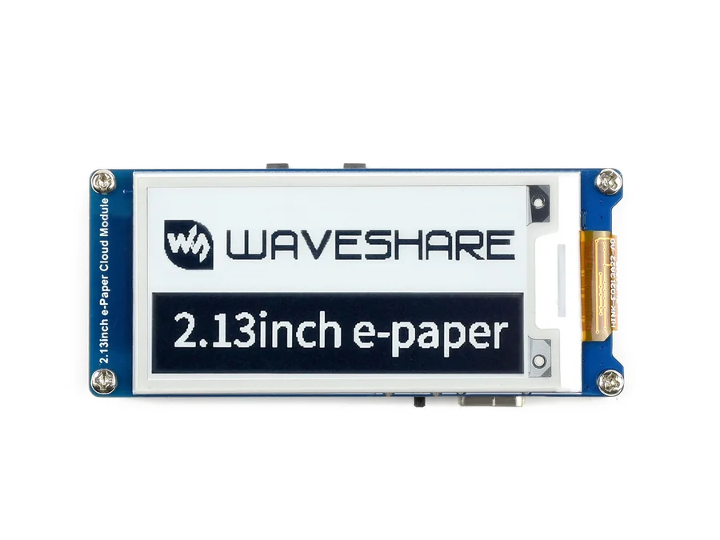](../../library/maker-media/648062f5132fabca8d534c714e08a712e250d6556243b6fcbad991e6b32d9b61.jpg)

**identification photo** · Source image inspected; technical review pending

Manufacturer artwork; reproduction rights not established; not cleared for the printed book

## 2.13inch e-Paper HAT

Waveshare · Manufacturer documentation recorded

[Open full gallery](https://valleytech-black-wire-guide.pages.dev/?tab=makers&part=maker-waveshare-bd07805881af)

[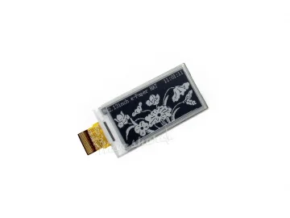](../../library/maker-media/75877ef6c9e13eedeebbf2bc6125125faec26bb1c2f5df04bbc9422092b5a908.jpg)

**identification photo** · Source image inspected; technical review pending

Manufacturer artwork; reproduction rights not established; not cleared for the printed book

## 2.13inch e-Paper HAT (B)

Waveshare · Manufacturer documentation recorded

[Open full gallery](https://valleytech-black-wire-guide.pages.dev/?tab=makers&part=maker-waveshare-3345ab94c78d)

[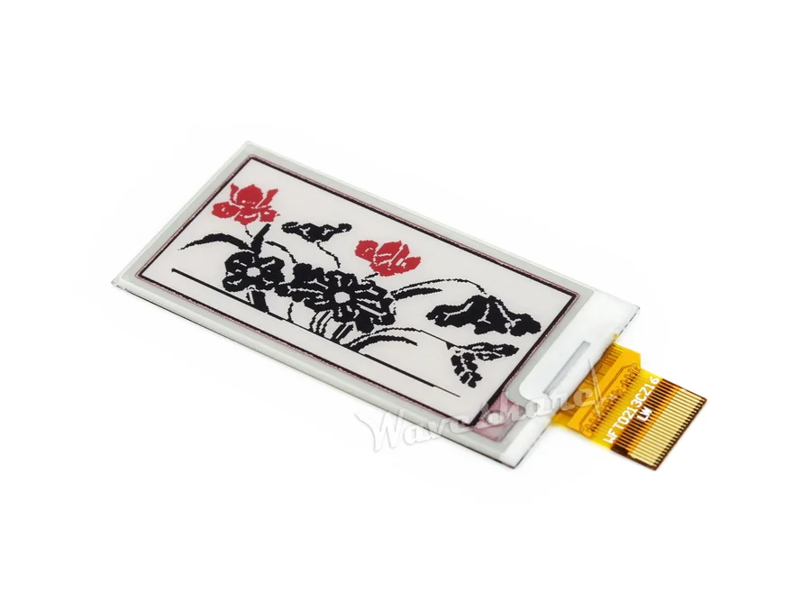](../../library/maker-media/e4d87d1436ddb7740d555c9437fb565b61752dac5d069a93956d8068c374918f.jpg)

**source reference** · Source image inspected; technical review pending

Manufacturer artwork; reproduction rights not established; not cleared for the printed book

## 2.13inch e-Paper HAT (C)

Waveshare · Manufacturer documentation recorded

[Open full gallery](https://valleytech-black-wire-guide.pages.dev/?tab=makers&part=maker-waveshare-9c3c662ef20d)

[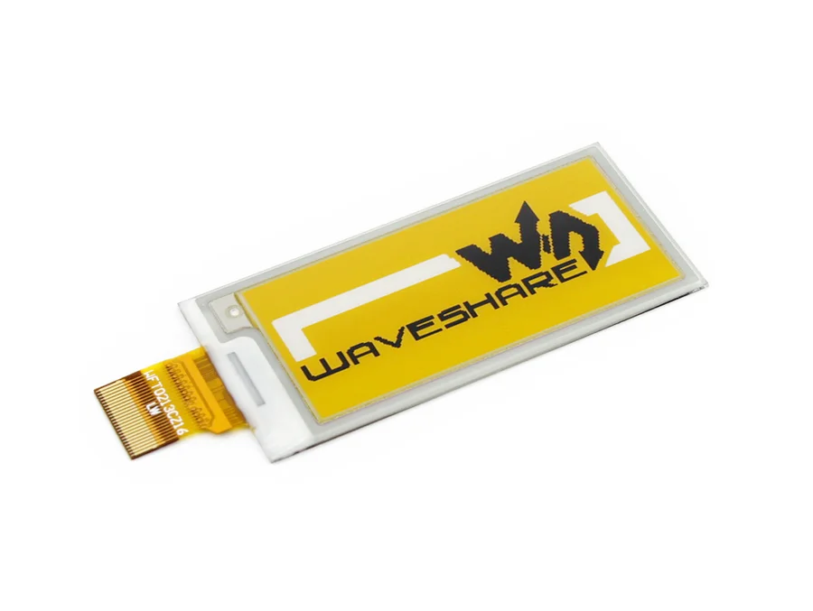](../../library/maker-media/0aa222d714760fdd968c9d36e45e1cccb23c3f1166cab7b816193543b1a67098.jpg)

**identification photo** · Source image inspected; technical review pending

Manufacturer artwork; reproduction rights not established; not cleared for the printed book

## 2.13inch e-Paper HAT (D)

Waveshare · Manufacturer documentation recorded

[Open full gallery](https://valleytech-black-wire-guide.pages.dev/?tab=makers&part=maker-waveshare-16f7dc0a1d9b)

[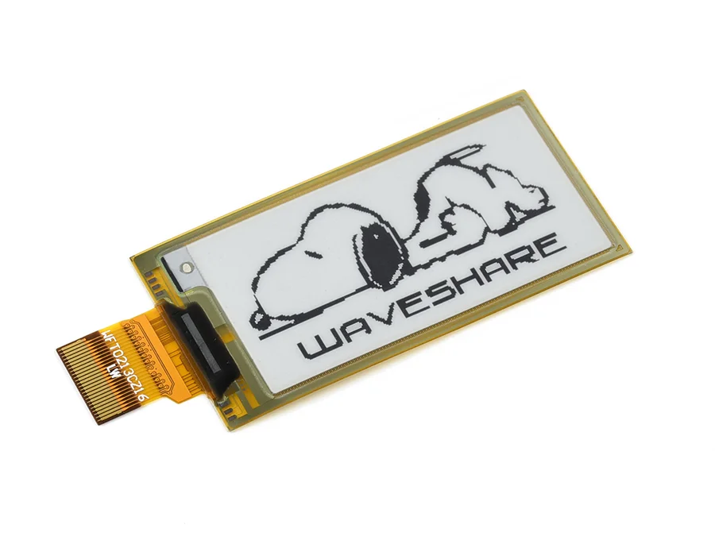](../../library/maker-media/9e5523cdba3bdeac8fa04b33119d6de8e89dbcac4b916fcec2fad1ac5909cea1.jpg)

**source reference** · Source image inspected; technical review pending

Manufacturer artwork; reproduction rights not established; not cleared for the printed book

## 2.13inch Touch e-Paper HAT

Waveshare · Manufacturer documentation recorded

[Open full gallery](https://valleytech-black-wire-guide.pages.dev/?tab=makers&part=maker-waveshare-d604fc30b057)

[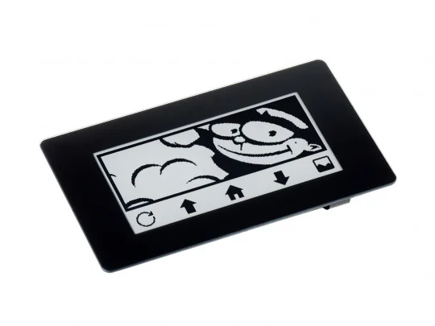](../../library/maker-media/80940784804251fcda26aa8c954a4bf4cd16e84f373ea5cc715c5cc70e7c441b.jpg)

**identification photo** · Source image inspected; technical review pending

Manufacturer artwork; reproduction rights not established; not cleared for the printed book

## 2.2" TFT Display

Adafruit · Manufacturer documentation recorded

[Open full gallery](https://valleytech-black-wire-guide.pages.dev/?tab=makers&part=maker-adafruit-541cb8b6d293)

[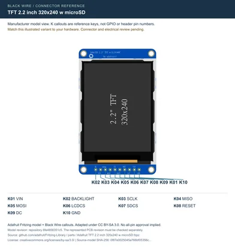](../../library/maker-media/f62d3185003cfc4db47a2849e7670de3faf635212380711ac5303513f133d8ca.svg)

**pinout image** · Manufacturer-model geometry checked; independent electrical and full-device review pending

Adafruit manufacturer illustration with Black Wire connector callouts, adapted under CC BY-SA 3.0. Attribution and share-alike terms apply to this sheet.

## 2.23inch OLED HAT

Waveshare · Manufacturer documentation recorded

[Open full gallery](https://valleytech-black-wire-guide.pages.dev/?tab=makers&part=maker-waveshare-2442ca9ad5a2)

[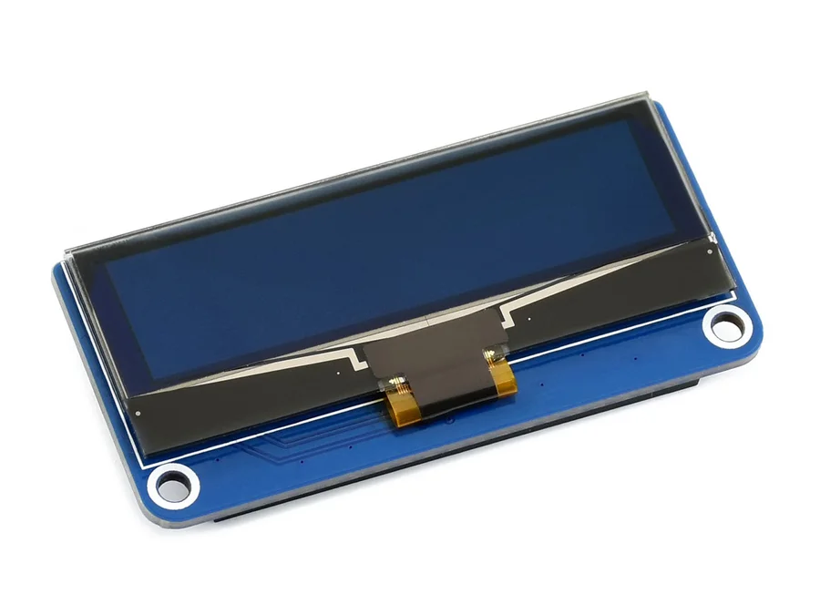](../../library/maker-media/c270dd0f7dd158c979b17a0c935cad7fb96bef7bd36b32beafe93f7855510b50.jpg)

**identification photo** · Source image inspected; technical review pending

Manufacturer artwork; reproduction rights not established; not cleared for the printed book

## 2.4inch LCD Module

Waveshare · Manufacturer documentation recorded

[Open full gallery](https://valleytech-black-wire-guide.pages.dev/?tab=makers&part=maker-waveshare-ab108237da08)

[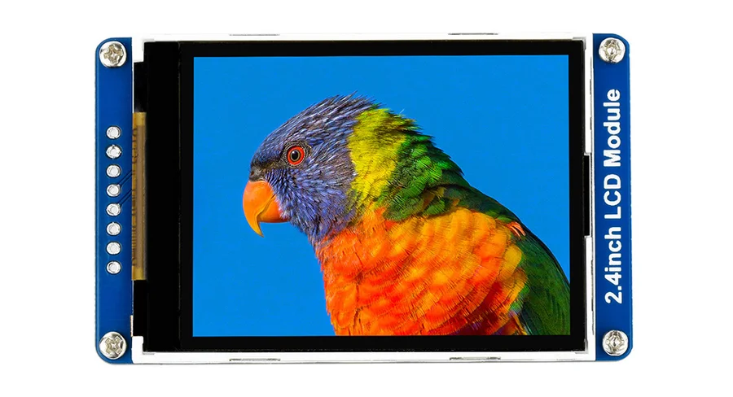](../../library/maker-media/05e3f2b0c22625cee51c6534666a7dd9a71493321e8e653347ebcb4ba72216dc.jpg)

**identification photo** · Source image inspected; technical review pending

Manufacturer artwork; reproduction rights not established; not cleared for the printed book

## 2.66inch e-Paper Module

Waveshare · Manufacturer documentation recorded

[Open full gallery](https://valleytech-black-wire-guide.pages.dev/?tab=makers&part=maker-waveshare-6773e8d3e990)

[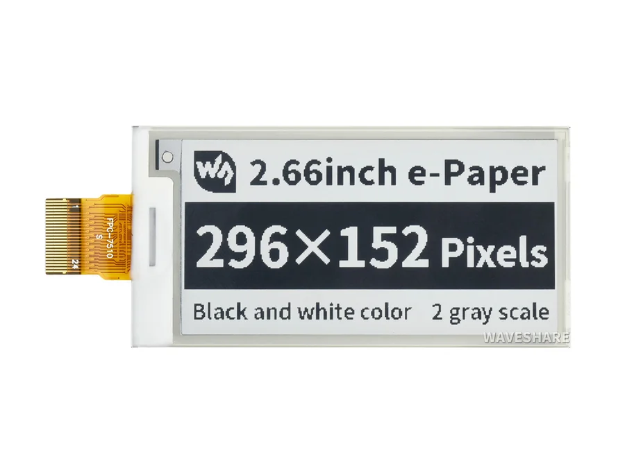](../../library/maker-media/5afbcc8942ef231202ede13ebb926c3aeeb06e62fd4e6063e732d48e69376f68.jpg)

**identification photo** · Source image inspected; technical review pending

Manufacturer artwork; reproduction rights not established; not cleared for the printed book

## 2.66inch e-Paper Module (B)

Waveshare · Manufacturer documentation recorded

[Open full gallery](https://valleytech-black-wire-guide.pages.dev/?tab=makers&part=maker-waveshare-8039850471d4)

[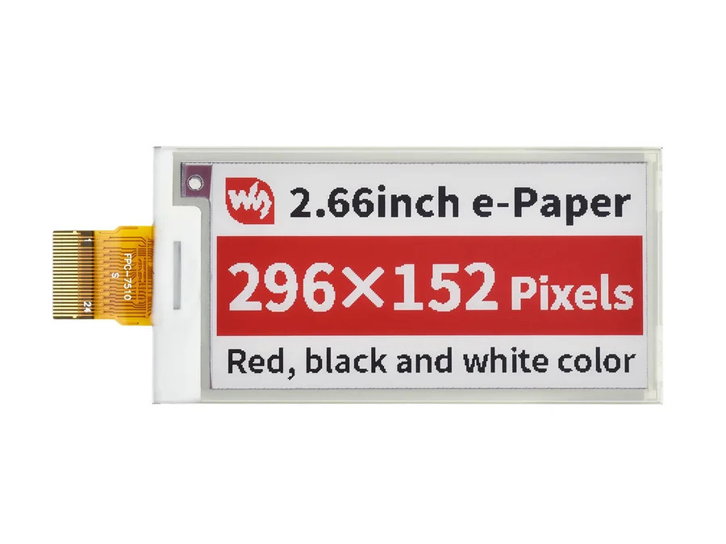](../../library/maker-media/7a9a71b6229744e2fe489fd7d255b2dbf67bb95b6f8e09f1795d330ba81e8637.jpg)

**identification photo** · Source image inspected; technical review pending

Manufacturer artwork; reproduction rights not established; not cleared for the printed book

## 2.7inch e-Paper HAT

Waveshare · Manufacturer documentation recorded

[Open full gallery](https://valleytech-black-wire-guide.pages.dev/?tab=makers&part=maker-waveshare-4471a6117c04)

[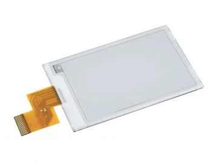](../../library/maker-media/327dceb10e2614a492823303a4668c32ee9b5303dd6d927eb6a5c710b042d6bd.jpg)

**source reference** · Source image inspected; technical review pending

Manufacturer artwork; reproduction rights not established; not cleared for the printed book

## 2.7inch e-Paper HAT (B)

Waveshare · Manufacturer documentation recorded

[Open full gallery](https://valleytech-black-wire-guide.pages.dev/?tab=makers&part=maker-waveshare-7bf8c5902568)

[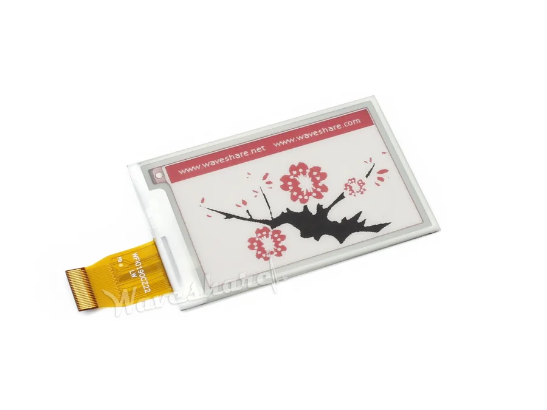](../../library/maker-media/6e2faf3e347a517de7332f32ff4e69a47740757bd219bb3519a87292f3e3e525.jpg)

**identification photo** · Source image inspected; technical review pending

Manufacturer artwork; reproduction rights not established; not cleared for the printed book

## 2.8inch Resistive Touch LCD

Waveshare · Manufacturer documentation recorded

[Open full gallery](https://valleytech-black-wire-guide.pages.dev/?tab=makers&part=maker-waveshare-91a5be63d277)

[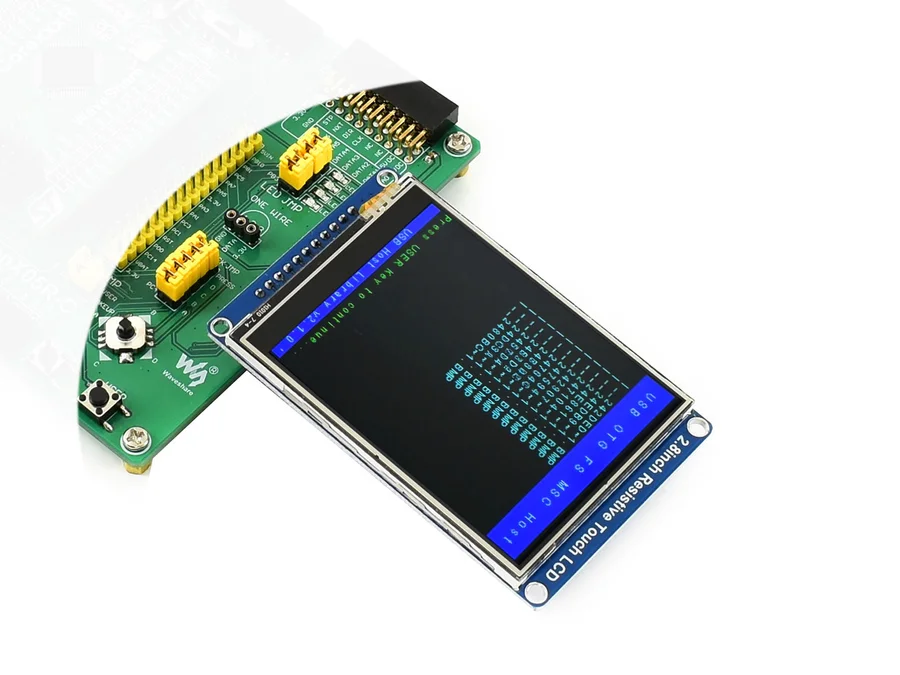](../../library/maker-media/903535f12a380ae17ad4c8d00a04c495f771bba1f6128b0a767b93fe22f0d888.jpg)

**identification photo** · Source image inspected; technical review pending

Manufacturer artwork; reproduction rights not established; not cleared for the printed book

## 2.9inch e-Paper HAT (D)

Waveshare · Manufacturer documentation recorded

[Open full gallery](https://valleytech-black-wire-guide.pages.dev/?tab=makers&part=maker-waveshare-95878eb54795)

[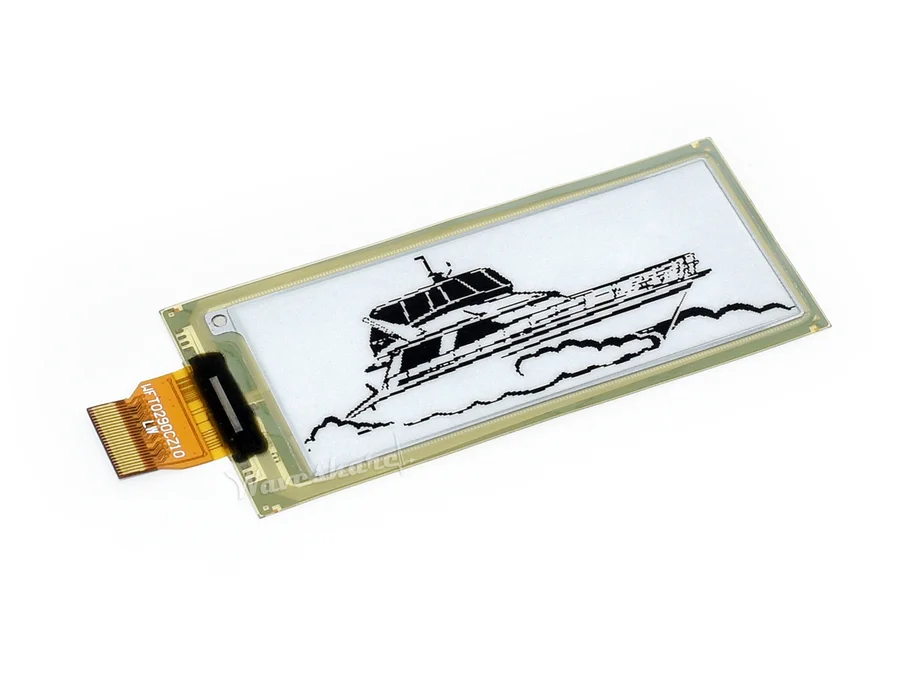](../../library/maker-media/57618cb47a598a6f5ad6b628a070ab2052a1ec50893b21f91d5333f5193ea701.jpg)

**source reference** · Source image inspected; technical review pending

Manufacturer artwork; reproduction rights not established; not cleared for the printed book

## 2.9inch e-Paper Module

Waveshare · Manufacturer documentation recorded

[Open full gallery](https://valleytech-black-wire-guide.pages.dev/?tab=makers&part=maker-waveshare-d69b009b4393)

[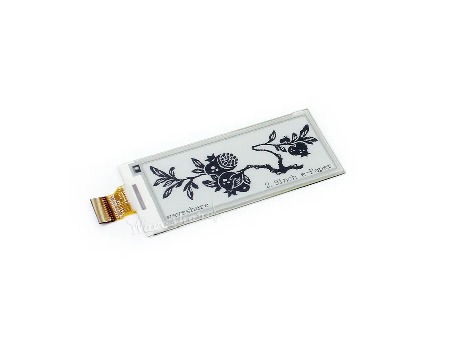](../../library/maker-media/17397c20c7a5ccfc1b2f0a61a8337f72c29dbe568c7658ef75fb1bf8584b25ef.jpg)

**identification photo** · Source image inspected; technical review pending

Manufacturer artwork; reproduction rights not established; not cleared for the printed book

## 2.9inch e-Paper Module (B)

Waveshare · Manufacturer documentation recorded

[Open full gallery](https://valleytech-black-wire-guide.pages.dev/?tab=makers&part=maker-waveshare-ad87a11a3c9b)

[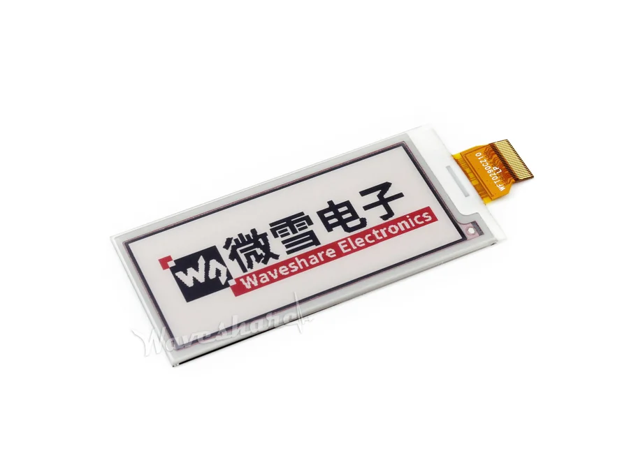](../../library/maker-media/154f7b1f499c0e27728bc78578b4293caba37ddac50c14b80d963dd20e6748e4.jpg)

**identification photo** · Source image inspected; technical review pending

Manufacturer artwork; reproduction rights not established; not cleared for the printed book

## 2.9inch e-Paper Module (C)

Waveshare · Manufacturer documentation recorded

[Open full gallery](https://valleytech-black-wire-guide.pages.dev/?tab=makers&part=maker-waveshare-d97af5afc577)

[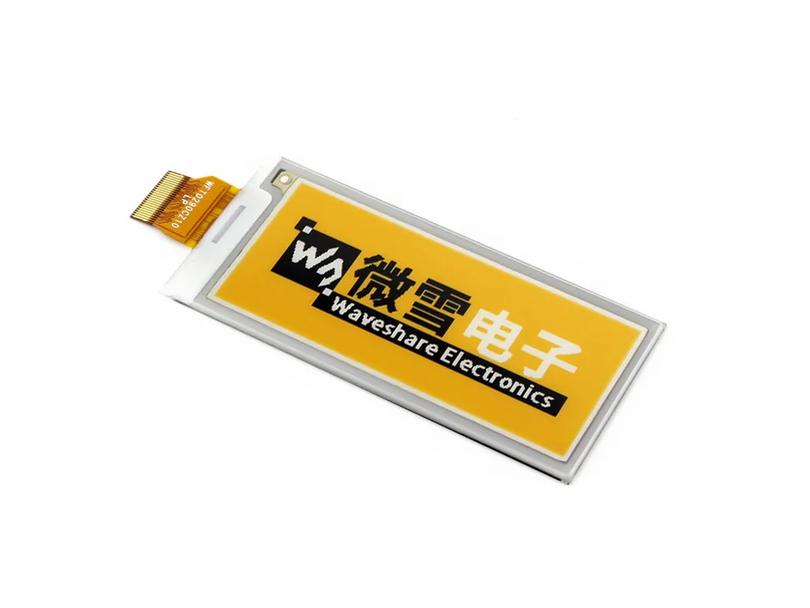](../../library/maker-media/37b8f146d36a75782cd32fc3ea523545da754934ff51f8e35244ddd2c1cdaff5.jpg)

**identification photo** · Source image inspected; technical review pending

Manufacturer artwork; reproduction rights not established; not cleared for the printed book

## 2.9inch Touch e-Paper HAT

Waveshare · Manufacturer documentation recorded

[Open full gallery](https://valleytech-black-wire-guide.pages.dev/?tab=makers&part=maker-waveshare-faad3351cbb4)

[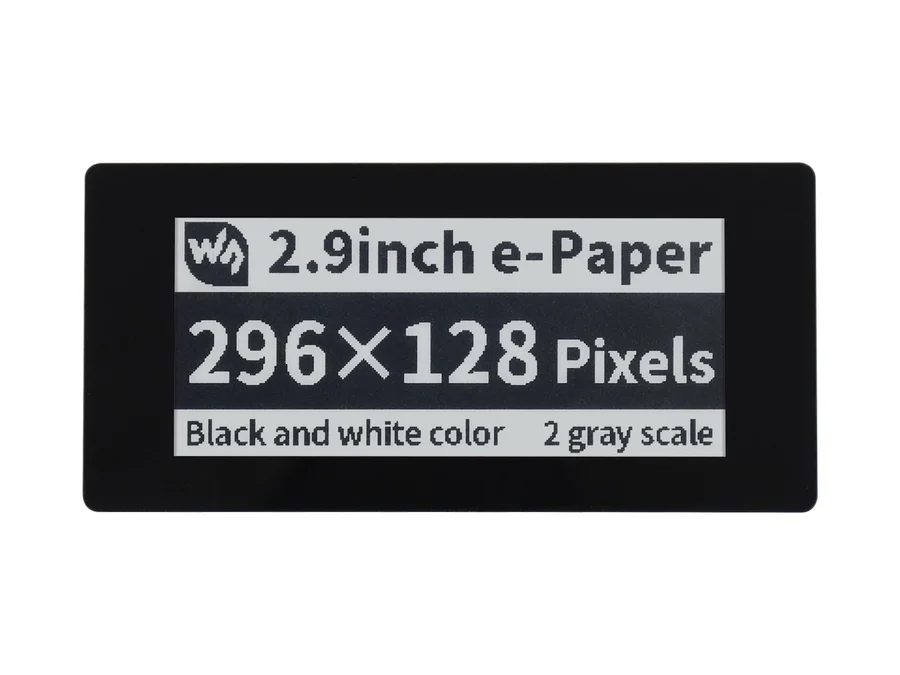](../../library/maker-media/e4ece0e0e34bcaa4cbb4dd1fdd2afe7a10041cf0750cc3f9f574277350d17322.jpg)

**identification photo** · Source image inspected; technical review pending

Manufacturer artwork; reproduction rights not established; not cleared for the printed book

## 2inch LCD Module

Waveshare · Manufacturer documentation recorded

[Open full gallery](https://valleytech-black-wire-guide.pages.dev/?tab=makers&part=maker-waveshare-1cd781a89574)

[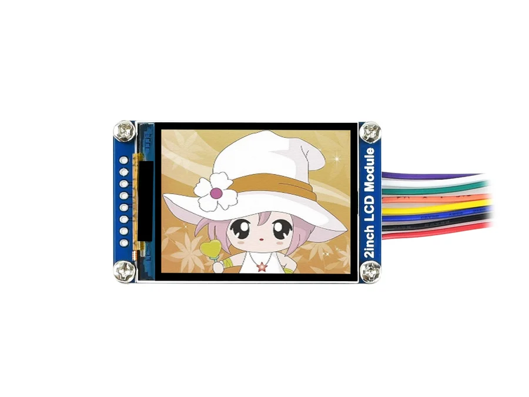](../../library/maker-media/63c38455cf8c93758ca7a0568ee2e724ec1ef5035e9c5366bbbe7d6ab9daf692.jpg)

**identification photo** · Source image inspected; technical review pending

Manufacturer artwork; reproduction rights not established; not cleared for the printed book

## 3.52inch e-Paper HAT

Waveshare · Manufacturer documentation recorded

[Open full gallery](https://valleytech-black-wire-guide.pages.dev/?tab=makers&part=maker-waveshare-e2262dadb5e8)

[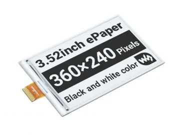](../../library/maker-media/3982e4b1ab8ba28bfe1ac6ff3dafc29bece53627eef23e93b51d86bd95341a0e.jpg)

**identification photo** · Source image inspected; technical review pending

Manufacturer artwork; reproduction rights not established; not cleared for the printed book

## 3.7inch e-Paper HAT

Waveshare · Manufacturer documentation recorded

[Open full gallery](https://valleytech-black-wire-guide.pages.dev/?tab=makers&part=maker-waveshare-f052759af7bf)

[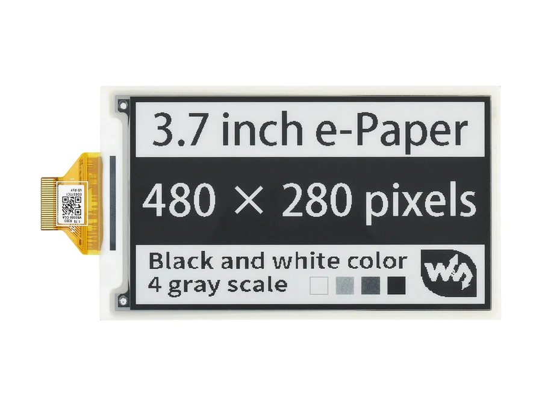](../../library/maker-media/1853ffc6702cb80360b6d4559993d4c678f46882780f9b59dd4772e8355ed868.jpg)

**source reference** · Source image inspected; technical review pending

Manufacturer artwork; reproduction rights not established; not cleared for the printed book

## 3inch e-Paper Module (G)

Waveshare · Manufacturer documentation recorded

[Open full gallery](https://valleytech-black-wire-guide.pages.dev/?tab=makers&part=maker-waveshare-6861e5e11fc6)

[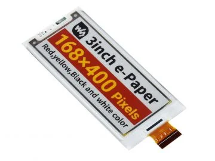](../../library/maker-media/c0bd60980038fce23840f4cbf1df293e9268364c5d8245a0db6edf7f79c48ec8.jpg)

**identification photo** · Source image inspected; technical review pending

Manufacturer artwork; reproduction rights not established; not cleared for the printed book

## 4.01inch e-Paper HAT (F)

Waveshare · Manufacturer documentation recorded

[Open full gallery](https://valleytech-black-wire-guide.pages.dev/?tab=makers&part=maker-waveshare-95f16767c5b0)

[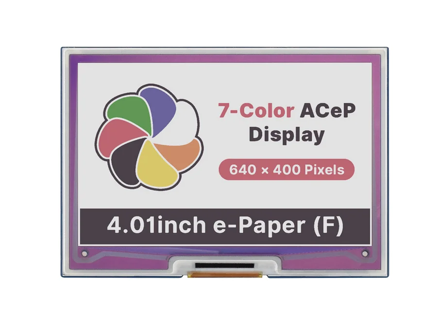](../../library/maker-media/9bb8ddcae9e48ce1eeb64a394fdbd153f26d06fd48b4f0fd8b9b0b8fa263d752.jpg)

**source reference** · Source image inspected; technical review pending

Manufacturer artwork; reproduction rights not established; not cleared for the printed book

## 4.01inch e-Paper Module (F)

Waveshare · Manufacturer documentation recorded

[Open full gallery](https://valleytech-black-wire-guide.pages.dev/?tab=makers&part=maker-waveshare-01c68237b637)

**source reference** · Source image inspected; technical review pending

Manufacturer artwork; reproduction rights not established; not cleared for the printed book

## 4.2inch e-Paper Cloud Module

Waveshare · Manufacturer documentation recorded

[Open full gallery](https://valleytech-black-wire-guide.pages.dev/?tab=makers&part=maker-waveshare-596a74e959a5)

[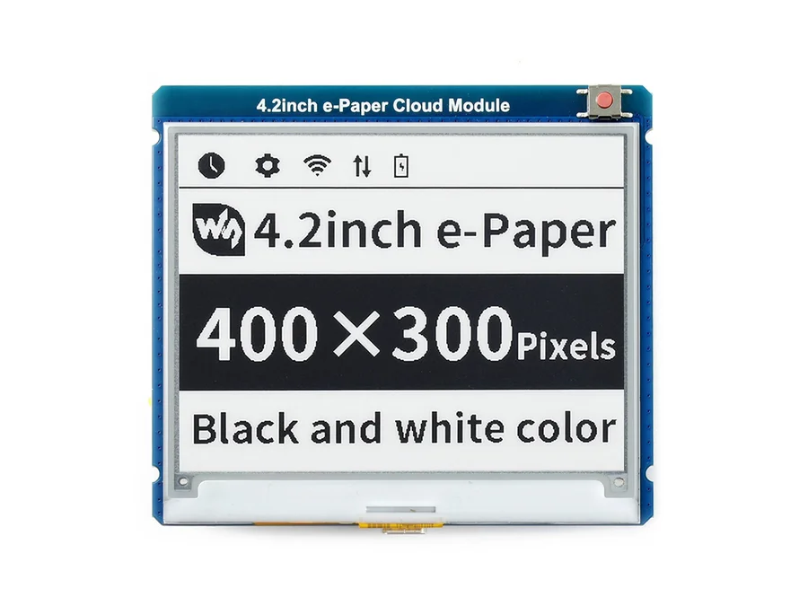](../../library/maker-media/7105a7637411f303eb5637154a6083c791009780df5a504fd72eb7a8b0041fe8.jpg)

**identification photo** · Source image inspected; technical review pending

Manufacturer artwork; reproduction rights not established; not cleared for the printed book

## 4.2inch e-Paper Module

Waveshare · Manufacturer documentation recorded

[Open full gallery](https://valleytech-black-wire-guide.pages.dev/?tab=makers&part=maker-waveshare-7ad311da1c26)

[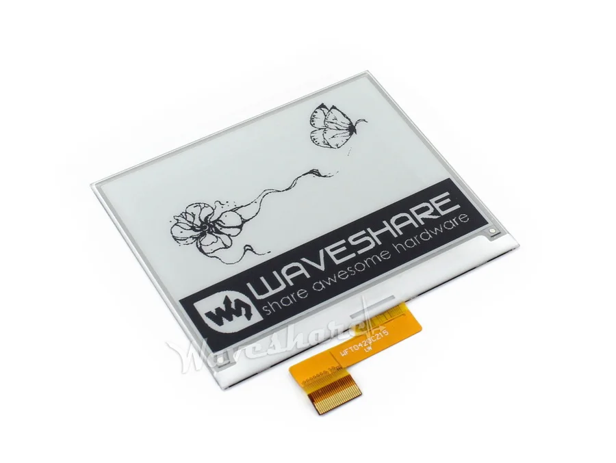](../../library/maker-media/259a959d1589d6acbf5e767dd1bb74c17e481a43038e3fc6ce02499796ff267c.jpg)

**source reference** · Source image inspected; technical review pending

Manufacturer artwork; reproduction rights not established; not cleared for the printed book

## 4.2inch e-Paper Module (B)

Waveshare · Manufacturer documentation recorded

[Open full gallery](https://valleytech-black-wire-guide.pages.dev/?tab=makers&part=maker-waveshare-1ce8fb9f0b76)

[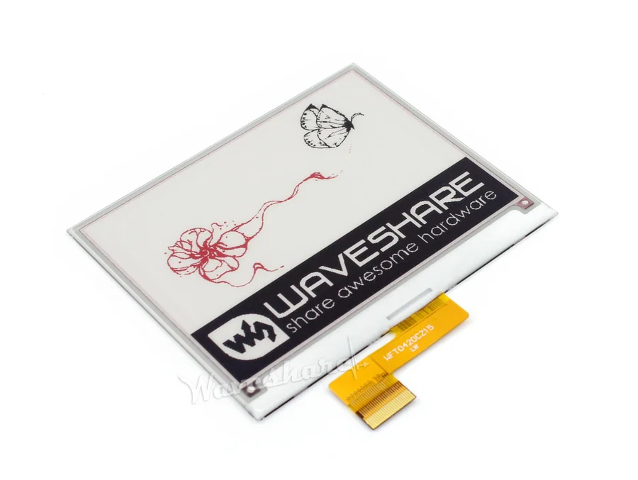](../../library/maker-media/fc7b6ab3a0683d5f8b851eceaa5ecd00cc8030a07281451876a6c2cbbe7ea612.jpg)

**identification photo** · Source image inspected; technical review pending

Manufacturer artwork; reproduction rights not established; not cleared for the printed book

## 4.2inch e-Paper Module (C)

Waveshare · Manufacturer documentation recorded

[Open full gallery](https://valleytech-black-wire-guide.pages.dev/?tab=makers&part=maker-waveshare-4b51a4011fe6)

[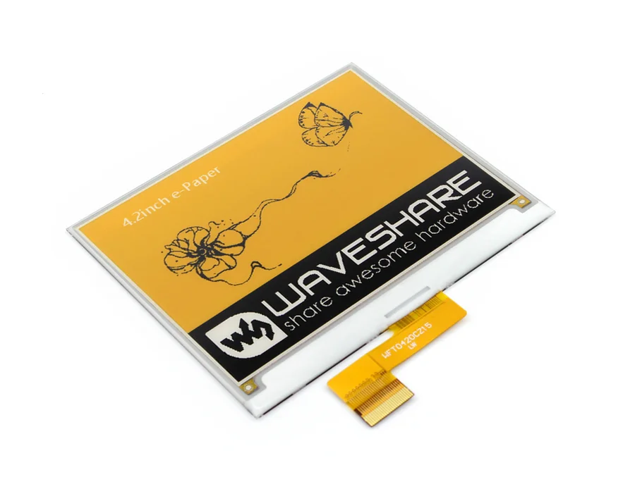](../../library/maker-media/db2ee1383cc89b6baceefeef458a57e633b89d0d2e666759d503fc38265d37e2.jpg)

**source reference** · Source image inspected; technical review pending

Manufacturer artwork; reproduction rights not established; not cleared for the printed book

## 4.3inch e-Paper UART Module

Waveshare · Manufacturer documentation recorded

[Open full gallery](https://valleytech-black-wire-guide.pages.dev/?tab=makers&part=maker-waveshare-ca6ff85d88cc)

[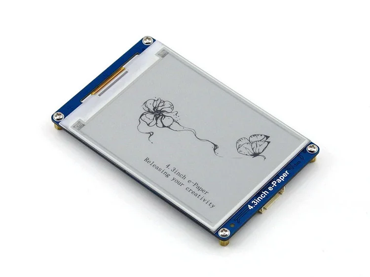](../../library/maker-media/ffa7cb60474412e5e42b652ed35bb7c28f66ac4715e65f9a64f2680ded8b6995.jpg)

**identification photo** · Source image inspected; technical review pending

Manufacturer artwork; reproduction rights not established; not cleared for the printed book

## 5.65inch e-Paper Module (F)

Waveshare · Manufacturer documentation recorded

[Open full gallery](https://valleytech-black-wire-guide.pages.dev/?tab=makers&part=maker-waveshare-dda30e9fd090)

[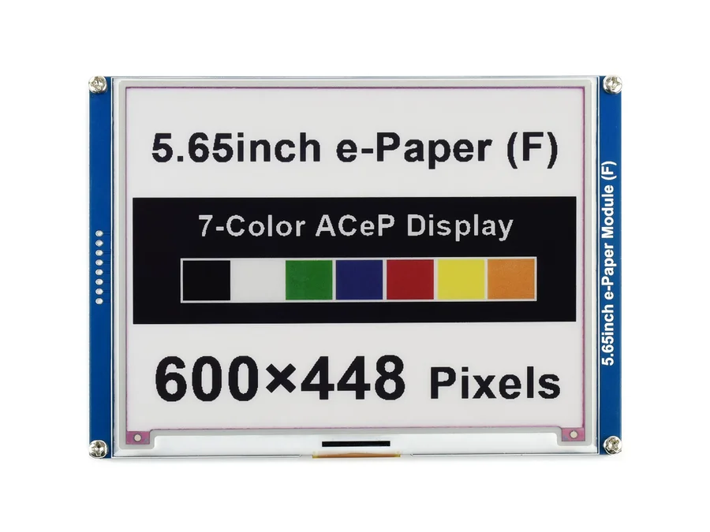](../../library/maker-media/606c74aabaa671c7d1cd8863208342d4a1438853fafe04b5fc977542a11ed732.jpg)

**identification photo** · Source image inspected; technical review pending

Manufacturer artwork; reproduction rights not established; not cleared for the printed book

## 5.83inch e-Paper HAT

Waveshare · Manufacturer documentation recorded

[Open full gallery](https://valleytech-black-wire-guide.pages.dev/?tab=makers&part=maker-waveshare-84506f22447b)

[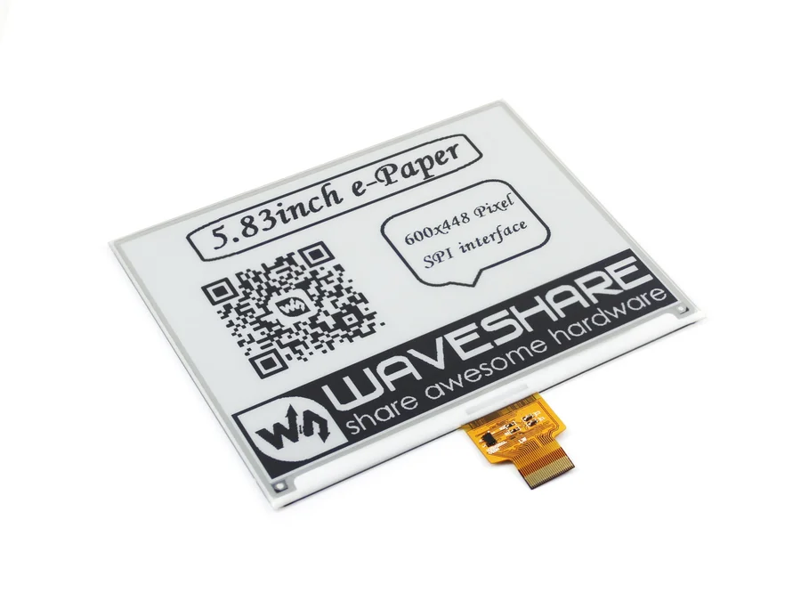](../../library/maker-media/e4e62e48f93310cbc438710febaa36945289f86f109564c4f77aab8185c86e7a.jpg)

**identification photo** · Source image inspected; technical review pending

Manufacturer artwork; reproduction rights not established; not cleared for the printed book

## 5.83inch e-Paper HAT (B)

Waveshare · Manufacturer documentation recorded

[Open full gallery](https://valleytech-black-wire-guide.pages.dev/?tab=makers&part=maker-waveshare-6a6c3a42824b)

[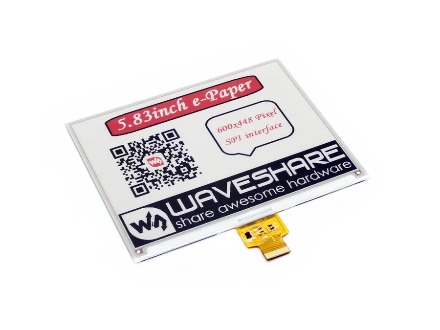](../../library/maker-media/47739bbfd78ebfcdb8c5c41799ead632e91c82fda5a99a321427d6effaa97fb8.jpg)

**identification photo** · Source image inspected; technical review pending

Manufacturer artwork; reproduction rights not established; not cleared for the printed book

## 5.83inch e-Paper HAT (C)

Waveshare · Manufacturer documentation recorded

[Open full gallery](https://valleytech-black-wire-guide.pages.dev/?tab=makers&part=maker-waveshare-66ba510e06ae)

[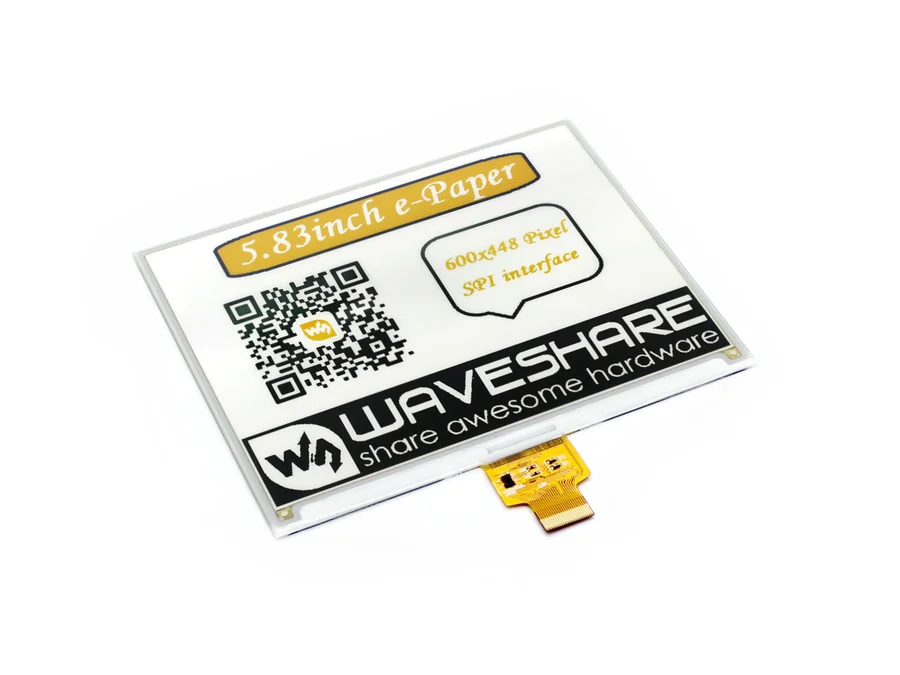](../../library/maker-media/3d42855f192983c2241ac799c860650aa1965af0b2b071908fea79bbdbc7b7fd.jpg)

**identification photo** · Source image inspected; technical review pending

Manufacturer artwork; reproduction rights not established; not cleared for the printed book

## 6inch e-Paper HAT

Waveshare · Manufacturer documentation recorded

[Open full gallery](https://valleytech-black-wire-guide.pages.dev/?tab=makers&part=maker-waveshare-476460b2cfcd)

[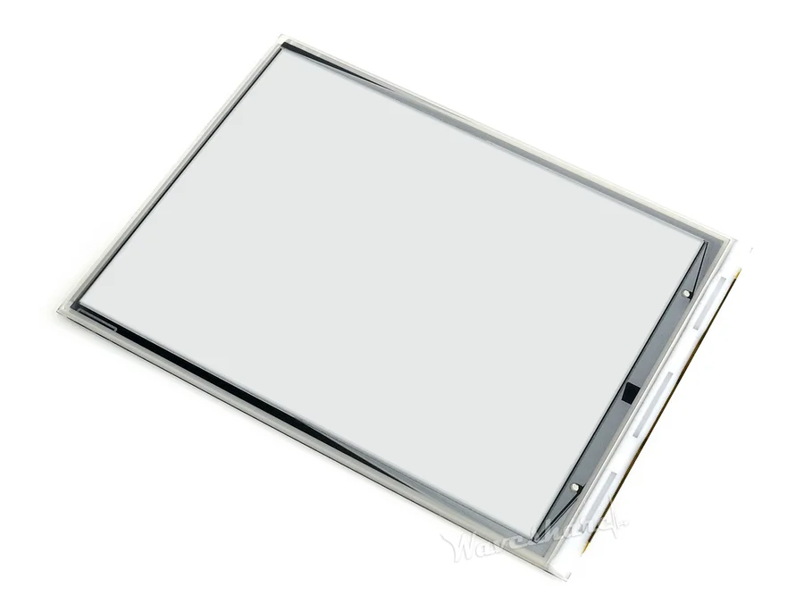](../../library/maker-media/685fbfd8138605427c91285301550910e7e6ee3ce42aa9491048af64beadd898.jpg)

**identification photo** · Source image inspected; technical review pending

Manufacturer artwork; reproduction rights not established; not cleared for the printed book

## 6inch HD e-Paper HAT

Waveshare · Manufacturer documentation recorded

[Open full gallery](https://valleytech-black-wire-guide.pages.dev/?tab=makers&part=maker-waveshare-227ca87dad49)

[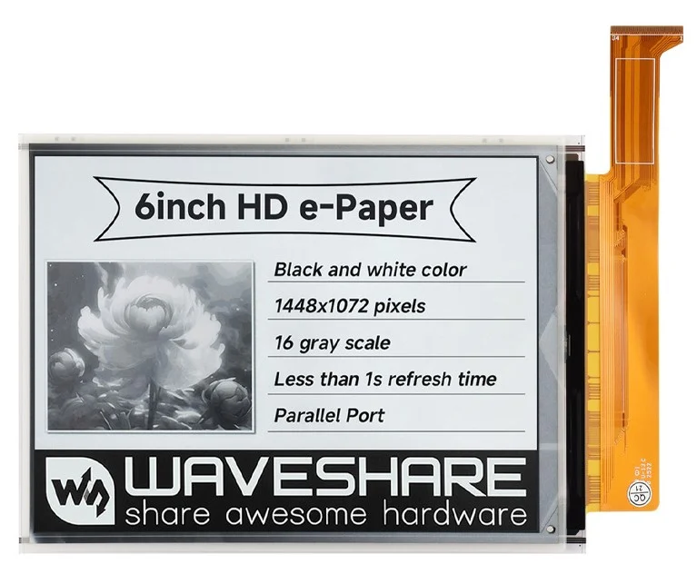](../../library/maker-media/4ada97b0cbd92ebf703e2c55cc44f8fce341c8d731970b69855c5f2fbd582efa.jpg)

**identification photo** · Source image inspected; technical review pending

Manufacturer artwork; reproduction rights not established; not cleared for the printed book

## 7.3inch e-Paper HAT (G)

Waveshare · Manufacturer documentation recorded

[Open full gallery](https://valleytech-black-wire-guide.pages.dev/?tab=makers&part=maker-waveshare-c1e1bc056690)

[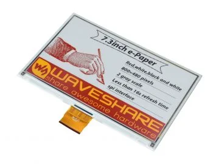](../../library/maker-media/d3fa85070c46edb029516e277caf53d1ef3c068ccff51acaa6415a6eb63588c6.jpg)

**identification photo** · Source image inspected; technical review pending

Manufacturer artwork; reproduction rights not established; not cleared for the printed book

## 7.5inch e-Paper (G)

Waveshare · Manufacturer documentation recorded

[Open full gallery](https://valleytech-black-wire-guide.pages.dev/?tab=makers&part=maker-waveshare-e61b17de1ca1)

[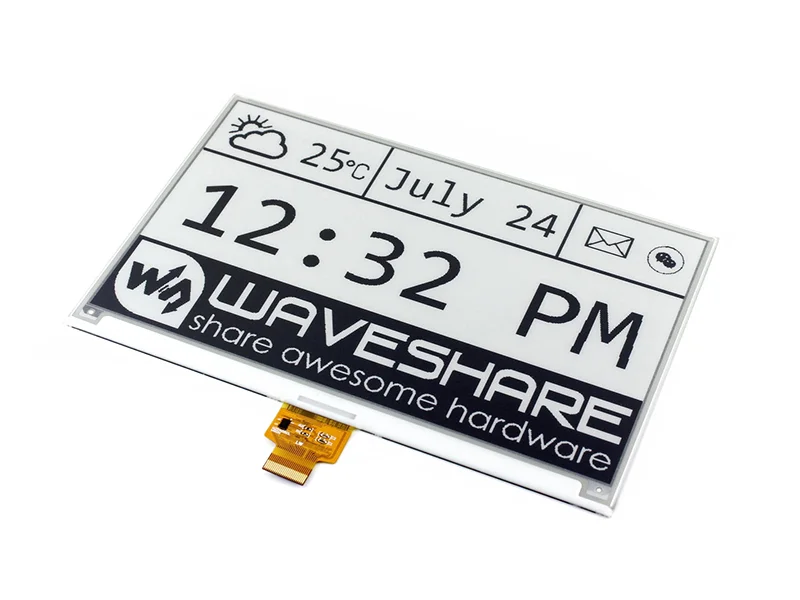](../../library/maker-media/a7e3536570341dc3886912d51b3c83e6a6c5f45516ddf9f623c883059a14f038.jpg)

**identification photo** · Source image inspected; technical review pending

Manufacturer artwork; reproduction rights not established; not cleared for the printed book

## 7.5inch e-Paper HAT

Waveshare · Manufacturer documentation recorded

[Open full gallery](https://valleytech-black-wire-guide.pages.dev/?tab=makers&part=maker-waveshare-e35cd3f2ab4a)

**identification photo** · Source image inspected; technical review pending

Manufacturer artwork; reproduction rights not established; not cleared for the printed book

## 7.5inch e-Paper HAT (B)

Waveshare · Manufacturer documentation recorded

[Open full gallery](https://valleytech-black-wire-guide.pages.dev/?tab=makers&part=maker-waveshare-b98c577cb381)

[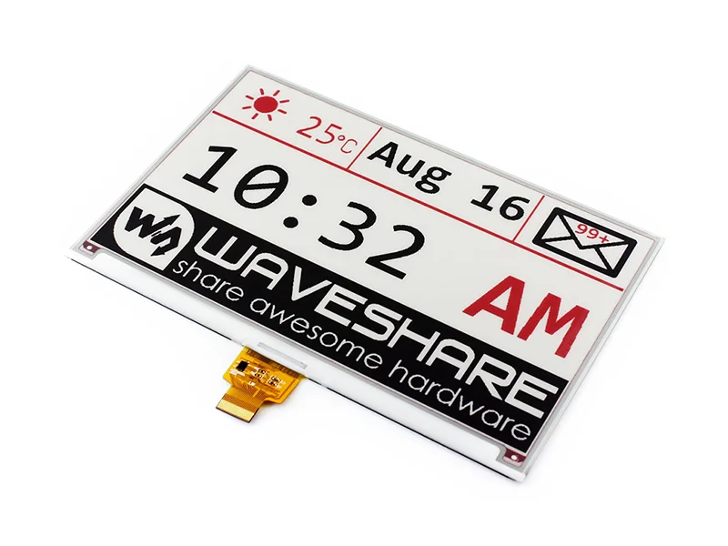](../../library/maker-media/d9351070e6625a3bb74bea8260214cde1c19f3376821d4ac423b44c3f3298feb.jpg)

**source reference** · Source image inspected; technical review pending

Manufacturer artwork; reproduction rights not established; not cleared for the printed book

## 7.5inch e-Paper HAT (C)

Waveshare · Manufacturer documentation recorded

[Open full gallery](https://valleytech-black-wire-guide.pages.dev/?tab=makers&part=maker-waveshare-cd213f214956)

[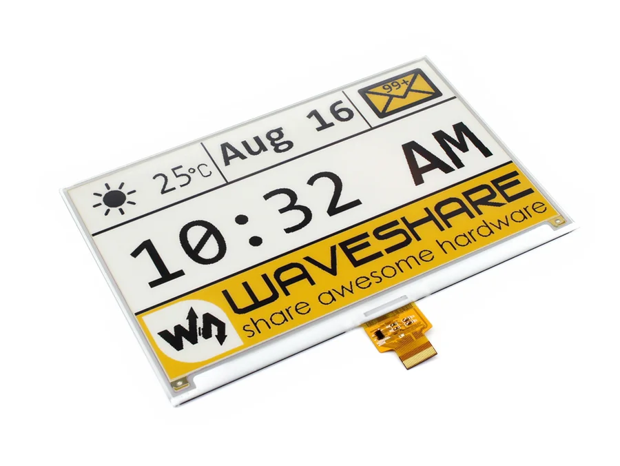](../../library/maker-media/8112865563c50ed8c6d43da48a541cf8edb613f9096b8a46e0d36d9df273051c.jpg)

**identification photo** · Source image inspected; technical review pending

Manufacturer artwork; reproduction rights not established; not cleared for the printed book

## 7.5inch HD e-Paper HAT

Waveshare · Manufacturer documentation recorded

[Open full gallery](https://valleytech-black-wire-guide.pages.dev/?tab=makers&part=maker-waveshare-79b43c26938d)

[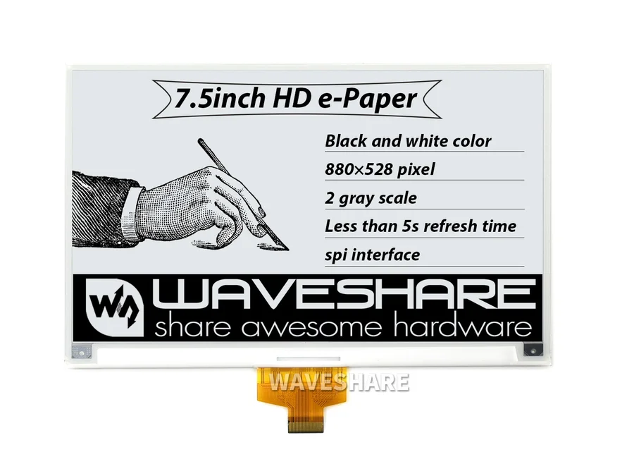](../../library/maker-media/e5a7dff497ff7b1b4194435c6dee4c941140fae39447e748e17d2e8abcd79b3b.jpg)

**identification photo** · Source image inspected; technical review pending

Manufacturer artwork; reproduction rights not established; not cleared for the printed book

## 7.5inch HD e-Paper HAT (B)

Waveshare · Manufacturer documentation recorded

[Open full gallery](https://valleytech-black-wire-guide.pages.dev/?tab=makers&part=maker-waveshare-b350e0bcb5a6)

[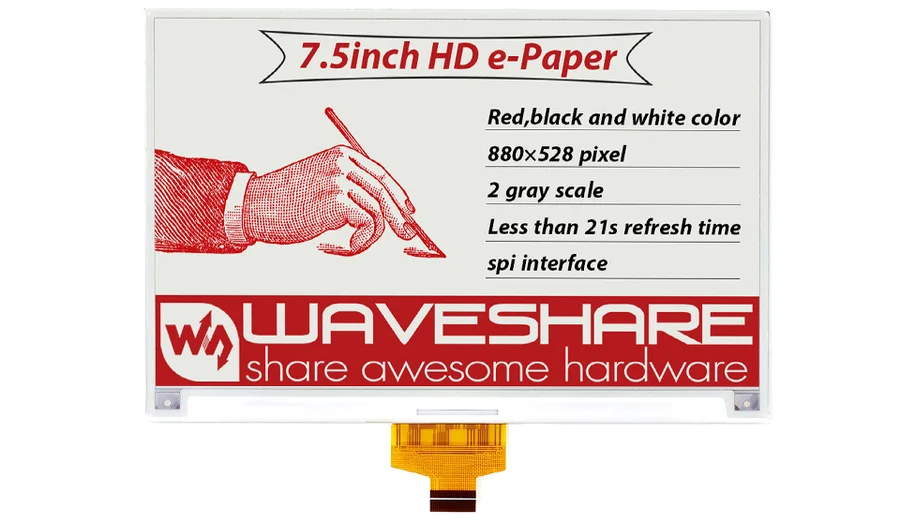](../../library/maker-media/dc2ca620c9b4f5b33d0405c157deaa391e1dd79e40c47ae1a6035b4a6bfcd611.jpg)

**identification photo** · Source image inspected; technical review pending

Manufacturer artwork; reproduction rights not established; not cleared for the printed book

## 7.8inch e-Paper HAT

Waveshare · Manufacturer documentation recorded

[Open full gallery](https://valleytech-black-wire-guide.pages.dev/?tab=makers&part=maker-waveshare-57eb73e46ab7)

[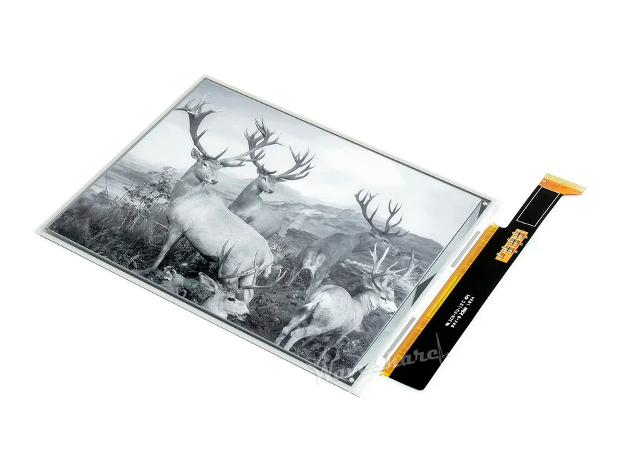](../../library/maker-media/d1d3543c00e252224b645aa61c9e888cfb6c566ec71c3ae62b75dd1592d80078.jpg)

**identification photo** · Source image inspected; technical review pending

Manufacturer artwork; reproduction rights not established; not cleared for the printed book

## 9.7inch e-Paper HAT

Waveshare · Manufacturer documentation recorded

[Open full gallery](https://valleytech-black-wire-guide.pages.dev/?tab=makers&part=maker-waveshare-1323e6016990)

[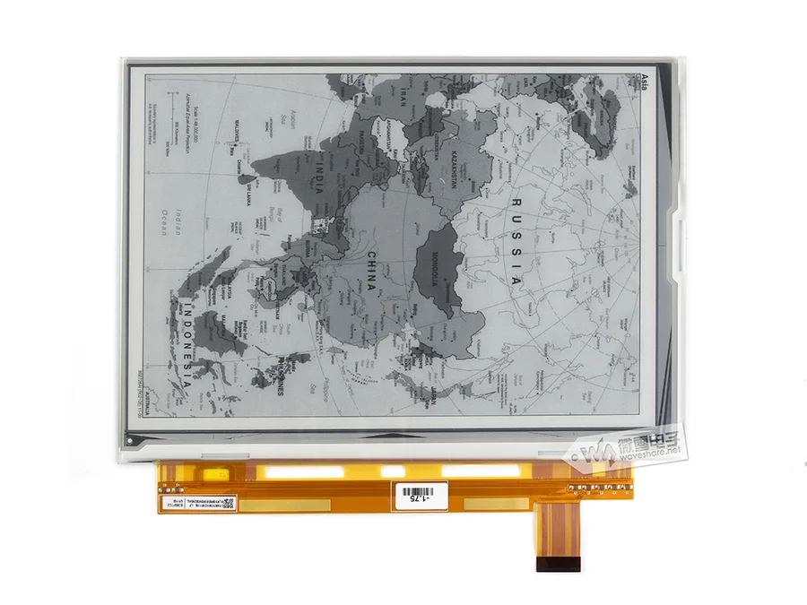](../../library/maker-media/b7807ccc17ec558846712d51c1483f54a472a5d987141b8fcf9d85444c715ff0.jpg)

**identification photo** · Source image inspected; technical review pending

Manufacturer artwork; reproduction rights not established; not cleared for the printed book

## Adafruit 1.27" and 1.5" Color OLED Breakout Board

Adafruit · Manufacturer documentation recorded

[Open full gallery](https://valleytech-black-wire-guide.pages.dev/?tab=makers&part=maker-adafruit-b1353880bff2)

[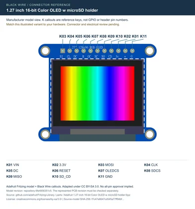](../../library/maker-media/0acda9e6d0663155aa74e84f90801becf2a25cb1afc178d4d34bd79fd013b4de.svg)

**pinout image** · Manufacturer-model geometry checked; independent electrical and full-device review pending

Adafruit manufacturer illustration with Black Wire connector callouts, adapted under CC BY-SA 3.0. Attribution and share-alike terms apply to this sheet.

## Adafruit 1.3" and 1.54" 240x240 Wide Angle TFT LCD Displays

Adafruit · Manufacturer documentation recorded

[Open full gallery](https://valleytech-black-wire-guide.pages.dev/?tab=makers&part=maker-adafruit-fc5529ac841e)

[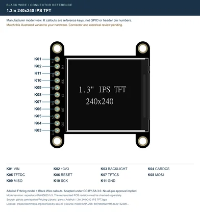](../../library/maker-media/2c7d2e1292751d40167cad9fab521382abbef9492cefb0e07aa28b020213a775.svg)

**pinout image** · Manufacturer-model geometry checked; independent electrical and full-device review pending

Adafruit manufacturer illustration with Black Wire connector callouts, adapted under CC BY-SA 3.0. Attribution and share-alike terms apply to this sheet.

## Adafruit 2.13" eInk Display Breakouts and FeatherWings

Adafruit · Manufacturer documentation recorded

[Open full gallery](https://valleytech-black-wire-guide.pages.dev/?tab=makers&part=maker-adafruit-cdbedfac50f7)

[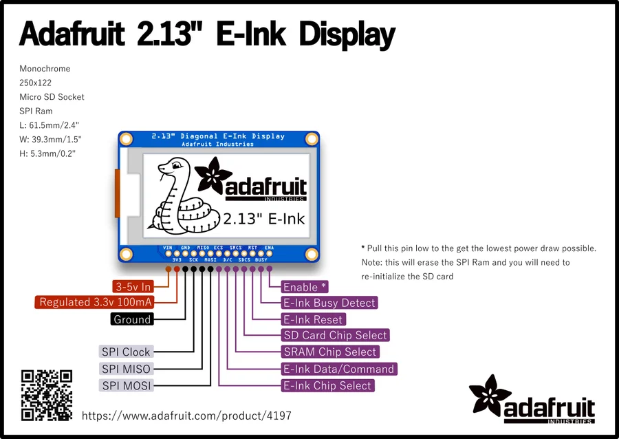](../../library/maker-media/9085d981d15a2a6abc7058188e79db2d712c25f1142cfc2b831ccc32b8eaa221.png)

**pinout image** · Source image inspected; technical review pending

Adafruit Industries / original asset contributor. https://creativecommons.org/licenses/by-sa/3.0/; original image unchanged. See linked asset page for creator and terms.

## Adafruit 2.4" Color TFT Touchscreen Breakout

Adafruit · Manufacturer documentation recorded

[Open full gallery](https://valleytech-black-wire-guide.pages.dev/?tab=makers&part=maker-adafruit-4b55b6d2c219)

[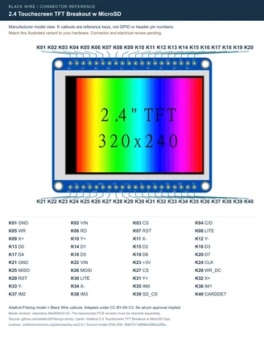](../../library/maker-media/9f6a5c6e44e2f8b0c37b5b1aec68e1c60fc70038583f9c45f4b61edce0b1ba5c.svg)

**pinout image** · Manufacturer-model geometry checked; independent electrical and full-device review pending

Adafruit manufacturer illustration with Black Wire connector callouts, adapted under CC BY-SA 3.0. Attribution and share-alike terms apply to this sheet.

## Adafruit eInk Display Breakouts and FeatherWings

Adafruit · Manufacturer documentation recorded

[Open full gallery](https://valleytech-black-wire-guide.pages.dev/?tab=makers&part=maker-adafruit-58b0ba90bb84)

**pinout image** · Source image inspected; technical review pending

Adafruit Industries / original asset contributor. https://creativecommons.org/licenses/by-sa/3.0/; original image unchanged. See linked asset page for creator and terms.

## Adafruit LED Backpacks

Adafruit · Manufacturer documentation recorded

[Open full gallery](https://valleytech-black-wire-guide.pages.dev/?tab=makers&part=maker-adafruit-ca7cb99c2341)

[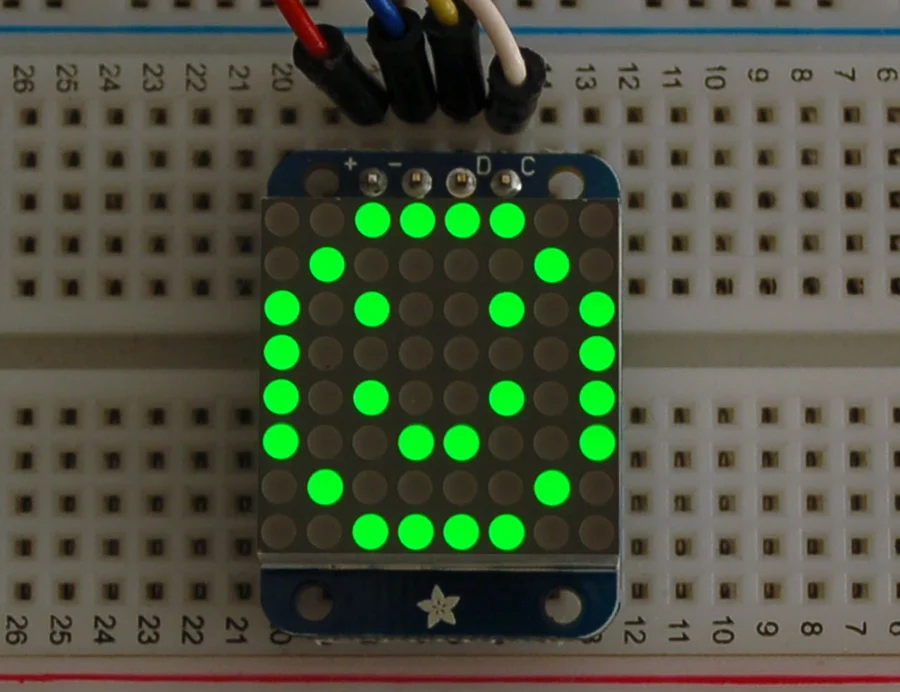](../../library/maker-media/7ec0353e716479c9c466ff5d24d1e492ca2f5824f968cfc69389e506dc341ddd.jpg)

**source reference** · Source image inspected; technical review pending

Adafruit Industries / original asset contributor. https://creativecommons.org/licenses/by-sa/3.0/; original image unchanged. See linked asset page for creator and terms.

## Adafruit OLED FeatherWing

Adafruit · Manufacturer documentation recorded

[Open full gallery](https://valleytech-black-wire-guide.pages.dev/?tab=makers&part=maker-adafruit-bc27aae30369)

[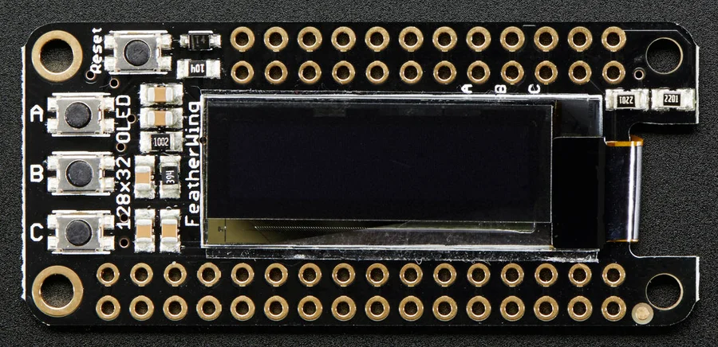](../../library/maker-media/76ac6b272efcf99f2064ba3d57588ee0ebbc1d58df6d50e02b2704e85059289d.jpg)

**source reference** · Source image inspected; technical review pending

Adafruit Industries / original asset contributor. https://creativecommons.org/licenses/by-sa/3.0/; original image unchanged. See linked asset page for creator and terms.

## Adafruit Sharp Memory Display Breakout

Adafruit · Manufacturer documentation recorded

[Open full gallery](https://valleytech-black-wire-guide.pages.dev/?tab=makers&part=maker-adafruit-d7c5159e09e2)

[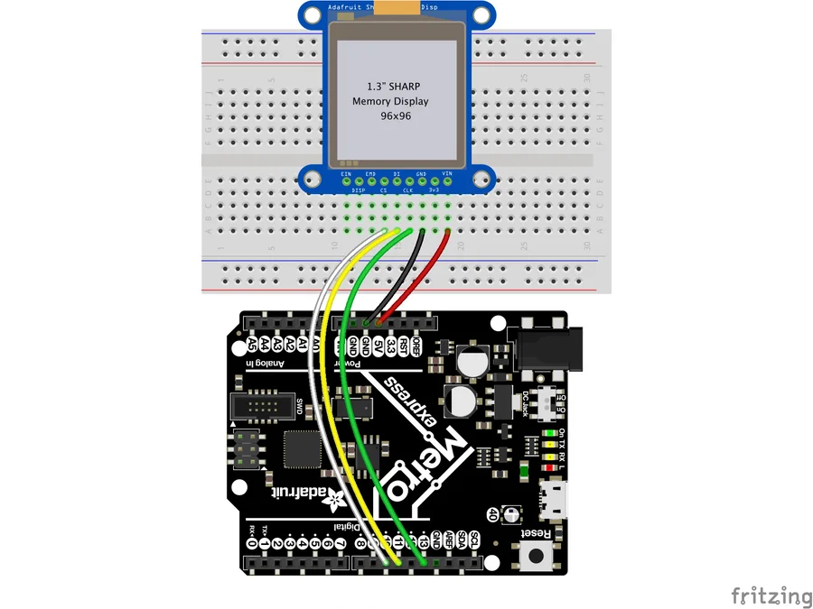](../../library/maker-media/fc1fd81adbc434a8877b7013bbc1eb9a146f7c9a920cbcfb70fa0694c1a834cb.jpg)

**source reference** · Source image inspected; technical review pending

Manufacturer artwork; reproduction rights not established; not cleared for the printed book

## Character LCDs

Adafruit · Manufacturer documentation recorded

[Open full gallery](https://valleytech-black-wire-guide.pages.dev/?tab=makers&part=maker-adafruit-eca3f9239995)

[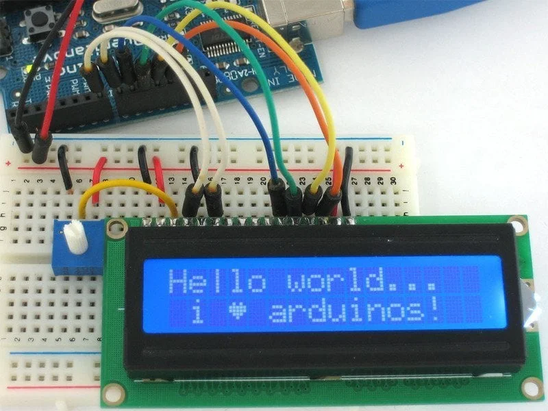](../../library/maker-media/dc348998f1d954ada572a0ad8a5482c70d229516bdd8268370434d0b71df2320.jpg)

**identification photo** · Source image inspected; technical review pending

Manufacturer artwork; reproduction rights not established; not cleared for the printed book

## Display 1.14 For StickS3

M5Stack · Source review pending

[Open full gallery](https://valleytech-black-wire-guide.pages.dev/?tab=makers&part=maker-existing-m5stack-expansion-display-1-14-for-sticks3)

[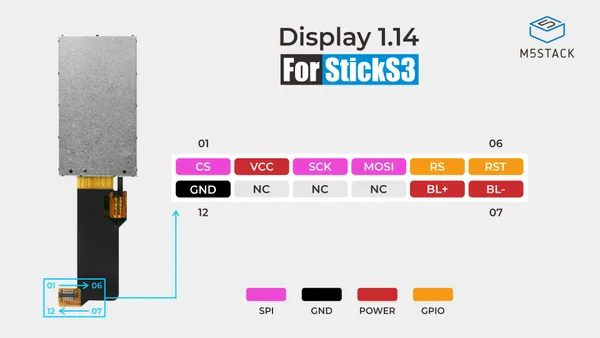](../../library/media/a7d42df665d2e6366724daa714ef4a71975ce6bdc708a52110a9f0b4ab14aef6.jpg)

**pinout image** · Reviewed source

Not established; source attribution retained

## Fermion: 2.8” 320x240 TFT LCD Resistive Touchscreen Display Module / DFR0665

DFRobot · Manufacturer documentation recorded

[Open full gallery](https://valleytech-black-wire-guide.pages.dev/?tab=makers&part=maker-dfrobot-ae656a153017)

[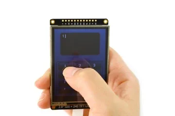](../../library/maker-media/fbd56271ac0264c88944c1597475626ff214d52e06649c0c0917a7b1b16b5519.webp)

**identification photo** · Source image inspected; technical review pending

Manufacturer artwork; reproduction rights not established; not cleared for the printed book

## GC9A01 round TFT modules

Generic / manufacturer unconfirmed · Identification needed

[Open full gallery](https://valleytech-black-wire-guide.pages.dev/?tab=makers&part=maker-generic-gc9a01-round-tft-modules)

Matching image still needed.

## Gravity: 1602 LCD Keypad Shield / DFR0009

DFRobot · Manufacturer documentation recorded

[Open full gallery](https://valleytech-black-wire-guide.pages.dev/?tab=makers&part=maker-dfrobot-606a7d411fa4)

[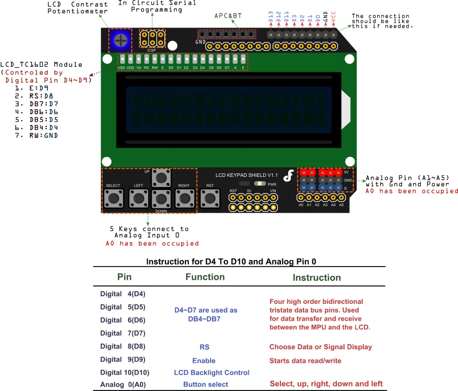](../../library/maker-media/5785dd43013e7e09463964266b418521e99e60762745ac1d4db3990f1b464ac7.webp)

**pinout image** · Source image inspected; technical review pending

Manufacturer artwork; reproduction rights not established; not cleared for the printed book

## Gravity: I2C LCD1602 Display Module / DFR0555

DFRobot · Manufacturer documentation recorded

[Open full gallery](https://valleytech-black-wire-guide.pages.dev/?tab=makers&part=maker-dfrobot-7ceb5287a0ce)

[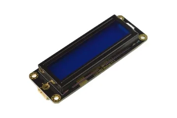](../../library/maker-media/1360f4e8274b96b3779aaf95db04001d00d560648184ab062cb3833a31cd2a79.webp)

**identification photo** · Source image inspected; technical review pending

Manufacturer artwork; reproduction rights not established; not cleared for the printed book

## Gravity: I2C LCD1602 Display Module / DFR0556

DFRobot · Manufacturer documentation recorded

[Open full gallery](https://valleytech-black-wire-guide.pages.dev/?tab=makers&part=maker-dfrobot-7521fd62c4f9)

[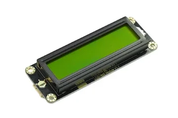](../../library/maker-media/cb6e7298d9b138857d25d9307f309ec84be790f0b1ab27c2385bd73bf7f6c74c.webp)

**identification photo** · Source image inspected; technical review pending

Manufacturer artwork; reproduction rights not established; not cleared for the printed book

## Gravity: I2C LCD1602 Display Module / DFR0557

DFRobot · Manufacturer documentation recorded

[Open full gallery](https://valleytech-black-wire-guide.pages.dev/?tab=makers&part=maker-dfrobot-399292cc8ff3)

[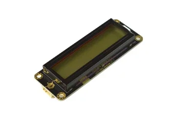](../../library/maker-media/b9019afa0027dd2f0ebe54e954e4726c044efd5b5ef3b7caf4242caab3e3d436.webp)

**identification photo** · Source image inspected; technical review pending

Manufacturer artwork; reproduction rights not established; not cleared for the printed book

## Gravity: LCD12864 Shield for Arduino / DFR0287

DFRobot · Manufacturer documentation recorded

[Open full gallery](https://valleytech-black-wire-guide.pages.dev/?tab=makers&part=maker-dfrobot-06087436c228)

[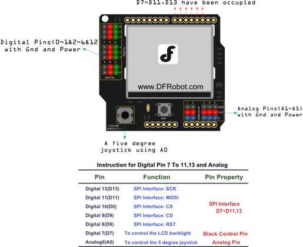](../../library/maker-media/31876e2b00a504e3736abc6e3c93c47194b48fc96b6f35d48513e4fc3a24e6a0.png)

**pinout image** · Connector diagram visually inspected; independent electrical review pending

Manufacturer source artwork. Reproduction rights not established; excluded from the printed book.

## HD44780 character LCD modules

Generic / manufacturer unconfirmed · Identification needed

[Open full gallery](https://valleytech-black-wire-guide.pages.dev/?tab=makers&part=maker-generic-hd44780-character-lcd-modules)

Matching image still needed.

## I2C 16x2 LCD Display Module / TOY0046

DFRobot · Manufacturer documentation recorded

[Open full gallery](https://valleytech-black-wire-guide.pages.dev/?tab=makers&part=maker-dfrobot-0a169a5b688e)

Matching image still needed.

## ILI9341 TFT modules

Generic / manufacturer unconfirmed · Identification needed

[Open full gallery](https://valleytech-black-wire-guide.pages.dev/?tab=makers&part=maker-generic-ili9341-tft-modules)

Matching image still needed.

## Inky pHAT (4 Colour ePaper/E Ink®/EPD)

Pimoroni · Manufacturer documentation recorded

[Open full gallery](https://valleytech-black-wire-guide.pages.dev/?tab=makers&part=maker-pimoroni-99fbaa8c4c7a)

**identification photo** · Source image inspected; technical review pending

Manufacturer artwork; reproduction rights not established; not cleared for the printed book

## Monochrome 0.96" 128x64 OLED Graphic Display - STEMMA QT / PID 326

Adafruit · Manufacturer documentation recorded

[Open full gallery](https://valleytech-black-wire-guide.pages.dev/?tab=makers&part=maker-adafruit-product-326)

[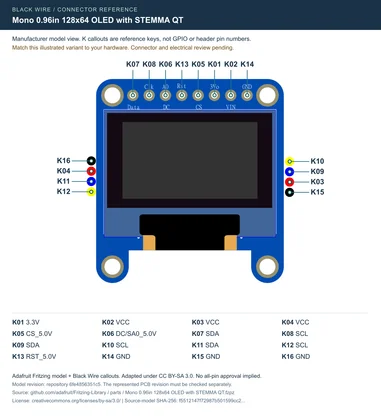](../../library/maker-media/dcd812fcc60629cdb8513c87a6a04af154dac789a5ce94c9b3caa8e208e9822a.svg)

**pinout image** · Manufacturer-model geometry checked; independent electrical and full-device review pending

Adafruit manufacturer illustration with Black Wire connector callouts, adapted under CC BY-SA 3.0. Attribution and share-alike terms apply to this sheet.

## Monochrome 1.3" 128x64 OLED graphic display - STEMMA QT / Qwiic / PID 938

Adafruit · Manufacturer documentation recorded

[Open full gallery](https://valleytech-black-wire-guide.pages.dev/?tab=makers&part=maker-adafruit-product-938)

[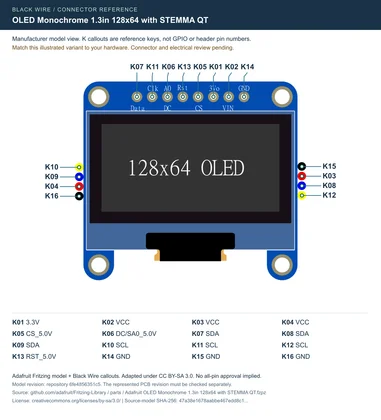](../../library/maker-media/11f5cf2acb01ab61bd9bb4d2ec46eaab32af7da30a142dc580ed0f15a4d162fb.svg)

**pinout image** · Manufacturer-model geometry checked; independent electrical and full-device review pending

Adafruit manufacturer illustration with Black Wire connector callouts, adapted under CC BY-SA 3.0. Attribution and share-alike terms apply to this sheet.

## Monochrome OLED Breakouts

Adafruit · Manufacturer documentation recorded

[Open full gallery](https://valleytech-black-wire-guide.pages.dev/?tab=makers&part=maker-adafruit-e49788b786b1)

[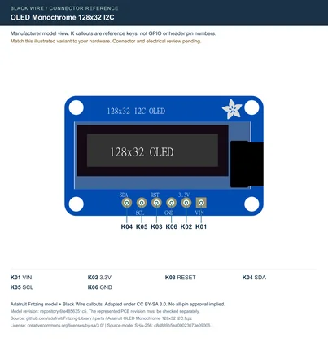](../../library/maker-media/47eb8173c9cb9461c2b20ddf6dcf00af616353664e99f864974ee93c65e4b90f.svg)

**pinout image** · Manufacturer-model geometry checked; independent electrical and full-device review pending

Adafruit manufacturer illustration with Black Wire connector callouts, adapted under CC BY-SA 3.0. Attribution and share-alike terms apply to this sheet.

## RGB LCD Shield

Adafruit · Manufacturer documentation recorded

[Open full gallery](https://valleytech-black-wire-guide.pages.dev/?tab=makers&part=maker-adafruit-6bca959feda8)

[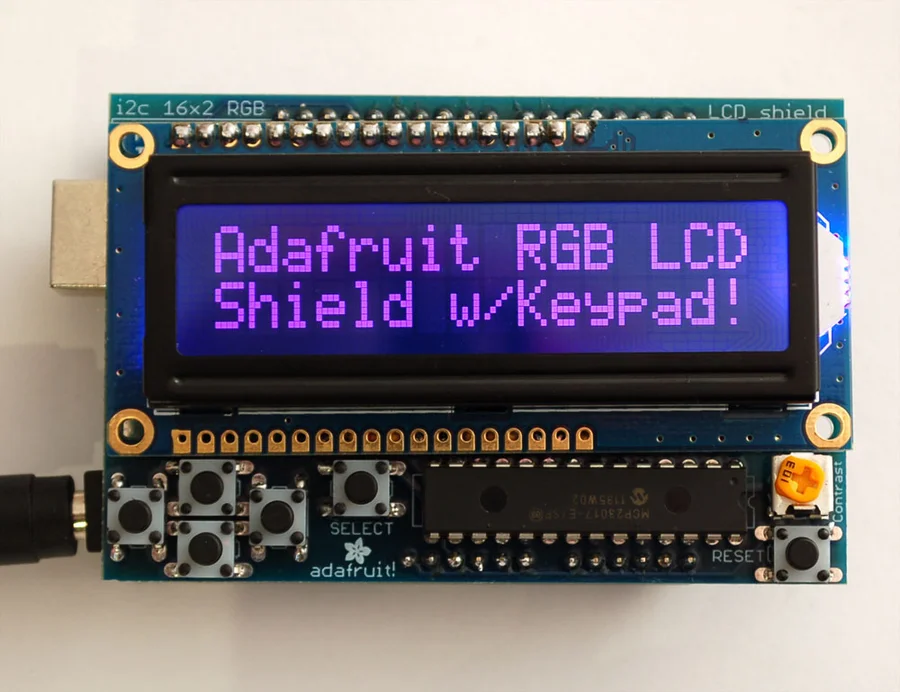](../../library/maker-media/c0009dd117369bb5e3bbab775da8c31ac8b0e7f9b6444309639965bd59774d03.jpg)

**source reference** · Source image inspected; technical review pending

Adafruit Industries / original asset contributor. https://creativecommons.org/licenses/by-sa/3.0/; original image unchanged. See linked asset page for creator and terms.

## SH1106 OLED modules

Generic / manufacturer unconfirmed · Identification needed

[Open full gallery](https://valleytech-black-wire-guide.pages.dev/?tab=makers&part=maker-generic-sh1106-oled-modules)

Matching image still needed.

## SSD1306 OLED modules

Generic / manufacturer unconfirmed · Identification needed

[Open full gallery](https://valleytech-black-wire-guide.pages.dev/?tab=makers&part=maker-generic-ssd1306-oled-modules)

Matching image still needed.

## ST7735 TFT modules

Generic / manufacturer unconfirmed · Identification needed

[Open full gallery](https://valleytech-black-wire-guide.pages.dev/?tab=makers&part=maker-generic-st7735-tft-modules)

Matching image still needed.

## ST7789 TFT modules

Generic / manufacturer unconfirmed · Identification needed

[Open full gallery](https://valleytech-black-wire-guide.pages.dev/?tab=makers&part=maker-generic-st7789-tft-modules)

Matching image still needed.

## Unit LCD

M5Stack · Source review pending

[Open full gallery](https://valleytech-black-wire-guide.pages.dev/?tab=makers&part=maker-existing-source-board-583a02cdb5e4a40a07)

[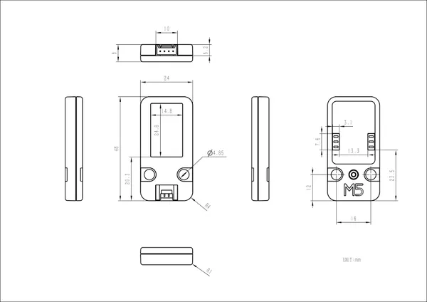](../../library/media/a404c5023c2da8465b515cc546bb229fcdb488b864f8a9015abd65cec296dadd.jpg)

**source reference** · Unreviewed source

Source rights not yet established

## Unit Mini OLED

M5Stack · Source review pending

[Open full gallery](https://valleytech-black-wire-guide.pages.dev/?tab=makers&part=maker-existing-source-board-006d629d6c06146f9f)

[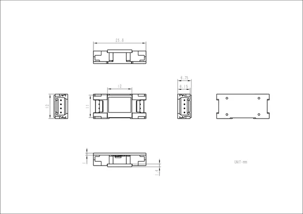](../../library/media/2bc616562f18cc3396c39def8059f3d6e2a46594d5f72c09e6d16512435ad75e.jpg)

**source reference** · Unreviewed source

Source rights not yet established

## Unit OLED

M5Stack · Source review pending

[Open full gallery](https://valleytech-black-wire-guide.pages.dev/?tab=makers&part=maker-existing-source-board-ee98e1a23278e9d676)

**source reference** · Unreviewed source

Source rights not yet established

## Xadow - RGB OLED 96x64

Seeed Studio · Source review pending

[Open full gallery](https://valleytech-black-wire-guide.pages.dev/?tab=makers&part=maker-existing-source-board-b7a01acf3f960b5f03)

[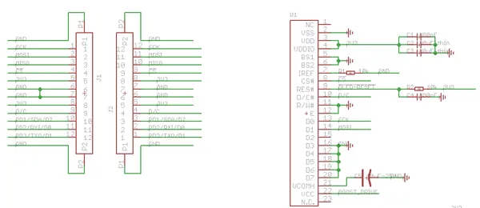](../../library/media/712849fcca0f04dac4b0f863b14a6846e877926bf16e1caa482f8174f745189a.png)

**source reference** · Unreviewed source

Source rights not yet established
