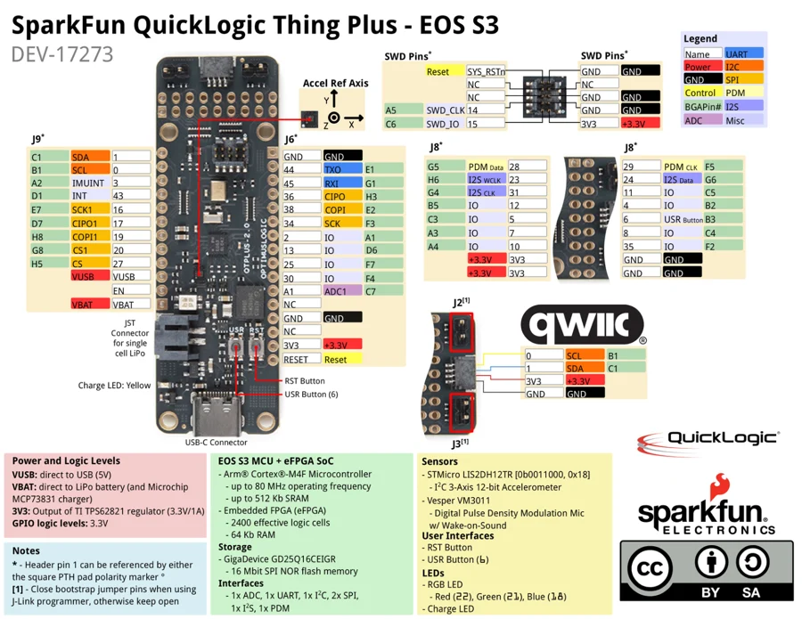
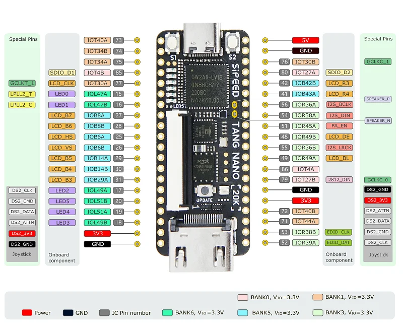
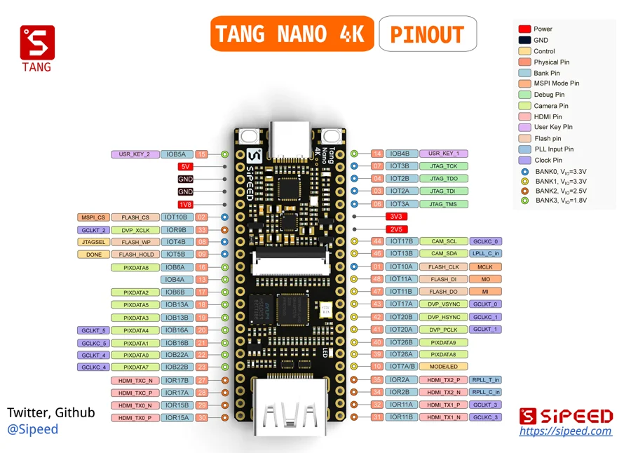

# FPGA / visual references

[All categories](../../MAKER_VISUALS.md) · [Image attribution ledger](../../catalog/maker-attributions.json)

Manufacturer originals remain unchanged. Connector-model sheets add separately labeled callouts under the recorded source license. Check exact PCB/revision, source notes and rights before reuse. Photos and partial connector diagrams are not complete-device approvals.

## iCEBreaker v1.0b

1BitSquared · Manufacturer source references collected

[Open full gallery](https://valleytech-black-wire-guide.pages.dev/?tab=makers&part=maker-1bitsquared-icebreaker-v1-0b)

**pinout image** · Reviewed source

1BitSquared / original diagram contributors. Rights not established for this asset; attribution retained. Original artwork is not covered by Black Wire's editorial license.

## QuickLogic Thing Plus EOS S3

SparkFun · Manufacturer source references collected

[Open full gallery](https://valleytech-black-wire-guide.pages.dev/?tab=makers&part=maker-sparkfun-quicklogic-thing-plus-eos-s3)

**pinout image** · Reviewed source

SparkFun Electronics / graphical datasheet contributors. CC BY-SA marking retained in the original; verify the applicable version in the source repository before redistribution.

## Tang Nano 20K

Sipeed · Manufacturer source references collected

[Open full gallery](https://valleytech-black-wire-guide.pages.dev/?tab=makers&part=maker-sipeed-tang-nano-20k)

**pinout image** · Reviewed source

Sipeed / original diagram contributors. Rights not established for this asset; attribution retained. Original artwork is not covered by Black Wire's editorial license.

## Tang Nano 4K

Sipeed · Manufacturer source references collected

[Open full gallery](https://valleytech-black-wire-guide.pages.dev/?tab=makers&part=maker-sipeed-tang-nano-4k)

**pinout image** · Reviewed source

Sipeed / original diagram contributors. Rights not established for this asset; attribution retained. Original artwork is not covered by Black Wire's editorial license.
