# Input controls / visual references

[All categories](../../MAKER_VISUALS.md) · [Image attribution ledger](../../catalog/maker-attributions.json)

Manufacturer originals remain unchanged. Connector-model sheets add separately labeled callouts under the recorded source license. Check exact PCB/revision, source notes and rights before reuse. Photos and partial connector diagrams are not complete-device approvals.

## Adafruit MPR121 12-Key Capacitive Touch Sensor Gator Breakout

Adafruit · Manufacturer documentation recorded

[Open full gallery](https://valleytech-black-wire-guide.pages.dev/?tab=makers&part=maker-adafruit-824c400d04a1)

[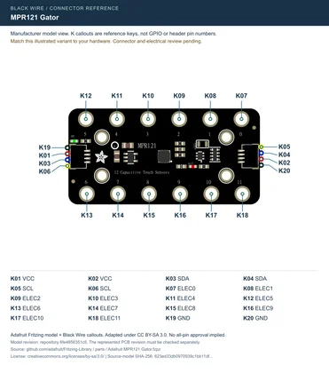](../../library/maker-media/337e77fbb966dbe71fe6dc2970e541dac9e69b3bbc78093aac9860622affa30f.svg)

**pinout image** · Manufacturer-model geometry checked; independent electrical and full-device review pending

Adafruit manufacturer illustration with Black Wire connector callouts, adapted under CC BY-SA 3.0. Attribution and share-alike terms apply to this sheet.

## Faces Encoder

M5Stack · Source review pending

[Open full gallery](https://valleytech-black-wire-guide.pages.dev/?tab=makers&part=maker-existing-m5stack-expansion-faces-encoder)

[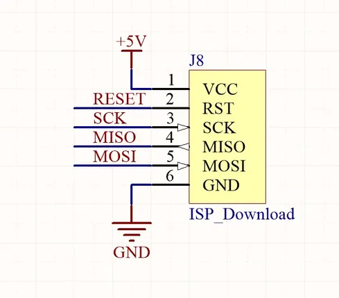](../../library/media/b4d54e2c19d4d31bd8dd28671a8b5ca6540502456486ad74358e884c4906a8c4.png)

**GPIO reference image** · Reviewed source

Not established; source attribution retained

## Faces Joystick

M5Stack · Source review pending

[Open full gallery](https://valleytech-black-wire-guide.pages.dev/?tab=makers&part=maker-existing-m5stack-expansion-faces-joystick)

**GPIO reference image** · Reviewed source

Not established; source attribution retained

## Faces QWERTY

M5Stack · Source review pending

[Open full gallery](https://valleytech-black-wire-guide.pages.dev/?tab=makers&part=maker-existing-m5stack-expansion-faces-qwerty)

**GPIO reference image** · Reviewed source

Not established; source attribution retained

## Hat CardKB

M5Stack · Source review pending

[Open full gallery](https://valleytech-black-wire-guide.pages.dev/?tab=makers&part=maker-existing-m5stack-expansion-hat-cardkb)

**GPIO reference image** · Reviewed source

Not established; source attribution retained

## KY-002 Vibration switch

Joy-IT · Manufacturer documentation recorded

[Open full gallery](https://valleytech-black-wire-guide.pages.dev/?tab=makers&part=maker-joy-it-31690f72dc67)

[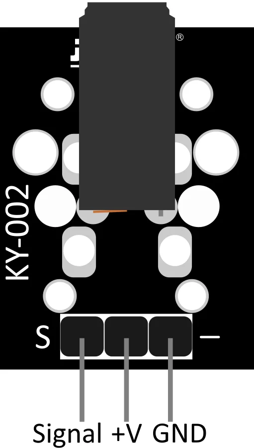](../../library/maker-media/af86e0e9688960106fe16d1163cecb1ff0a159ada61cfea2de1126950ee42ced.svg)

**pinout image** · Source image inspected; technical review pending

Manufacturer artwork; reproduction rights not established; not cleared for the printed book

## KY-004 Button

Joy-IT · Manufacturer documentation recorded

[Open full gallery](https://valleytech-black-wire-guide.pages.dev/?tab=makers&part=maker-joy-it-52321e6c2236)

[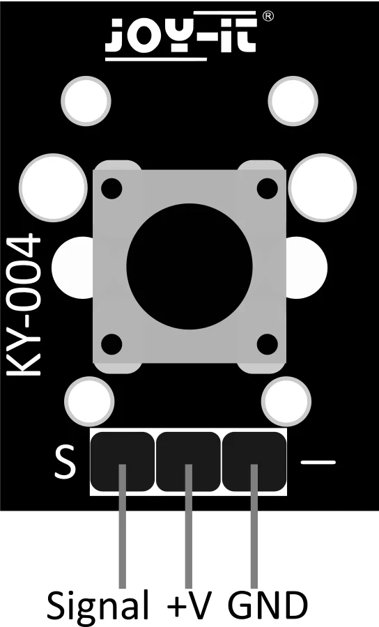](../../library/maker-media/7ebdf0cf4a42fc506db999e2a39ad80385bd9bb2cf2fc30b658aab8a1a681e3a.svg)

**pinout image** · Source image inspected; technical review pending

Manufacturer artwork; reproduction rights not established; not cleared for the printed book

## KY-017 Tilt switch

Joy-IT · Manufacturer documentation recorded

[Open full gallery](https://valleytech-black-wire-guide.pages.dev/?tab=makers&part=maker-joy-it-3a585fd9e9dc)

[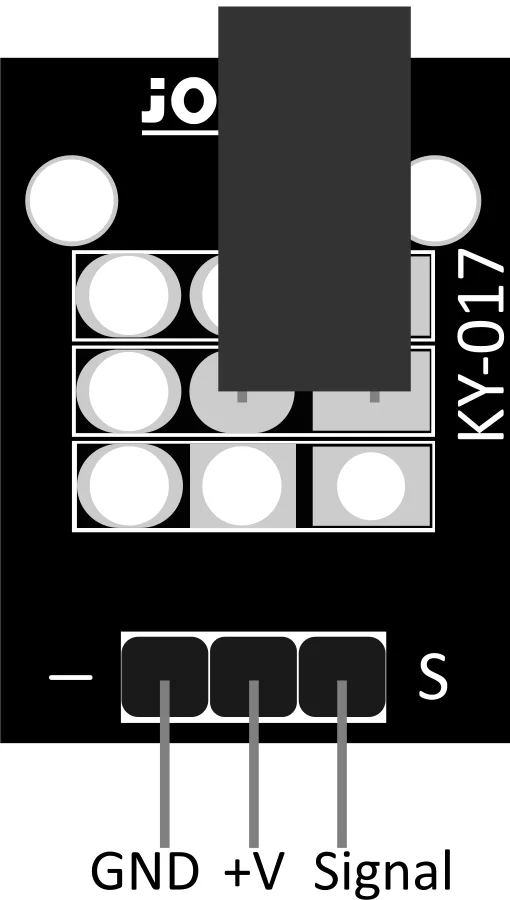](../../library/maker-media/fedcb80ea4b9f3cb6c42ae57c4670f7572fac2dc45f3d4a44871ed2d5af09671.svg)

**pinout image** · Source image inspected; technical review pending

Manufacturer artwork; reproduction rights not established; not cleared for the printed book

## KY-020 Tilt switch

Joy-IT · Manufacturer documentation recorded

[Open full gallery](https://valleytech-black-wire-guide.pages.dev/?tab=makers&part=maker-joy-it-1baa1dfaa7b5)

[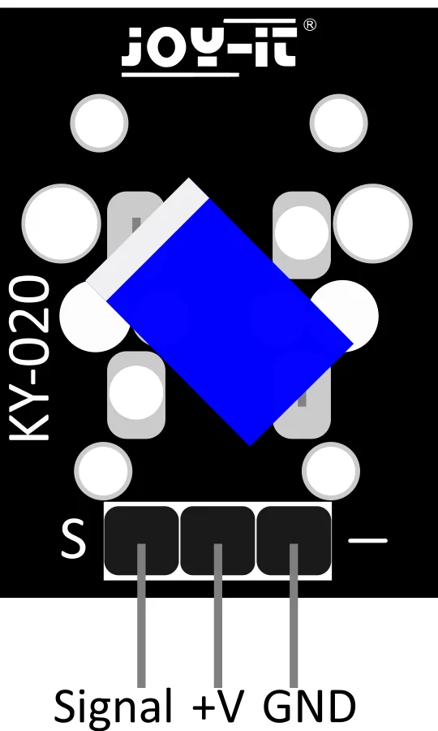](../../library/maker-media/8f27b728f9d5c0881a8b49e500beb6463440c996ef4e807fd3f7fc38736e7ec1.svg)

**pinout image** · Source image inspected; technical review pending

Manufacturer artwork; reproduction rights not established; not cleared for the printed book

## KY-023 Joystick (X-Y-Axis)

Joy-IT · Manufacturer documentation recorded

[Open full gallery](https://valleytech-black-wire-guide.pages.dev/?tab=makers&part=maker-joy-it-527879a218d8)

[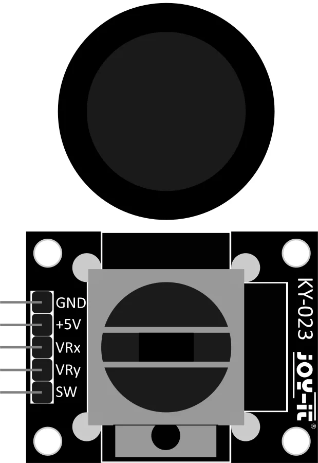](../../library/maker-media/6875fa8aac142020e23a075e1737fb9b938a444473e6193f2c24b1082a8a7f54.svg)

**pinout image** · Source image inspected; technical review pending

Manufacturer artwork; reproduction rights not established; not cleared for the printed book

## KY-036 Metal-touch sensor

Joy-IT · Manufacturer documentation recorded

[Open full gallery](https://valleytech-black-wire-guide.pages.dev/?tab=makers&part=maker-joy-it-e32b473dd46c)

[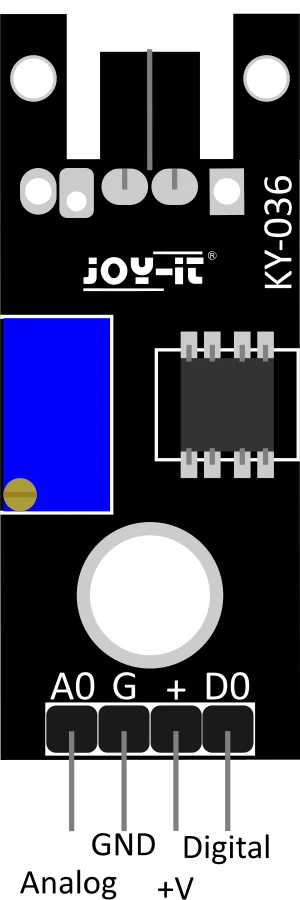](../../library/maker-media/0ed8026f531717838455a82ebe98cd78f4c677cc826d1a4b254631e77c3736e1.svg)

**pinout image** · Source image inspected; technical review pending

Manufacturer artwork; reproduction rights not established; not cleared for the printed book

## KY-040 Rotary encoder

Joy-IT · Manufacturer documentation recorded

[Open full gallery](https://valleytech-black-wire-guide.pages.dev/?tab=makers&part=maker-joy-it-d820c64e1242)

[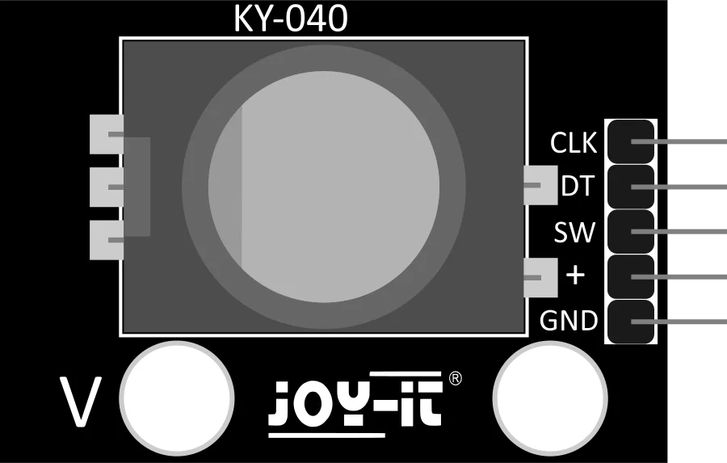](../../library/maker-media/7f544c1fdbafa5bd35441fe9b533fc10d8664eab39a73fc8c825893150d30dfa.svg)

**pinout image** · Source image inspected; technical review pending

Manufacturer artwork; reproduction rights not established; not cleared for the printed book

## KY-040 rotary encoder clones

Generic / manufacturer unconfirmed · Identification needed

[Open full gallery](https://valleytech-black-wire-guide.pages.dev/?tab=makers&part=maker-generic-ky-040-rotary-encoder-clones)

Matching image still needed.

## Mechanical pushbutton modules

Generic / manufacturer unconfirmed · Identification needed

[Open full gallery](https://valleytech-black-wire-guide.pages.dev/?tab=makers&part=maker-generic-mechanical-pushbutton-modules)

Matching image still needed.

## Module 4EncoderMotor

M5Stack · Source review pending

[Open full gallery](https://valleytech-black-wire-guide.pages.dev/?tab=makers&part=maker-existing-source-board-6e3dc9690edea8068a)

[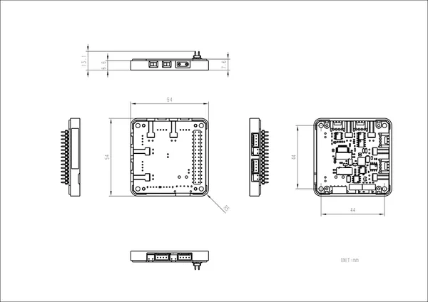](../../library/media/4c06c743519c55041f9b57233bb9526a89b7e91e2ab9943e531b12a910b894be.jpg)

**source reference** · Unreviewed source

Source rights not yet established

## Module 4EncoderMotor v1.1

M5Stack · Source review pending

[Open full gallery](https://valleytech-black-wire-guide.pages.dev/?tab=makers&part=maker-existing-source-board-a56f7ffa7285274433)

[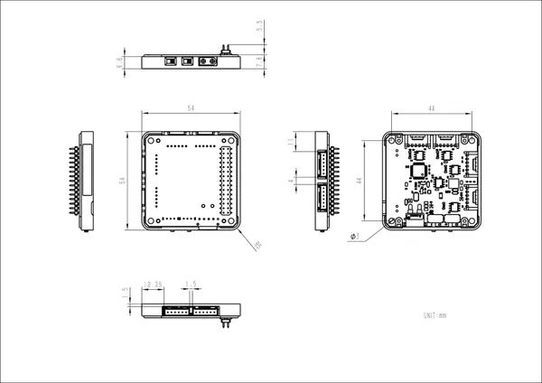](../../library/media/1ba1ed93ccad22f1db507cb14a751e71c29f8e6e484dfc549062ba6a8c38fd09.jpg)

**source reference** · Unreviewed source

Source rights not yet established

## Qwiic Twist Hookup Guide

SparkFun · Manufacturer documentation recorded

[Open full gallery](https://valleytech-black-wire-guide.pages.dev/?tab=makers&part=maker-sparkfun-986796aabfec)

[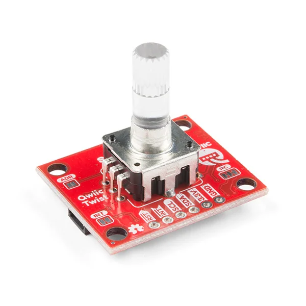](../../library/maker-media/7049d69b25b892cfd292eb082369bc1134b0d25943043efb53d819abb7db9fd4.jpg)

**source reference** · Source image inspected; technical review pending

Manufacturer artwork; reproduction rights not established; not cleared for the printed book

## SparkFun Qwiic Button Hookup Guide

SparkFun · Manufacturer documentation recorded

[Open full gallery](https://valleytech-black-wire-guide.pages.dev/?tab=makers&part=maker-sparkfun-6f14efd964ef)

[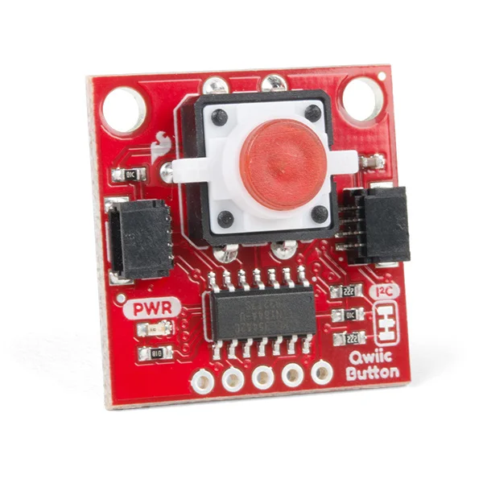](../../library/maker-media/fa780f53dfdfa7bebecb6132eb3ad6c5b054e0ea7b654f7a7ea23cf8e722ad9c.jpg)

**source reference** · Source image inspected; technical review pending

Manufacturer artwork; reproduction rights not established; not cleared for the printed book

## Unit 8Encoder

M5Stack · Source review pending

[Open full gallery](https://valleytech-black-wire-guide.pages.dev/?tab=makers&part=maker-existing-source-board-834f40b2126ac18fbc)

[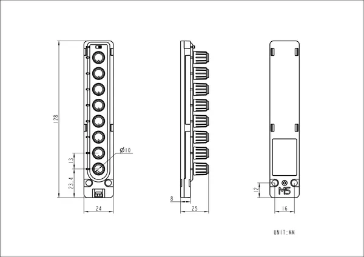](../../library/media/8f63277c68e8ff2d519ebe9f18c706ac5916f9a90e49c640b0b0dda91d5b61b3.png)

**source reference** · Unreviewed source

Source rights not yet established

## Unit Button

M5Stack · Source review pending

[Open full gallery](https://valleytech-black-wire-guide.pages.dev/?tab=makers&part=maker-existing-source-board-93f8f5b86b82e353c4)

[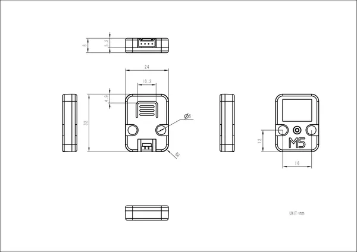](../../library/media/b88d91527a3aba43016d3cf21ee1e37485cce260fbfc5bd67376519530f4a3ad.png)

**source reference** · Unreviewed source

Source rights not yet established

## Unit ByteButton

M5Stack · Source review pending

[Open full gallery](https://valleytech-black-wire-guide.pages.dev/?tab=makers&part=maker-existing-source-board-a5c1c864be6e705563)

[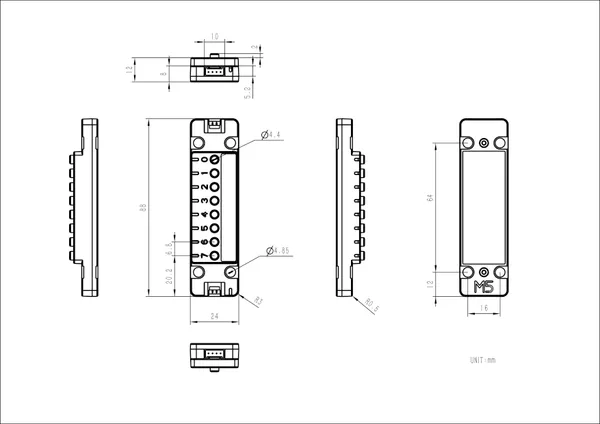](../../library/media/726d4c1e93a92d1ab904163f6af147a486be628adaf0c992e5160e1febb1d3e8.jpg)

**source reference** · Unreviewed source

Source rights not yet established

## Unit ByteSwitch

M5Stack · Source review pending

[Open full gallery](https://valleytech-black-wire-guide.pages.dev/?tab=makers&part=maker-existing-source-board-49a7e629a0418a8886)

[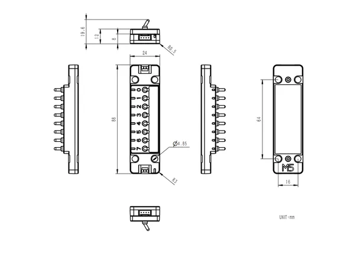](../../library/media/ee3e2cc03f7a9dd7c0600f4725e5214f14897f266e8f892b8bd42ee765e7c07d.png)

**source reference** · Unreviewed source

Source rights not yet established

## Unit CardKB

M5Stack · Source review pending

[Open full gallery](https://valleytech-black-wire-guide.pages.dev/?tab=makers&part=maker-existing-m5stack-expansion-unit-cardkb)

**GPIO reference image** · Reviewed source

Not established; source attribution retained

## Unit CardKB v1.1

M5Stack · Source review pending

[Open full gallery](https://valleytech-black-wire-guide.pages.dev/?tab=makers&part=maker-existing-m5stack-expansion-unit-cardkb-v1-1)

**GPIO reference image** · Reviewed source

Not established; source attribution retained

## Unit CardKB2

M5Stack · Source review pending

[Open full gallery](https://valleytech-black-wire-guide.pages.dev/?tab=makers&part=maker-existing-source-board-399179cf665cf2d916)

[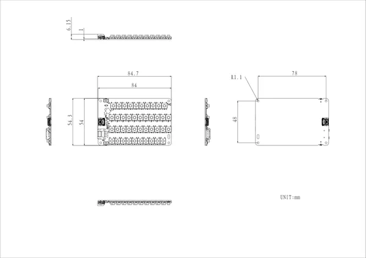](../../library/media/13739352e9fdb47e194847cec8767d9236fb57b5c02fd4df1d9f5c23ad805f62.png)

**source reference** · Unreviewed source

Source rights not yet established

## Unit Dual Button

M5Stack · Source review pending

[Open full gallery](https://valleytech-black-wire-guide.pages.dev/?tab=makers&part=maker-existing-source-board-943d0b181f92dbfc8e)

[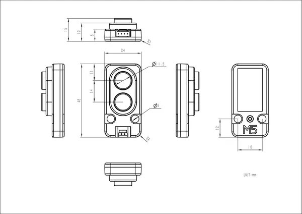](../../library/media/a295a259de010b359cd24d93f27f3997a417ae331165a7a3435260daae86f494.png)

**source reference** · Unreviewed source

Source rights not yet established

## Unit Encoder

M5Stack · Source review pending

[Open full gallery](https://valleytech-black-wire-guide.pages.dev/?tab=makers&part=maker-existing-source-board-a70dad63858e101475)

[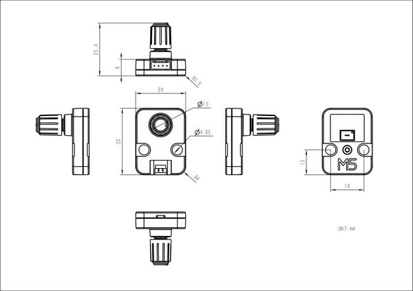](../../library/media/49e0f3c8a04b8765b9d745b405d81581b42afa11a9207aa8ba723f8a78b168d2.png)

**source reference** · Unreviewed source

Source rights not yet established

## Unit ExtEncoder

M5Stack · Source review pending

[Open full gallery](https://valleytech-black-wire-guide.pages.dev/?tab=makers&part=maker-existing-source-board-57db784a8a3386d537)

[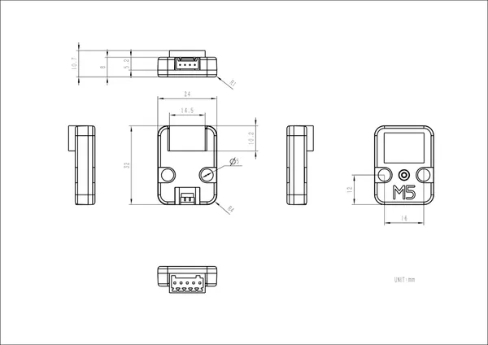](../../library/media/2ade64d0bda52f52453522b34884a9405b2db1f73e8057f381d7f1d1c37ffef4.jpg)

**source reference** · Unreviewed source

Source rights not yet established

## Unit Joystick v1.1

M5Stack · Source review pending

[Open full gallery](https://valleytech-black-wire-guide.pages.dev/?tab=makers&part=maker-existing-source-board-8b464318f392fbaf9c)

[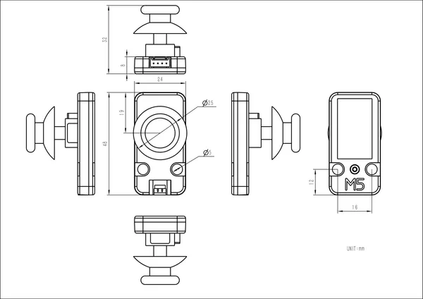](../../library/media/d49382277f3d0a02c9389752879fb8f1a9d03a8e63355782ce9a934ef95eff02.png)

**source reference** · Unreviewed source

Source rights not yet established

## Unit Joystick2

M5Stack · Source review pending

[Open full gallery](https://valleytech-black-wire-guide.pages.dev/?tab=makers&part=maker-existing-source-board-637ca1de735dc5e859)

[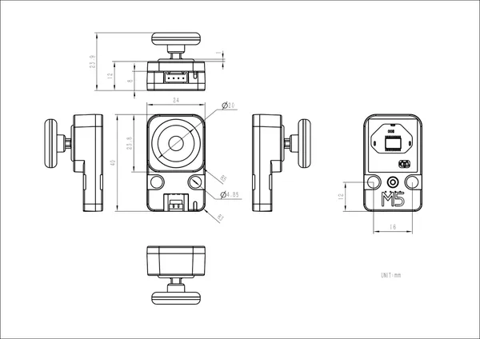](../../library/media/2acf99dafc31548996cd62313aa34252a006be1559ef7209b4be5af29997ce2b.jpg)

**source reference** · Unreviewed source

Source rights not yet established

## Xadow - Q Touch Sensor

Seeed Studio · Source review pending

[Open full gallery](https://valleytech-black-wire-guide.pages.dev/?tab=makers&part=maker-existing-source-board-3ed41ac2f7590b1856)

[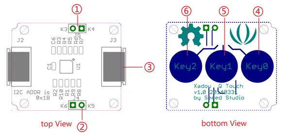](../../library/media/dc9bf600cce0416fa45e8b55cbecda146ecfe134599c492eba38801d87587d2d.png)

**source reference** · Unreviewed source

Source rights not yet established
