# Interface & expansion / visual references

[All categories](../../MAKER_VISUALS.md) · [Image attribution ledger](../../catalog/maker-attributions.json)

Manufacturer originals remain unchanged. Connector-model sheets add separately labeled callouts under the recorded source license. Check exact PCB/revision, source notes and rights before reuse. Photos and partial connector diagrams are not complete-device approvals.

## 3D Gesture Tracking Shield for Raspberry Pi (MGC3130)

Seeed Studio · Source review pending

[Open full gallery](https://valleytech-black-wire-guide.pages.dev/?tab=makers&part=maker-existing-seeed-studio-expansion-3d-gesture-tracking-shield-for-raspberry-pi-mgc3130)

**pinout image** · Reviewed source

Not established; source attribution retained

## 4-Channel 16-Bit ADC for Raspberry Pi (ADS1115)

Seeed Studio · Source review pending

[Open full gallery](https://valleytech-black-wire-guide.pages.dev/?tab=makers&part=maker-existing-seeed-studio-expansion-4-channel-16-bit-adc-for-raspberry-pi-ads1115)

[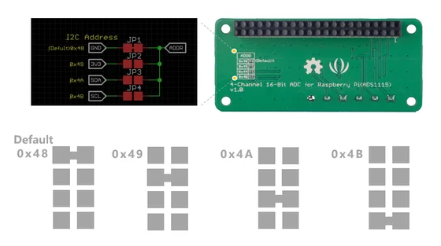](../../library/maker-media/0c7b66172d3e16f99d3395e2a1ca558e12955f83b403b47af0c1a5830ad7eac0.png)

**pinout image** · Connector diagram visually inspected; independent electrical review pending

Manufacturer source artwork. Reproduction rights not established; excluded from the printed book.

## Adafruit 2.8" TFT Touch Shield v2 - Capacitive or Resistive

Adafruit · Manufacturer documentation recorded

[Open full gallery](https://valleytech-black-wire-guide.pages.dev/?tab=makers&part=maker-adafruit-9b2288f1d41e)

[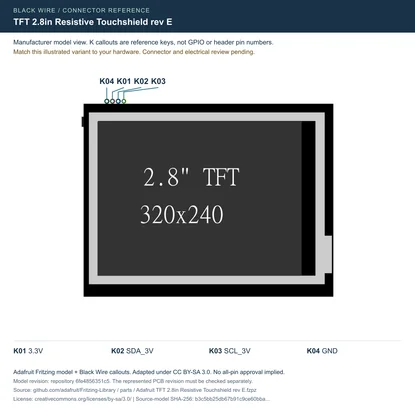](../../library/maker-media/04321298fd3d6821b61d6ecafe5f5ed7dec23d357d505bf739198edca1ed5e4d.svg)

**pinout image** · Manufacturer-model geometry checked; independent electrical and full-device review pending

Adafruit manufacturer illustration with Black Wire connector callouts, adapted under CC BY-SA 3.0. Attribution and share-alike terms apply to this sheet.

## Adafruit 4-Channel ADC Breakouts

Adafruit · Manufacturer documentation recorded

[Open full gallery](https://valleytech-black-wire-guide.pages.dev/?tab=makers&part=maker-adafruit-cda7bdb9542d)

[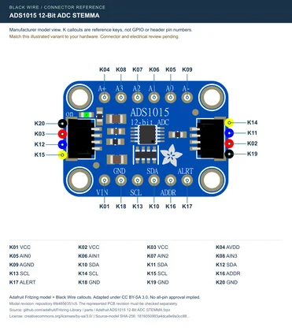](../../library/maker-media/dda0e0fa7fb8725794e2bda63ad58e62e7247cc04c99b83b2861aac5ea4dbab5.svg)

**pinout image** · Manufacturer-model geometry checked; independent electrical and full-device review pending

Adafruit manufacturer illustration with Black Wire connector callouts, adapted under CC BY-SA 3.0. Attribution and share-alike terms apply to this sheet.

## Adafruit DS3231 Precision RTC Breakout

Adafruit · Manufacturer documentation recorded

[Open full gallery](https://valleytech-black-wire-guide.pages.dev/?tab=makers&part=maker-adafruit-f3f7192319ed)

[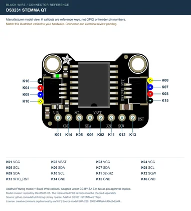](../../library/maker-media/40b6b7c511b9f346509262ad2038a86ae29b98a0eed2fb6e680a5e29dcfd4539.svg)

**pinout image** · Manufacturer-model geometry checked; independent electrical and full-device review pending

Adafruit manufacturer illustration with Black Wire connector callouts, adapted under CC BY-SA 3.0. Attribution and share-alike terms apply to this sheet.

## Adafruit MCP23017 I2C GPIO Expander

Adafruit · Manufacturer documentation recorded

[Open full gallery](https://valleytech-black-wire-guide.pages.dev/?tab=makers&part=maker-adafruit-0f530fade5b8)

[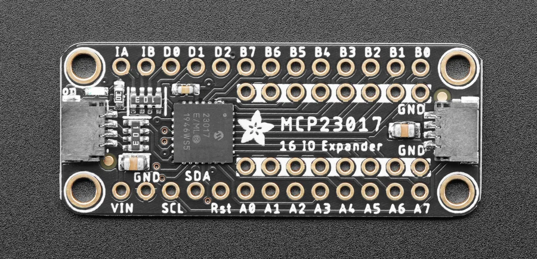](../../library/maker-media/5437e631ac1d058a1476e70aea58881b494fb8e24dcc0b058087add47b16f34e.png)

**source reference** · Source image inspected; technical review pending

Adafruit Industries / original asset contributor. https://creativecommons.org/licenses/by-sa/3.0/; original image unchanged. See linked asset page for creator and terms.

## Adafruit PCF8523 Real Time Clock

Adafruit · Manufacturer documentation recorded

[Open full gallery](https://valleytech-black-wire-guide.pages.dev/?tab=makers&part=maker-adafruit-4055f8db746a)

[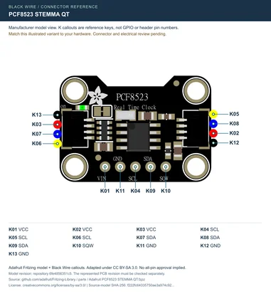](../../library/maker-media/77be73ad49f0dc96316fe5d604de9e207ed8a4c69d99ef6df0187147cce7fe71.svg)

**pinout image** · Manufacturer-model geometry checked; independent electrical and full-device review pending

Adafruit manufacturer illustration with Black Wire connector callouts, adapted under CC BY-SA 3.0. Attribution and share-alike terms apply to this sheet.

## Adafruit TCA9548A 1-to-8 I2C Multiplexer Breakout

Adafruit · Manufacturer documentation recorded

[Open full gallery](https://valleytech-black-wire-guide.pages.dev/?tab=makers&part=maker-adafruit-f85e5df8527b)

[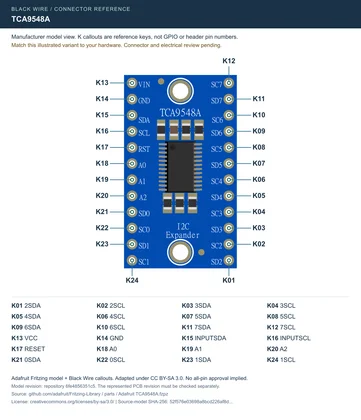](../../library/maker-media/93e6527827375483973e8a4ebde98801dee5f9bfd01cfe69fef5539877b7c461.svg)

**pinout image** · Manufacturer-model geometry checked; independent electrical and full-device review pending

Adafruit manufacturer illustration with Black Wire connector callouts, adapted under CC BY-SA 3.0. Attribution and share-alike terms apply to this sheet.

## Base Bottom

M5Stack · Source review pending

[Open full gallery](https://valleytech-black-wire-guide.pages.dev/?tab=makers&part=maker-existing-m5stack-expansion-base-bottom)

[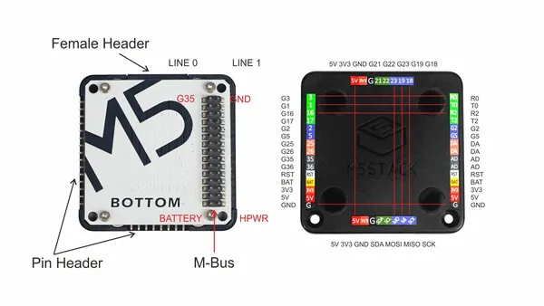](../../library/media/2d6cedf02e902fe8dfe4a7a7e1e4eb76a215dac78152bff1246ecd8d0d68e7be.png)

**pinout image** · Reviewed source

Not established; source attribution retained

## Breakout Garden Mini (I2C)

Pimoroni · Manufacturer documentation recorded

[Open full gallery](https://valleytech-black-wire-guide.pages.dev/?tab=makers&part=maker-pimoroni-9e49e0c90489)

[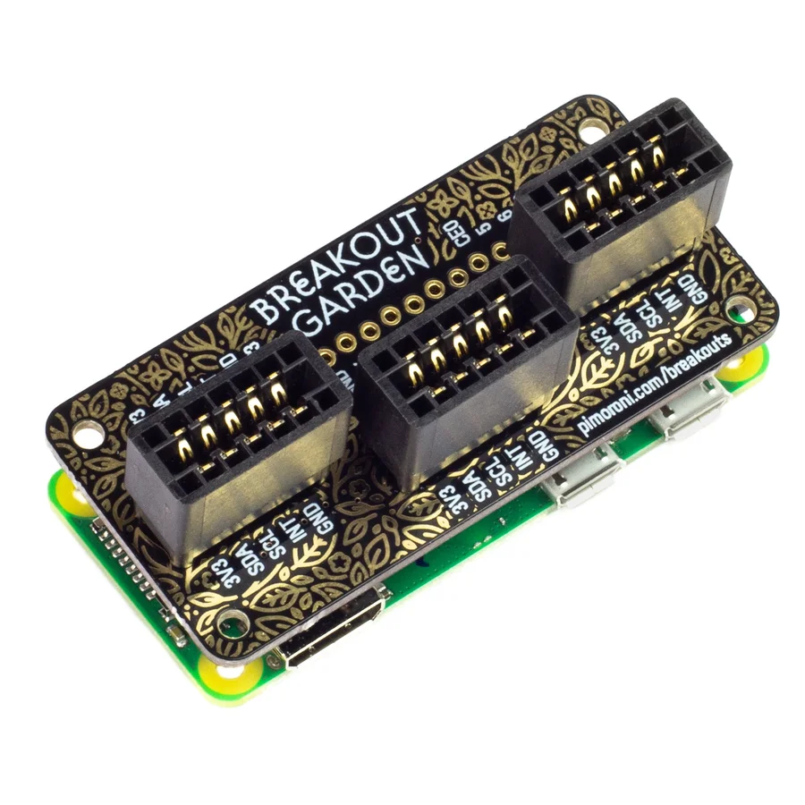](../../library/maker-media/5b5960b18af60b4c47d1b4df1d54a5898da343b8d944b4fb3825513b068481bb.jpg)

**identification photo** · Source image inspected; technical review pending

Manufacturer artwork; reproduction rights not established; not cleared for the printed book

## CAN-BUS Shield V1.2

Seeed Studio · Source review pending

[Open full gallery](https://valleytech-black-wire-guide.pages.dev/?tab=makers&part=maker-existing-seeed-studio-expansion-can-bus-shield-v1-2)

[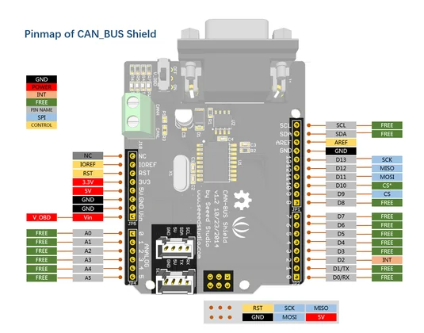](../../library/maker-media/c69c4e9d3a6ead96d4a424b6094d288b77785efa7dce1461adb899a6204df2c9.png)

**pinout image** · Connector diagram visually inspected; independent electrical review pending

Manufacturer source artwork. Reproduction rights not established; excluded from the printed book.

## DS1307 RTC for Raspberry Pi

Seeed Studio · Source review pending

[Open full gallery](https://valleytech-black-wire-guide.pages.dev/?tab=makers&part=maker-existing-seeed-studio-expansion-ds1307-rtc-for-raspberry-pi)

[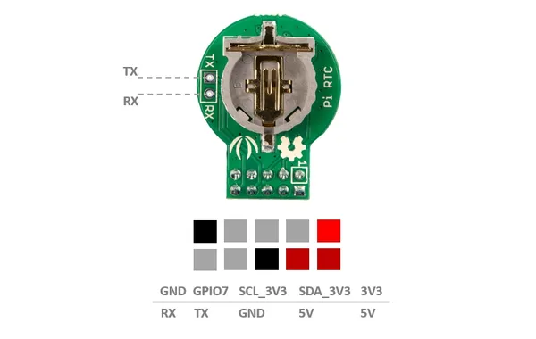](../../library/media/99ca455f6fa13f38cd99cf44758e273ea07b9b8ebe241309c53b012d4eb332d1.jpg)

**pinout image** · Reviewed source

Not established; source attribution retained

## DS3231 High Accuracy RTC for Raspberry Pi

Seeed Studio · Source review pending

[Open full gallery](https://valleytech-black-wire-guide.pages.dev/?tab=makers&part=maker-existing-seeed-studio-expansion-ds3231-high-accuracy-rtc-for-raspberry-pi)

[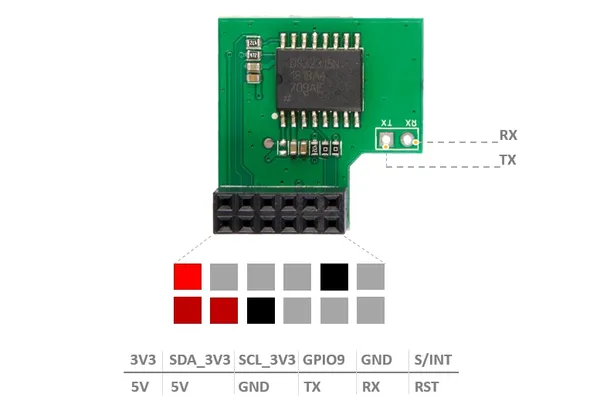](../../library/media/362fdee20ed35d9dd48ed39894926d1de5d3640922db0a41e93ffff7530b143a.jpg)

**pinout image** · Reviewed source

Not established; source attribution retained

## Expansion Board Base for XIAO

Seeed Studio · Source review pending

[Open full gallery](https://valleytech-black-wire-guide.pages.dev/?tab=makers&part=maker-existing-seeed-studio-expansion-expansion-board-base-for-xiao)

**pinout image** · Reviewed source

Not established; source attribution retained

## Gravity: I2C to Dual UART Module / DFR0627

DFRobot · Manufacturer documentation recorded

[Open full gallery](https://valleytech-black-wire-guide.pages.dev/?tab=makers&part=maker-dfrobot-46da4b20f4ef)

[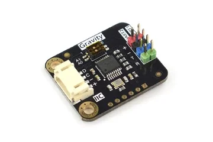](../../library/maker-media/46ef9b91d604cd935736672c2d424f5a15e759377e893b255834eeb2814fddc7.webp)

**identification photo** · Source image inspected; technical review pending

Manufacturer artwork; reproduction rights not established; not cleared for the printed book

## Grove - Base Shield for IOIO-OTG

Seeed Studio · Source review pending

[Open full gallery](https://valleytech-black-wire-guide.pages.dev/?tab=makers&part=maker-existing-source-board-c219ddbb601c475420)

[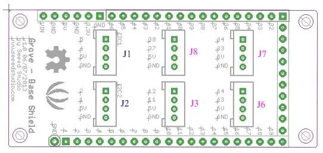](../../library/media/a6cbf18d6ed412da51a071cb11202e1e1b64f320c7f4aa15c68595b1b2bffd41.jpg)

**source reference** · Unreviewed source

Source rights not yet established

## Grove - Mega Shield

Seeed Studio · Source review pending

[Open full gallery](https://valleytech-black-wire-guide.pages.dev/?tab=makers&part=maker-existing-source-board-a4388d63a62bacb53d)

[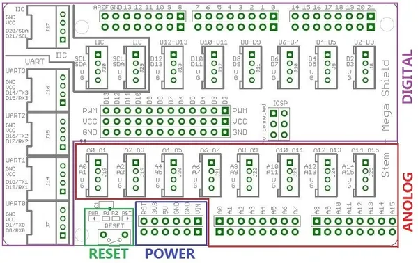](../../library/media/96a5222a4245be4cff0a59b345d85380a08bef8279d4a257cf8b4fa3de216a90.jpg)

**source reference** · Unreviewed source

Source rights not yet established

## Grove - Protoshield

Seeed Studio · Source review pending

[Open full gallery](https://valleytech-black-wire-guide.pages.dev/?tab=makers&part=maker-existing-source-board-9c816d9f975c7f0db0)

**source reference** · Unreviewed source

Source rights not yet established

## Grove Base BoosterPack

Seeed Studio · Source review pending

[Open full gallery](https://valleytech-black-wire-guide.pages.dev/?tab=makers&part=maker-existing-seeed-studio-expansion-grove-base-boosterpack)

[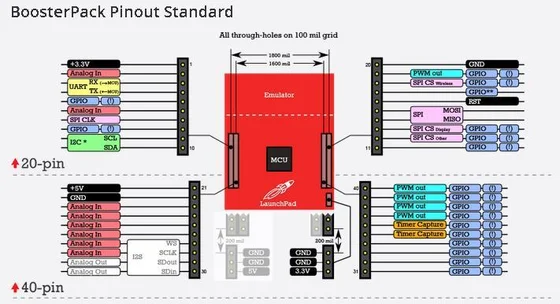](../../library/maker-media/f6f69b0b5e5a77e7dbb6bcd4dc6fc393b3fb9721825ce3a0b183fb210b84ccd8.jpg)

**pinout image** · Connector diagram visually inspected; independent electrical review pending

Manufacturer source artwork. Reproduction rights not established; excluded from the printed book.

## Grove Base Cape for BeagleBone V2

Seeed Studio · Source review pending

[Open full gallery](https://valleytech-black-wire-guide.pages.dev/?tab=makers&part=maker-existing-source-board-838efa674dcac12fa7)

**source reference** · Unreviewed source

Source rights not yet established

## Grove Base HAT

Seeed Studio · Source review pending

[Open full gallery](https://valleytech-black-wire-guide.pages.dev/?tab=makers&part=maker-existing-source-board-e3a347ef6612592656)

[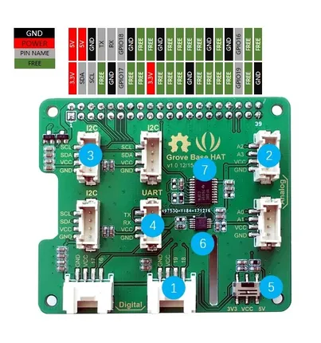](../../library/media/e606d8afde234ac620515f8ff021c54e1f713f0f93c095cc691024fa3130b335.jpg)

**source reference** · Unreviewed source

Source rights not yet established

## Grove Base Hat for Raspberry Pi

Seeed Studio · Source review pending

[Open full gallery](https://valleytech-black-wire-guide.pages.dev/?tab=makers&part=maker-existing-seeed-studio-expansion-grove-base-hat-for-raspberry-pi)

**board labeling image** · Reviewed source

Not established; source attribution retained

## Grove Base Hat for Raspberry Pi Zero

Seeed Studio · Source review pending

[Open full gallery](https://valleytech-black-wire-guide.pages.dev/?tab=makers&part=maker-existing-seeed-studio-expansion-grove-base-hat-for-raspberry-pi-zero)

[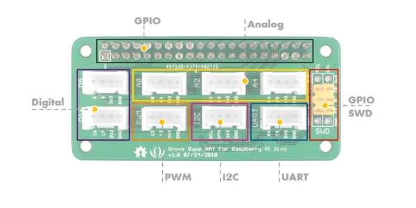](../../library/media/40ccae7bcc3a41d5cf83abcf07185d5013c915ae5a063e2a6b49bcd2177de5de.jpg)

**board labeling image** · Reviewed source

Not established; source attribution retained

## Grove Base Kit for Raspberry Pi

Seeed Studio · Source review pending

[Open full gallery](https://valleytech-black-wire-guide.pages.dev/?tab=makers&part=maker-existing-seeed-studio-expansion-grove-base-kit-for-raspberry-pi)

**board labeling image** · Reviewed source

Not established; source attribution retained

## Grove Base Shield for NodeMCU V1.0

Seeed Studio · Source review pending

[Open full gallery](https://valleytech-black-wire-guide.pages.dev/?tab=makers&part=maker-existing-source-board-df9b36454f16b53f6e)

**source reference** · Unreviewed source

Source rights not yet established

## Grove Base Shield for Photon

Seeed Studio · Source review pending

[Open full gallery](https://valleytech-black-wire-guide.pages.dev/?tab=makers&part=maker-existing-source-board-b5a886dc67e44a7a2a)

**source reference** · Unreviewed source

Source rights not yet established

## Grove Converter

M5Stack · Source review pending

[Open full gallery](https://valleytech-black-wire-guide.pages.dev/?tab=makers&part=maker-existing-source-board-6e4b9ee9a0f3979694)

**source reference** · Unreviewed source

Source rights not yet established

## Grove Shield for Arduino Nano

Seeed Studio · Source review pending

[Open full gallery](https://valleytech-black-wire-guide.pages.dev/?tab=makers&part=maker-existing-seeed-studio-expansion-grove-shield-for-arduino-nano)

[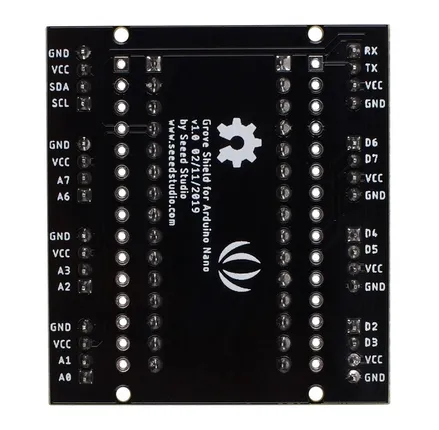](../../library/media/46e99c66ddfb0b1891833ca05a88bb778a47452bc1dc86b3513ec35ba0b432e6.jpg)

**board labeling image** · Reviewed source

Not established; source attribution retained

## Grove Shield for Intel Joule

Seeed Studio · Source review pending

[Open full gallery](https://valleytech-black-wire-guide.pages.dev/?tab=makers&part=maker-existing-source-board-39a2114c0a0f24ce52)

[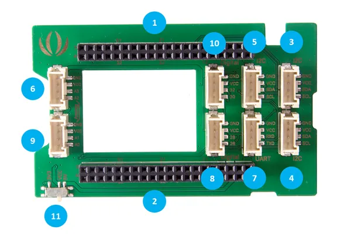](../../library/media/8ed5758b721de099fcb61e7f61874a84c1a54386d93e87268d5623cbe10516ce.png)

**source reference** · Unreviewed source

Source rights not yet established

## Grove Shield for Pi Pico V1.0

Seeed Studio · Source review pending

[Open full gallery](https://valleytech-black-wire-guide.pages.dev/?tab=makers&part=maker-existing-seeed-studio-expansion-grove-shield-for-pi-pico-v1-0)

**board labeling image** · Reviewed source

Not established; source attribution retained

## Grove Shield for Wio Lite

Seeed Studio · Source review pending

[Open full gallery](https://valleytech-black-wire-guide.pages.dev/?tab=makers&part=maker-existing-seeed-studio-expansion-grove-shield-for-wio-lite)

[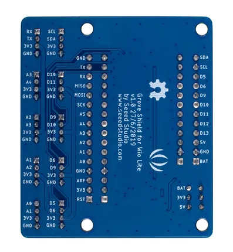](../../library/media/4048bbbc72ddb62653d7cf1d85effddc65cdfe72a5fd8f4cdd4b1148bd5f9f0c.jpg)

**board labeling image** · Reviewed source

Not established; source attribution retained

## Grove Shield for XIAO

Seeed Studio · Source review pending

[Open full gallery](https://valleytech-black-wire-guide.pages.dev/?tab=makers&part=maker-existing-seeed-studio-expansion-grove-shield-for-xiao)

[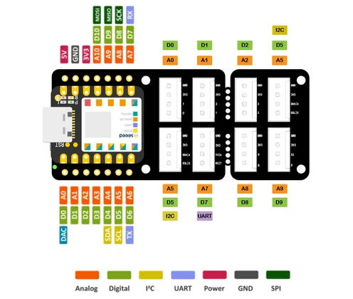](../../library/maker-media/32932e35556f8d69a71012fae9d4d51605479340408988814bfd522009ed659e.png)

**pinout image** · Connector diagram visually inspected; independent electrical review pending

Manufacturer source artwork. Reproduction rights not established; excluded from the printed book.

## KY-051 Voltage Translator / Level Shifter

Joy-IT · Manufacturer documentation recorded

[Open full gallery](https://valleytech-black-wire-guide.pages.dev/?tab=makers&part=maker-joy-it-7d34ebf8c5e0)

[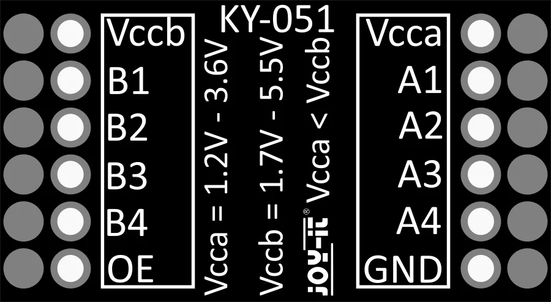](../../library/maker-media/b8717e4b1b53256371ac19d563c1b1688b6c496a7ac9f6ae05cd0a8689f7da29.svg)

**pinout image** · Source image inspected; technical review pending

Manufacturer artwork; reproduction rights not established; not cleared for the printed book

## KY-053 Analog Digital Converter

Joy-IT · Manufacturer documentation recorded

[Open full gallery](https://valleytech-black-wire-guide.pages.dev/?tab=makers&part=maker-joy-it-1f772d976a4c)

[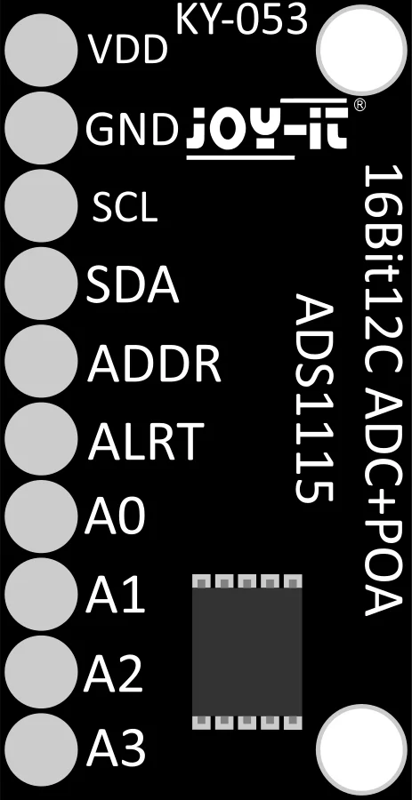](../../library/maker-media/0ed8f265ac13911abe4ac37fc0a2064050793611a03cc3d676a11545b5d7cc30.svg)

**pinout image** · Source image inspected; technical review pending

Manufacturer artwork; reproduction rights not established; not cleared for the printed book

## MCP4725 12-Bit DAC Tutorial

Adafruit · Manufacturer documentation recorded

[Open full gallery](https://valleytech-black-wire-guide.pages.dev/?tab=makers&part=maker-adafruit-fa8225e29b1c)

[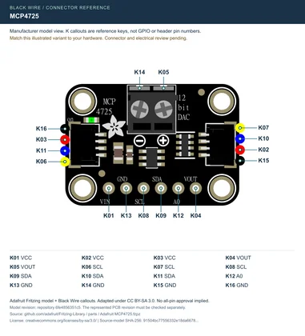](../../library/maker-media/a57577a651ea01199062b525de63b41f0f9ac1eddf65ef54f1d4bd8194457934.svg)

**pinout image** · Manufacturer-model geometry checked; independent electrical and full-device review pending

Adafruit manufacturer illustration with Black Wire connector callouts, adapted under CC BY-SA 3.0. Attribution and share-alike terms apply to this sheet.

## MicroSD SPI breakout variants

Generic / manufacturer unconfirmed · Identification needed

[Open full gallery](https://valleytech-black-wire-guide.pages.dev/?tab=makers&part=maker-generic-microsd-spi-breakout-variants)

Matching image still needed.

## MT3620 Grove Shield

Seeed Studio · Source review pending

[Open full gallery](https://valleytech-black-wire-guide.pages.dev/?tab=makers&part=maker-existing-source-board-9411f7846292008faf)

**source reference** · Unreviewed source

Source rights not yet established

## PCF8574 LCD backpack variants

Generic / manufacturer unconfirmed · Identification needed

[Open full gallery](https://valleytech-black-wire-guide.pages.dev/?tab=makers&part=maker-generic-pcf8574-lcd-backpack-variants)

Matching image still needed.

## RS-232 To TTL Converter (MAX3232IDR)

Seeed Studio · Source review pending

[Open full gallery](https://valleytech-black-wire-guide.pages.dev/?tab=makers&part=maker-existing-seeed-studio-expansion-rs-232-to-ttl-converter-max3232idr)

[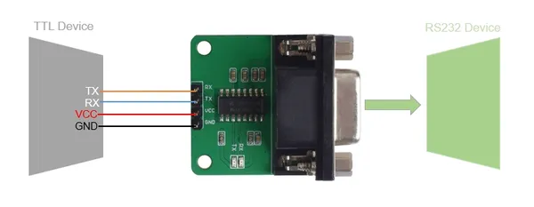](../../library/media/d18a0a25c984aaea84187be894cdc5eac3395e7b39b81e2094b52be8d8d3ee42.jpg)

**pinout image** · Reviewed source

Not established; source attribution retained

## RS-485 Shield for Raspberry Pi

Seeed Studio · Source review pending

[Open full gallery](https://valleytech-black-wire-guide.pages.dev/?tab=makers&part=maker-existing-seeed-studio-expansion-rs-485-shield-for-raspberry-pi)

**board labeling image** · Reviewed source

Not established; source attribution retained

## SD Card Shield

Seeed Studio · Source review pending

[Open full gallery](https://valleytech-black-wire-guide.pages.dev/?tab=makers&part=maker-existing-seeed-studio-expansion-sd-card-shield)

**board labeling image** · Reviewed source

Not established; source attribution retained

## UartSB Frame

Seeed Studio · Source review pending

[Open full gallery](https://valleytech-black-wire-guide.pages.dev/?tab=makers&part=maker-existing-seeed-studio-expansion-uartsb-frame)

**pinout image** · Reviewed source

Not established; source attribution retained

## UartSBee V3.1

Seeed Studio · Source review pending

[Open full gallery](https://valleytech-black-wire-guide.pages.dev/?tab=makers&part=maker-existing-seeed-studio-expansion-uartsbee-v3-1)

**pinout image** · Reviewed source

Not established; source attribution retained

## UartSBee V4

Seeed Studio · Source review pending

[Open full gallery](https://valleytech-black-wire-guide.pages.dev/?tab=makers&part=maker-existing-seeed-studio-expansion-uartsbee-v4)

**pinout image** · Reviewed source

Not established; source attribution retained

## Unit ADC

M5Stack · Source review pending

[Open full gallery](https://valleytech-black-wire-guide.pages.dev/?tab=makers&part=maker-existing-source-board-0cbb8cb1ff28e5754b)

[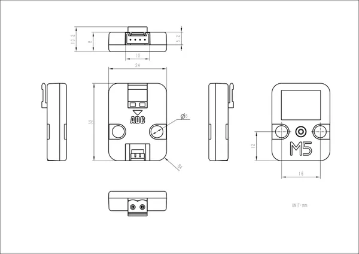](../../library/media/c52b852e63c00eecc7e5e051582bd3665aa927bacf06e8cc1f97eef4fe952875.jpg)

**source reference** · Unreviewed source

Source rights not yet established

## Unit DAC

M5Stack · Source review pending

[Open full gallery](https://valleytech-black-wire-guide.pages.dev/?tab=makers&part=maker-existing-source-board-8ce1cf3d0ee0a51ed1)

**source reference** · Unreviewed source

Source rights not yet established

## Unit DAC2

M5Stack · Source review pending

[Open full gallery](https://valleytech-black-wire-guide.pages.dev/?tab=makers&part=maker-existing-source-board-18ed5c1f767cc2e793)

**source reference** · Unreviewed source

Source rights not yet established

## Unit Hub

M5Stack · Source review pending

[Open full gallery](https://valleytech-black-wire-guide.pages.dev/?tab=makers&part=maker-existing-source-board-ec1ecab334af3f64bb)

[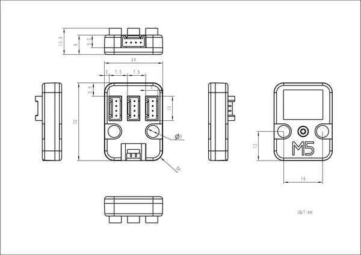](../../library/media/b4c285343b02b7a26e2d5d0eb1fd9d969cce357ec1ed5c15c49f0c86937cec9b.png)

**source reference** · Unreviewed source

Source rights not yet established

## Unit PaHub

M5Stack · Source review pending

[Open full gallery](https://valleytech-black-wire-guide.pages.dev/?tab=makers&part=maker-existing-source-board-ba9e5f605961dcedee)

**source reference** · Unreviewed source

Source rights not yet established

## Unit PaHub v2.1

M5Stack · Source review pending

[Open full gallery](https://valleytech-black-wire-guide.pages.dev/?tab=makers&part=maker-existing-source-board-2d9e671dd6280fac66)

**source reference** · Unreviewed source

Source rights not yet established

## Unit PbHub

M5Stack · Source review pending

[Open full gallery](https://valleytech-black-wire-guide.pages.dev/?tab=makers&part=maker-existing-m5stack-expansion-unit-pbhub)

**GPIO reference image** · Reviewed source

Not established; source attribution retained

## Wifi Shield V1.2

Seeed Studio · Source review pending

[Open full gallery](https://valleytech-black-wire-guide.pages.dev/?tab=makers&part=maker-existing-seeed-studio-expansion-wifi-shield-v1-2)

[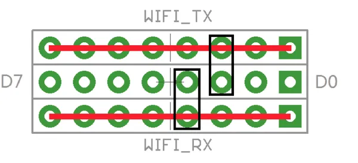](../../library/media/2e0488f098fb989697474caa82b63e4fde6043ab544328cfea74d0ab72cdfad9.png)

**pinout image** · Reviewed source

Not established; source attribution retained

## Wifi Shield V2.0

Seeed Studio · Source review pending

[Open full gallery](https://valleytech-black-wire-guide.pages.dev/?tab=makers&part=maker-existing-seeed-studio-expansion-wifi-shield-v2-0)

[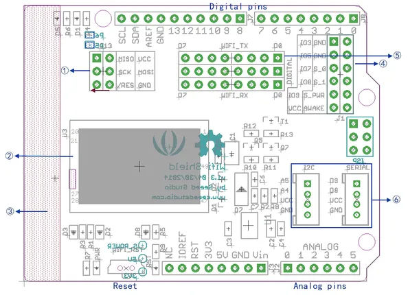](../../library/media/5129dbf1b8025cd56676d0442c1b0dfb3e2a548759ce8f2519eac0b5ada0c958.png)

**pinout image** · Reviewed source

Not established; source attribution retained

## XBee Shield

Seeed Studio · Source review pending

[Open full gallery](https://valleytech-black-wire-guide.pages.dev/?tab=makers&part=maker-existing-seeed-studio-expansion-xbee-shield)

[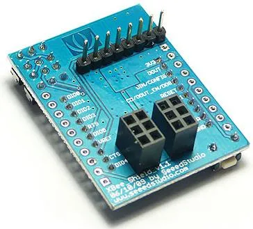](../../library/media/8d96b2abad686dc150e7632e6685503d29ccfcd4eece74c33f503838ddbed01e.jpg)

**board labeling image** · Reviewed source

Not established; source attribution retained
