# Other modules / visual references

[All categories](../../MAKER_VISUALS.md) · [Image attribution ledger](../../catalog/maker-attributions.json)

Manufacturer originals remain unchanged. Connector-model sheets add separately labeled callouts under the recorded source license. Check exact PCB/revision, source notes and rights before reuse. Photos and partial connector diagrams are not complete-device approvals.

## Atomic Port ABC Base

M5Stack · Source review pending

[Open full gallery](https://valleytech-black-wire-guide.pages.dev/?tab=makers&part=maker-existing-m5stack-expansion-atomic-port-abc-base)

**pinout image** · Reviewed source

Not established; source attribution retained

## Butterfly Launcher

M5Stack · Source review pending

[Open full gallery](https://valleytech-black-wire-guide.pages.dev/?tab=makers&part=maker-existing-m5stack-expansion-butterfly-launcher)

**GPIO reference image** · Reviewed source

Not established; source attribution retained

## DDSM210

Waveshare · Source review pending

[Open full gallery](https://valleytech-black-wire-guide.pages.dev/?tab=makers&part=maker-existing-waveshare-expansion-ddsm210)

**pinout image** · Reviewed source

Not established; source attribution retained

## DDSM315

Waveshare · Source review pending

[Open full gallery](https://valleytech-black-wire-guide.pages.dev/?tab=makers&part=maker-existing-waveshare-expansion-ddsm315)

[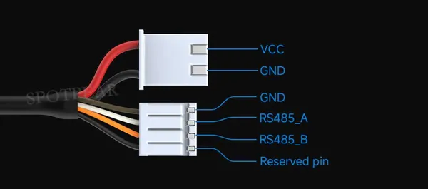](../../library/media/0b3282c33e264c6a5cd4198673deb04c9a4902106bd67c05c4708b994b208045.jpg)

**pinout image** · Reviewed source

Not established; source attribution retained

## Faces Calculator

M5Stack · Source review pending

[Open full gallery](https://valleytech-black-wire-guide.pages.dev/?tab=makers&part=maker-existing-m5stack-expansion-faces-calculator)

**GPIO reference image** · Reviewed source

Not established; source attribution retained

## Faces Gamepad

M5Stack · Source review pending

[Open full gallery](https://valleytech-black-wire-guide.pages.dev/?tab=makers&part=maker-existing-m5stack-expansion-faces-gamepad)

**GPIO reference image** · Reviewed source

Not established; source attribution retained

## Grove - Joint V2.0

Seeed Studio · Source review pending

[Open full gallery](https://valleytech-black-wire-guide.pages.dev/?tab=makers&part=maker-existing-source-board-5fc752650eb8ceacc3)

**source reference** · Unreviewed source

Source rights not yet established

## Grove - Node

Seeed Studio · Source review pending

[Open full gallery](https://valleytech-black-wire-guide.pages.dev/?tab=makers&part=maker-existing-source-board-a17635f8ee434814e3)

**source reference** · Unreviewed source

Source rights not yet established

## Grove - Wio-E5

Seeed Studio · Source review pending

[Open full gallery](https://valleytech-black-wire-guide.pages.dev/?tab=makers&part=maker-existing-source-board-4a797fd4d0f753b7e3)

[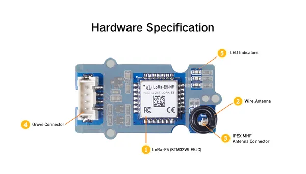](../../library/media/33be6f3413b8992c1f2eccda9d8b0f7d97d0f9f277044833d5f76aff0a4579f7.png)

**source reference** · Unreviewed source

Source rights not yet established

## Grove - XBee Carrier

Seeed Studio · Source review pending

[Open full gallery](https://valleytech-black-wire-guide.pages.dev/?tab=makers&part=maker-existing-source-board-8b0e3f03922c352347)

[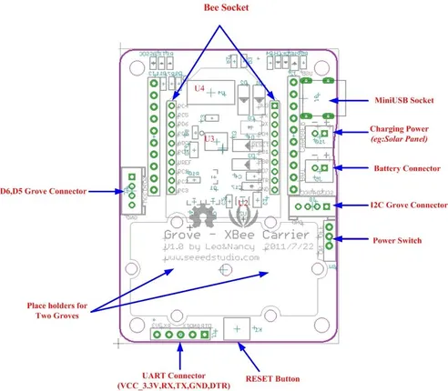](../../library/media/ca318b7f8c87dca292c0313193cbde14e17c27cdacc9a0d2fcb9cc9dbce4c751.jpg)

**source reference** · Unreviewed source

Source rights not yet established

## Grove AI HAT for Edge Computing

Seeed Studio · Source review pending

[Open full gallery](https://valleytech-black-wire-guide.pages.dev/?tab=makers&part=maker-existing-source-board-8669627ca0e540609e)

[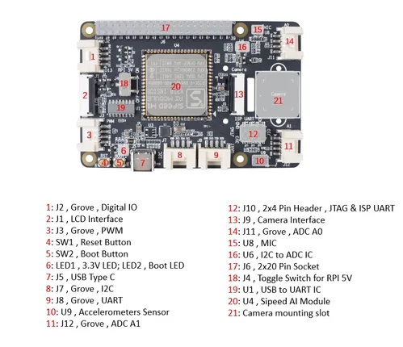](../../library/media/291ee4d8e7345d1446e5e5d46b3010baed7a49db547a9539818ba9b9171bb992.jpg)

**source reference** · Unreviewed source

Source rights not yet established

## Grove Basic Kit for Raspberry Pi Pico

Seeed Studio · Source review pending

[Open full gallery](https://valleytech-black-wire-guide.pages.dev/?tab=makers&part=maker-existing-seeed-studio-expansion-grove-basic-kit-for-raspberry-pi-pico)

[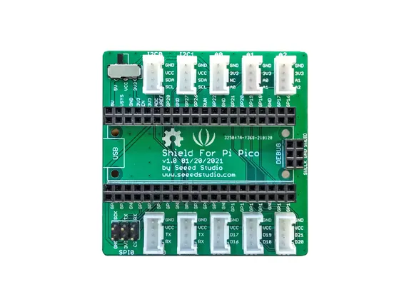](../../library/media/103a2bfabefd52a7e57bd5d3903abd4a5900c1728ce32bdd6e248cff47e77579.png)

**board labeling image** · Reviewed source

Not established; source attribution retained

## Grove Beginner Kit for Arduino

Seeed Studio · Source review pending

[Open full gallery](https://valleytech-black-wire-guide.pages.dev/?tab=makers&part=maker-existing-source-board-f3ba78f8e9b88aa08e)

[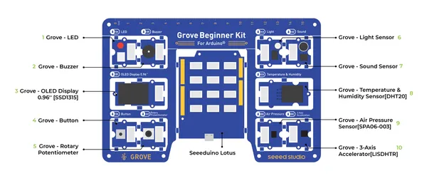](../../library/media/d42de7286f0ce69d281ce25e171aea1c982767fba8498a84dab751be2de00480.png)

**source reference** · Unreviewed source

Source rights not yet established

## Grove Breakout for LinkIt Smart 7688 Duo

Seeed Studio · Source review pending

[Open full gallery](https://valleytech-black-wire-guide.pages.dev/?tab=makers&part=maker-existing-source-board-fe6e96ae8e667278de)

**source reference** · Unreviewed source

Source rights not yet established

## Grove Cape for BeagleBone Series

Seeed Studio · Source review pending

[Open full gallery](https://valleytech-black-wire-guide.pages.dev/?tab=makers&part=maker-existing-source-board-8f6616a53c6803d732)

[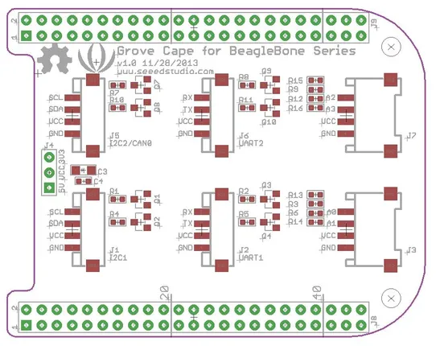](../../library/media/46908fe823339edbaa187a4fbbafbc6036babe1f4d9ecc309748433f3ef7dbdd.jpg)

**source reference** · Unreviewed source

Source rights not yet established

## Grove Starter Kit for Azure Sphere MT3620 Development Kit

Seeed Studio · Source review pending

[Open full gallery](https://valleytech-black-wire-guide.pages.dev/?tab=makers&part=maker-existing-source-board-16121f72660f3c5746)

[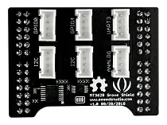](../../library/media/2351223f684eef6625163d8ccd237bddfd4719f33eed31f79f70c044b809c6fb.jpg)

**source reference** · Unreviewed source

Source rights not yet established

## Grove T

M5Stack · Source review pending

[Open full gallery](https://valleytech-black-wire-guide.pages.dev/?tab=makers&part=maker-existing-source-board-da76e277a8985719d4)

[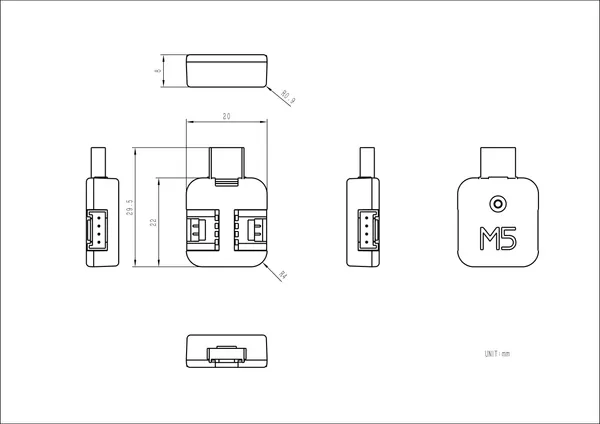](../../library/media/c4a103965bd31841a1aae11ff67d5477170721ca0952cfec5617d507f4396b7e.png)

**source reference** · Unreviewed source

Source rights not yet established

## Grove to 4P

M5Stack · Source review pending

[Open full gallery](https://valleytech-black-wire-guide.pages.dev/?tab=makers&part=maker-existing-source-board-8b7bc8abf33e9365fe)

[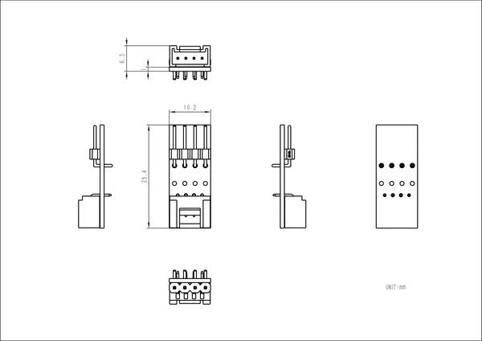](../../library/media/69919a789863153e77addecf5f14859b6a668fcd21d80c8da99056804871325f.png)

**source reference** · Unreviewed source

Source rights not yet established

## Grove to Grove

M5Stack · Source review pending

[Open full gallery](https://valleytech-black-wire-guide.pages.dev/?tab=makers&part=maker-existing-source-board-8cb9bff718fbbf41b6)

[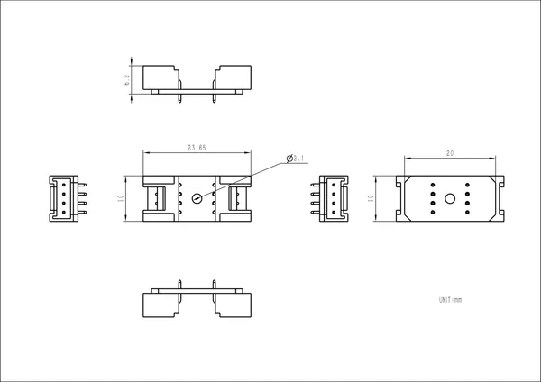](../../library/media/e2e5963be82595fb3351da7fc014e1a30cc8a3bcf4f6d7d4303d862857fd4fd3.png)

**source reference** · Unreviewed source

Source rights not yet established

## Grove to PIN

M5Stack · Source review pending

[Open full gallery](https://valleytech-black-wire-guide.pages.dev/?tab=makers&part=maker-existing-source-board-cc0272832d61950412)

[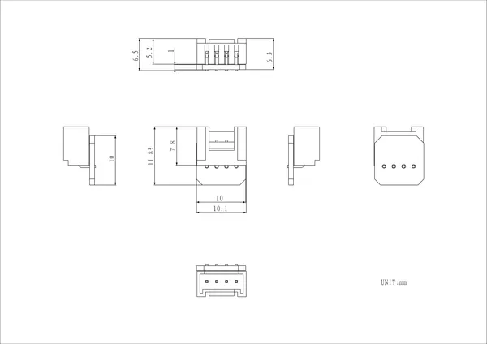](../../library/media/ec82183129a5d52dd287abe9f4c5e84c0c31f20c59ffa75d6f63ec63ce94e67f.png)

**source reference** · Unreviewed source

Source rights not yet established

## Grove to USBC

M5Stack · Source review pending

[Open full gallery](https://valleytech-black-wire-guide.pages.dev/?tab=makers&part=maker-existing-source-board-1a18c2638cb34d6a64)

[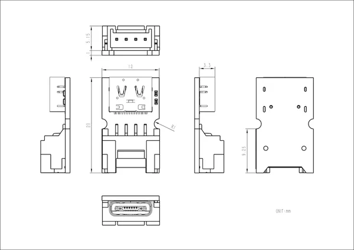](../../library/media/ca3419df82ce723f6976979ac971e045955af898c4cd7fe2533bc8cdd35cae40.jpg)

**source reference** · Unreviewed source

Source rights not yet established

## Grove Vision AI Module

Seeed Studio · Source review pending

[Open full gallery](https://valleytech-black-wire-guide.pages.dev/?tab=makers&part=maker-existing-source-board-2eef993ff78502144a)

[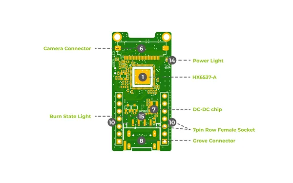](../../library/media/3f90e3238468ec1b18213545b174df534c2a0b836c85d878fa6e3496be9ecca4.png)

**source reference** · Unreviewed source

Source rights not yet established

## Grove Vision AI Module V2

Seeed Studio · Source review pending

[Open full gallery](https://valleytech-black-wire-guide.pages.dev/?tab=makers&part=maker-existing-source-board-26f61aaf24516ca6f8)

**source reference** · Unreviewed source

Source rights not yet established

## Laser-450nm-5W driver

Spotpear (manufacturer unconfirmed) · Source review pending

[Open full gallery](https://valleytech-black-wire-guide.pages.dev/?tab=makers&part=maker-existing-spotpear-manufacturer-unconfirmed-expansion-laser-450nm-5w-driver)

[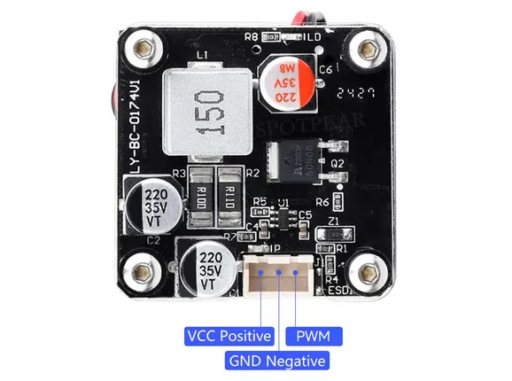](../../library/media/c81f409e5fb6e91cf353b23a81008dc5aec797093fb5faf6dc81ecd0bcc38cc5.jpg)

**pinout image** · Reviewed source

Not established; source attribution retained

## LTE Cat 1 Pi HAT

Seeed Studio · Source review pending

[Open full gallery](https://valleytech-black-wire-guide.pages.dev/?tab=makers&part=maker-existing-seeed-studio-expansion-lte-cat-1-pi-hat)

[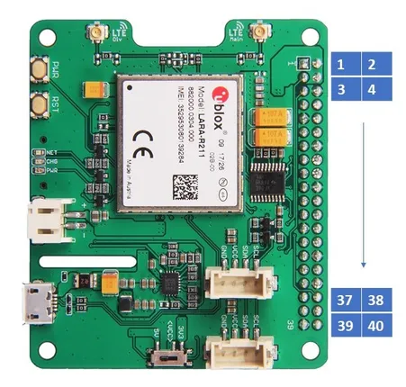](../../library/media/60b951b23b11de46f476066fb30cbe649660d99e9976ce0445cf83dd7902c4dc.jpg)

**board labeling image** · Reviewed source

Not established; source attribution retained

## Module Air Quality

M5Stack · Source review pending

[Open full gallery](https://valleytech-black-wire-guide.pages.dev/?tab=makers&part=maker-existing-source-board-3b299715f598234f5a)

**source reference** · Unreviewed source

Source rights not yet established

## Module ASR

M5Stack · Source review pending

[Open full gallery](https://valleytech-black-wire-guide.pages.dev/?tab=makers&part=maker-existing-source-board-30d9237b1f6dcddf5c)

**source reference** · Unreviewed source

Source rights not yet established

## Module Audio

M5Stack · Source review pending

[Open full gallery](https://valleytech-black-wire-guide.pages.dev/?tab=makers&part=maker-existing-m5stack-expansion-module-audio)

[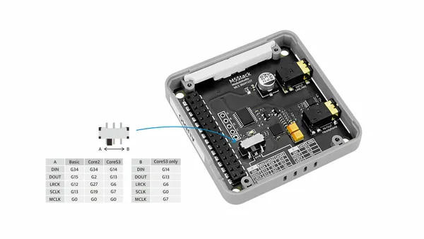](../../library/media/a95cc380fa0ae8a7deb825a810458bd80055a98257659207630bc34cc9a42c93.jpg)

**pinout image** · Reviewed source

Not established; source attribution retained

## Module Bus

M5Stack · Source review pending

[Open full gallery](https://valleytech-black-wire-guide.pages.dev/?tab=makers&part=maker-existing-source-board-4a5f789a23ee2fe5d5)

**source reference** · Unreviewed source

Source rights not yet established

## Module CC1101

M5Stack · Source review pending

[Open full gallery](https://valleytech-black-wire-guide.pages.dev/?tab=makers&part=maker-existing-source-board-27ec83602a0e893308)

**source reference** · Unreviewed source

Source rights not yet established

## Module COMMU

M5Stack · Source review pending

[Open full gallery](https://valleytech-black-wire-guide.pages.dev/?tab=makers&part=maker-existing-source-board-83e8ae5da6a0f34206)

[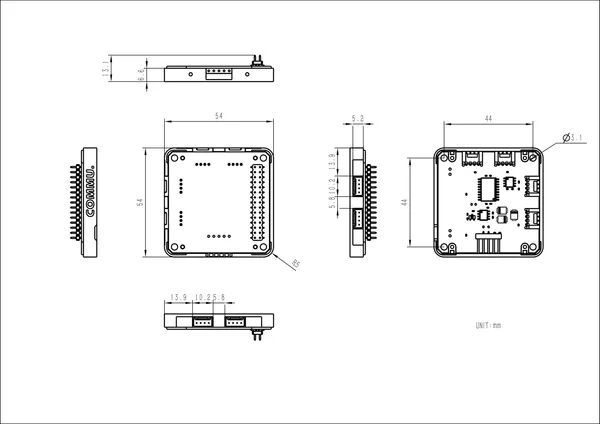](../../library/media/a2e01fab409126dc4d82195e6373d4f879b8bc4ddad4425817e974e47b394243.png)

**source reference** · Unreviewed source

Source rights not yet established

## Module COMX Cat1

M5Stack · Source review pending

[Open full gallery](https://valleytech-black-wire-guide.pages.dev/?tab=makers&part=maker-existing-source-board-a3728068228391b3e1)

[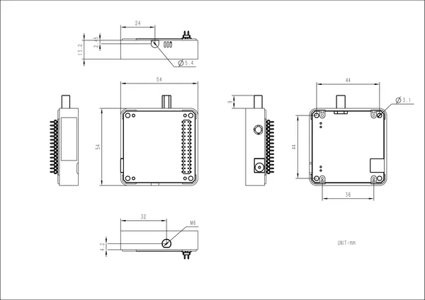](../../library/media/2290a740d4736447f1d752e58006b47034a100e41135c15b6745b812b33be4b2.png)

**source reference** · Unreviewed source

Source rights not yet established

## Module ExtPort For Core2

M5Stack · Source review pending

[Open full gallery](https://valleytech-black-wire-guide.pages.dev/?tab=makers&part=maker-existing-source-board-c560ffe2964a48351a)

**source reference** · Unreviewed source

Source rights not yet established

## Module Fan v1.1

M5Stack · Source review pending

[Open full gallery](https://valleytech-black-wire-guide.pages.dev/?tab=makers&part=maker-existing-source-board-95f3859b605dab0a85)

**source reference** · Unreviewed source

Source rights not yet established

## Module Gateway H2

M5Stack · Source review pending

[Open full gallery](https://valleytech-black-wire-guide.pages.dev/?tab=makers&part=maker-existing-source-board-c6c79d67f42fa85245)

[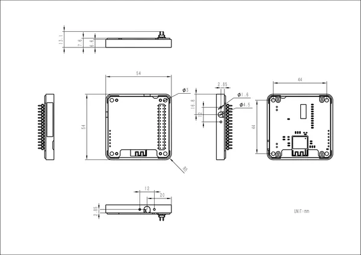](../../library/media/c38efe0889125ed86ec98d316920655f141facc936a50666c46aeb527092227c.png)

**source reference** · Unreviewed source

Source rights not yet established

## Module GoPlus

M5Stack · Source review pending

[Open full gallery](https://valleytech-black-wire-guide.pages.dev/?tab=makers&part=maker-existing-m5stack-expansion-module-goplus)

**GPIO reference image** · Reviewed source

Not established; source attribution retained

## Module HMI

M5Stack · Source review pending

[Open full gallery](https://valleytech-black-wire-guide.pages.dev/?tab=makers&part=maker-existing-source-board-05507662d78ca9da33)

[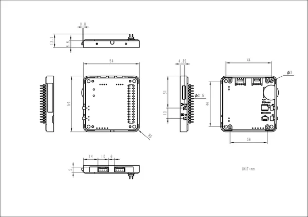](../../library/media/76a23afe4edd1c00de7f038a33815b391fef63142115a35ed1b15b58bfcc09e0.png)

**source reference** · Unreviewed source

Source rights not yet established

## Module LLM

M5Stack · Source review pending

[Open full gallery](https://valleytech-black-wire-guide.pages.dev/?tab=makers&part=maker-existing-m5stack-expansion-module-llm)

**pinout image** · Reviewed source

Not established; source attribution retained

## Module LLM Kit

M5Stack · Source review pending

[Open full gallery](https://valleytech-black-wire-guide.pages.dev/?tab=makers&part=maker-existing-m5stack-expansion-module-llm-kit)

**pinout image** · Reviewed source

Not established; source attribution retained

## Module Plus

M5Stack · Source review pending

[Open full gallery](https://valleytech-black-wire-guide.pages.dev/?tab=makers&part=maker-existing-m5stack-expansion-module-plus)

**GPIO reference image** · Reviewed source

Not established; source attribution retained

## Module Proto

M5Stack · Source review pending

[Open full gallery](https://valleytech-black-wire-guide.pages.dev/?tab=makers&part=maker-existing-source-board-f09cfb45256c52238e)

**source reference** · Unreviewed source

Source rights not yet established

## Module Proto Frame

M5Stack · Source review pending

[Open full gallery](https://valleytech-black-wire-guide.pages.dev/?tab=makers&part=maker-existing-source-board-b481048324688ec6c4)

[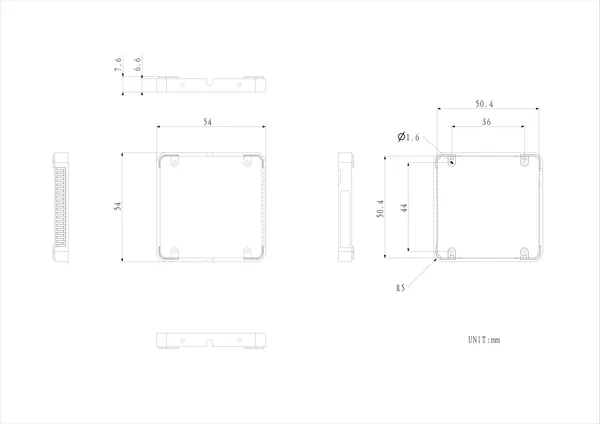](../../library/media/667cd2759fd0e8ade4d7555877622bf62dbf5052a36667fe1cd5a53889dec443.png)

**source reference** · Unreviewed source

Source rights not yet established

## Module USB v1.2

M5Stack · Source review pending

[Open full gallery](https://valleytech-black-wire-guide.pages.dev/?tab=makers&part=maker-existing-m5stack-expansion-module-usb-v1-2)

**GPIO reference image** · Reviewed source

Not established; source attribution retained

## Module13.2 LAN

M5Stack · Source review pending

[Open full gallery](https://valleytech-black-wire-guide.pages.dev/?tab=makers&part=maker-existing-m5stack-expansion-module13-2-lan)

[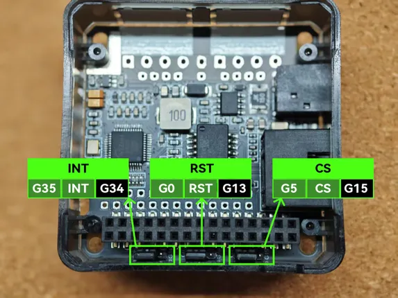](../../library/media/673be65512a92b4543eff73255b9ef4ede1262f132a79bc40b0c2e570ef803a6.png)

**pinout image** · Reviewed source

Not established; source attribution retained

## Module13.2 PwrCAN

M5Stack · Source review pending

[Open full gallery](https://valleytech-black-wire-guide.pages.dev/?tab=makers&part=maker-existing-m5stack-expansion-module13-2-pwrcan)

[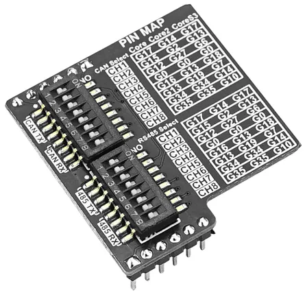](../../library/media/db793dbaa8bb1213a6809544158369f6bbe7af8c54ecc98084ecd04c6e9d4e91.png)

**pinout image** · Reviewed source

Not established; source attribution retained

## MT3620 Grove Breakout

Seeed Studio · Source review pending

[Open full gallery](https://valleytech-black-wire-guide.pages.dev/?tab=makers&part=maker-existing-seeed-studio-expansion-mt3620-grove-breakout)

[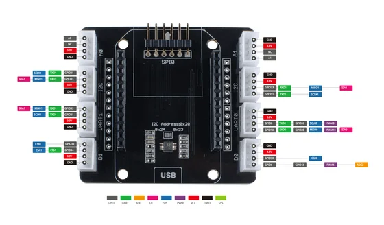](../../library/maker-media/17ab6d5a8f63d22a76067f8e06599d3146ffa16afe0816be5760b7a2ad6dfbf1.png)

**pinout image** · Connector diagram visually inspected; independent electrical review pending

Manufacturer source artwork. Reproduction rights not established; excluded from the printed book.

## PCIe TO MiniPCIe GbE USB3.2 HAT Plus

Waveshare · Source review pending

[Open full gallery](https://valleytech-black-wire-guide.pages.dev/?tab=makers&part=maker-existing-waveshare-expansion-pcie-to-minipcie-gbe-usb3-2-hat-plus)

**pinout image** · Reviewed source

Not established; source attribution retained

## RAK19001

RAKwireless · Source review pending

[Open full gallery](https://valleytech-black-wire-guide.pages.dev/?tab=makers&part=maker-existing-rakwireless-expansion-rak19001)

**board labeling image** · Reviewed source

Not established; source attribution retained

## RAK19003

RAKwireless · Source review pending

[Open full gallery](https://valleytech-black-wire-guide.pages.dev/?tab=makers&part=maker-existing-rakwireless-expansion-rak19003)

**pinout image** · Reviewed source

Not established; source attribution retained

## RAK19007

RAKwireless · Source review pending

[Open full gallery](https://valleytech-black-wire-guide.pages.dev/?tab=makers&part=maker-existing-rakwireless-expansion-rak19007)

Matching image still needed.

## RAK5005-O

RAKwireless · Source review pending

[Open full gallery](https://valleytech-black-wire-guide.pages.dev/?tab=makers&part=maker-existing-rakwireless-expansion-rak5005-o)

**pinout image** · Reviewed source

Not established; source attribution retained

## reSpeaker Lite

Seeed Studio · Source review pending

[Open full gallery](https://valleytech-black-wire-guide.pages.dev/?tab=makers&part=maker-existing-seeed-studio-expansion-respeaker-lite)

[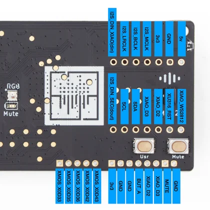](../../library/maker-media/e870fcf94eeb62567f1a9c9c06538329cf75bd12dc29d95bef8408a016aa67f8.png)

**pinout image** · Connector diagram visually inspected; independent electrical review pending

Manufacturer source artwork. Reproduction rights not established; excluded from the printed book.

## reSpeaker XVF3800 USB 4-Mic Array

Seeed Studio · Source review pending

[Open full gallery](https://valleytech-black-wire-guide.pages.dev/?tab=makers&part=maker-existing-seeed-studio-expansion-respeaker-xvf3800-usb-4-mic-array)

[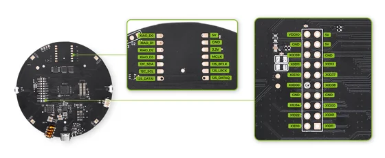](../../library/maker-media/4fc0169086ad6cb9715473df13d84986f65f0d931166109c23609a32f1c51f75.jpg)

**pinout image** · Connector diagram visually inspected; independent electrical review pending

Manufacturer source artwork. Reproduction rights not established; excluded from the printed book.

## RS485 Expansion Board for XIAO

Seeed Studio · Source review pending

[Open full gallery](https://valleytech-black-wire-guide.pages.dev/?tab=makers&part=maker-existing-seeed-studio-expansion-rs485-expansion-board-for-xiao)

[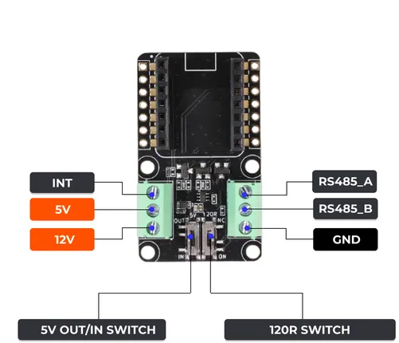](../../library/media/88e71425a3ef079f2cdbe69f9db31e3df7f6fb237a570bd3d8264a027dfa2cd3.png)

**pinout image** · Reviewed source

Not established; source attribution retained

## Stamp-AddOn C6 For P4

M5Stack · Source review pending

[Open full gallery](https://valleytech-black-wire-guide.pages.dev/?tab=makers&part=maker-existing-m5stack-expansion-stamp-addon-c6-for-p4)

**pinout image** · Reviewed source

Not established; source attribution retained

## Stamp-AddOn Cam0308

M5Stack · Source review pending

[Open full gallery](https://valleytech-black-wire-guide.pages.dev/?tab=makers&part=maker-existing-m5stack-expansion-stamp-addon-cam0308)

[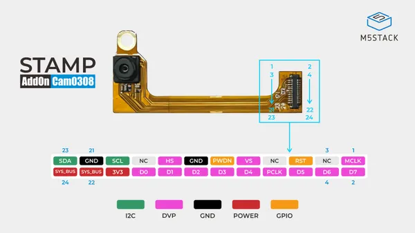](../../library/media/2bcadb6f753a6e980a83ae5da55a4a2807d09d2052fb83a003db8fd1633cfe93.jpg)

**pinout image** · Reviewed source

Not established; source attribution retained

## Stamp-AddOn Cam3660

M5Stack · Source review pending

[Open full gallery](https://valleytech-black-wire-guide.pages.dev/?tab=makers&part=maker-existing-m5stack-expansion-stamp-addon-cam3660)

[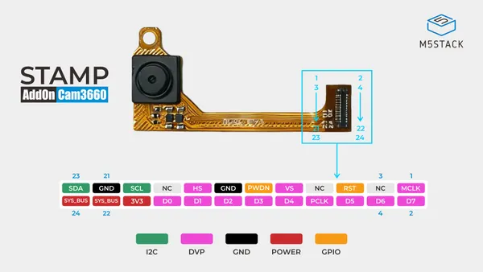](../../library/media/34252e3c7c7a921a0cdd431ababe79d32197e3b8e58786951ddd426476f3914b.jpg)

**pinout image** · Reviewed source

Not established; source attribution retained

## T-U2T

LILYGO · Source review pending

[Open full gallery](https://valleytech-black-wire-guide.pages.dev/?tab=makers&part=maker-existing-lilygo-expansion-t-u2t)

[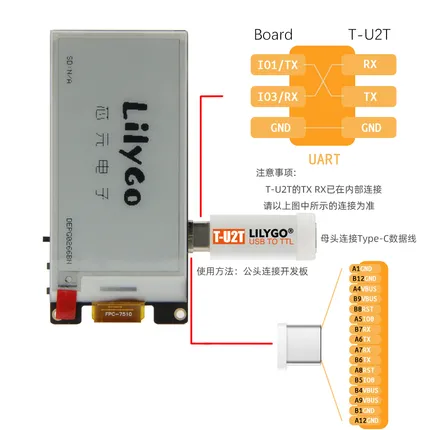](../../library/media/14ac4b37f22a38ba802e7ac7bdcd618163d44853ee79eef4c913f0bba04fe023.jpg)

**pinout image** · Reviewed source

Not established; source attribution retained

## Unit 3.96

M5Stack · Source review pending

[Open full gallery](https://valleytech-black-wire-guide.pages.dev/?tab=makers&part=maker-existing-source-board-11aeaf594ae1cec034)

**source reference** · Unreviewed source

Source rights not yet established

## Unit 8Angle

M5Stack · Source review pending

[Open full gallery](https://valleytech-black-wire-guide.pages.dev/?tab=makers&part=maker-existing-source-board-0711046c6ae397d072)

[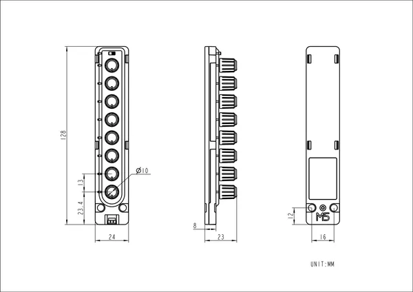](../../library/media/71a87e3d887632dc42c7390a37b841afb194f984aa9c7db2b56bbdb3eb671e2d.png)

**source reference** · Unreviewed source

Source rights not yet established

## Unit AC Measure

M5Stack · Source review pending

[Open full gallery](https://valleytech-black-wire-guide.pages.dev/?tab=makers&part=maker-existing-m5stack-expansion-unit-ac-measure)

**GPIO reference image** · Reviewed source

Not established; source attribution retained

## Unit Accel

M5Stack · Source review pending

[Open full gallery](https://valleytech-black-wire-guide.pages.dev/?tab=makers&part=maker-existing-source-board-c9be29dd4aabd2546e)

[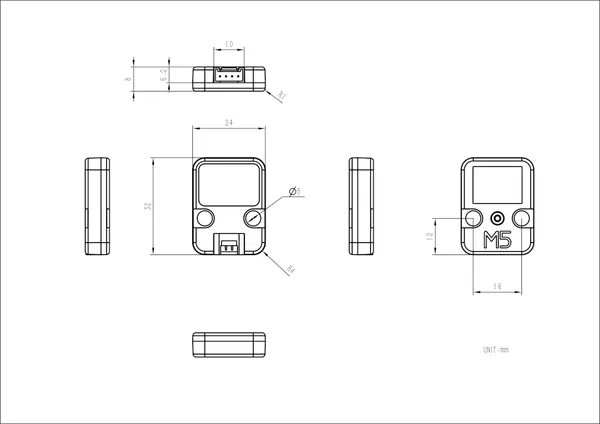](../../library/media/e749d4158272a2c050a2ead49ed72402b301bf7f259353fbbc39c81c3033a6be.jpg)

**source reference** · Unreviewed source

Source rights not yet established

## Unit ACSSR

M5Stack · Source review pending

[Open full gallery](https://valleytech-black-wire-guide.pages.dev/?tab=makers&part=maker-existing-source-board-5ed3e9384fdd5e49f7)

[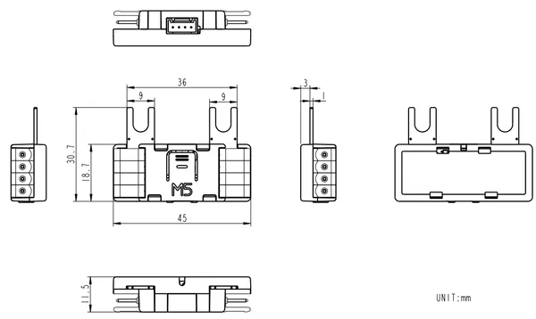](../../library/media/73c94732b217e29d79280cc83eda480def5f822602a28b55839dcfffa3600a63.png)

**source reference** · Unreviewed source

Source rights not yet established

## Unit AIN4-20mA

M5Stack · Source review pending

[Open full gallery](https://valleytech-black-wire-guide.pages.dev/?tab=makers&part=maker-existing-source-board-6f842c1018055cc899)

[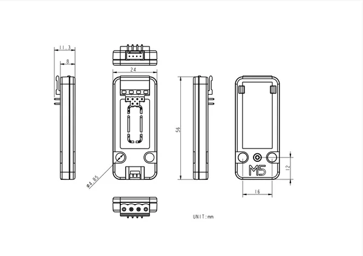](../../library/media/aef65710d24e865c916ae7abfcc11c36c4d8178e6bdac043a1e46fc6098ef592.png)

**source reference** · Unreviewed source

Source rights not yet established

## Unit AMeter

M5Stack · Source review pending

[Open full gallery](https://valleytech-black-wire-guide.pages.dev/?tab=makers&part=maker-existing-source-board-a7f71367218db84e3a)

**source reference** · Unreviewed source

Source rights not yet established

## Unit Angle

M5Stack · Source review pending

[Open full gallery](https://valleytech-black-wire-guide.pages.dev/?tab=makers&part=maker-existing-source-board-17bd07bc39eefffb8d)

[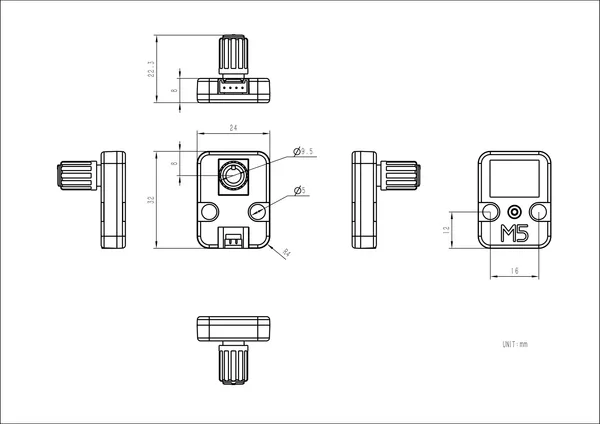](../../library/media/04f501deb4394853a90dcb775e2b461b5077f2d5023a7928db552fa83ef96180.png)

**source reference** · Unreviewed source

Source rights not yet established

## Unit ASR

M5Stack · Source review pending

[Open full gallery](https://valleytech-black-wire-guide.pages.dev/?tab=makers&part=maker-existing-source-board-8d4a15e405a597d1dd)

[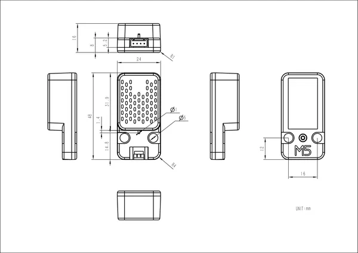](../../library/media/de3c76b3e206e6068ab751dac39bd99d01f503741415d3ef538539091c2ca636.png)

**source reference** · Unreviewed source

Source rights not yet established

## Unit AudioPlayer

M5Stack · Source review pending

[Open full gallery](https://valleytech-black-wire-guide.pages.dev/?tab=makers&part=maker-existing-source-board-5beb5c4cbdf08dc7a4)

[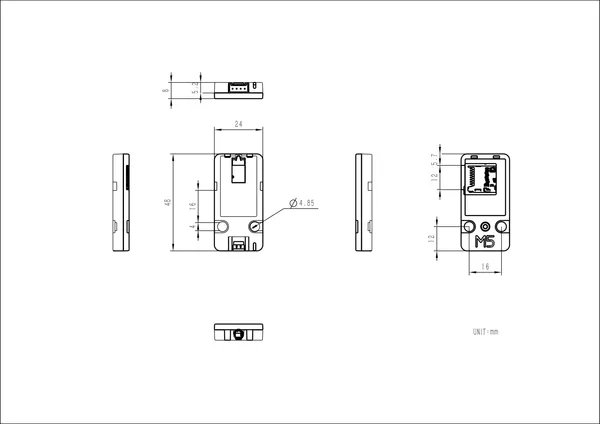](../../library/media/e88d02fb388f92133a41bf3b359628f4fce6b7c8fe394c7b7c115e91f05d7f76.png)

**source reference** · Unreviewed source

Source rights not yet established

## Unit BLDC Driver

M5Stack · Source review pending

[Open full gallery](https://valleytech-black-wire-guide.pages.dev/?tab=makers&part=maker-existing-source-board-a428555279fa49793a)

[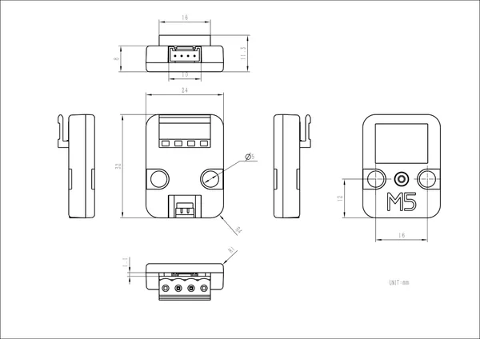](../../library/media/7b1dbdac1fa4595940594466f5632e57e567b577b0a05100d5b4be5e8d945296.jpg)

**source reference** · Unreviewed source

Source rights not yet established

## Unit C6L

M5Stack · Source review pending

[Open full gallery](https://valleytech-black-wire-guide.pages.dev/?tab=makers&part=maker-existing-source-board-4cbd9ff0b6a21ef607)

[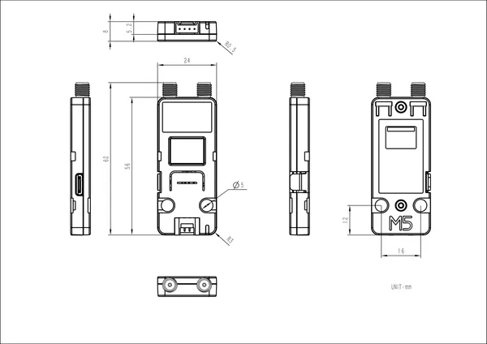](../../library/media/ff6c76245b8a6290bf18b5e76b23eae2f9314f1c7865c3067a3b296ee1f1d9ca.png)

**source reference** · Unreviewed source

Source rights not yet established

## Unit Camera

M5Stack · Source review pending

[Open full gallery](https://valleytech-black-wire-guide.pages.dev/?tab=makers&part=maker-existing-source-board-833dff9546137267f1)

[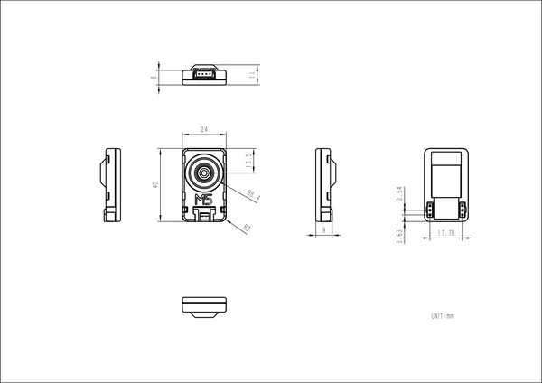](../../library/media/53e4f07eecfaf24f9a7742536ad36e42e3e941b9652f6160a98f2b19b2f96f47.png)

**source reference** · Unreviewed source

Source rights not yet established

## Unit CamS3

M5Stack · Source review pending

[Open full gallery](https://valleytech-black-wire-guide.pages.dev/?tab=makers&part=maker-existing-source-board-83b053da889c2603e0)

[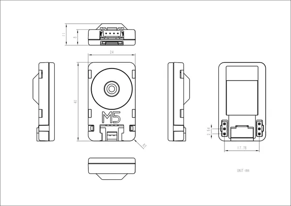](../../library/media/0348f0a36ee6758d338f4e2b60d0116131db848288219b795478988f9fe7572e.jpg)

**source reference** · Unreviewed source

Source rights not yet established

## Unit Cat1-CN

M5Stack · Source review pending

[Open full gallery](https://valleytech-black-wire-guide.pages.dev/?tab=makers&part=maker-existing-source-board-d282e51761a64c9876)

[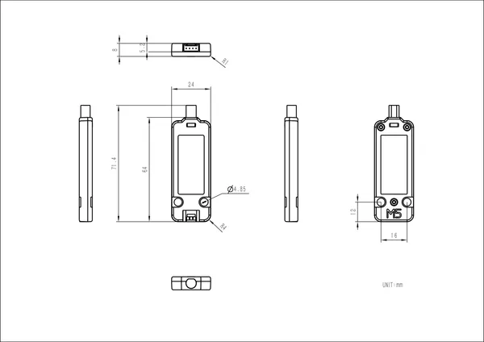](../../library/media/d2f0189f2fe32c3d4e56ce2637784661887ebc161e7b6d0293c36e39e3caebed.png)

**source reference** · Unreviewed source

Source rights not yet established

## Unit Catch

M5Stack · Source review pending

[Open full gallery](https://valleytech-black-wire-guide.pages.dev/?tab=makers&part=maker-existing-source-board-6383c92a87a114d737)

**source reference** · Unreviewed source

Source rights not yet established

## Unit ChainBus

M5Stack · Source review pending

[Open full gallery](https://valleytech-black-wire-guide.pages.dev/?tab=makers&part=maker-existing-source-board-676c051d840ed74fac)

**source reference** · Unreviewed source

Source rights not yet established

## Unit CO2

M5Stack · Source review pending

[Open full gallery](https://valleytech-black-wire-guide.pages.dev/?tab=makers&part=maker-existing-source-board-f2b5b135d118cd8838)

[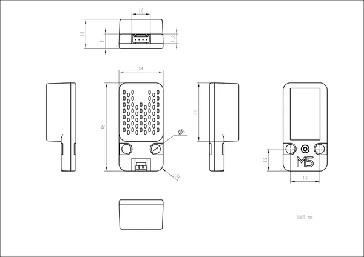](../../library/media/63652c3d0252415cfe2dfef7e8c5c957bde89302b44897239266858596199cef.jpg)

**source reference** · Unreviewed source

Source rights not yet established

## Unit CO2L

M5Stack · Source review pending

[Open full gallery](https://valleytech-black-wire-guide.pages.dev/?tab=makers&part=maker-existing-source-board-db86e14f80111eba4c)

[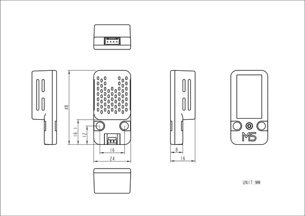](../../library/media/0275b1562b6c9b59f4c2305d628e3bffdfdc509b60bfdef1063dacd7b637500a.png)

**source reference** · Unreviewed source

Source rights not yet established

## Unit Color

M5Stack · Source review pending

[Open full gallery](https://valleytech-black-wire-guide.pages.dev/?tab=makers&part=maker-existing-source-board-9a0f004d0cc6c8536e)

**source reference** · Unreviewed source

Source rights not yet established

## Unit DDS

M5Stack · Source review pending

[Open full gallery](https://valleytech-black-wire-guide.pages.dev/?tab=makers&part=maker-existing-source-board-4a314d8882fe8ac2fe)

[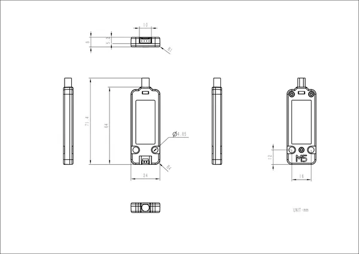](../../library/media/9371a9193e6fb8704621c2df12abbfb104ea388c3a1ba808529702f662f22337.jpg)

**source reference** · Unreviewed source

Source rights not yet established

## Unit DLight

M5Stack · Source review pending

[Open full gallery](https://valleytech-black-wire-guide.pages.dev/?tab=makers&part=maker-existing-source-board-d890bd2a0d89c86ad4)

**source reference** · Unreviewed source

Source rights not yet established

## Unit DMX

M5Stack · Source review pending

[Open full gallery](https://valleytech-black-wire-guide.pages.dev/?tab=makers&part=maker-existing-source-board-1c76a6c25ec80de5ed)

**source reference** · Unreviewed source

Source rights not yet established

## Unit Earth

M5Stack · Source review pending

[Open full gallery](https://valleytech-black-wire-guide.pages.dev/?tab=makers&part=maker-existing-source-board-695142eef6e58984e3)

**source reference** · Unreviewed source

Source rights not yet established

## Unit ENV-III

M5Stack · Source review pending

[Open full gallery](https://valleytech-black-wire-guide.pages.dev/?tab=makers&part=maker-existing-source-board-0473b4084149e1e41f)

**source reference** · Unreviewed source

Source rights not yet established

## Unit EXT.IO

M5Stack · Source review pending

[Open full gallery](https://valleytech-black-wire-guide.pages.dev/?tab=makers&part=maker-existing-source-board-7d1e4ea106c3456c6e)

[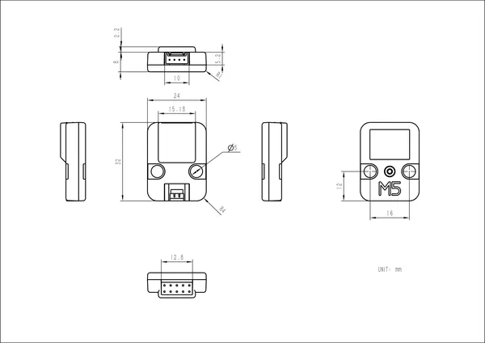](../../library/media/76903042ad050e0c49e43bd7c1c4101d05caa0352332e87a73772d755b7d6f42.png)

**source reference** · Unreviewed source

Source rights not yet established

## Unit Fader

M5Stack · Source review pending

[Open full gallery](https://valleytech-black-wire-guide.pages.dev/?tab=makers&part=maker-existing-source-board-f9da2d5a1b80c5b285)

**source reference** · Unreviewed source

Source rights not yet established

## Unit Fan

M5Stack · Source review pending

[Open full gallery](https://valleytech-black-wire-guide.pages.dev/?tab=makers&part=maker-existing-source-board-48f3df202a3e5ba049)

[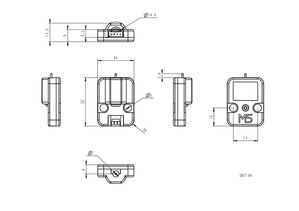](../../library/media/77bc0c759772b255d3bba3858b6ee56b8e2065192d55d0c43f9b99dc74f3e0cd.png)

**source reference** · Unreviewed source

Source rights not yet established

## Unit Finger

M5Stack · Source review pending

[Open full gallery](https://valleytech-black-wire-guide.pages.dev/?tab=makers&part=maker-existing-source-board-8535ed7db495c46a54)

[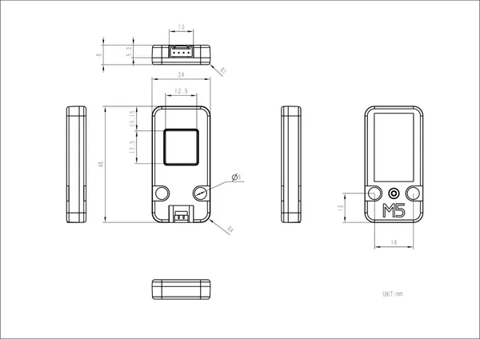](../../library/media/ba25727c0a7a53c70e3a0b8d21640f79f85bdeefb2170e3b637d996a0461b457.jpg)

**source reference** · Unreviewed source

Source rights not yet established

## Unit Fingerprint2

M5Stack · Source review pending

[Open full gallery](https://valleytech-black-wire-guide.pages.dev/?tab=makers&part=maker-existing-source-board-6f6f329bfe576d3657)

[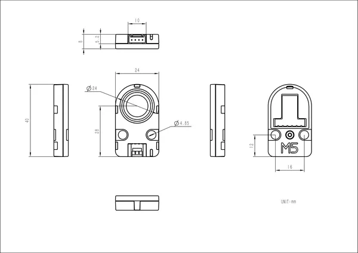](../../library/media/6df4ed5e63c580a660278da2731de90a1268bc73df6381fa45ce670061b631f7.png)

**source reference** · Unreviewed source

Source rights not yet established

## Unit FlashLight

M5Stack · Source review pending

[Open full gallery](https://valleytech-black-wire-guide.pages.dev/?tab=makers&part=maker-existing-source-board-c41af7f5f00e2de084)

[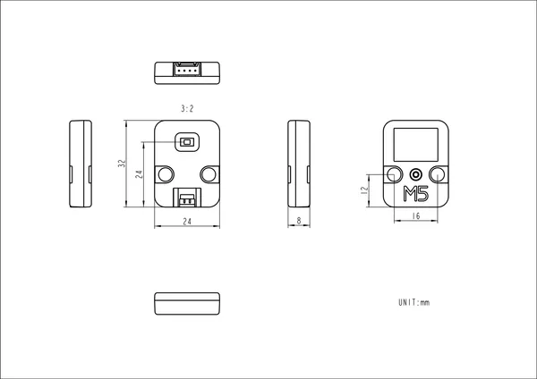](../../library/media/2c7039106bc7ee426dde8e2a33b17ff79b0ed2181ef13fb1c3e671b5a346e1e5.png)

**source reference** · Unreviewed source

Source rights not yet established

## Unit Gateway H2

M5Stack · Source review pending

[Open full gallery](https://valleytech-black-wire-guide.pages.dev/?tab=makers&part=maker-existing-source-board-19e3832e05505eee62)

[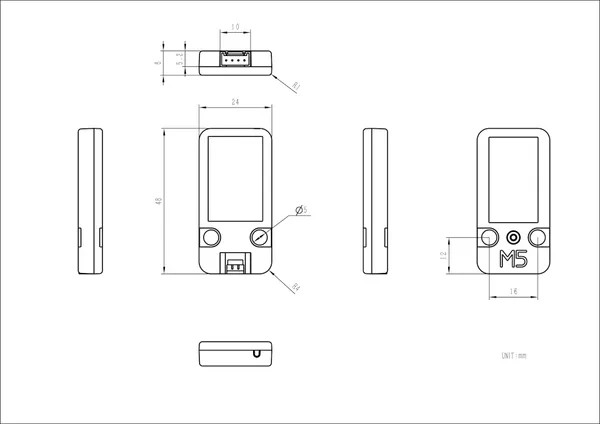](../../library/media/807c99afe25bd183b39a698b6f54cc4b6f3611f0d7a4357bdc57b04faac9efb9.jpg)

**source reference** · Unreviewed source

Source rights not yet established

## Unit Gesture

M5Stack · Source review pending

[Open full gallery](https://valleytech-black-wire-guide.pages.dev/?tab=makers&part=maker-existing-source-board-46e754cf4dc301964c)

[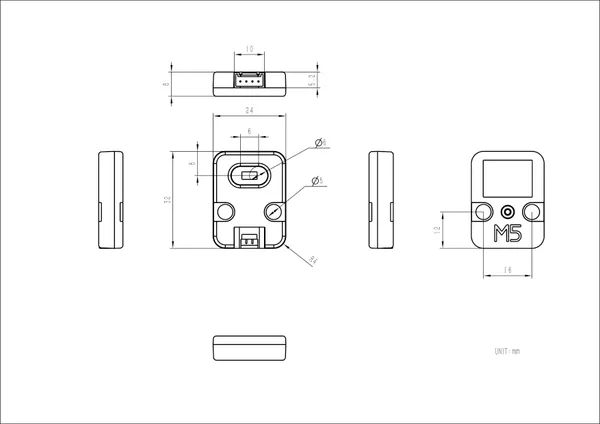](../../library/media/a6683ef64ebca6c9a4190258517ad54dbf09fc2dadb7545970ceec9e5c0ab686.jpg)

**source reference** · Unreviewed source

Source rights not yet established

## Unit Glass

M5Stack · Source review pending

[Open full gallery](https://valleytech-black-wire-guide.pages.dev/?tab=makers&part=maker-existing-source-board-0f797f4fc6408ab69e)

[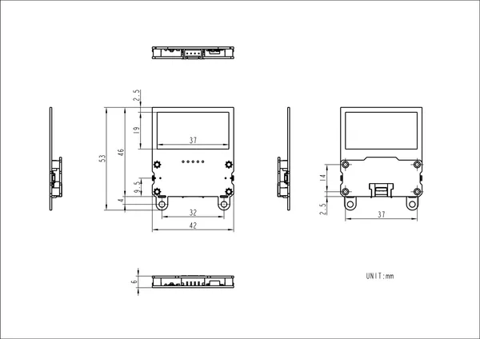](../../library/media/95c02b8ed4ef21808f226672664f579d89bb504c7d719d7b2365655d0e0db2a3.png)

**source reference** · Unreviewed source

Source rights not yet established

## Unit Glass2

M5Stack · Source review pending

[Open full gallery](https://valleytech-black-wire-guide.pages.dev/?tab=makers&part=maker-existing-source-board-3cae9c1bced8e16a80)

[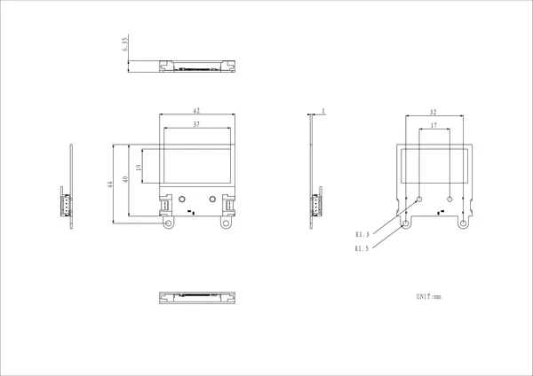](../../library/media/af7533e74b36ff06704c9f16a40bcd76b796492e3d3802ad7a78f57eceb62a55.png)

**source reference** · Unreviewed source

Source rights not yet established

## Unit Grove to Grove

M5Stack · Source review pending

[Open full gallery](https://valleytech-black-wire-guide.pages.dev/?tab=makers&part=maker-existing-source-board-7cb5c281a1564e4e60)

**source reference** · Unreviewed source

Source rights not yet established

## Unit Heart

M5Stack · Source review pending

[Open full gallery](https://valleytech-black-wire-guide.pages.dev/?tab=makers&part=maker-existing-source-board-7b051a6f89f7b3a4ec)

[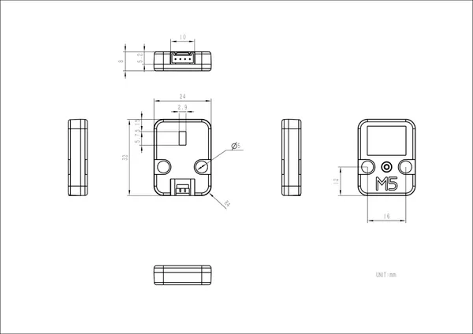](../../library/media/d15518e7ffed66d2fc517e3de208ce30670bddc401b7a41e591ab4d9cfaf43c8.jpg)

**source reference** · Unreviewed source

Source rights not yet established

## Unit HEX

M5Stack · Source review pending

[Open full gallery](https://valleytech-black-wire-guide.pages.dev/?tab=makers&part=maker-existing-source-board-6d75103d33b3617063)

**source reference** · Unreviewed source

Source rights not yet established

## Unit ID

M5Stack · Source review pending

[Open full gallery](https://valleytech-black-wire-guide.pages.dev/?tab=makers&part=maker-existing-source-board-160e2efda6b63a95da)

[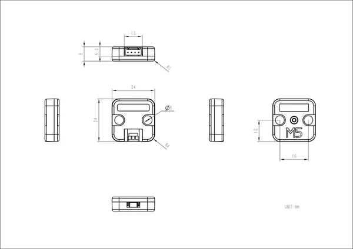](../../library/media/31b0ad365228504643b4378124707848a1ea0f38df3f58736c0cb262b2d9ec07.jpg)

**source reference** · Unreviewed source

Source rights not yet established

## Unit IR

M5Stack · Source review pending

[Open full gallery](https://valleytech-black-wire-guide.pages.dev/?tab=makers&part=maker-existing-source-board-d82cd9b4c678a7e51d)

[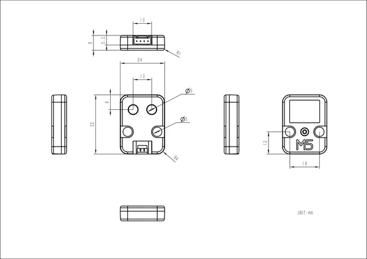](../../library/media/aca8f8ada3661a0ce5b0e890422e3583107043e29d7ca157e9346c8792e36174.png)

**source reference** · Unreviewed source

Source rights not yet established

## Unit Key

M5Stack · Source review pending

[Open full gallery](https://valleytech-black-wire-guide.pages.dev/?tab=makers&part=maker-existing-source-board-91a88779058500669a)

[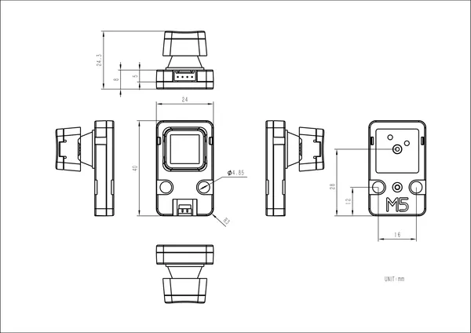](../../library/media/10f8f0fa9a15cd03f93ebfb98b1efc6276363f3f4a57642b214af03b54b22fac.png)

**source reference** · Unreviewed source

Source rights not yet established

## Unit KMeter-ISO

M5Stack · Source review pending

[Open full gallery](https://valleytech-black-wire-guide.pages.dev/?tab=makers&part=maker-existing-source-board-37fa4c27be8e1e21b0)

**source reference** · Unreviewed source

Source rights not yet established

## Unit Laser RX

M5Stack · Source review pending

[Open full gallery](https://valleytech-black-wire-guide.pages.dev/?tab=makers&part=maker-existing-source-board-4a0ca9b6dca33a5d46)

[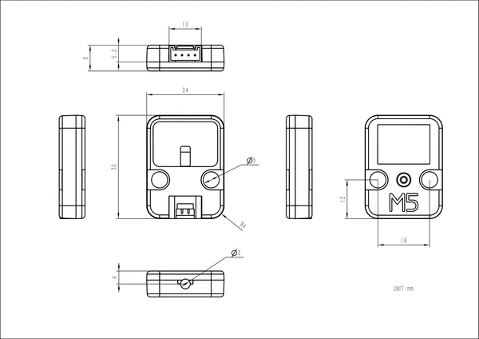](../../library/media/87cf777e0b52ed3831f71f07fb35192ba1a3867a63c765f041c3445cbd1fb9cf.png)

**source reference** · Unreviewed source

Source rights not yet established

## Unit Light

M5Stack · Source review pending

[Open full gallery](https://valleytech-black-wire-guide.pages.dev/?tab=makers&part=maker-existing-source-board-13ce62af46e87a241c)

[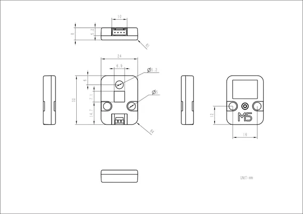](../../library/media/9a2bcd5727fcd65cf4f6a9715c316d7547e7c71794f31b924b4e0a5e873cd8a5.jpg)

**source reference** · Unreviewed source

Source rights not yet established

## Unit Limit

M5Stack · Source review pending

[Open full gallery](https://valleytech-black-wire-guide.pages.dev/?tab=makers&part=maker-existing-source-board-2527d2ea1ad559d94d)

[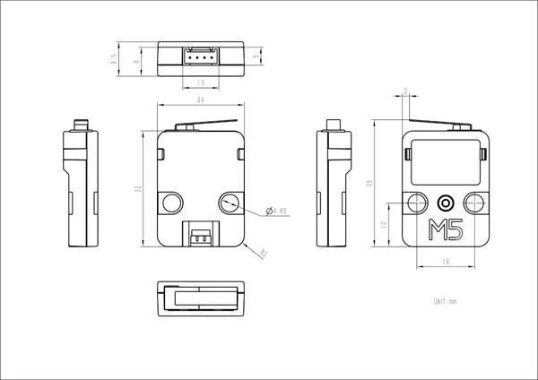](../../library/media/7e8dd3f916b7eeb798c01df0110e3ad9d404b9e46fe07edaba466f675b231476.jpg)

**source reference** · Unreviewed source

Source rights not yet established

## Unit MIDI

M5Stack · Source review pending

[Open full gallery](https://valleytech-black-wire-guide.pages.dev/?tab=makers&part=maker-existing-source-board-6d9ef7d2c385a09d32)

**source reference** · Unreviewed source

Source rights not yet established

## Unit Mini BPS v1.1

M5Stack · Source review pending

[Open full gallery](https://valleytech-black-wire-guide.pages.dev/?tab=makers&part=maker-existing-source-board-470857140b66a94f21)

**source reference** · Unreviewed source

Source rights not yet established

## Unit Mini CAN

M5Stack · Source review pending

[Open full gallery](https://valleytech-black-wire-guide.pages.dev/?tab=makers&part=maker-existing-source-board-3a474e2b3486b9fc9a)

**source reference** · Unreviewed source

Source rights not yet established

## Unit Mini PDM

M5Stack · Source review pending

[Open full gallery](https://valleytech-black-wire-guide.pages.dev/?tab=makers&part=maker-existing-source-board-018e46d081f1e9de6a)

**source reference** · Unreviewed source

Source rights not yet established

## Unit Mini Proto

M5Stack · Source review pending

[Open full gallery](https://valleytech-black-wire-guide.pages.dev/?tab=makers&part=maker-existing-source-board-d98aa688f305d3abc1)

[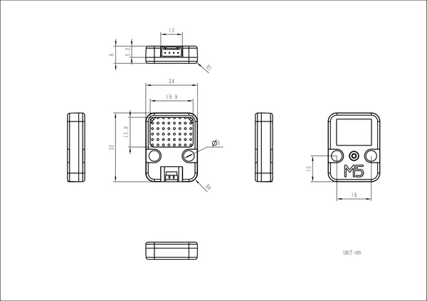](../../library/media/f81af1802b946995f299dafa2e5e4d3c21f3cd26bb13564f6845011e6258251a.png)

**source reference** · Unreviewed source

Source rights not yet established

## Unit Mini Scales

M5Stack · Source review pending

[Open full gallery](https://valleytech-black-wire-guide.pages.dev/?tab=makers&part=maker-existing-source-board-ca806d76c33d111205)

**source reference** · Unreviewed source

Source rights not yet established

## Unit Mini ToF-90°

M5Stack · Source review pending

[Open full gallery](https://valleytech-black-wire-guide.pages.dev/?tab=makers&part=maker-existing-source-board-ae1823dbebbc124a83)

[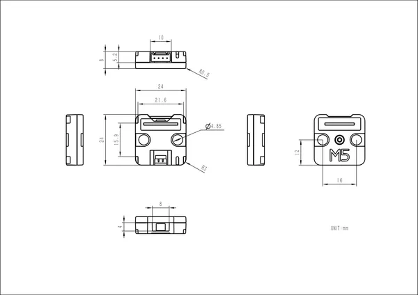](../../library/media/74c8ab686aa7b57cd266b09a87cb566202f072269043e24ac0bb37835e4094ca.png)

**source reference** · Unreviewed source

Source rights not yet established

## Unit MQ

M5Stack · Source review pending

[Open full gallery](https://valleytech-black-wire-guide.pages.dev/?tab=makers&part=maker-existing-source-board-30f44e0d1f3cddc27a)

[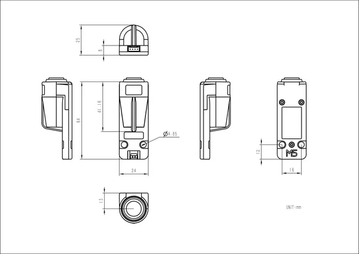](../../library/media/6d7e44ec67a8de93b04705685229bbb5ceabfd5d3682d5110cfceb4c1bc5d304.png)

**source reference** · Unreviewed source

Source rights not yet established

## Unit MQTT

M5Stack · Source review pending

[Open full gallery](https://valleytech-black-wire-guide.pages.dev/?tab=makers&part=maker-existing-source-board-5b1db598f87b36cea5)

**source reference** · Unreviewed source

Source rights not yet established

## Unit NBIoT2

M5Stack · Source review pending

[Open full gallery](https://valleytech-black-wire-guide.pages.dev/?tab=makers&part=maker-existing-source-board-1e341275ea454a4761)

**source reference** · Unreviewed source

Source rights not yet established

## Unit NCIR

M5Stack · Source review pending

[Open full gallery](https://valleytech-black-wire-guide.pages.dev/?tab=makers&part=maker-existing-source-board-e91ee02407ca7da244)

[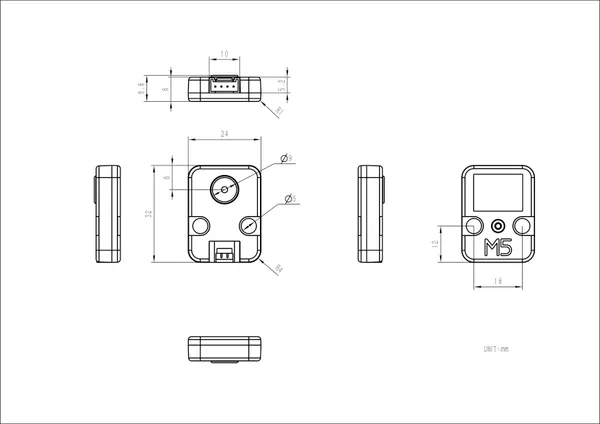](../../library/media/a6e7eed3d8406d7d85d7e32142f273a08df08a2d4e3266cbfbd232d953faba7b.jpg)

**source reference** · Unreviewed source

Source rights not yet established

## Unit NCIR2

M5Stack · Source review pending

[Open full gallery](https://valleytech-black-wire-guide.pages.dev/?tab=makers&part=maker-existing-source-board-41bab4646e04facc82)

[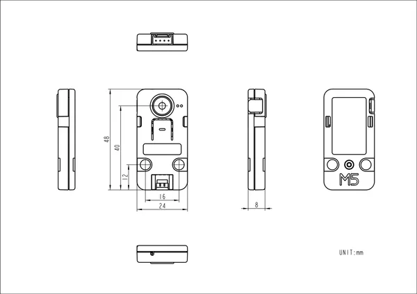](../../library/media/06668ce8fed7c0638f7f731a5c40e97144c7fc5371d61a5e87bbf8d046f5e764.png)

**source reference** · Unreviewed source

Source rights not yet established

## Unit Neco

M5Stack · Source review pending

[Open full gallery](https://valleytech-black-wire-guide.pages.dev/?tab=makers&part=maker-existing-source-board-70d2c75f72335b6063)

[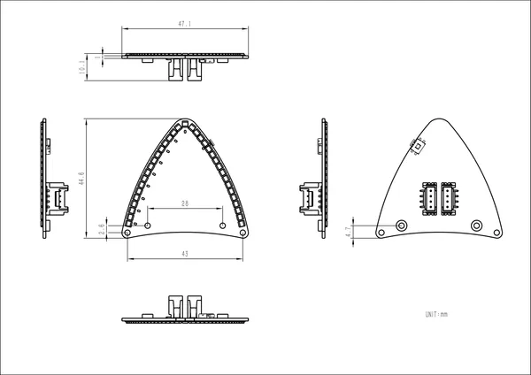](../../library/media/477a757107ef3532bd46bcf4cdb791090027fc5cd0c3b09e1d65e394cf6d22be.png)

**source reference** · Unreviewed source

Source rights not yet established

## Unit NeoHEX

M5Stack · Source review pending

[Open full gallery](https://valleytech-black-wire-guide.pages.dev/?tab=makers&part=maker-existing-source-board-71358175817868c0a7)

[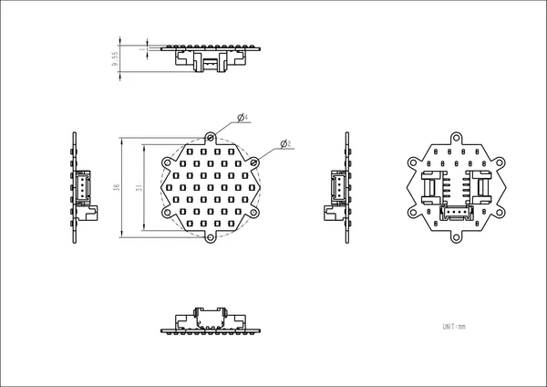](../../library/media/70ec6e7601ac7f5a58d88dd28097f89ae87ad167711b313a5965c3b92365fd36.png)

**source reference** · Unreviewed source

Source rights not yet established

## Unit NFC

M5Stack · Source review pending

[Open full gallery](https://valleytech-black-wire-guide.pages.dev/?tab=makers&part=maker-existing-source-board-78a7dee46ac529b42e)

[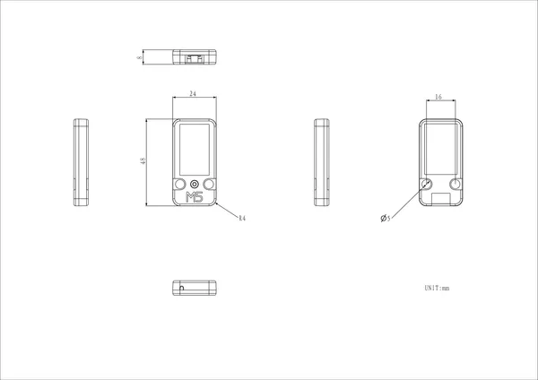](../../library/media/a0ffa01c425d557682201cd2a86577f3f0c5e70c04105aa9447b9fc0c13956c1.png)

**source reference** · Unreviewed source

Source rights not yet established

## Unit OP180

M5Stack · Source review pending

[Open full gallery](https://valleytech-black-wire-guide.pages.dev/?tab=makers&part=maker-existing-source-board-f9ca4d6557f8a63eb1)

[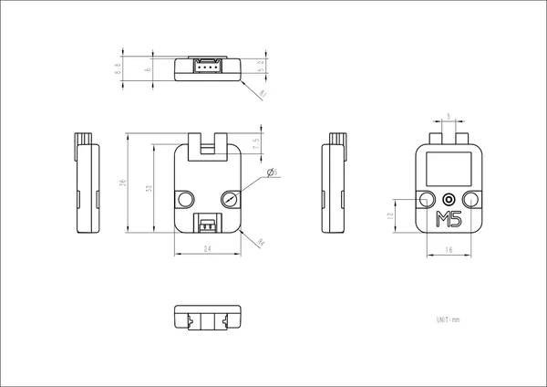](../../library/media/02a8f15444fe33fe5a7b13d73b93057177ca84bbdc632eab3b1a57ce52c03909.jpg)

**source reference** · Unreviewed source

Source rights not yet established

## Unit OP90

M5Stack · Source review pending

[Open full gallery](https://valleytech-black-wire-guide.pages.dev/?tab=makers&part=maker-existing-source-board-d8ff421aaf3fa9b688)

**source reference** · Unreviewed source

Source rights not yet established

## Unit PIR

M5Stack · Source review pending

[Open full gallery](https://valleytech-black-wire-guide.pages.dev/?tab=makers&part=maker-existing-source-board-ab6064cda4c6d6cbe9)

[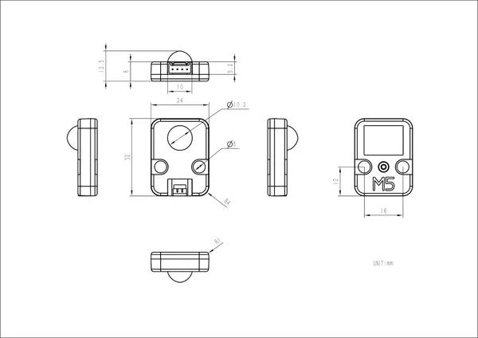](../../library/media/2e08d240d1840669c25fa9a141f639fada0b9f1b3aa09d596c4b32dc1729dc77.jpg)

**source reference** · Unreviewed source

Source rights not yet established

## Unit PoE CAM-W

M5Stack · Source review pending

[Open full gallery](https://valleytech-black-wire-guide.pages.dev/?tab=makers&part=maker-existing-source-board-f995d7ef19a31f3d9a)

**source reference** · Unreviewed source

Source rights not yet established

## Unit PoE CAM-W v1.1

M5Stack · Source review pending

[Open full gallery](https://valleytech-black-wire-guide.pages.dev/?tab=makers&part=maker-existing-source-board-2477653d0c88e3be88)

**source reference** · Unreviewed source

Source rights not yet established

## Unit Proto

M5Stack · Source review pending

[Open full gallery](https://valleytech-black-wire-guide.pages.dev/?tab=makers&part=maker-existing-source-board-7ef12a9cd3c02d0fcf)

**source reference** · Unreviewed source

Source rights not yet established

## Unit Proto Case

M5Stack · Source review pending

[Open full gallery](https://valleytech-black-wire-guide.pages.dev/?tab=makers&part=maker-existing-source-board-762c4c86bf177e5fd1)

**source reference** · Unreviewed source

Source rights not yet established

## Unit Puzzle

M5Stack · Source review pending

[Open full gallery](https://valleytech-black-wire-guide.pages.dev/?tab=makers&part=maker-existing-source-board-d31271066d46e5fd4b)

[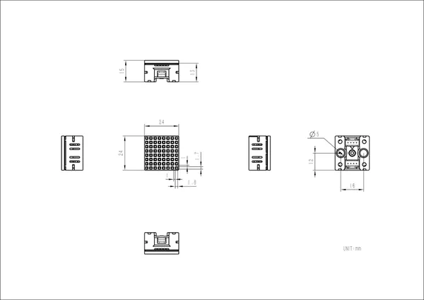](../../library/media/60e67fbf2df5880366d230a3991ddb384799e2ff241cb9e052026210bd581f5c.jpg)

**source reference** · Unreviewed source

Source rights not yet established

## Unit QRCode

M5Stack · Source review pending

[Open full gallery](https://valleytech-black-wire-guide.pages.dev/?tab=makers&part=maker-existing-source-board-1ca67ec53bf2a3ce3a)

**source reference** · Unreviewed source

Source rights not yet established

## Unit RCA

M5Stack · Source review pending

[Open full gallery](https://valleytech-black-wire-guide.pages.dev/?tab=makers&part=maker-existing-source-board-cfb551b6de8e6c1587)

[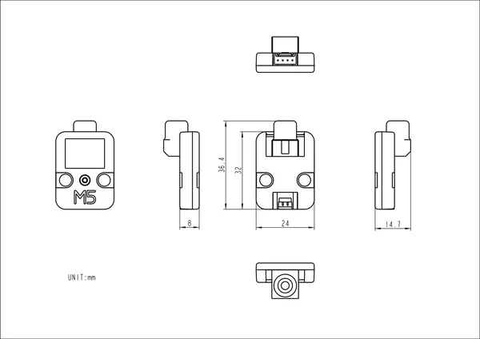](../../library/media/7510f1b2d070bf98848790badc41cb43a0d2ce4605fe75605ce19717962c5df5.png)

**source reference** · Unreviewed source

Source rights not yet established

## Unit Reflective IR

M5Stack · Source review pending

[Open full gallery](https://valleytech-black-wire-guide.pages.dev/?tab=makers&part=maker-existing-source-board-3d09118d5e48953680)

[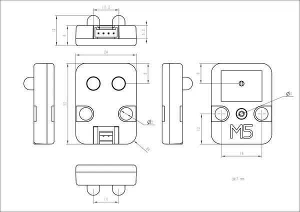](../../library/media/209dd32dae1a4f5fc1f4e92ec80554bfdf87bf55f6e5a0ca6d326f1630145725.jpg)

**source reference** · Unreviewed source

Source rights not yet established

## Unit RGB

M5Stack · Source review pending

[Open full gallery](https://valleytech-black-wire-guide.pages.dev/?tab=makers&part=maker-existing-source-board-f9bf0afb3681ad50aa)

[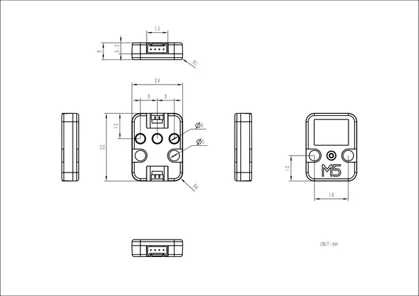](../../library/media/9da7e3710688ba87336fc01942c86f91ce24ae56c58f1b11865acb28e7a6e7ae.png)

**source reference** · Unreviewed source

Source rights not yet established

## Unit Roller485

M5Stack · Source review pending

[Open full gallery](https://valleytech-black-wire-guide.pages.dev/?tab=makers&part=maker-existing-source-board-2f8863fd57f131c6f0)

**source reference** · Unreviewed source

Source rights not yet established

## Unit Scales

M5Stack · Source review pending

[Open full gallery](https://valleytech-black-wire-guide.pages.dev/?tab=makers&part=maker-existing-source-board-5b205f64cb5a1f17ef)

**source reference** · Unreviewed source

Source rights not yet established

## Unit Scroll

M5Stack · Source review pending

[Open full gallery](https://valleytech-black-wire-guide.pages.dev/?tab=makers&part=maker-existing-source-board-be68305d414b05d2df)

**source reference** · Unreviewed source

Source rights not yet established

## Unit SSR

M5Stack · Source review pending

[Open full gallery](https://valleytech-black-wire-guide.pages.dev/?tab=makers&part=maker-existing-source-board-0deb3cc52909696465)

**source reference** · Unreviewed source

Source rights not yet established

## Unit Step16

M5Stack · Source review pending

[Open full gallery](https://valleytech-black-wire-guide.pages.dev/?tab=makers&part=maker-existing-source-board-bcfccaf958283fb56a)

**source reference** · Unreviewed source

Source rights not yet established

## Unit TimerPWR

M5Stack · Source review pending

[Open full gallery](https://valleytech-black-wire-guide.pages.dev/?tab=makers&part=maker-existing-source-board-d3430af2798820c2fa)

[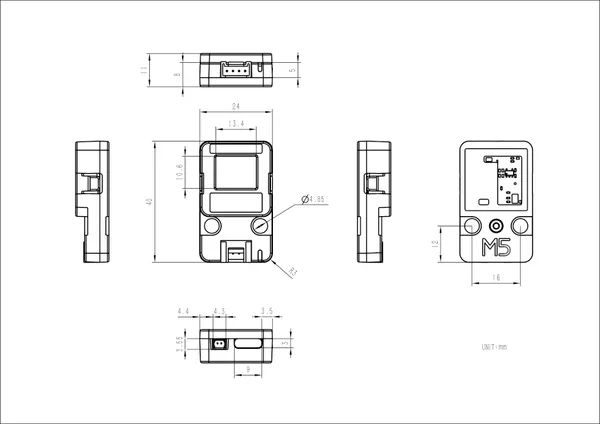](../../library/media/3f4cf1d13664fd0bbe15f4322e92f5e41e0f5a8bddf3f421c4cda831ae4e6f80.jpg)

**source reference** · Unreviewed source

Source rights not yet established

## Unit TMOS PIR

M5Stack · Source review pending

[Open full gallery](https://valleytech-black-wire-guide.pages.dev/?tab=makers&part=maker-existing-source-board-310aca6f9b5384b17b)

[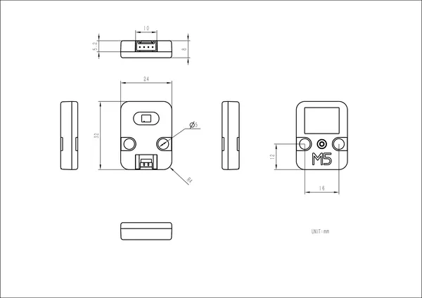](../../library/media/f8ed12e8cefedb13f50748d87afa45adb04e8466b9574920b0b8d2a7f00fbb8c.png)

**source reference** · Unreviewed source

Source rights not yet established

## Unit ToF

M5Stack · Source review pending

[Open full gallery](https://valleytech-black-wire-guide.pages.dev/?tab=makers&part=maker-existing-source-board-b435576274d054c7ef)

**source reference** · Unreviewed source

Source rights not yet established

## Unit ToF4M

M5Stack · Source review pending

[Open full gallery](https://valleytech-black-wire-guide.pages.dev/?tab=makers&part=maker-existing-source-board-e19808c11c1b09dfd3)

[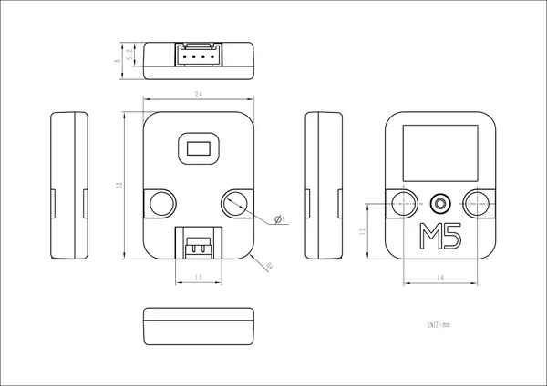](../../library/media/61a719ce9529adc62ffb00e9551688d5913f2deef37b0b4f518b46e7e065a2b4.jpg)

**source reference** · Unreviewed source

Source rights not yet established

## Unit Trace

M5Stack · Source review pending

[Open full gallery](https://valleytech-black-wire-guide.pages.dev/?tab=makers&part=maker-existing-m5stack-expansion-unit-trace)

**GPIO reference image** · Reviewed source

Not established; source attribution retained

## Unit TypeC to Grove

M5Stack · Source review pending

[Open full gallery](https://valleytech-black-wire-guide.pages.dev/?tab=makers&part=maker-existing-m5stack-expansion-unit-typec-to-grove)

[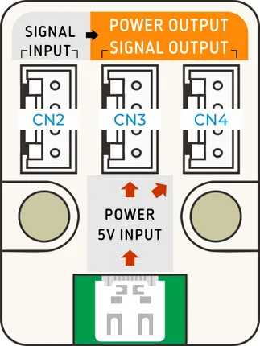](../../library/media/aa47603c2d10f1e2dccfc7d94546e683374718b93b11445e3ffaa62f5bce9641.png)

**pinout image** · Reviewed source

Not established; source attribution retained

## Unit UHF-RFID

M5Stack · Source review pending

[Open full gallery](https://valleytech-black-wire-guide.pages.dev/?tab=makers&part=maker-existing-source-board-c360f4f6b8e1f0310a)

[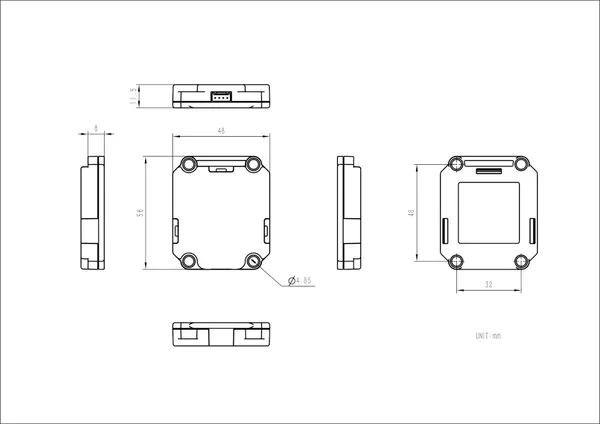](../../library/media/876b93a6332347e7e44bf409fc3029cb034f57bc5b24b9c66c9a60200025ff3d.jpg)

**source reference** · Unreviewed source

Source rights not yet established

## Unit Vibrator

M5Stack · Source review pending

[Open full gallery](https://valleytech-black-wire-guide.pages.dev/?tab=makers&part=maker-existing-source-board-cc26469cbed814787b)

[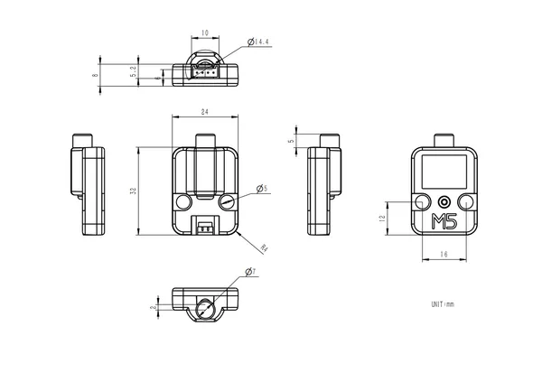](../../library/media/f16a2927e7e504cfbbf420a19fe0c50dbdf65bac66ee4eda073f3356defd107d.png)

**source reference** · Unreviewed source

Source rights not yet established

## Unit Watering

M5Stack · Source review pending

[Open full gallery](https://valleytech-black-wire-guide.pages.dev/?tab=makers&part=maker-existing-source-board-4828539aa387945544)

[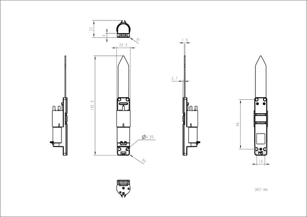](../../library/media/d463f7a09c66c01969b9554d4c842dca9814876e7d01c19d4cdeb7496b864adf.jpg)

**source reference** · Unreviewed source

Source rights not yet established

## Unit Weight

M5Stack · Source review pending

[Open full gallery](https://valleytech-black-wire-guide.pages.dev/?tab=makers&part=maker-existing-source-board-12e23574aab03d88d0)

[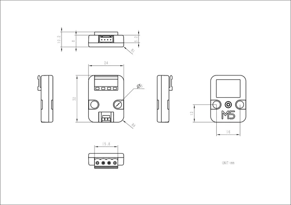](../../library/media/4743a95b0d5dd16030b2aaf16eaefeb625c5abc1b9522c76e249cedfb0ccc992.jpg)

**source reference** · Unreviewed source

Source rights not yet established

## Unit Weight-I2C

M5Stack · Source review pending

[Open full gallery](https://valleytech-black-wire-guide.pages.dev/?tab=makers&part=maker-existing-source-board-3f04e1ad26e264e446)

[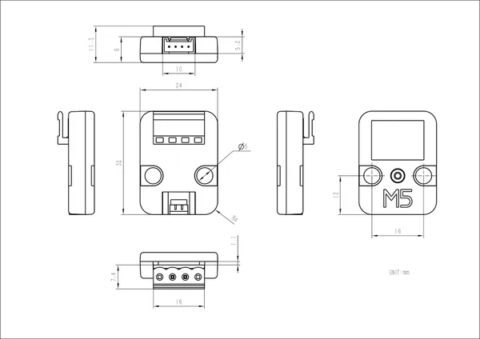](../../library/media/3102189890b4ce1e329fba40bb6535a67aa37a6206682e7bf3c1fb0f3dbfc23f.jpg)

**source reference** · Unreviewed source

Source rights not yet established

## Wio-LR2021

Seeed Studio · Source review pending

[Open full gallery](https://valleytech-black-wire-guide.pages.dev/?tab=makers&part=maker-existing-seeed-studio-expansion-wio-lr2021)

[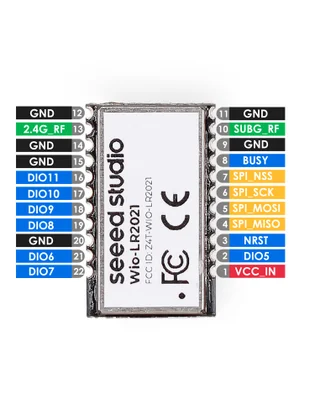](../../library/maker-media/63ac27467f9c9f8e9286f7a0056ee75f26892d92a0d06b02690aa3f763273215.jpg)

**pinout image** · Connector diagram visually inspected; independent electrical review pending

Manufacturer source artwork. Reproduction rights not established; excluded from the printed book.

## Wio-SX1262

Seeed Studio · Source review pending

[Open full gallery](https://valleytech-black-wire-guide.pages.dev/?tab=makers&part=maker-existing-seeed-studio-expansion-wio-sx1262)

[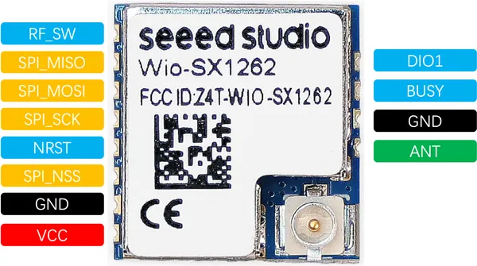](../../library/media/60fc906dd8bae2589e891ac17fb46e8bb453dd104109d9dfe827754cd7a7be0e.png)

**pinout image** · Reviewed source

Not established; source attribution retained

## WM1302 Pi HAT

Seeed Studio · Source review pending

[Open full gallery](https://valleytech-black-wire-guide.pages.dev/?tab=makers&part=maker-existing-seeed-studio-expansion-wm1302-pi-hat)

**pinout image** · Reviewed source

Not established; source attribution retained

## XIAO Debug Mate

Seeed Studio · Source review pending

[Open full gallery](https://valleytech-black-wire-guide.pages.dev/?tab=makers&part=maker-existing-seeed-studio-expansion-xiao-debug-mate)

[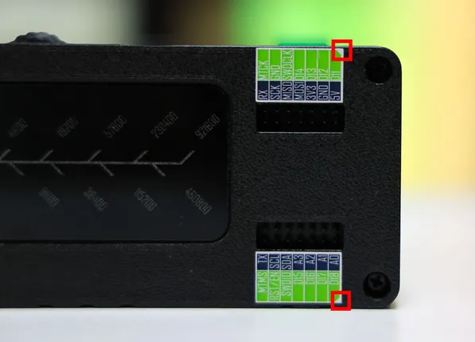](../../library/media/bd85a2c5980c09ff04fc01dd5ef86674723dc1699bad9a114829a0d5426bf814.jpg)

**pinout image** · Reviewed source

Not established; source attribution retained

## XIAO Logger HAT

Seeed Studio · Source review pending

[Open full gallery](https://valleytech-black-wire-guide.pages.dev/?tab=makers&part=maker-existing-seeed-studio-expansion-xiao-logger-hat)

**board labeling image** · Reviewed source

Not established; source attribution retained
