# Outputs & drivers / visual references

[All categories](../../MAKER_VISUALS.md) · [Image attribution ledger](../../catalog/maker-attributions.json)

Manufacturer originals remain unchanged. Connector-model sheets add separately labeled callouts under the recorded source license. Check exact PCB/revision, source notes and rights before reuse. Photos and partial connector diagrams are not complete-device approvals.

## A4988 Stepper Motor Driver Carrier

Pololu · Manufacturer documentation recorded

[Open full gallery](https://valleytech-black-wire-guide.pages.dev/?tab=makers&part=maker-pololu-c9f3c19279b1)

[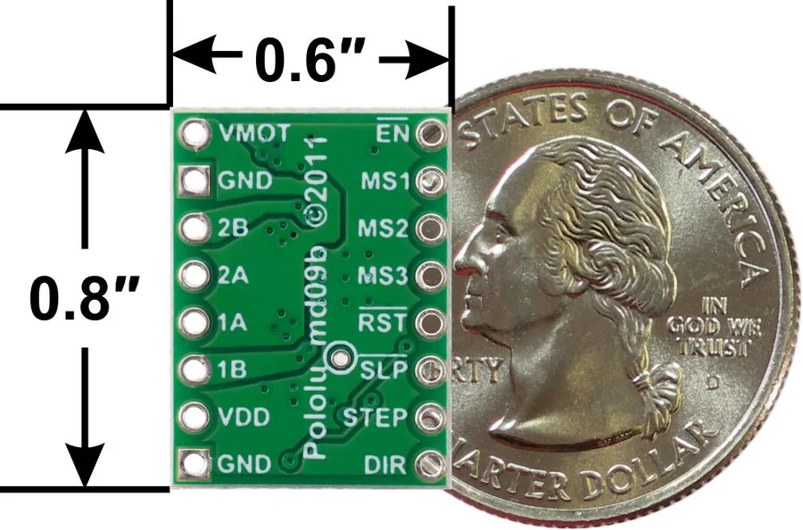](../../library/maker-media/c682b5f532bdd307d07deddfcf685480722bcac58893a2e8ca7e6baaeca33e1c.jpg)

**pinout image** · Source image inspected; technical review pending

Manufacturer artwork; reproduction rights not established; not cleared for the printed book

## Adafruit DRV8833 DC/Stepper Motor Driver Breakout Board

Adafruit · Manufacturer documentation recorded

[Open full gallery](https://valleytech-black-wire-guide.pages.dev/?tab=makers&part=maker-adafruit-3c05b617f1ed)

[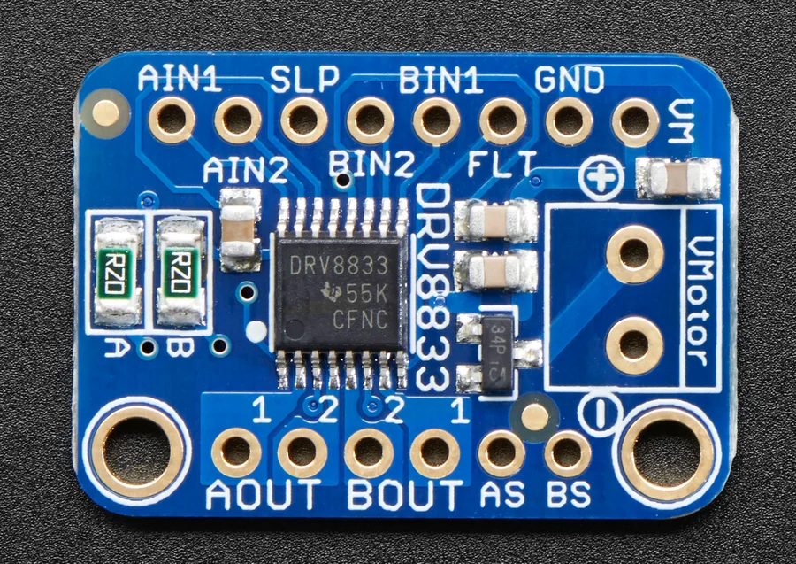](../../library/maker-media/390b8d4fd3c7955db354f628a95dcae357bb80c08f291b73dc412751b40b8b53.jpg)

**source reference** · Source image inspected; technical review pending

Manufacturer artwork; reproduction rights not established; not cleared for the printed book

## Adafruit PCA9685 16-Channel Servo Driver

Adafruit · Manufacturer documentation recorded

[Open full gallery](https://valleytech-black-wire-guide.pages.dev/?tab=makers&part=maker-adafruit-f728bed24afd)

[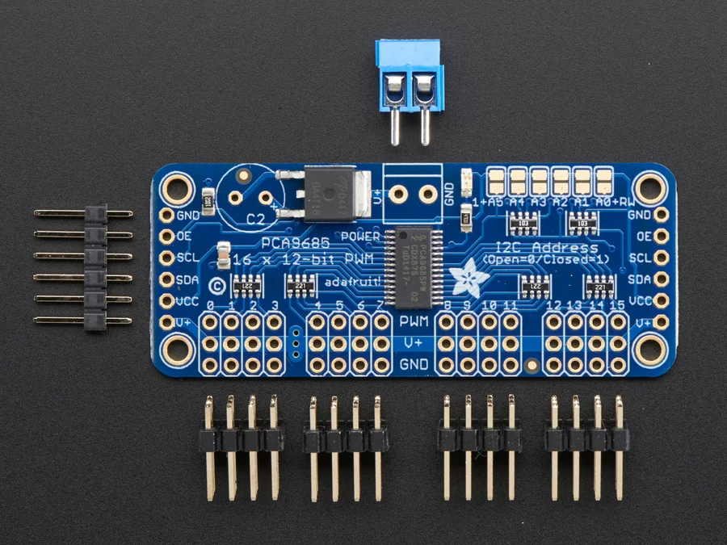](../../library/maker-media/c3b835deab1c82f023de8b46cc0f739d8f672d7cd6c48f3ab86abc3306373ced.jpg)

**source reference** · Source image inspected; technical review pending

Manufacturer artwork; reproduction rights not established; not cleared for the printed book

## Adafruit STEMMA Non-Latching Mini Relay

Adafruit · Manufacturer documentation recorded

[Open full gallery](https://valleytech-black-wire-guide.pages.dev/?tab=makers&part=maker-adafruit-bbff2124b1be)

[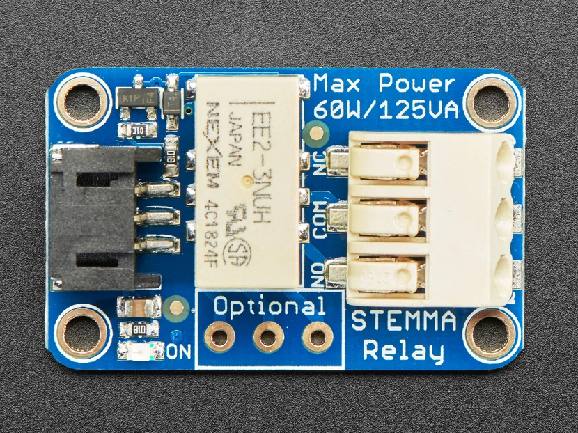](../../library/maker-media/f0ce2acde3ea725a5d82d76ae38fb8d19c32e1838b4375167f2773216f8d53b6.jpg)

**source reference** · Source image inspected; technical review pending

Adafruit Industries / original asset contributor. https://creativecommons.org/licenses/by-sa/3.0/; original image unchanged. See linked asset page for creator and terms.

## DRV8825 Stepper Motor Driver Carrier, High Current

Pololu · Manufacturer documentation recorded

[Open full gallery](https://valleytech-black-wire-guide.pages.dev/?tab=makers&part=maker-pololu-82ffefdddeb5)

[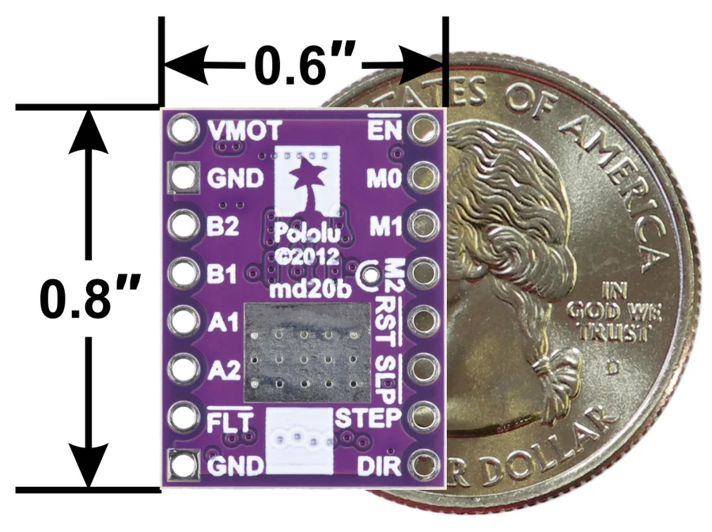](../../library/maker-media/77e5d47b97d550821af4839822f1abfddc045f1774ef6fc4fbbc178e987de753.jpg)

**pinout image** · Source image inspected; technical review pending

Manufacturer artwork; reproduction rights not established; not cleared for the printed book

## Generic relay module variants

Generic / manufacturer unconfirmed · Identification needed

[Open full gallery](https://valleytech-black-wire-guide.pages.dev/?tab=makers&part=maker-generic-generic-relay-module-variants)

Matching image still needed.

## Grove to Servo

M5Stack · Source review pending

[Open full gallery](https://valleytech-black-wire-guide.pages.dev/?tab=makers&part=maker-existing-source-board-9e85c320e96566c801)

[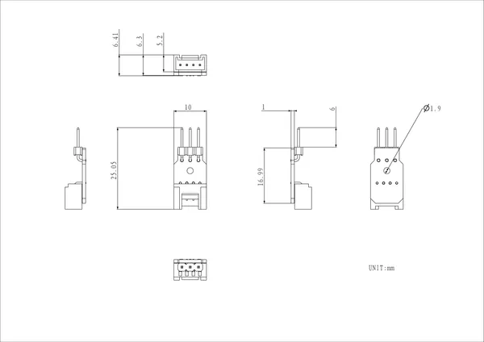](../../library/media/a99bb891c80a459c36603d29d12db2210f90214dc641206e9680052628200e32.png)

**source reference** · Unreviewed source

Source rights not yet established

## Hat 8Servos

M5Stack · Source review pending

[Open full gallery](https://valleytech-black-wire-guide.pages.dev/?tab=makers&part=maker-existing-m5stack-expansion-hat-8servos)

[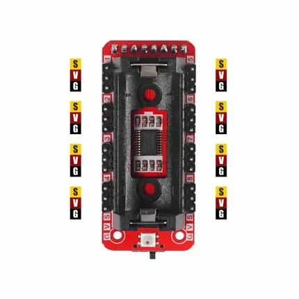](../../library/media/ce665a65f547ae05ea7a96e8b92b01154202298b13586a1d98cfe51c3f938d2c.png)

**pinout image** · Reviewed source

Not established; source attribution retained

## IoT Brushless Motor Driver

SparkFun · Manufacturer source references collected

[Open full gallery](https://valleytech-black-wire-guide.pages.dev/?tab=makers&part=maker-sparkfun-iot-brushless-motor-driver)

**pinout image** · Reviewed source

SparkFun / original diagram contributors. Rights not established for this asset; attribution retained. Original artwork is not covered by Black Wire's editorial license.

## KY-005 Infrared transmitter

Joy-IT · Manufacturer documentation recorded

[Open full gallery](https://valleytech-black-wire-guide.pages.dev/?tab=makers&part=maker-joy-it-f34bdd598ad9)

[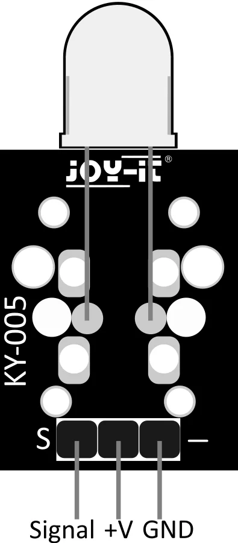](../../library/maker-media/0448970145730bd9f358134b4b4d3e51ce49337addf002021ab5b38e706a1dbe.svg)

**pinout image** · Source image inspected; technical review pending

Manufacturer artwork; reproduction rights not established; not cleared for the printed book

## KY-006 / Passive Piezo-Buzzer

Joy-IT · Manufacturer documentation recorded

[Open full gallery](https://valleytech-black-wire-guide.pages.dev/?tab=makers&part=maker-joy-it-d14c8adf215f)

[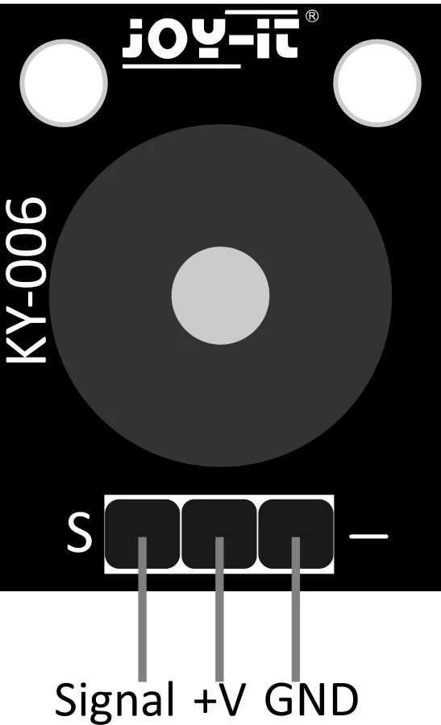](../../library/maker-media/7ec8ce4d1716858ecda1f4ecaf736f54f81aaea38588fd7da9e97ccdecbd14d6.svg)

**pinout image** · Source image inspected; technical review pending

Manufacturer artwork; reproduction rights not established; not cleared for the printed book

## KY-009 RGB SMD-LED

Joy-IT · Manufacturer documentation recorded

[Open full gallery](https://valleytech-black-wire-guide.pages.dev/?tab=makers&part=maker-joy-it-d9044d01adc7)

[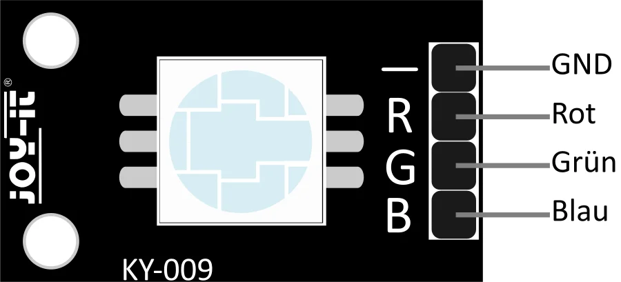](../../library/maker-media/ee3845c49e206bdb303ec69dbb287cf97739e78f940baaeb10c1f596a21f2824.svg)

**pinout image** · Source image inspected; technical review pending

Manufacturer artwork; reproduction rights not established; not cleared for the printed book

## KY-011 2-Color 5mm LED

Joy-IT · Manufacturer documentation recorded

[Open full gallery](https://valleytech-black-wire-guide.pages.dev/?tab=makers&part=maker-joy-it-1d28d19450c9)

[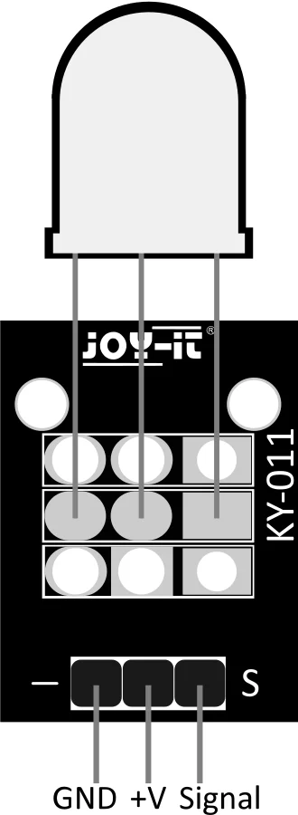](../../library/maker-media/83062fea6e95e241c9b7a712ad831e266a7c680c9b0fe93a38bb6f6d329e57d3.svg)

**pinout image** · Source image inspected; technical review pending

Manufacturer artwork; reproduction rights not established; not cleared for the printed book

## KY-012 Active Piezo-Buzzer

Joy-IT · Manufacturer documentation recorded

[Open full gallery](https://valleytech-black-wire-guide.pages.dev/?tab=makers&part=maker-joy-it-307a0c709eb4)

[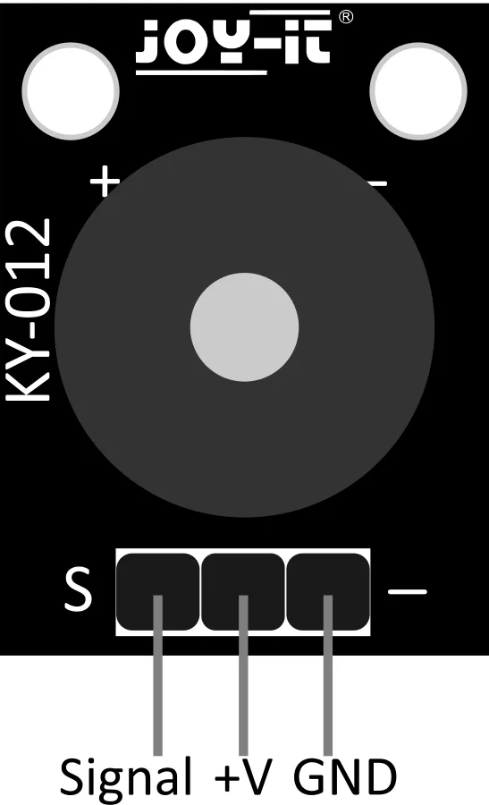](../../library/maker-media/90fcba4eb372380f30aba6a56489e2bf80bc72eb5c2013cd8ebf5b60cb6a5aff.svg)

**pinout image** · Source image inspected; technical review pending

Manufacturer artwork; reproduction rights not established; not cleared for the printed book

## KY-016 RGB 5mm LED

Joy-IT · Manufacturer documentation recorded

[Open full gallery](https://valleytech-black-wire-guide.pages.dev/?tab=makers&part=maker-joy-it-ee23277cb4d5)

[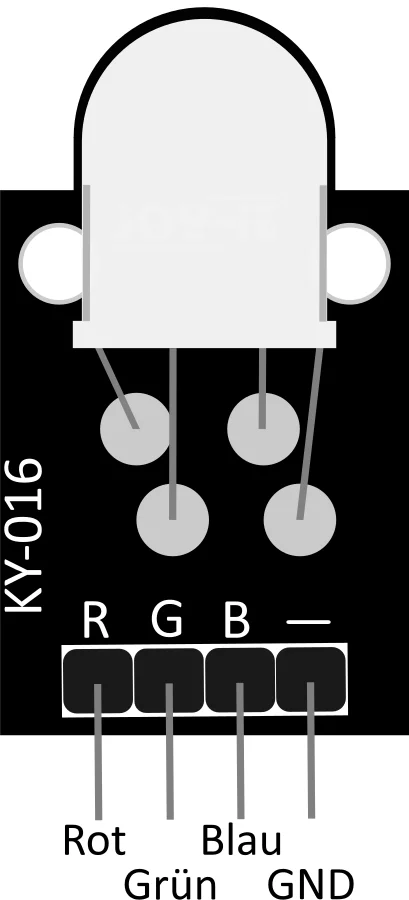](../../library/maker-media/b39eda54e805449087f650d727791eff8ab992ac52206e973a5136aae2e7e443.svg)

**pinout image** · Source image inspected; technical review pending

Manufacturer artwork; reproduction rights not established; not cleared for the printed book

## KY-019 5V Relais

Joy-IT · Manufacturer documentation recorded

[Open full gallery](https://valleytech-black-wire-guide.pages.dev/?tab=makers&part=maker-joy-it-62a590ade7e0)

[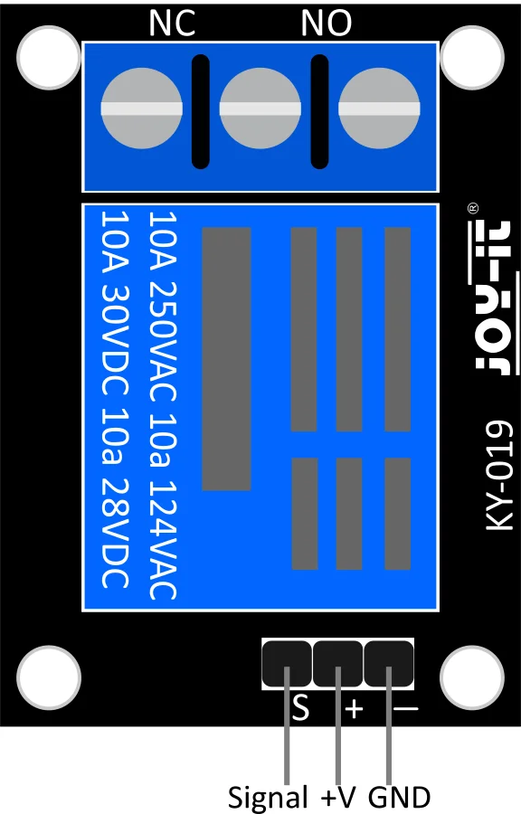](../../library/maker-media/7db48c37343691b464e4af5911bd331000695726c7c842fa480cc52aade0bd14.svg)

**pinout image** · Source image inspected; technical review pending

Manufacturer artwork; reproduction rights not established; not cleared for the printed book

## KY-029 2-Color 3mm LED

Joy-IT · Manufacturer documentation recorded

[Open full gallery](https://valleytech-black-wire-guide.pages.dev/?tab=makers&part=maker-joy-it-9fb34e2b8d0c)

[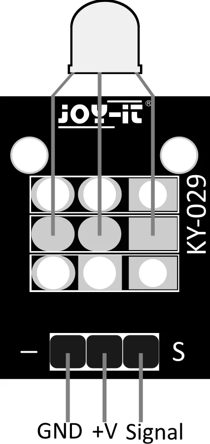](../../library/maker-media/746eaadda948b5fe4c54279935a31573956896eca68a0c54a15b532f94971886.svg)

**pinout image** · Source image inspected; technical review pending

Manufacturer artwork; reproduction rights not established; not cleared for the printed book

## KY-034 7 Color flash-LED

Joy-IT · Manufacturer documentation recorded

[Open full gallery](https://valleytech-black-wire-guide.pages.dev/?tab=makers&part=maker-joy-it-d5b815a83fa0)

[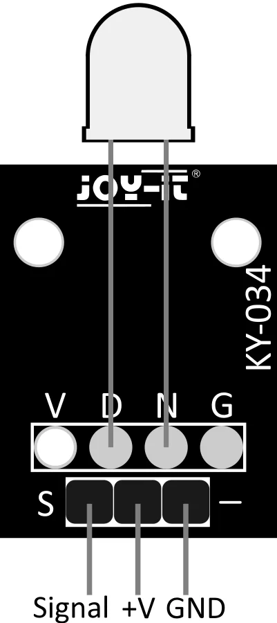](../../library/maker-media/6e1d0a8bca8b29982e80f082a55650c8c50844423d5dc518bb63cd70be0e82ad.svg)

**pinout image** · Source image inspected; technical review pending

Manufacturer artwork; reproduction rights not established; not cleared for the printed book

## LED Driver Board for XIAO

Seeed Studio · Source review pending

[Open full gallery](https://valleytech-black-wire-guide.pages.dev/?tab=makers&part=maker-existing-seeed-studio-expansion-led-driver-board-for-xiao)

[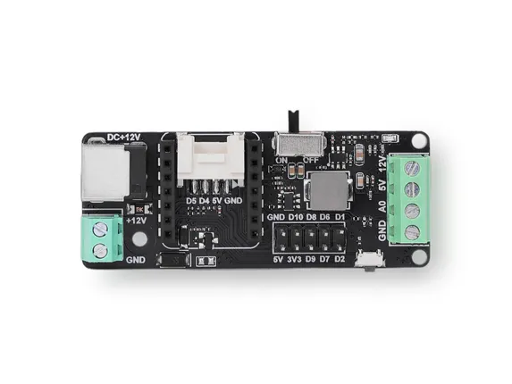](../../library/media/ffe6a89aab5b196aac552d72fc24b7585ebd45522bbdf66560611ad62420d711.jpg)

**board labeling image** · Reviewed source

Not established; source attribution retained

## Module DCMotor

M5Stack · Source review pending

[Open full gallery](https://valleytech-black-wire-guide.pages.dev/?tab=makers&part=maker-existing-m5stack-expansion-module-dcmotor)

**GPIO reference image** · Reviewed source

Not established; source attribution retained

## Module Servo

M5Stack · Source review pending

[Open full gallery](https://valleytech-black-wire-guide.pages.dev/?tab=makers&part=maker-existing-m5stack-expansion-module-servo)

**GPIO reference image** · Reviewed source

Not established; source attribution retained

## Module Stepmotor

M5Stack · Source review pending

[Open full gallery](https://valleytech-black-wire-guide.pages.dev/?tab=makers&part=maker-existing-m5stack-expansion-module-stepmotor)

**GPIO reference image** · Reviewed source

Not established; source attribution retained

## Module13.2 Stepmotor Driver v1.1

M5Stack · Source review pending

[Open full gallery](https://valleytech-black-wire-guide.pages.dev/?tab=makers&part=maker-existing-m5stack-expansion-module13-2-stepmotor-driver-v1-1)

[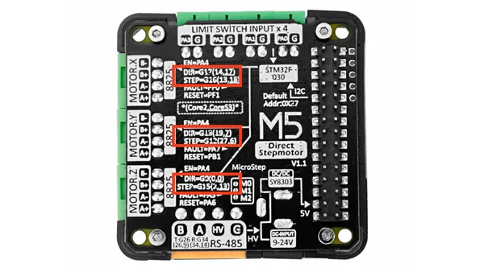](../../library/media/a02209c512ad7ff1e880b7f34d168284a9e01d589c5c3f4edcfcc334ddf7c26a.png)

**pinout image** · Reviewed source

Not established; source attribution retained

## Unit 2Relay

M5Stack · Source review pending

[Open full gallery](https://valleytech-black-wire-guide.pages.dev/?tab=makers&part=maker-existing-source-board-65eb2a314dd301abcc)

[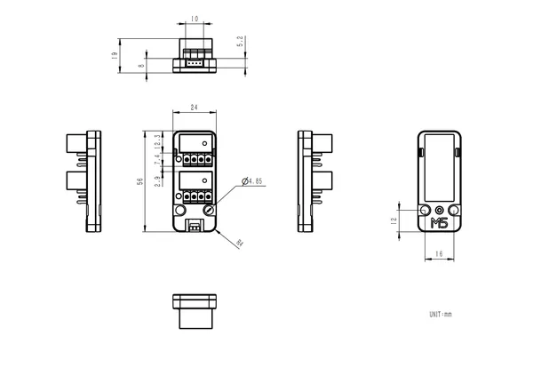](../../library/media/f80df2a33652551fbd762e3fee031206c69c3bad4044029406b73972f47b5b2e.png)

**source reference** · Unreviewed source

Source rights not yet established

## Unit 4Relay

M5Stack · Source review pending

[Open full gallery](https://valleytech-black-wire-guide.pages.dev/?tab=makers&part=maker-existing-source-board-7a1c360932c2af5e64)

[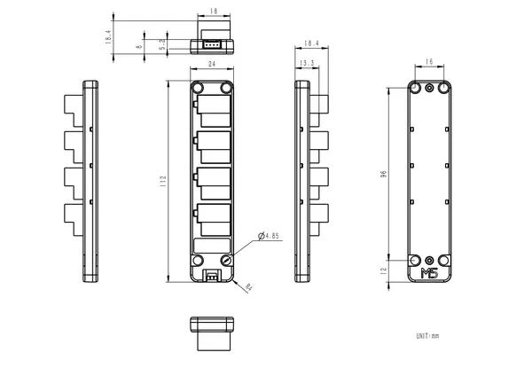](../../library/media/3432bf885d49a5ae90007605c6819be5bad54eeb379dd4ccaedd03004edfae54.png)

**source reference** · Unreviewed source

Source rights not yet established

## Unit 8Servos

M5Stack · Source review pending

[Open full gallery](https://valleytech-black-wire-guide.pages.dev/?tab=makers&part=maker-existing-source-board-aac83aba13e5a6ef0c)

[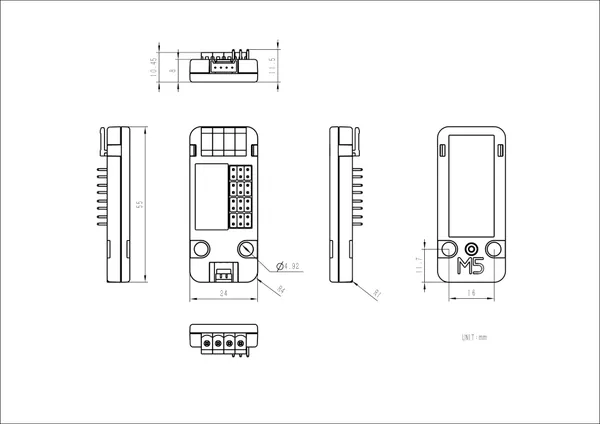](../../library/media/23ba85d8d34eafb9deb7259b7d68ceab34712820c1d47676c671a1c319fd8252.jpg)

**source reference** · Unreviewed source

Source rights not yet established

## Unit 8Servos2-Chain

M5Stack · Source review pending

[Open full gallery](https://valleytech-black-wire-guide.pages.dev/?tab=makers&part=maker-existing-source-board-1236d859c33d2398ca)

**source reference** · Unreviewed source

Source rights not yet established

## Unit 8Servos2-I2C

M5Stack · Source review pending

[Open full gallery](https://valleytech-black-wire-guide.pages.dev/?tab=makers&part=maker-existing-m5stack-expansion-unit-8servos2-i2c)

[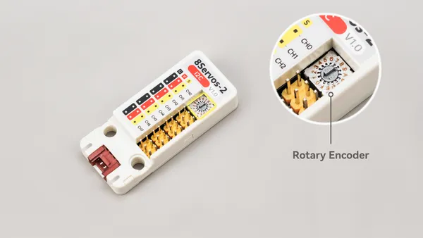](../../library/media/f7dba6934728bb290f982c32f9fc61550434f63955358763469650e115266ab8.png)

**board labeling image** · Reviewed source

Not established; source attribution retained

## Unit Buzzer

M5Stack · Source review pending

[Open full gallery](https://valleytech-black-wire-guide.pages.dev/?tab=makers&part=maker-existing-source-board-801de8099af0a1c5c4)

**source reference** · Unreviewed source

Source rights not yet established

## Unit Relay

M5Stack · Source review pending

[Open full gallery](https://valleytech-black-wire-guide.pages.dev/?tab=makers&part=maker-existing-source-board-d68745531c69f4b7db)

[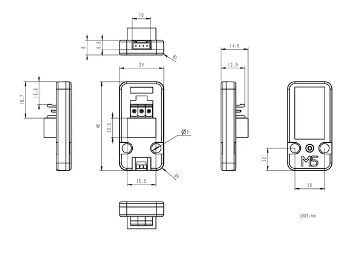](../../library/media/6cd191a82515b185efbc6ffe4588db860936b853f37f4bb5ac5280af2bc2fcc4.png)

**source reference** · Unreviewed source

Source rights not yet established

## WS2812 addressable LED modules

Generic / manufacturer unconfirmed · Identification needed

[Open full gallery](https://valleytech-black-wire-guide.pages.dev/?tab=makers&part=maker-generic-ws2812-addressable-led-modules)

Matching image still needed.
