# Power & charging / visual references

[All categories](../../MAKER_VISUALS.md) · [Image attribution ledger](../../catalog/maker-attributions.json)

Source references remain unchanged. Check exact PCB/revision, source notes and rights before reuse. Photos and partial connector diagrams are not complete-device approvals.

## Adafruit Powerboost 1000 Basic

Adafruit · Manufacturer documentation recorded

[Open full gallery](https://valleytech-black-wire-guide.pages.dev/?tab=makers&part=maker-adafruit-50b7b2b3df89)

[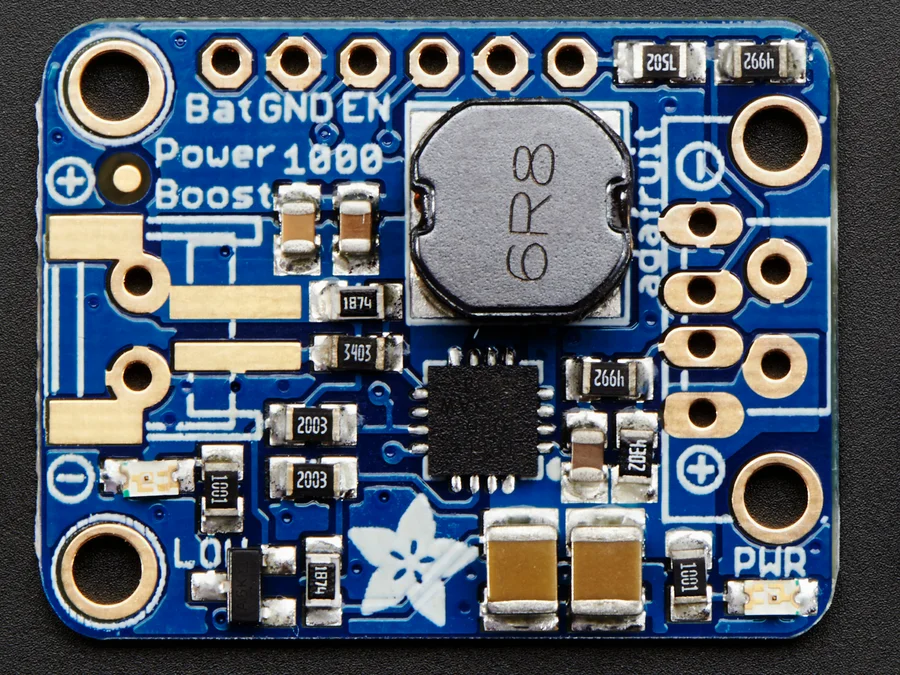](../../library/maker-media/6f0d6b26480689596f09162c41a5e5a1a59034f37f7d03ae6f50283c18878c5d.jpg)

**source reference** · Source image inspected; technical review pending

Adafruit Industries / original asset contributor. https://creativecommons.org/licenses/by-sa/3.0/; original image unchanged. See linked asset page for creator and terms.

## Adafruit Powerboost 1000C

Adafruit · Manufacturer documentation recorded

[Open full gallery](https://valleytech-black-wire-guide.pages.dev/?tab=makers&part=maker-adafruit-11fc5d17cd6f)

[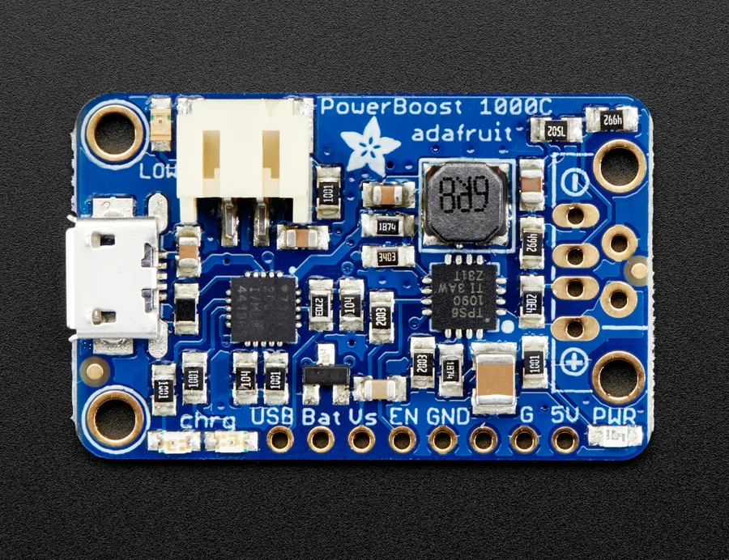](../../library/maker-media/4c1df590df275cc57ee972db0a8c4624306edcd94f1469406115161ee6fd284c.jpg)

**source reference** · Source image inspected; technical review pending

Adafruit Industries / original asset contributor. https://creativecommons.org/licenses/by-sa/3.0/; original image unchanged. See linked asset page for creator and terms.

## Adafruit PowerBoost 500 + Charger

Adafruit · Manufacturer documentation recorded

[Open full gallery](https://valleytech-black-wire-guide.pages.dev/?tab=makers&part=maker-adafruit-44fa7ce955f3)

[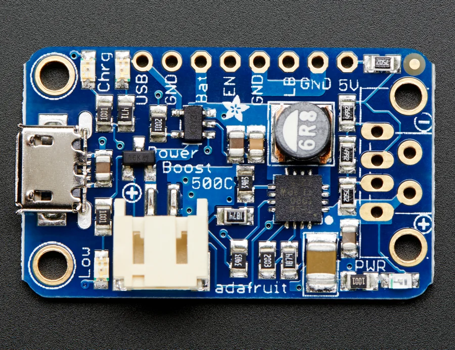](../../library/maker-media/90f9d1847558e7d42831a5ae5a1d237d2e879a93b346a13971e71d7d704d5e25.jpg)

**source reference** · Source image inspected; technical review pending

Adafruit Industries / original asset contributor. https://creativecommons.org/licenses/by-sa/3.0/; original image unchanged. See linked asset page for creator and terms.

## Adafruit Universal USB / DC / Solar Lithium Ion/Polymer charger - BQ24074

Adafruit · Manufacturer documentation recorded

[Open full gallery](https://valleytech-black-wire-guide.pages.dev/?tab=makers&part=maker-adafruit-93c799be9ed6)

[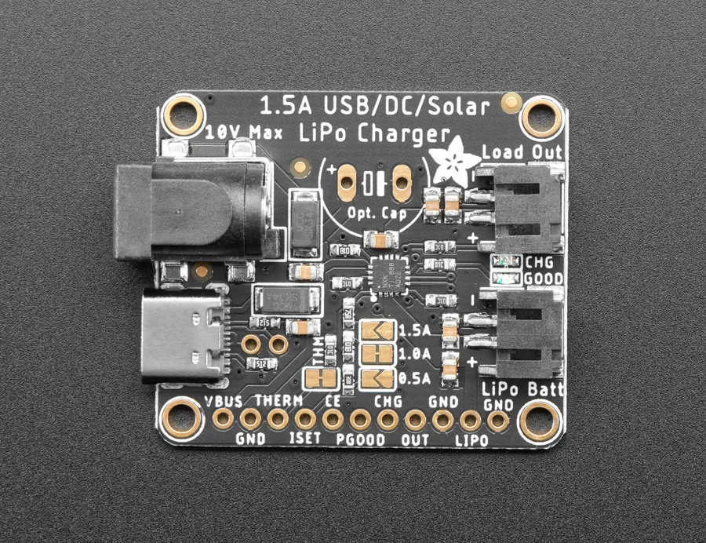](../../library/maker-media/f8ffe6e98b241f18b5a870c420c33fbd5453a42dd70516fb4b8a21409078fcda.jpg)

**source reference** · Source image inspected; technical review pending

Manufacturer artwork; reproduction rights not established; not cleared for the printed book

## CN3165 Solar Power Management Module (DFR0559)

DFRobot · Manufacturer documentation recorded

[Open full gallery](https://valleytech-black-wire-guide.pages.dev/?tab=makers&part=maker-dfrobot-07cea1af709f)

[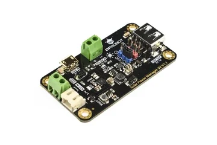](../../library/maker-media/82adaa64cd8eb3021a92a4383eae3af418df51853c40e5c34e54a475156f7275.webp)

**identification photo** · Source image inspected; technical review pending

Manufacturer artwork; reproduction rights not established; not cleared for the printed book

## DC-DC Buck Converter Module (DFR1025)

DFRobot · Manufacturer documentation recorded

[Open full gallery](https://valleytech-black-wire-guide.pages.dev/?tab=makers&part=maker-dfrobot-fc08dfdf432e)

[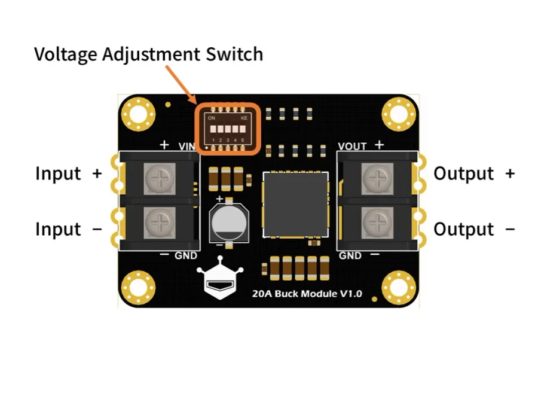](../../library/maker-media/5b7741ba7f219bf16801ba3bb58fdd5642833f848aaab27396f4da8f3f07c9bb.webp)

**pinout image** · Source image inspected; technical review pending

Manufacturer artwork; reproduction rights not established; not cleared for the printed book

## DC-DC Buck Converter Power Module (DFR0831)

DFRobot · Manufacturer documentation recorded

[Open full gallery](https://valleytech-black-wire-guide.pages.dev/?tab=makers&part=maker-dfrobot-1c921925e669)

[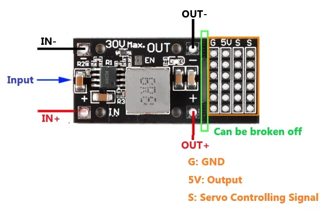](../../library/maker-media/3bfcb92a455a7d269cb4fc01894894cb77426d95b4f55032ad3aa4054d3c686e.webp)

**pinout image** · Source image inspected; technical review pending

Manufacturer artwork; reproduction rights not established; not cleared for the printed book

## DC-DC buck-boost converter DFR0946

DFRobot · Manufacturer documentation recorded

[Open full gallery](https://valleytech-black-wire-guide.pages.dev/?tab=makers&part=maker-power-82efdaa39b70)

[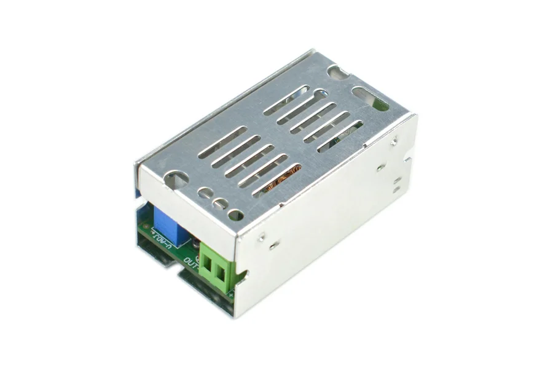](../../library/maker-media/952fc900770f68402ba6d5da4dffb079e9fe24432660b7ddd87da2e455f274eb.jpg)

**identification photo** · Source image inspected; technical review pending

Manufacturer artwork; reproduction rights not established; not cleared for the printed book

## DC5-36-TO-DC3V3-5 buck module

Waveshare · Manufacturer documentation recorded

[Open full gallery](https://valleytech-black-wire-guide.pages.dev/?tab=makers&part=maker-power-e343809c3eab)

[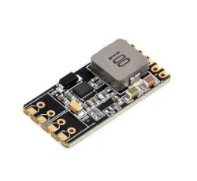](../../library/maker-media/1bd388a95efe8a5926879839cefbf5751981b7d687e7526f08fef674371fb1c8.jpg)

**identification photo** · Source image inspected; technical review pending

Manufacturer artwork; reproduction rights not established; not cleared for the printed book

## Gravity: MAX17043 3.7V Lithium Battery Fuel Gauge Module (DFR0563)

DFRobot · Manufacturer documentation recorded

[Open full gallery](https://valleytech-black-wire-guide.pages.dev/?tab=makers&part=maker-dfrobot-26c9bc388cd7)

[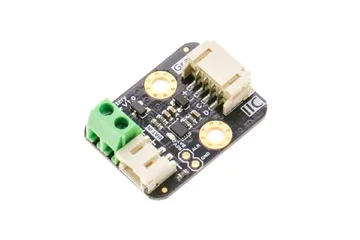](../../library/maker-media/3de4bee97f05777719df9bb05413a65e769dd97a7fd589f94bec7a5448d3fa83.webp)

**identification photo** · Source image inspected; technical review pending

Manufacturer artwork; reproduction rights not established; not cleared for the printed book

## GS2678 DC-DC Converter Module (DFR0205)

DFRobot · Manufacturer documentation recorded

[Open full gallery](https://valleytech-black-wire-guide.pages.dev/?tab=makers&part=maker-dfrobot-6b63744042ac)

[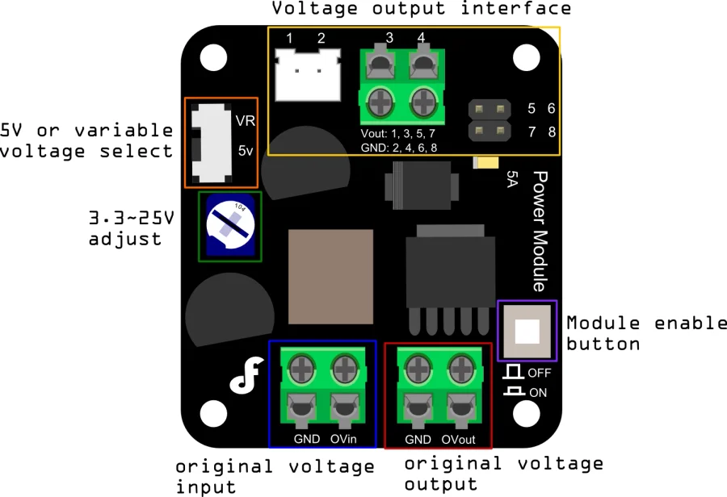](../../library/maker-media/39e58dd32cf7acb3f926b3ff40482d54c943db2d9dfac36571109abdc4f99d7c.webp)

**pinout image** · Source image inspected; technical review pending

Manufacturer artwork; reproduction rights not established; not cleared for the printed book

## LM2596 buck module — Sunrom 4314

Sunrom (seller; OEM unconfirmed) · Seller identification; technical review needed

[Open full gallery](https://valleytech-black-wire-guide.pages.dev/?tab=makers&part=maker-power-e07fb4989949)

[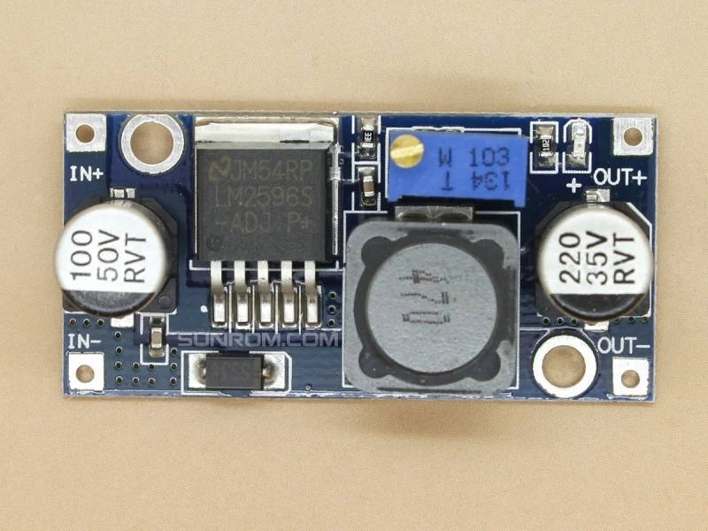](../../library/maker-media/25068b84779f63cab86018efcfff83fb71071e02b81e33c5b2905c3c2acd8cd3.jpg)

**identification photo** · Source image inspected; technical review pending

Manufacturer artwork; reproduction rights not established; not cleared for the printed book

## LTC3652 Solar Power Management Module (DFR0535)

DFRobot · Manufacturer documentation recorded

[Open full gallery](https://valleytech-black-wire-guide.pages.dev/?tab=makers&part=maker-dfrobot-9cec44edde33)

[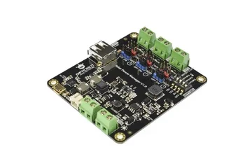](../../library/maker-media/ddc27f5f52114ca3bf9a83e388cf8825b457c957bc85df47560633493e6f902b.webp)

**identification photo** · Source image inspected; technical review pending

Manufacturer artwork; reproduction rights not established; not cleared for the printed book

## Mini boost module DFR0952

DFRobot · Manufacturer documentation recorded

[Open full gallery](https://valleytech-black-wire-guide.pages.dev/?tab=makers&part=maker-power-dee1c28096b6)

[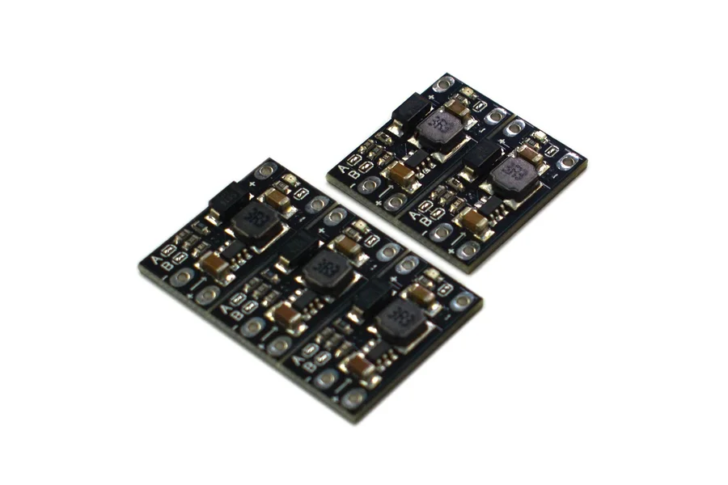](../../library/maker-media/e6c1f9a1be4c0d018c434b85052424d3cb99ab23f5bfb045d7f439c9e754a3c8.jpg)

**identification photo** · Source image inspected; technical review pending

Manufacturer artwork; reproduction rights not established; not cleared for the printed book

## Module Battery

M5Stack · Source review pending

[Open full gallery](https://valleytech-black-wire-guide.pages.dev/?tab=makers&part=maker-existing-source-board-c203ae1acad081e528)

**source reference** · Unreviewed source

Source rights not yet established

## MP1584 buck module — Sunrom 4498

Sunrom (seller; OEM unconfirmed) · Seller identification; technical review needed

[Open full gallery](https://valleytech-black-wire-guide.pages.dev/?tab=makers&part=maker-power-926d4b35f8d8)

[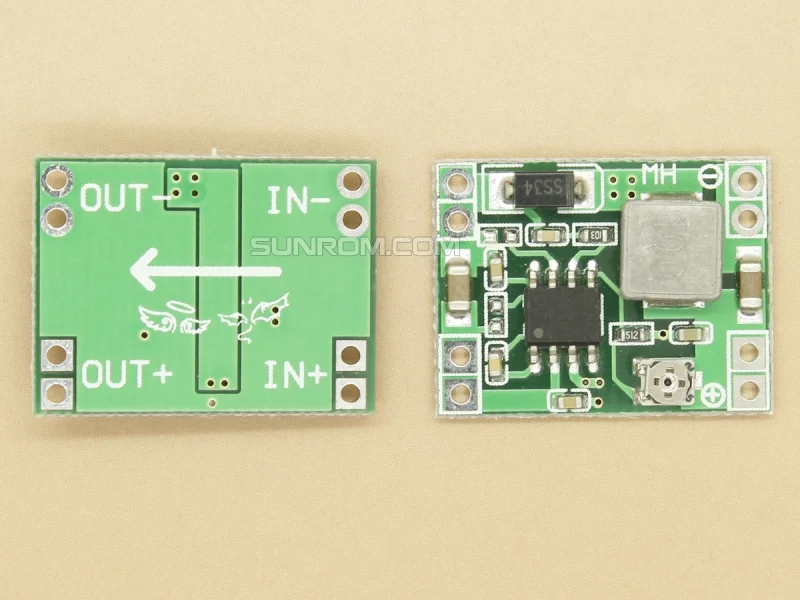](../../library/maker-media/e9c23872e6ed3bb37be34d558bd6fefd40ba32feca37f89fba5f0b4f6444b257.jpg)

**identification photo** · Source image inspected; technical review pending

Manufacturer artwork; reproduction rights not established; not cleared for the printed book

## MT3608 boost module — Sunrom 4576

Sunrom (seller; OEM unconfirmed) · Seller identification; technical review needed

[Open full gallery](https://valleytech-black-wire-guide.pages.dev/?tab=makers&part=maker-power-7d42ca26a549)

[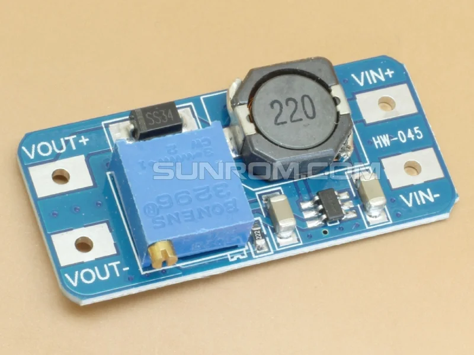](../../library/maker-media/9df821d38d8a3e22d118ce8733385bdb2d2b343e5156b510527c474870d6213d.jpg)

**identification photo** · Source image inspected; technical review pending

Manufacturer artwork; reproduction rights not established; not cleared for the printed book

## Pololu 5V Step-Up Voltage Regulator U1V11F5

Pololu · Manufacturer documentation recorded

[Open full gallery](https://valleytech-black-wire-guide.pages.dev/?tab=makers&part=maker-pololu-3b241b83a098)

[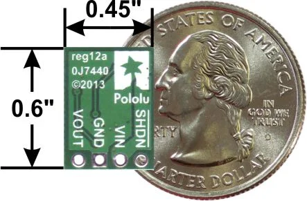](../../library/maker-media/17623950aa10ce79d138bc5cefb47c926559af02d1ae7e5e55be6c86dfea8871.jpg)

**pinout image** · Source image inspected; technical review pending

Manufacturer artwork; reproduction rights not established; not cleared for the printed book

## Pololu 5V Step-Up/Step-Down Voltage Regulator S7V8F5

Pololu · Manufacturer documentation recorded

[Open full gallery](https://valleytech-black-wire-guide.pages.dev/?tab=makers&part=maker-pololu-16b3e62c449a)

[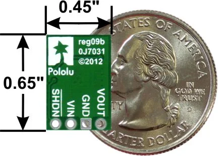](../../library/maker-media/f5d0c32300170b250eecdf099159c2a25977999e304bb2d579a7936d9409fa51.jpg)

**pinout image** · Source image inspected; technical review pending

Manufacturer artwork; reproduction rights not established; not cleared for the printed book

## Pololu 5V, 1A Step-Down Voltage Regulator D24V10F5

Pololu · Manufacturer documentation recorded

[Open full gallery](https://valleytech-black-wire-guide.pages.dev/?tab=makers&part=maker-pololu-e3046d322bfd)

[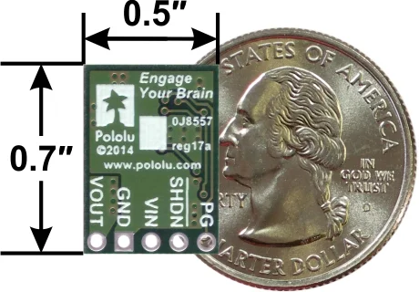](../../library/maker-media/1a158fa47a8f154e992bd37296be1571b2a542a0a92b3e4c73104bdd7905e8fb.jpg)

**pinout image** · Source image inspected; technical review pending

Manufacturer artwork; reproduction rights not established; not cleared for the printed book

## Solar Power Manager

Waveshare · Manufacturer documentation recorded

[Open full gallery](https://valleytech-black-wire-guide.pages.dev/?tab=makers&part=maker-waveshare-98e5f4b5a1d7)

[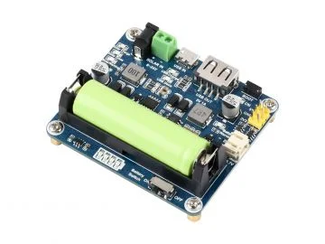](../../library/maker-media/c07062e0ae7ae4da20e5aa1ee5da553d3e1c27c8798499f9b3821fc05e05c7b2.jpg)

**identification photo** · Source image inspected; technical review pending

Manufacturer artwork; reproduction rights not established; not cleared for the printed book

## SPV1050 Solar Power Management Module (DFR0579)

DFRobot · Manufacturer documentation recorded

[Open full gallery](https://valleytech-black-wire-guide.pages.dev/?tab=makers&part=maker-dfrobot-5ea29ad6e94a)

[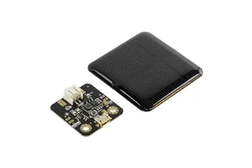](../../library/maker-media/bd1a49d1db5e2c97985b05dcf8c19e9d7f374f1cbe477ee656483be71d3c4365.webp)

**identification photo** · Source image inspected; technical review pending

Manufacturer artwork; reproduction rights not established; not cleared for the printed book

## SY6982C 7.4V LiPo Battery USB Charging Module (DFR0564)

DFRobot · Manufacturer documentation recorded

[Open full gallery](https://valleytech-black-wire-guide.pages.dev/?tab=makers&part=maker-dfrobot-02aaaf3a68b2)

[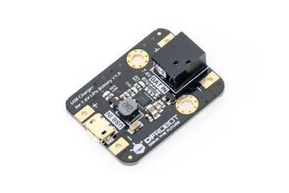](../../library/maker-media/5189ebf3508df021d27ccd31aecb6968a17320ddc712fd9c26f20a7cbe6aebe3.webp)

**identification photo** · Source image inspected; technical review pending

Manufacturer artwork; reproduction rights not established; not cleared for the printed book

## TP4056 USB-C charger with protection — Sunrom 5949

Sunrom (seller; OEM unconfirmed) · Seller identification; technical review needed

[Open full gallery](https://valleytech-black-wire-guide.pages.dev/?tab=makers&part=maker-power-7e8f975e5e40)

[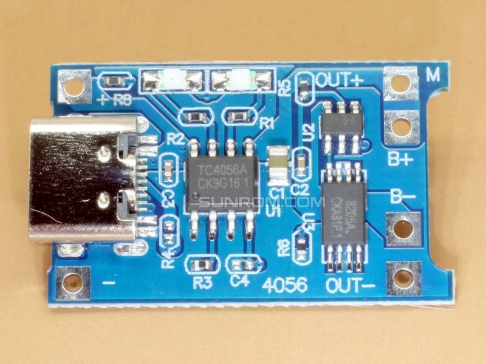](../../library/maker-media/b5decd52acc39dc9a61886eba28d80ad6d1c9dc8ccf9a622f7fb9ed829ed50f2.jpg)

**identification photo** · Source image inspected; technical review pending

Manufacturer artwork; reproduction rights not established; not cleared for the printed book

## TP4056X MicroUSB Lipo Charger Module (DFR0667)

DFRobot · Manufacturer documentation recorded

[Open full gallery](https://valleytech-black-wire-guide.pages.dev/?tab=makers&part=maker-dfrobot-8e4275476361)

[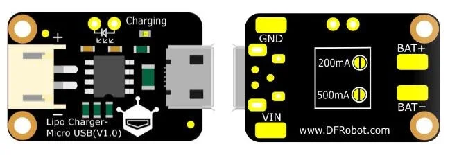](../../library/maker-media/f73c443e81b482748c3e870537560a0e164adb6ffd283189d3008bf6d4662bc8.webp)

**pinout image** · Source image inspected; technical review pending

Manufacturer artwork; reproduction rights not established; not cleared for the printed book

## TP4056X Type-C Lipo Charger Module (DFR0668)

DFRobot · Manufacturer documentation recorded

[Open full gallery](https://valleytech-black-wire-guide.pages.dev/?tab=makers&part=maker-dfrobot-66edd1629d47)

[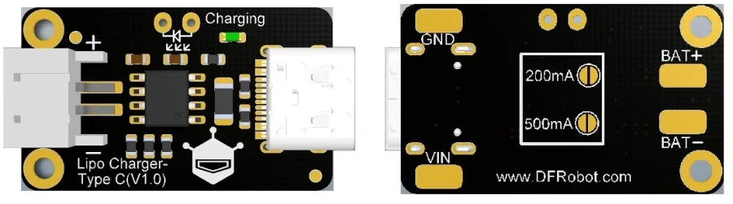](../../library/maker-media/d3811631bed40f41354d68d99053e16add1a03fedc03107b07544d93f5e3de98.webp)

**pinout image** · Source image inspected; technical review pending

Manufacturer artwork; reproduction rights not established; not cleared for the printed book

## TP4057 charging module — DIY-Thermocam assembly variant

DIY-Thermocam reference / OEM unconfirmed · Project identification; technical review needed

[Open full gallery](https://valleytech-black-wire-guide.pages.dev/?tab=makers&part=maker-power-6c7895c83432)

[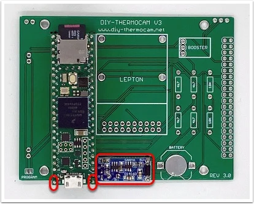](../../library/maker-media/a293a8fcfeb2d969cde677c791f9f2d4c613d6cfe65f048ac4eb9302119bc8f8.jpg)

**identification photo** · Source image inspected; technical review pending

Manufacturer artwork; reproduction rights not established; not cleared for the printed book

## UPS Module 3S

Waveshare · Manufacturer documentation recorded

[Open full gallery](https://valleytech-black-wire-guide.pages.dev/?tab=makers&part=maker-waveshare-b66fa68e62af)

[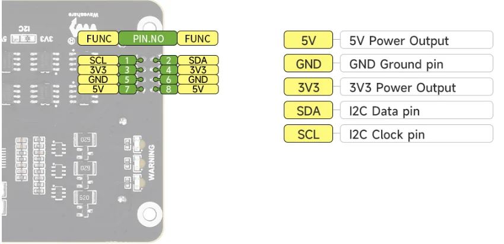](../../library/maker-media/c9a08c456057961989c264fcaeafa28b2c57775dd05e8c83952653c072251536.png)

**pinout image** · Source image inspected; technical review pending

Manufacturer artwork; reproduction rights not established; not cleared for the printed book

## UPS Module Mini

Waveshare · Manufacturer documentation recorded

[Open full gallery](https://valleytech-black-wire-guide.pages.dev/?tab=makers&part=maker-waveshare-f9cdecc7e49d)

[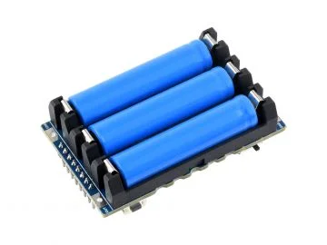](../../library/maker-media/fd8763fead24ace979df956bd592eaa57869b5e1fa33c554d19260e431b6ea30.jpg)

**identification photo** · Source image inspected; technical review pending

Manufacturer artwork; reproduction rights not established; not cleared for the printed book

## UPS Power Module (C)

Waveshare · Source review pending

[Open full gallery](https://valleytech-black-wire-guide.pages.dev/?tab=makers&part=maker-existing-waveshare-expansion-ups-power-module-c)

**pinout image** · Reviewed source

Not established; source attribution retained

## XIAO PowerBread

Seeed Studio · Source review pending

[Open full gallery](https://valleytech-black-wire-guide.pages.dev/?tab=makers&part=maker-existing-seeed-studio-expansion-xiao-powerbread)

**board labeling image** · Reviewed source

Not established; source attribution retained

## XL6009 boost module — Sunrom 4316

Sunrom (seller; OEM unconfirmed) · Seller identification; technical review needed

[Open full gallery](https://valleytech-black-wire-guide.pages.dev/?tab=makers&part=maker-power-705667cffe64)

[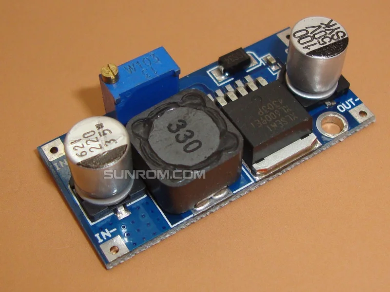](../../library/maker-media/d5d77e030922764e72ee20c453b84bb5aaea31ca4789b1e4e469d85457ccf0f9.jpg)

**identification photo** · Source image inspected; technical review pending

Manufacturer artwork; reproduction rights not established; not cleared for the printed book
