# Sensors / visual references

[All categories](../../MAKER_VISUALS.md) · [Image attribution ledger](../../catalog/maker-attributions.json)

Manufacturer originals remain unchanged. Connector-model sheets add separately labeled callouts under the recorded source license. Check exact PCB/revision, source notes and rights before reuse. Photos and partial connector diagrams are not complete-device approvals.

## Adafruit AHT20 Temperature & Humidity Sensor

Adafruit · Manufacturer documentation recorded

[Open full gallery](https://valleytech-black-wire-guide.pages.dev/?tab=makers&part=maker-adafruit-a80cab59debc)

[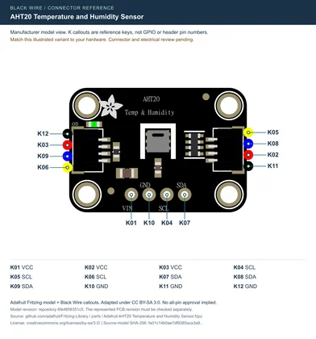](../../library/maker-media/9b6259c8d6ec264853f4180c0674019ec43c9eca478ade062734ddbaaae9f502.svg)

**pinout image** · Manufacturer-model geometry checked; independent electrical and full-device review pending

Adafruit manufacturer illustration with Black Wire connector callouts, adapted under CC BY-SA 3.0. Attribution and share-alike terms apply to this sheet.

## Adafruit APDS9960 breakout

Adafruit · Manufacturer documentation recorded

[Open full gallery](https://valleytech-black-wire-guide.pages.dev/?tab=makers&part=maker-adafruit-4390e7df6964)

[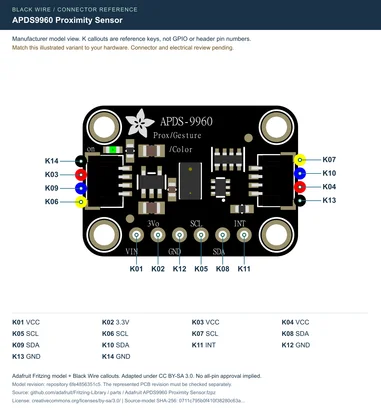](../../library/maker-media/015b655184972e83e5cbcb8d3bb511af82e043531c86b113996f249f81af0440.svg)

**pinout image** · Manufacturer-model geometry checked; independent electrical and full-device review pending

Adafruit manufacturer illustration with Black Wire connector callouts, adapted under CC BY-SA 3.0. Attribution and share-alike terms apply to this sheet.

## Adafruit BH1750 Ambient Light Sensor

Adafruit · Manufacturer documentation recorded

[Open full gallery](https://valleytech-black-wire-guide.pages.dev/?tab=makers&part=maker-adafruit-1e2e6f5dc16e)

[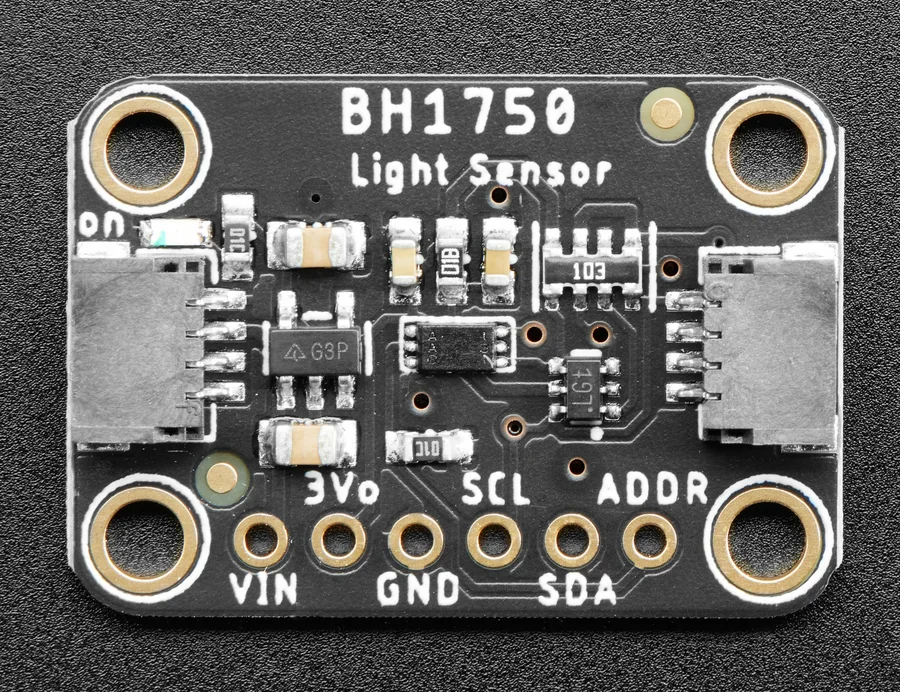](../../library/maker-media/49b86e63f5a3ee8dd72563719f330cd44b49adc3f5443e7f3c80da997149b269.png)

**source reference** · Source image inspected; technical review pending

Manufacturer artwork; reproduction rights not established; not cleared for the printed book

## Adafruit BME280 Humidity + Barometric Pressure + Temperature Sensor Breakout

Adafruit · Manufacturer documentation recorded

[Open full gallery](https://valleytech-black-wire-guide.pages.dev/?tab=makers&part=maker-adafruit-bc61583da117)

[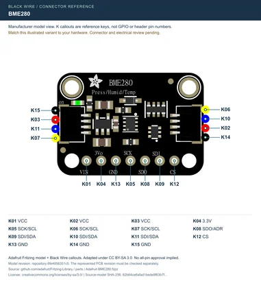](../../library/maker-media/d26e5f86a6e6567e4a2e0adb37d83d2f8186d40e04dc9842866b5f651dcd78ff.svg)

**pinout image** · Manufacturer-model geometry checked; independent electrical and full-device review pending

Adafruit manufacturer illustration with Black Wire connector callouts, adapted under CC BY-SA 3.0. Attribution and share-alike terms apply to this sheet.

## Adafruit BME680

Adafruit · Manufacturer documentation recorded

[Open full gallery](https://valleytech-black-wire-guide.pages.dev/?tab=makers&part=maker-adafruit-cf6c8b88cee4)

[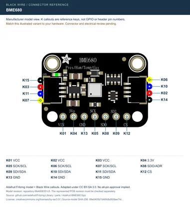](../../library/maker-media/390eb2bfb9ccb1721f44020dc9e0bc23ef50e9770450a4e4fd9a341de0e3156f.svg)

**pinout image** · Manufacturer-model geometry checked; independent electrical and full-device review pending

Adafruit manufacturer illustration with Black Wire connector callouts, adapted under CC BY-SA 3.0. Attribution and share-alike terms apply to this sheet.

## Adafruit BMP280 Barometric Pressure + Temperature Sensor Breakout

Adafruit · Manufacturer documentation recorded

[Open full gallery](https://valleytech-black-wire-guide.pages.dev/?tab=makers&part=maker-adafruit-4b0001459b22)

[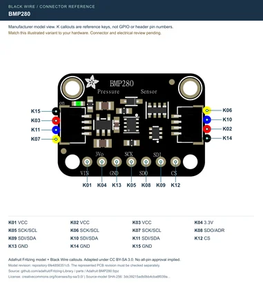](../../library/maker-media/9384784466fbb5223e4aacf59c45dc9e103679fa5e8262922b308befb3839e59.svg)

**pinout image** · Manufacturer-model geometry checked; independent electrical and full-device review pending

Adafruit manufacturer illustration with Black Wire connector callouts, adapted under CC BY-SA 3.0. Attribution and share-alike terms apply to this sheet.

## Adafruit BNO055 Absolute Orientation Sensor

Adafruit · Manufacturer documentation recorded

[Open full gallery](https://valleytech-black-wire-guide.pages.dev/?tab=makers&part=maker-adafruit-033e26673f5e)

[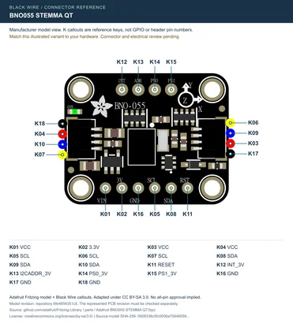](../../library/maker-media/d0294c78cd17a52935d368da0d9a0dc1543edd5a25015b234ec515cfb8fc4a4c.svg)

**pinout image** · Manufacturer-model geometry checked; independent electrical and full-device review pending

Adafruit manufacturer illustration with Black Wire connector callouts, adapted under CC BY-SA 3.0. Attribution and share-alike terms apply to this sheet.

## Adafruit INA219 Current Sensor Breakout

Adafruit · Manufacturer documentation recorded

[Open full gallery](https://valleytech-black-wire-guide.pages.dev/?tab=makers&part=maker-adafruit-3e9ba2e85414)

[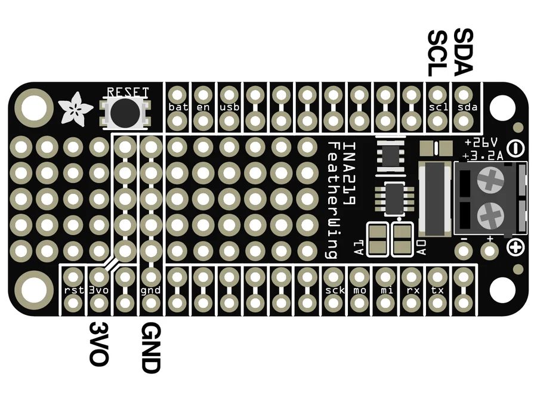](../../library/maker-media/6e40f24527a2263efb625e497e41f2b3b021eb1b691072a44e002e3f3d37e33a.png)

**pinout image** · Connector diagram visually inspected; independent electrical review pending

Adafruit Industries / original asset contributor. https://creativecommons.org/licenses/by-sa/3.0/; original image unchanged. See linked asset page for creator and terms.

## Adafruit INA260 Current + Voltage + Power Sensor Breakout

Adafruit · Manufacturer documentation recorded

[Open full gallery](https://valleytech-black-wire-guide.pages.dev/?tab=makers&part=maker-adafruit-d2748c21e7ce)

[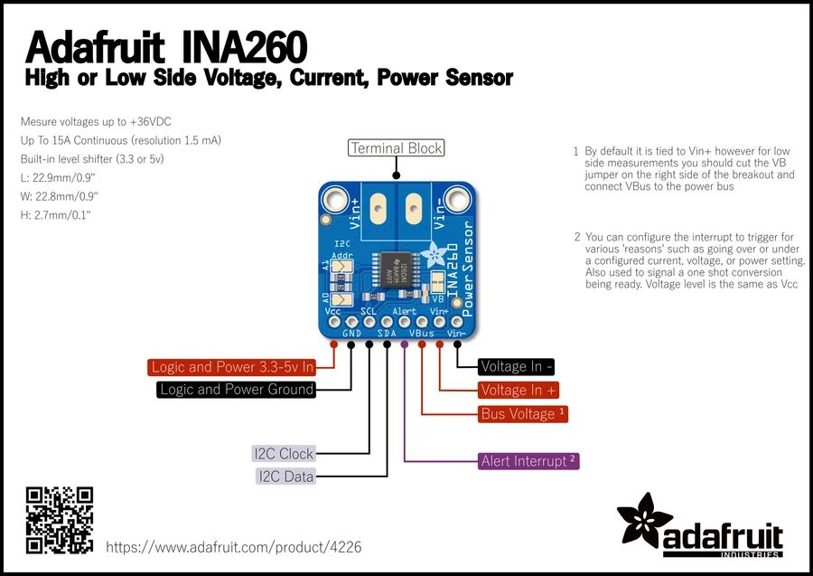](../../library/maker-media/9e060f64e5aa0e845d7a87d1b377515b9c23407ba2b85fcef78da254278d89aa.png)

**pinout image** · Connector diagram visually inspected; independent electrical review pending

Adafruit Industries / original asset contributor. https://creativecommons.org/licenses/by-sa/3.0/; original image unchanged. See linked asset page for creator and terms.

## Adafruit LIS3DH Triple-Axis Accelerometer Breakout

Adafruit · Manufacturer documentation recorded

[Open full gallery](https://valleytech-black-wire-guide.pages.dev/?tab=makers&part=maker-adafruit-333ef25b6ff3)

[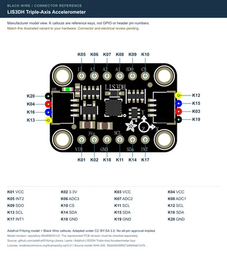](../../library/maker-media/61b6b5a8f3e88581c9dfd36bb4e7f45d7ab24614759d468f2bd5576d937050f5.svg)

**pinout image** · Manufacturer-model geometry checked; independent electrical and full-device review pending

Adafruit manufacturer illustration with Black Wire connector callouts, adapted under CC BY-SA 3.0. Attribution and share-alike terms apply to this sheet.

## Adafruit SCD-4x - True CO2 Temperature and Humidity Sensors

Adafruit · Manufacturer documentation recorded

[Open full gallery](https://valleytech-black-wire-guide.pages.dev/?tab=makers&part=maker-adafruit-357aa2b8b93a)

[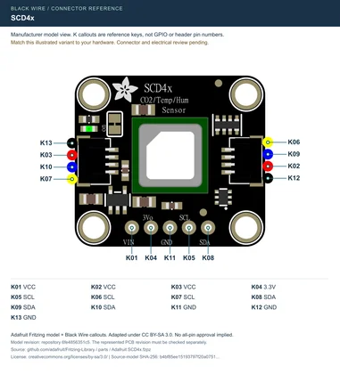](../../library/maker-media/8db2b5be01168cc37752330d4ea261f0cd08a7bd752695b5bc101b2855c853b9.svg)

**pinout image** · Manufacturer-model geometry checked; independent electrical and full-device review pending

Adafruit manufacturer illustration with Black Wire connector callouts, adapted under CC BY-SA 3.0. Attribution and share-alike terms apply to this sheet.

## Adafruit Sensirion SHT40, SHT41 & SHT45 Temperature & Humidity Sensors

Adafruit · Manufacturer documentation recorded

[Open full gallery](https://valleytech-black-wire-guide.pages.dev/?tab=makers&part=maker-adafruit-1a2b4f796497)

[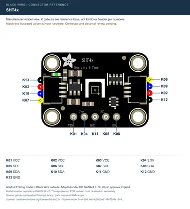](../../library/maker-media/6abc2410fbad7f20acee9d8d14c933bc65e3fd0e62e6d4b52dc8b09be4c049c4.svg)

**pinout image** · Manufacturer-model geometry checked; independent electrical and full-device review pending

Adafruit manufacturer illustration with Black Wire connector callouts, adapted under CC BY-SA 3.0. Attribution and share-alike terms apply to this sheet.

## Adafruit SHT31-D Temperature & Humidity Sensor Breakout

Adafruit · Manufacturer documentation recorded

[Open full gallery](https://valleytech-black-wire-guide.pages.dev/?tab=makers&part=maker-adafruit-1eb58493be3e)

[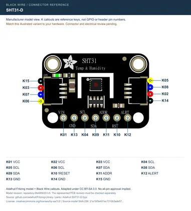](../../library/maker-media/f56d5188baf53fd231c6a9707f83ebbe1db66bd8f94d3c80b46d167d6bc5af6d.svg)

**pinout image** · Manufacturer-model geometry checked; independent electrical and full-device review pending

Adafruit manufacturer illustration with Black Wire connector callouts, adapted under CC BY-SA 3.0. Attribution and share-alike terms apply to this sheet.

## Adafruit VL53L0X Time of Flight Micro-LIDAR Distance Sensor Breakout

Adafruit · Manufacturer documentation recorded

[Open full gallery](https://valleytech-black-wire-guide.pages.dev/?tab=makers&part=maker-adafruit-b2e586290c14)

[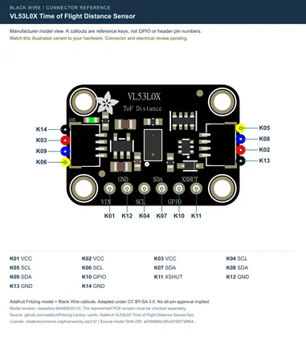](../../library/maker-media/d63c621551143f4fce4839feacf27f8cf065a9b07b25625f7192a8fbb401ace3.svg)

**pinout image** · Manufacturer-model geometry checked; independent electrical and full-device review pending

Adafruit manufacturer illustration with Black Wire connector callouts, adapted under CC BY-SA 3.0. Attribution and share-alike terms apply to this sheet.

## Adafruit VL53L1X Time of Flight Distance Sensor

Adafruit · Manufacturer documentation recorded

[Open full gallery](https://valleytech-black-wire-guide.pages.dev/?tab=makers&part=maker-adafruit-ce8520e58dc5)

[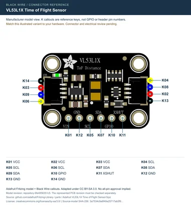](../../library/maker-media/a478b83a1656159ec455cb07bdeb99422f6f192ce16ee31129d872003f82854e.svg)

**pinout image** · Manufacturer-model geometry checked; independent electrical and full-device review pending

Adafruit manufacturer illustration with Black Wire connector callouts, adapted under CC BY-SA 3.0. Attribution and share-alike terms apply to this sheet.

## DHT11 and DHT22 breakout variants

Generic / manufacturer unconfirmed · Identification needed

[Open full gallery](https://valleytech-black-wire-guide.pages.dev/?tab=makers&part=maker-generic-dht11-and-dht22-breakout-variants)

Matching image still needed.

## Feather nRF52840 Sense

Adafruit · Manufacturer source references collected

[Open full gallery](https://valleytech-black-wire-guide.pages.dev/?tab=makers&part=maker-adafruit-feather-nrf52840-sense)

[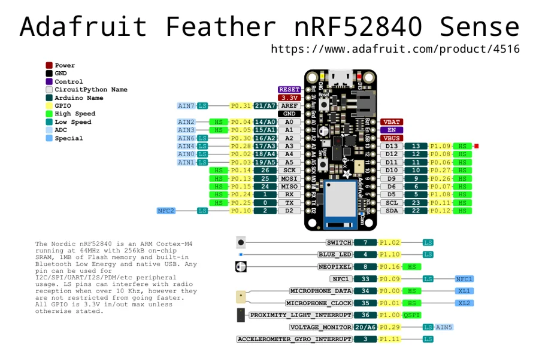](../../library/media/30716f3d2b3e7ebac06b37c10c85565e1e31fffa45ce73b26ee9cde3ac073561.png)

**pinout image** · Reviewed source

Adafruit / original diagram contributors. Rights not established for this asset; attribution retained. Original artwork is not covered by Black Wire's editorial license.

## Gravity: Analog Capacitive Corrosion Resistant Soil Moisture Sensor for Arduino / Raspberry Pi / SEN0193

DFRobot · Manufacturer documentation recorded

[Open full gallery](https://valleytech-black-wire-guide.pages.dev/?tab=makers&part=maker-dfrobot-c392b1494edb)

[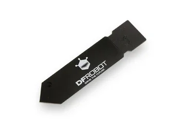](../../library/maker-media/54d9be3dae74a4e942458533b82e851de710408821af8ed14487b8e9d4ba82bf.webp)

**identification photo** · Source image inspected; technical review pending

Manufacturer artwork; reproduction rights not established; not cleared for the printed book

## Gravity: Analog Sound Level Sensor / SEN0232

DFRobot · Manufacturer documentation recorded

[Open full gallery](https://valleytech-black-wire-guide.pages.dev/?tab=makers&part=maker-dfrobot-82dbf92bcd45)

[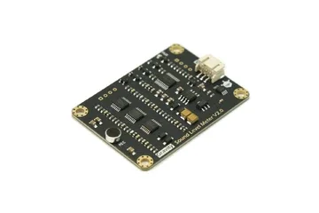](../../library/maker-media/e992f17de5785782af77cf641459c576c213481e28ab8b99e09fa7eecc573eac.webp)

**identification photo** · Source image inspected; technical review pending

Manufacturer artwork; reproduction rights not established; not cleared for the printed book

## Gravity: Electrochemical Oxygen / O2 Sensor (0-25%Vol) / SEN0322

DFRobot · Manufacturer documentation recorded

[Open full gallery](https://valleytech-black-wire-guide.pages.dev/?tab=makers&part=maker-dfrobot-7d4943403fb8)

[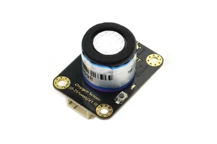](../../library/maker-media/744fd65732563f4efa4b7b2c131cc1f498b5f7654f55c9574ec30d32a78eb20a.webp)

**identification photo** · Source image inspected; technical review pending

Manufacturer artwork; reproduction rights not established; not cleared for the printed book

## Gravity: Laser PM2.5 Air Quality Sensor / SEN0177

DFRobot · Manufacturer documentation recorded

[Open full gallery](https://valleytech-black-wire-guide.pages.dev/?tab=makers&part=maker-dfrobot-9b446f8d2d68)

[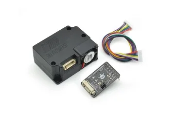](../../library/maker-media/9ac1e99bf4ca7074c61b6106132c8f83aa13eed168dc7a39dd02fdf7790922fa.webp)

**identification photo** · Source image inspected; technical review pending

Manufacturer artwork; reproduction rights not established; not cleared for the printed book

## Gravity: Waterproof Capacitive Soil Moisture Sensor / SEN0308

DFRobot · Manufacturer documentation recorded

[Open full gallery](https://valleytech-black-wire-guide.pages.dev/?tab=makers&part=maker-dfrobot-aae9e1e18b81)

[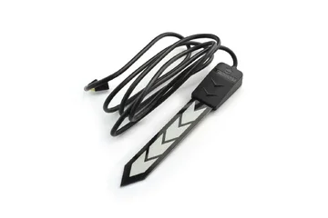](../../library/maker-media/c164193bc2b878f0a32d2238244ec84712fae00146000436e5710fd0b60046b3.webp)

**identification photo** · Source image inspected; technical review pending

Manufacturer artwork; reproduction rights not established; not cleared for the printed book

## HC-SR04 ultrasonic module variants

Generic / manufacturer unconfirmed · Identification needed

[Open full gallery](https://valleytech-black-wire-guide.pages.dev/?tab=makers&part=maker-generic-hc-sr04-ultrasonic-module-variants)

Matching image still needed.

## KY-001 Temperature sensor (DS18B20)

Joy-IT · Manufacturer documentation recorded

[Open full gallery](https://valleytech-black-wire-guide.pages.dev/?tab=makers&part=maker-joy-it-1f7410cec6e4)

[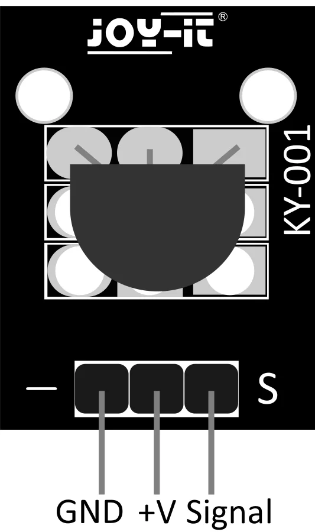](../../library/maker-media/05f9cc88deddf660fd1d25c8ced7f8329c312ac6348cd177577c5226582a61c4.svg)

**pinout image** · Source image inspected; technical review pending

Manufacturer artwork; reproduction rights not established; not cleared for the printed book

## KY-003 Hall magnetic field sensor

Joy-IT · Manufacturer documentation recorded

[Open full gallery](https://valleytech-black-wire-guide.pages.dev/?tab=makers&part=maker-joy-it-4ad4c121a597)

[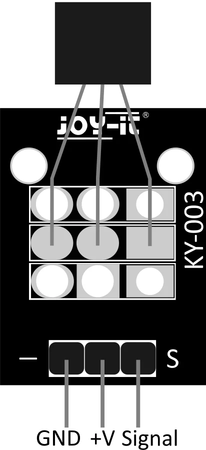](../../library/maker-media/7b0eaab8edb2f5cc1a81686e89ba62cf627afc55f5d361f03c51247d205e3462.svg)

**pinout image** · Source image inspected; technical review pending

Manufacturer artwork; reproduction rights not established; not cleared for the printed book

## KY-010 / KY-10 Light barrier

Joy-IT · Manufacturer documentation recorded

[Open full gallery](https://valleytech-black-wire-guide.pages.dev/?tab=makers&part=maker-joy-it-a5314cf5e14d)

[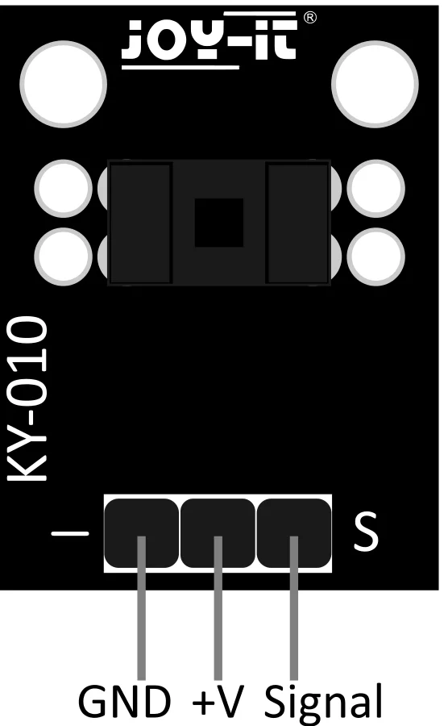](../../library/maker-media/cc05c6dc9b604983cfd303aedf3b4e0a01851fccabaa599470ddb2c16e0410b2.svg)

**pinout image** · Source image inspected; technical review pending

Manufacturer artwork; reproduction rights not established; not cleared for the printed book

## KY-013 Temperature sensor (NTC)

Joy-IT · Manufacturer documentation recorded

[Open full gallery](https://valleytech-black-wire-guide.pages.dev/?tab=makers&part=maker-joy-it-93d18fd1f19b)

[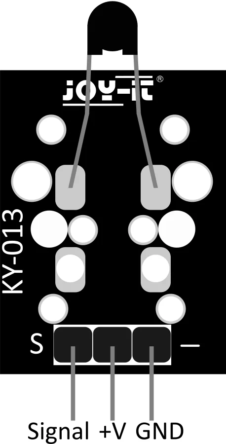](../../library/maker-media/2bff134c467719c5fdcaa313ea2a990990af91c408456425476ed9b4be8edf50.svg)

**pinout image** · Source image inspected; technical review pending

Manufacturer artwork; reproduction rights not established; not cleared for the printed book

## KY-015 Combi-Sensor (temperature & humidity)

Joy-IT · Manufacturer documentation recorded

[Open full gallery](https://valleytech-black-wire-guide.pages.dev/?tab=makers&part=maker-joy-it-5fc07c43b5c4)

[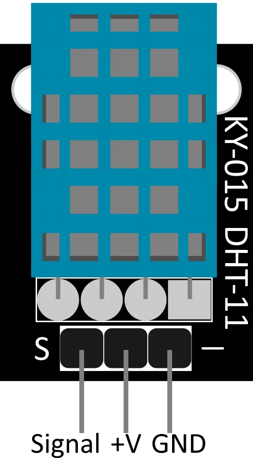](../../library/maker-media/9ff5357213177e8cb47bc2000406c1edddb024f81a2b1cf17adf4f7a5ab6d3b1.svg)

**pinout image** · Source image inspected; technical review pending

Manufacturer artwork; reproduction rights not established; not cleared for the printed book

## KY-018 Photoresistor

Joy-IT · Manufacturer documentation recorded

[Open full gallery](https://valleytech-black-wire-guide.pages.dev/?tab=makers&part=maker-joy-it-50ff19641a64)

[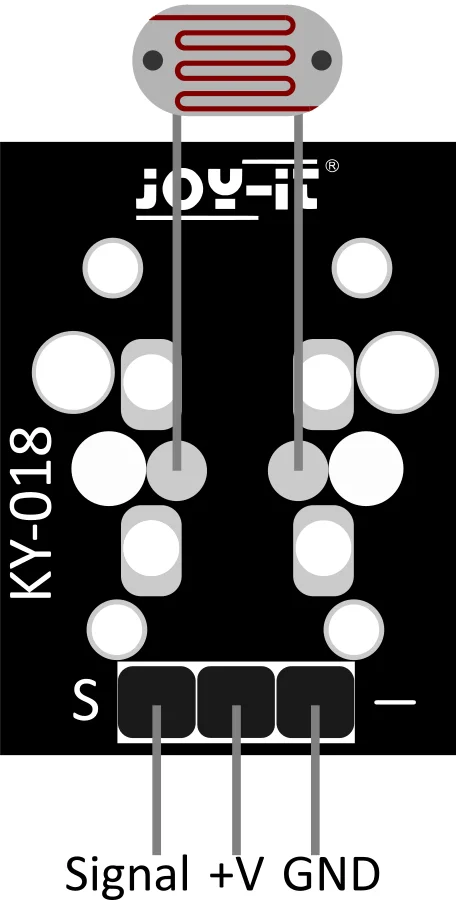](../../library/maker-media/9f70d5b87e13d066854945e9ce2904313c3fccd328882beb9154df9ff430a9c7.svg)

**pinout image** · Source image inspected; technical review pending

Manufacturer artwork; reproduction rights not established; not cleared for the printed book

## KY-021 Mini reed magnet

Joy-IT · Manufacturer documentation recorded

[Open full gallery](https://valleytech-black-wire-guide.pages.dev/?tab=makers&part=maker-joy-it-fdb6a6bacf62)

[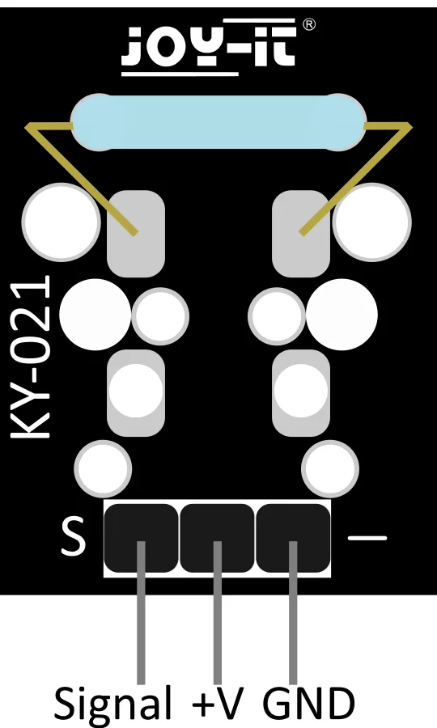](../../library/maker-media/2d3496a4f902c835b8e944b12bee2e6eaa12fe71ab4829201d6567983c95c812.svg)

**pinout image** · Source image inspected; technical review pending

Manufacturer artwork; reproduction rights not established; not cleared for the printed book

## KY-022 Infrared receiver

Joy-IT · Manufacturer documentation recorded

[Open full gallery](https://valleytech-black-wire-guide.pages.dev/?tab=makers&part=maker-joy-it-561911cf4ed9)

[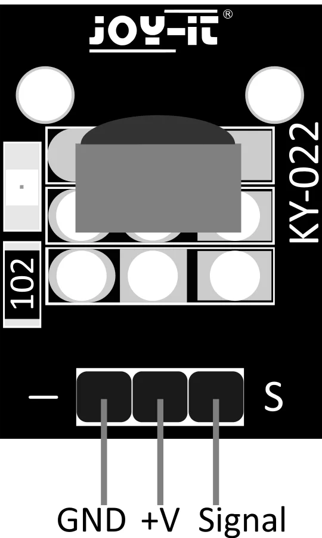](../../library/maker-media/f3f2d1df4faab15a4d175bbb3a2a7ff41455e932ee7a5515851bdce8377b68d0.svg)

**pinout image** · Source image inspected; technical review pending

Manufacturer artwork; reproduction rights not established; not cleared for the printed book

## KY-024 Linear, magnetic hall sensor

Joy-IT · Manufacturer documentation recorded

[Open full gallery](https://valleytech-black-wire-guide.pages.dev/?tab=makers&part=maker-joy-it-6ea66c3d5782)

[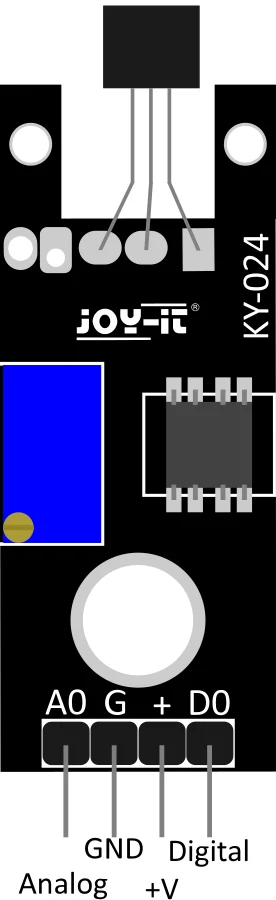](../../library/maker-media/538063f422920b62fe13d4e94de7fbaa6327506107f3c6eed15c3ec16d1ac0d2.svg)

**pinout image** · Source image inspected; technical review pending

Manufacturer artwork; reproduction rights not established; not cleared for the printed book

## KY-025 Analog, magnetic reed sensor

Joy-IT · Manufacturer documentation recorded

[Open full gallery](https://valleytech-black-wire-guide.pages.dev/?tab=makers&part=maker-joy-it-0f1f5ea963b9)

[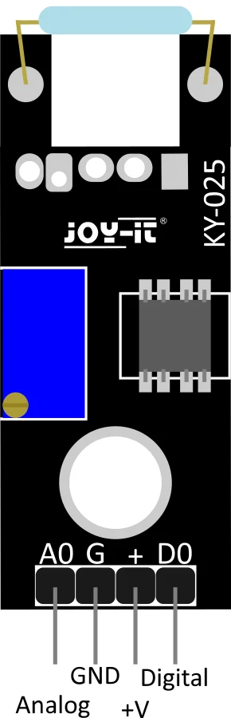](../../library/maker-media/ccbdc4ef32f6aaafb7798d177ca25bfb081e42c76f5ec3fbca8f00facc059dfb.svg)

**pinout image** · Source image inspected; technical review pending

Manufacturer artwork; reproduction rights not established; not cleared for the printed book

## KY-026 Analog flame sensor

Joy-IT · Manufacturer documentation recorded

[Open full gallery](https://valleytech-black-wire-guide.pages.dev/?tab=makers&part=maker-joy-it-6caff140fce1)

[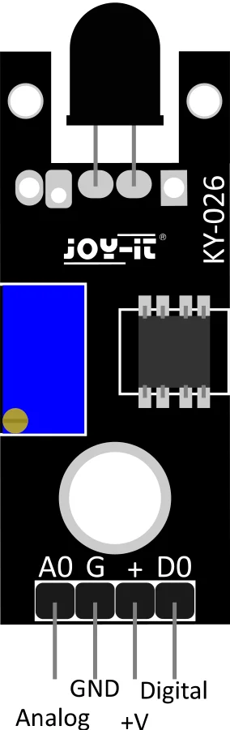](../../library/maker-media/0cfe3f44c1d658740cc30672726cfc76423314079ea99fcb0cc574ac26f3119a.svg)

**pinout image** · Source image inspected; technical review pending

Manufacturer artwork; reproduction rights not established; not cleared for the printed book

## KY-027 Magic light cup

Joy-IT · Manufacturer documentation recorded

[Open full gallery](https://valleytech-black-wire-guide.pages.dev/?tab=makers&part=maker-joy-it-69656f036a20)

[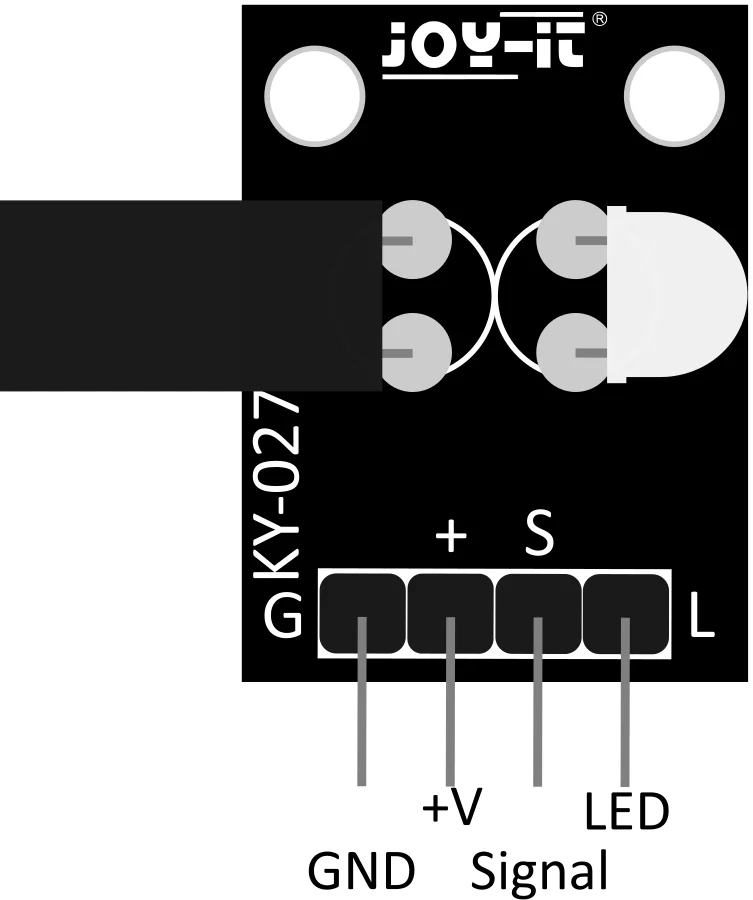](../../library/maker-media/eb7287243fc618ca2265c190f0c0998cea66d50c2330e11b15b6c8c83865866a.svg)

**pinout image** · Source image inspected; technical review pending

Manufacturer artwork; reproduction rights not established; not cleared for the printed book

## KY-028 Temperature sensor (thermistor)

Joy-IT · Manufacturer documentation recorded

[Open full gallery](https://valleytech-black-wire-guide.pages.dev/?tab=makers&part=maker-joy-it-b3ffd9a4f8a2)

[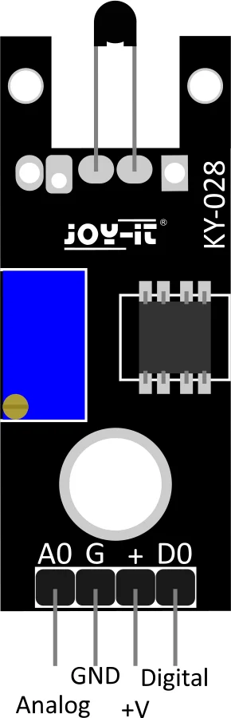](../../library/maker-media/117a90c06cce6b2045b3057be383b16e6fc4a6a295480ae60d4d7c6d7588a8dd.svg)

**pinout image** · Source image inspected; technical review pending

Manufacturer artwork; reproduction rights not established; not cleared for the printed book

## KY-031 Knock sensor

Joy-IT · Manufacturer documentation recorded

[Open full gallery](https://valleytech-black-wire-guide.pages.dev/?tab=makers&part=maker-joy-it-10d37b4c0e4d)

[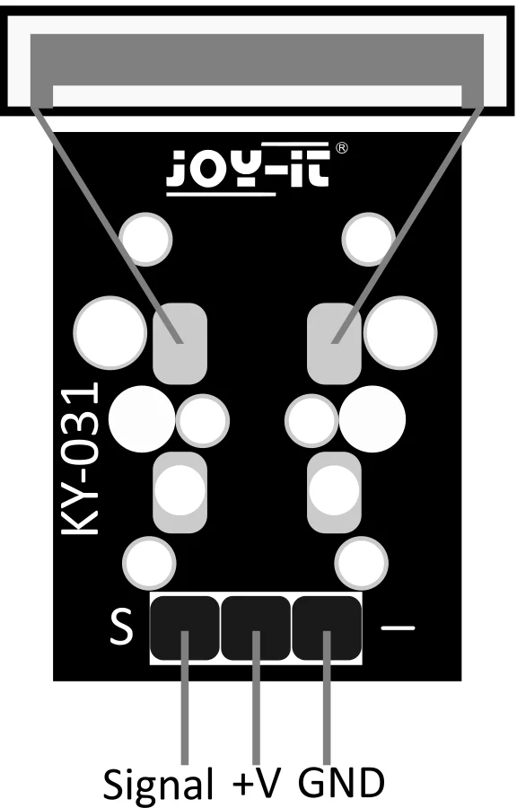](../../library/maker-media/584a74b3429a590bb8463917c9a0cd136e434d48dc6ccfbb9fcad30993b1303d.svg)

**pinout image** · Source image inspected; technical review pending

Manufacturer artwork; reproduction rights not established; not cleared for the printed book

## KY-032 Obstacle detector

Joy-IT · Manufacturer documentation recorded

[Open full gallery](https://valleytech-black-wire-guide.pages.dev/?tab=makers&part=maker-joy-it-5532b29f2ed5)

[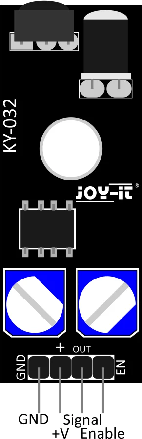](../../library/maker-media/6236c01efd7f0e34a6775c5550d33e3e13d72db42bacf3c6eb8c65b90d7a559f.svg)

**pinout image** · Source image inspected; technical review pending

Manufacturer artwork; reproduction rights not established; not cleared for the printed book

## KY-033 Linetracking sensor

Joy-IT · Manufacturer documentation recorded

[Open full gallery](https://valleytech-black-wire-guide.pages.dev/?tab=makers&part=maker-joy-it-f277a68abec1)

[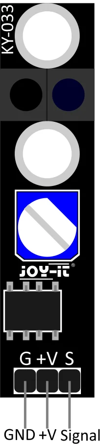](../../library/maker-media/30292d7aa17eb34f4b8c8ce1765c6b6ec2752957bd1d8e7e4ac6ddbf8157de14.svg)

**pinout image** · Source image inspected; technical review pending

Manufacturer artwork; reproduction rights not established; not cleared for the printed book

## KY-035 Bihor magnetic sensor

Joy-IT · Manufacturer documentation recorded

[Open full gallery](https://valleytech-black-wire-guide.pages.dev/?tab=makers&part=maker-joy-it-b4df12f011c1)

[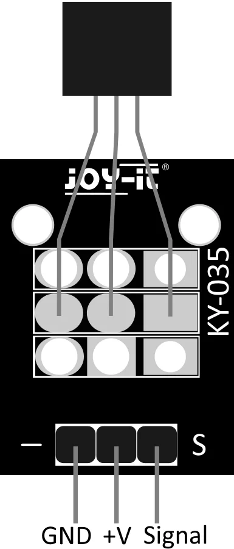](../../library/maker-media/345da3e9b6ffeb1656bbd0973675413f2dd9c0d7aab5f1e9adf9fab045b8585e.svg)

**pinout image** · Source image inspected; technical review pending

Manufacturer artwork; reproduction rights not established; not cleared for the printed book

## KY-037 Microphone sound sensor (high sensitivity)

Joy-IT · Manufacturer documentation recorded

[Open full gallery](https://valleytech-black-wire-guide.pages.dev/?tab=makers&part=maker-joy-it-4f5c2e209218)

[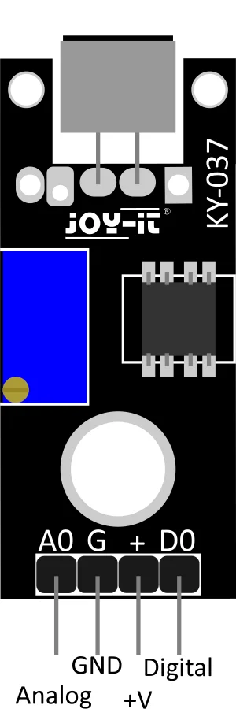](../../library/maker-media/6346411a2011bbe955f903541a08bb1bd70294eecc33e753ebbc84565f43bf57.svg)

**pinout image** · Source image inspected; technical review pending

Manufacturer artwork; reproduction rights not established; not cleared for the printed book

## KY-038 Microphone sound sensor

Joy-IT · Manufacturer documentation recorded

[Open full gallery](https://valleytech-black-wire-guide.pages.dev/?tab=makers&part=maker-joy-it-b2a1d441eb72)

[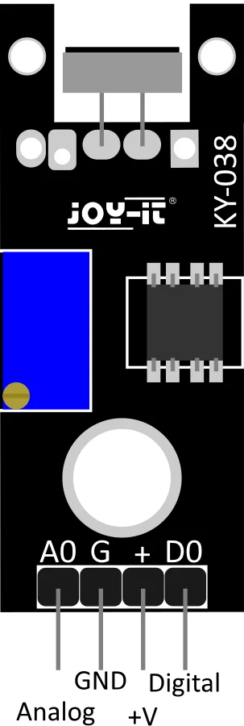](../../library/maker-media/d43f6918db8d527f6a8d589ec1ad11a85107b40ada973f11d672303c397bc66a.svg)

**pinout image** · Source image inspected; technical review pending

Manufacturer artwork; reproduction rights not established; not cleared for the printed book

## KY-039 Heartbeat sensor

Joy-IT · Manufacturer documentation recorded

[Open full gallery](https://valleytech-black-wire-guide.pages.dev/?tab=makers&part=maker-joy-it-0bc3011cd3c8)

[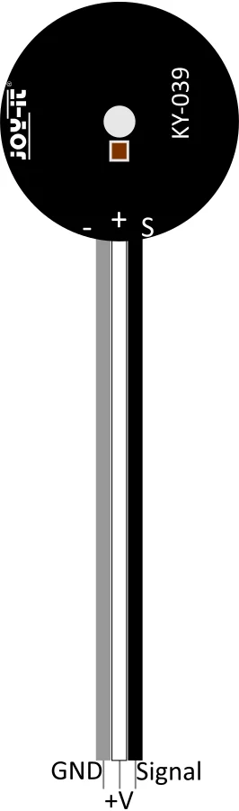](../../library/maker-media/0f145aec3ec3620e81738adbc571880e7b180f73e23a156e1f4ae4da9eae1d7d.svg)

**pinout image** · Source image inspected; technical review pending

Manufacturer artwork; reproduction rights not established; not cleared for the printed book

## KY-050 Ultrasonic distance sensor

Joy-IT · Manufacturer documentation recorded

[Open full gallery](https://valleytech-black-wire-guide.pages.dev/?tab=makers&part=maker-joy-it-a2559882a10a)

[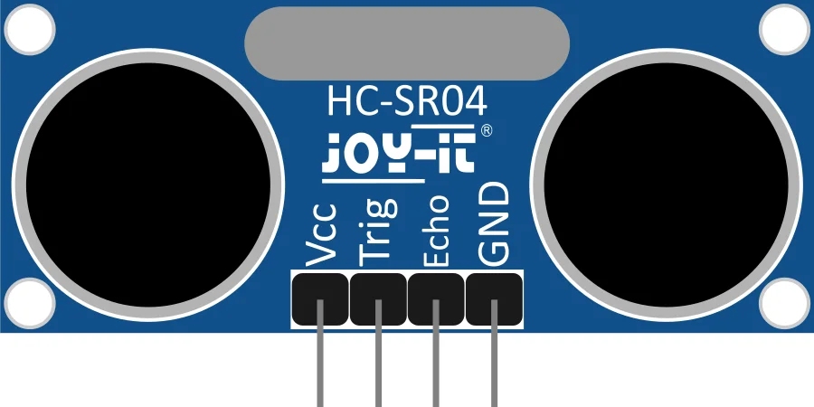](../../library/maker-media/98923dcf82406e437547b8f1d05feff1b155f1823a248f1cc540bf691289ec6d.svg)

**pinout image** · Source image inspected; technical review pending

Manufacturer artwork; reproduction rights not established; not cleared for the printed book

## KY-052 Pressure sensor / Temperature sensor (BMP280)

Joy-IT · Manufacturer documentation recorded

[Open full gallery](https://valleytech-black-wire-guide.pages.dev/?tab=makers&part=maker-joy-it-000aa80ed2d4)

[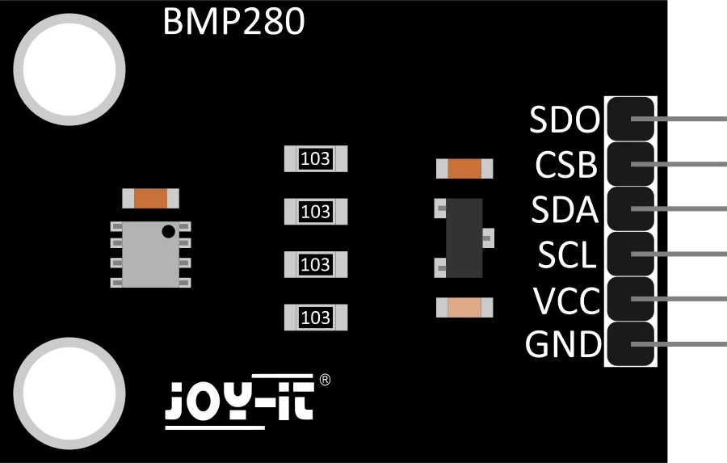](../../library/maker-media/0bb2897e9cb859d0d38c6d30345bb9ab143a3ed04cdb652101ae244eb3219573.svg)

**pinout image** · Source image inspected; technical review pending

Manufacturer artwork; reproduction rights not established; not cleared for the printed book

## KY-054 Phototransistor

Joy-IT · Manufacturer documentation recorded

[Open full gallery](https://valleytech-black-wire-guide.pages.dev/?tab=makers&part=maker-joy-it-92dad4744895)

[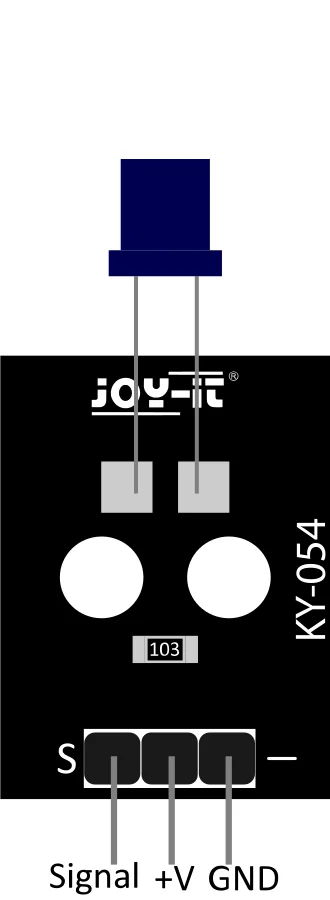](../../library/maker-media/d8a2bde5d8225af12156d0a3ce5a3c7f1a089dbb5d7e26043f00b10d3ddb297c.svg)

**pinout image** · Source image inspected; technical review pending

Manufacturer artwork; reproduction rights not established; not cleared for the printed book

## Load Cell Amplifier HX711 Breakout Hookup Guide

SparkFun · Manufacturer documentation recorded

[Open full gallery](https://valleytech-black-wire-guide.pages.dev/?tab=makers&part=maker-sparkfun-986cce1a498a)

[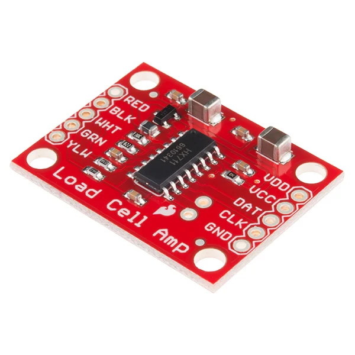](../../library/maker-media/320168145e4f2c400cceb9a5d31339855fa8d6e466aca29e2fb9d95cb8ce7f62.jpg)

**source reference** · Source image inspected; technical review pending

Manufacturer artwork; reproduction rights not established; not cleared for the printed book

## MinIMU-9 v5 Gyro, Accelerometer, and Compass (LSM6DS33 and LIS3MDL Carrier)

Pololu · Manufacturer documentation recorded

[Open full gallery](https://valleytech-black-wire-guide.pages.dev/?tab=makers&part=maker-pololu-eec8e3eed80f)

[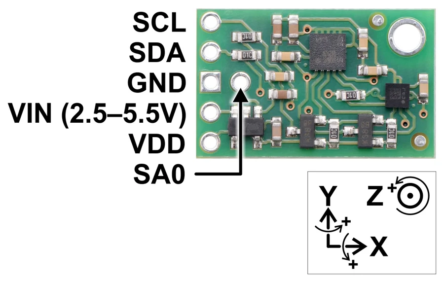](../../library/maker-media/4fd68155a3174bc1b2f65033e67e4edf239198444ab2b4b977cf5872b7784f3f.jpg)

**pinout image** · Source image inspected; technical review pending

Manufacturer artwork; reproduction rights not established; not cleared for the printed book

## mmWave Human Detection Sensor Kit (MR24HPC1)

Seeed Studio · Source review pending

[Open full gallery](https://valleytech-black-wire-guide.pages.dev/?tab=makers&part=maker-existing-source-board-e3199ac49cb857fde7)

[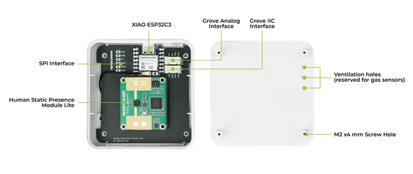](../../library/media/ac051196f635c80344eb4ce87e9fb8b677a3e0190ada432e7bac40f814d4eea7.jpg)

**source reference** · Unreviewed source

Source rights not yet established

## MQ gas sensor module variants

Generic / manufacturer unconfirmed · Identification needed

[Open full gallery](https://valleytech-black-wire-guide.pages.dev/?tab=makers&part=maker-generic-mq-gas-sensor-module-variants)

Matching image still needed.

## MR60BHA2 60GHz mmWave Breathing and Heartbeat Detection Sensor Kit with XIAO ESP32C6

Seeed Studio · Source review pending

[Open full gallery](https://valleytech-black-wire-guide.pages.dev/?tab=makers&part=maker-existing-source-board-6a46acf091548bef03)

[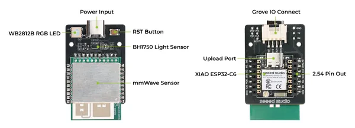](../../library/media/3d8bdb22a0be04252a8189158f5066b9c4b5397a187be23c8f182af81c99d297.jpg)

**source reference** · Unreviewed source

Source rights not yet established

## Proximity Trinkey

Adafruit · Manufacturer source references collected

[Open full gallery](https://valleytech-black-wire-guide.pages.dev/?tab=makers&part=maker-adafruit-proximity-trinkey)

[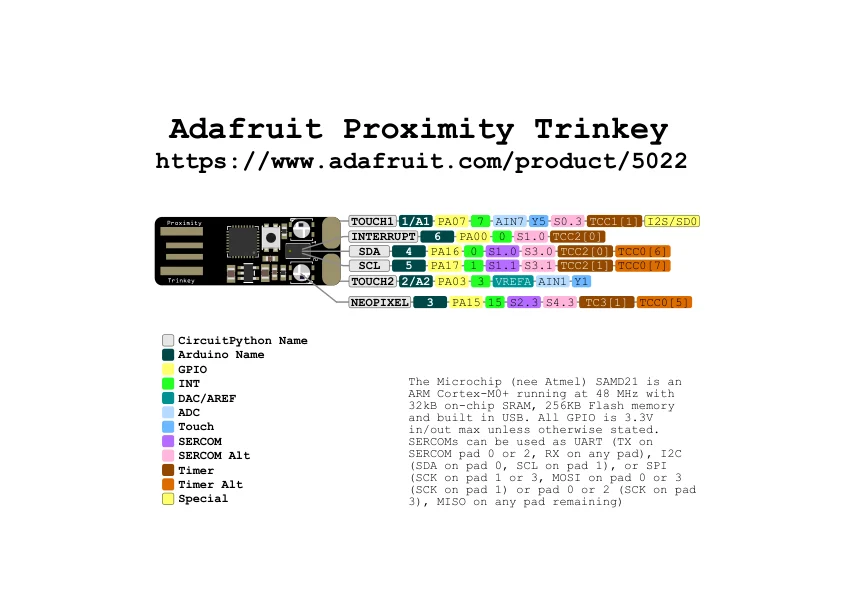](../../library/media/0ccec28455c8bb6f42b5c9ac06262c793c5f46dd3c0757d14b4c1d34a2f62eb0.png)

**pinout image** · Reviewed source

Adafruit / original diagram contributors. Rights not established for this asset; attribution retained. Original artwork is not covered by Black Wire's editorial license.

## SenseCAP A1101 (LoRaWAN Vision AI Sensor)

Seeed Studio · Source review pending

[Open full gallery](https://valleytech-black-wire-guide.pages.dev/?tab=makers&part=maker-existing-source-board-09dd14dad4781f80a9)

Matching image still needed.

## SHT45 Trinkey

Adafruit · Manufacturer source references collected

[Open full gallery](https://valleytech-black-wire-guide.pages.dev/?tab=makers&part=maker-adafruit-sht4x-trinkey)

**pinout image** · Reviewed source

Adafruit / original diagram contributors. Rights not established for this asset; attribution retained. Original artwork is not covered by Black Wire's editorial license.

## Unit Mini IMU-Pro

M5Stack · Source review pending

[Open full gallery](https://valleytech-black-wire-guide.pages.dev/?tab=makers&part=maker-existing-source-board-58a3464523a4a2c02e)

[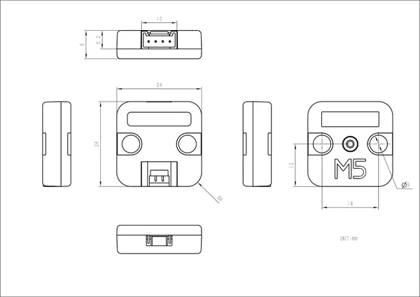](../../library/media/a643585c5155a74c30ba63499079e9964d7e18f1941779d5f58d216809807760.jpg)

**source reference** · Unreviewed source

Source rights not yet established

## Unit Thermal2

M5Stack · Source review pending

[Open full gallery](https://valleytech-black-wire-guide.pages.dev/?tab=makers&part=maker-existing-source-board-0e3122dd0f2d467be1)

[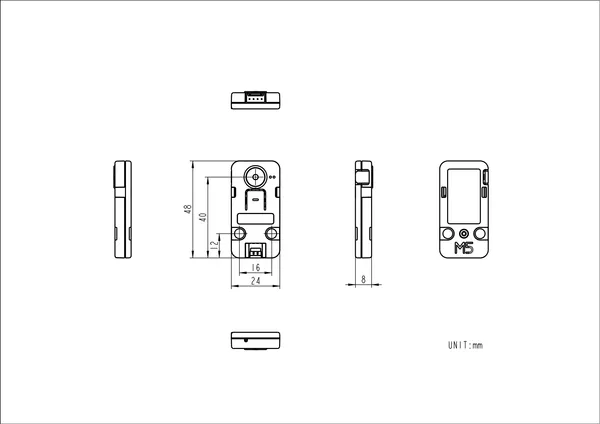](../../library/media/8b10bfba61caf882c04cf8fee0a96b2d38ae0b46c6e7c45cec3695ed4b23fd71.png)

**source reference** · Unreviewed source

Source rights not yet established

## Unit Tube Pressure

M5Stack · Source review pending

[Open full gallery](https://valleytech-black-wire-guide.pages.dev/?tab=makers&part=maker-existing-source-board-f128bcb679828e9993)

[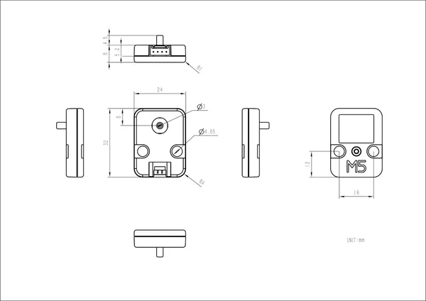](../../library/media/b832473286455f634b94598e7271a3447015e0c8f0ee4e9531bf6eb667234169.jpg)

**source reference** · Unreviewed source

Source rights not yet established

## Unit Ultrasonic

M5Stack · Source review pending

[Open full gallery](https://valleytech-black-wire-guide.pages.dev/?tab=makers&part=maker-existing-source-board-a2285d667efa547c38)

[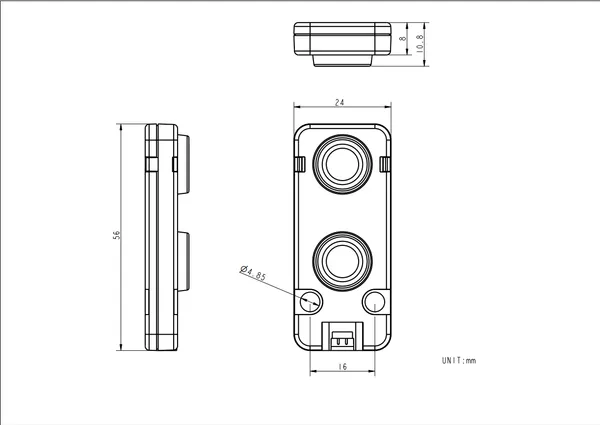](../../library/media/1a6b71200d0249ae5e906490d500ec39195734abb6273e6e349c2a5316f9587e.png)

**source reference** · Unreviewed source

Source rights not yet established

## Unit Ultrasonic-I2C

M5Stack · Source review pending

[Open full gallery](https://valleytech-black-wire-guide.pages.dev/?tab=makers&part=maker-existing-source-board-1944bd7d1e9fc877a6)

[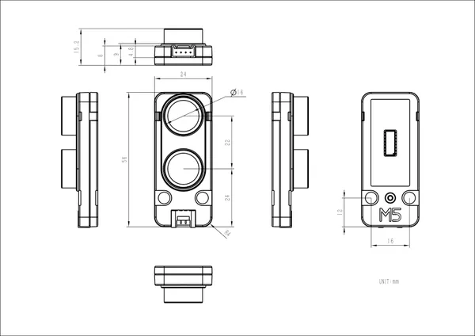](../../library/media/e241d461687544cc6ff1d9813ca02a9eba7e12e1e18ea8e3d72cc0cdffe159dc.jpg)

**source reference** · Unreviewed source

Source rights not yet established

## Xadow - Basic Sensors

Seeed Studio · Source review pending

[Open full gallery](https://valleytech-black-wire-guide.pages.dev/?tab=makers&part=maker-existing-source-board-b559332bf40915efce)

[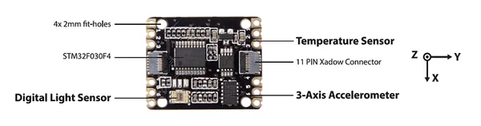](../../library/media/5aebbd8577e7e4b82b9663a7a5159ceb2b30904e3149b5b0cd19af6ca2fe5e08.png)

**source reference** · Unreviewed source

Source rights not yet established

## Xadow - Multichannel Gas Sensor

Seeed Studio · Source review pending

[Open full gallery](https://valleytech-black-wire-guide.pages.dev/?tab=makers&part=maker-existing-source-board-e3a84d91705df46b1d)

[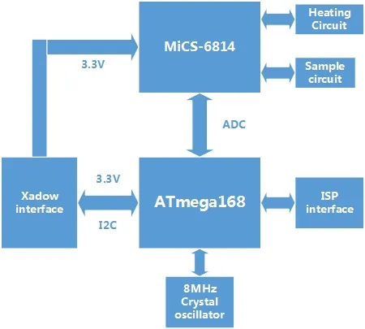](../../library/media/f77ed8b3ecbbf9f41c3cae9dd851b1eec28a7a4a17ae1b56be23fb98d74fa2da.jpg)

**source reference** · Unreviewed source

Source rights not yet established

## XIAO Soil Moisture Sensor

Seeed Studio · Source review pending

[Open full gallery](https://valleytech-black-wire-guide.pages.dev/?tab=makers&part=maker-existing-source-board-86ebac141812f19aab)

[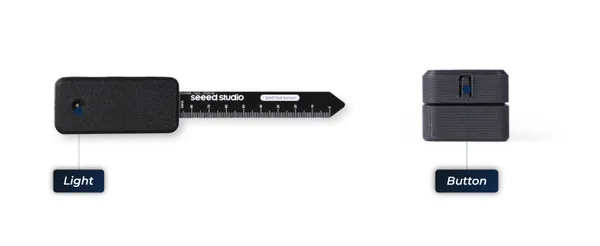](../../library/media/70ec2fdd3b9b6da71d3bf5179d3f361b62e02ebd8082c8c34891d361053c7a40.jpg)

**source reference** · Unreviewed source

Source rights not yet established
